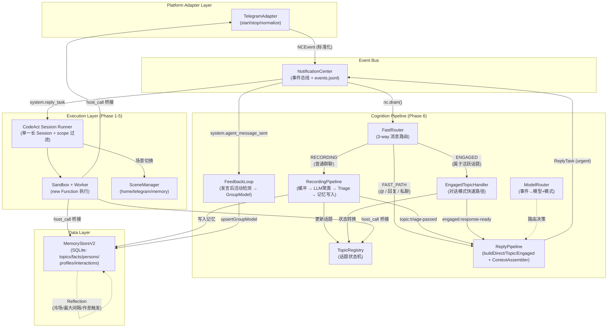

# CyberGroupmate — 项目实施方案

> **文档版本**: 0.10.0
> **最后更新**: 2026-03-13
> **状态**: Phase 1-5 已完成，Phase 6A/6B/6C 已完成（6C = Subagent Notification 处理架构 S1-S8，132/132 tests pass），Phase 7 规划中。

---

## 工程进度追踪

> **指示（给 Claude Code）**：每完成一个 Task，请更新下方表格的状态，并在「实施笔记」列补充你做出的关键决策、遇到的问题、以及与原计划的偏差。如果实施过程中发现原计划有设计缺陷或需要调整，请直接修改对应章节并在变更处标注 `[REVISED @Phase-X.Y]`。每个 Phase 完成后，在末尾「实施日志」章节追加一段总结。

| Phase | Task | 状态 | 实施笔记 |
|-------|------|------|----------|
| 1.1 | NotificationCenter | ✅ 完成 | monotonic ULID via monotonicFactory(); FTS5 JSONL append-only; async drain with waiter pattern |
| 1.2 | Sandbox + Worker | ✅ 完成 | new Function() + async wrapper; JSON-line IPC; console hijack; persistent ctx namespace |
| 1.3 | BackgroundManager | ✅ 完成 | AbortController cancellation; guardedRun auto-notifies system.background_error |
| 1.4 | Memory Store | ✅ 完成 | FTS5 + LIKE fallback for CJK; merge-update person profiles; WAL mode |
| 1.5 | SceneManager + 类型定义文件 | ✅ 完成 | L1/L2 type def system; home/telegram/memory scenes; scene-authoring.md |
| 1.6 | 项目脚手架（package.json, tsconfig, git 初始化） | ✅ 完成 | ESM, Node ≥22, strict TS, 55 tests passing |
| 2.1 | LLM 调用封装 | ✅ 完成 | 支持 Anthropic + OpenAI API；重试 + 指数退避；配置迁移到 config.ts (yaml 库) |
| 2.2 | CodeAct Session Runner | ✅ 完成 | 多轮交互循环；parseResponse 解析 ts/js/typescript/javascript 围栏；输出截断 4000 字符；每 5 轮检查新通知 |
| 2.3 | Bootstrap 流程 | ✅ 完成 | 代码保存+重放机制；重放失败回退到完整 LLM bootstrap |
| 2.4 | Main Event Loop | ✅ 完成 | drain+context组装+session运行；sandbox 崩溃检测+自动重启；graceful shutdown |
| 3.1 | Session Compaction | ✅ 完成 | LLM 提取摘要/事实/人物/待办；自动写入 memory 各表；JSON 解析含 markdown 代码块回退 |
| 3.2 | Agent State 管理 | ✅ 完成 | agent-state.md 自动更新；3500 字符截断防无限增长；main.ts 读取注入到 context |
| 3.3 | System Prompt 调优 | ✅ 完成 | system-prompt.md 含 CodeAct 环境说明、行为原则、场景系统、{{PERSONA}} 注入 |
| 3.4 | 安全限制（rate limit、禁止破坏性操作） | ✅ 完成 | MessageRateLimiter (session/分钟)、12 个禁止方法、sent-messages.jsonl 审计日志 |
| 4.1 | 错误恢复（sandbox 重启 + bootstrap 重放） | ✅ 完成 | 已在 main.ts 中实现：sandbox 崩溃检测 → 重启 → bootstrap 重放 → 事件推回队列 |
| 4.2 | CLI 工具 | ✅ 完成 | 6 个子命令 (sandbox REPL/notify/drain/memory/config/status)；支持多行输入、缩写命令 |
| 4.3 | 配置化 | ✅ 完成 | config.ts: 统一 AppConfig (LLM/Persona/Telegram)；yaml 库解析；env > yaml > defaults；TG_ 自动注入 |
| 4.4 | Agent Docs 系统 | ✅ 完成 | docs.ts + docs/mtcute-guide.md；sandbox 中 docs.read()/docs.list()；避免 agent 联网搜索 |
| 4.5 | 结构化日志 | ✅ 完成 | logger.ts: level/format/color；LOG_LEVEL + LOG_FORMAT 环境变量；子 logger；已集成到 main.ts |
| 4.6 | Bootstrap 改进 | ✅ 完成 | 具体 mtcute 代码示例 (bot/userbot)；登录流程 + OTP 交互；docs 注入到 sandbox |
| 4.7 | 跨进程通讯补丁 | ✅ 完成 | NC cross-process fix (buffer offset instead of string slice, fallback polling) |
| 4.8 | API Docs 与配置补丁 | ✅ 完成 | Mtcute API docs fix (full prototype method reference, Object.keys 警告); Temperature 覆盖 fix |
| 5.1 | Scene-Bound Sessions | ✅ 完成 | 单一 session + scope 过滤，见 Phase 5 总结 |
| 6.0 | Memory V2 Stub 迁移 | ✅ 完成 | [REVISED @Phase-6.0] 先以 read-empty/write-discard stub 替换旧 memory.ts；创建 `src/memory-v2/` 模块（types + stub impl + barrel export）；更新所有引用（main/cli/compaction/sandbox-worker/scenes）；16/16 测试通过。真实 V2 数据层待接入。 |
| 6.1 | Air-Reading Engine | ✅ 完成 | TopicRegistry 10 态状态机（ACTIVE→TRIAGING→PRELOADING→ENGAGED→EXITING→COOLDOWN→ARCHIVED 等）；超时清理（STALE 15min、ARCHIVED 2h）；话题流变继承。FastRouter 三路消息路由（FAST_PATH/@回复/私聊 → CodeAct；ENGAGED → 对话模式；其他 → Recording 缓冲）。 |
| 6.1.1 | Engaged Topic Handler | ✅ 完成 | 消息归属判定（reply chain、时间窗口+参与者、乐观归属+回退）；自然延迟模拟 3-15s；quickTriage cheap model 多维判定（身份探测/是否继续/自然结束）；7 级退出信号（P0 MAX_TURNS → P6 CROWDED_OUT）；5 种退出风格（NATURAL_END/FADE_OUT/GRACEFUL_REDIRECT/SILENT_WITHDRAWAL/GRADUAL_WITHDRAWAL） |
| 6.2 | Recording Pipeline | ✅ 完成 | 后台观察者 50 条/2min 双触发缓冲；强信号加速（15 条/30s eager mode）；4 步 flush（LLM 话题聚类 → LLM 摘要+Triage → TopicRegistry 更新 → Memory V2 写入 stub）；错误恢复（失败时消息放回缓冲头部） |
| 6.3 | Reply Pipeline Framework | ✅ 完成 | `ReplyPipeline` + `ReplyTask` 已接入主循环，覆盖 FAST_PATH / topic triage / engaged 三类任务；`ContextAssembler` 已把 `Scene Focus / Latent Memory` 自动注入首轮上下文 |
| 6.4 | Code-First Action Surface | ✅ 完成 | sandbox 已注入 `actions.*`（getTopicContext / listActiveTopics / recallForTopic），host-call 已桥接 memory/topic/action 上下文 |
| 6.5 | Agent-Skill Runtime | ✅ 完成 | sandbox 已注入代码型 `skills.memory` / `skills.social`，并由测试覆盖实际调用链 |
| 6.6 | Feedback Loop | ✅ 完成 | `system.agent_message_sent` → `FeedbackLoop` → `system.feedback_evaluated` 闭环已接入主循环并有集成测试 |
| 6.7 | Dry-Run System | ✅ 完成 | JSONL 历史消息加载 → 按时间模拟事件到达 → FastRouter+RecordingPipeline 处理 → JSON 评估报告输出；CLI `dry-run` 子命令（支持 --chat-id、--days 过滤）；saveDryRunReport 保存详细报告 |
| 6.8 | Model Router | ✅ 完成 | 规则表驱动路由（7 条默认规则）；3 层模型映射（cheap/mid/sota）；复杂度评估（消息长度、是否含问题、多人讨论、介入类型）；可通过构造函数自定义规则和模型名称 |
| — | 目录重组 | ✅ 完成 | src/ 重组为 core/、sandbox/、event/、scenes/、pipeline/、memory-v2/、adapter/（平台适配层）、agent/（docs）；main.ts + cli.ts 保留顶层。所有 import 路径 + 测试已更新。 |
| 6B.0 | Ingress Boundary Refactor | ✅ 完成 | `nc.message` 标准化 schema、`PlatformAdapter` 抽象、全链路 string ID 迁移、官方 `TelegramAdapter`、bootstrap 降责。框架正式接管消息消费侧，Agent 掌握消息生产侧与扩展侧。 |
| 7.1 | Playbook System | 📝 规划中 | SOTA 定期分析生成 GroupPlaybook；注入弱模型上下文 |
| 7.2 | Skill Auto-Generation | 📝 规划中 | SOTA 介入失败场景 → 写代码/测试/类型 → 生成可复用 Skill |
| 7.3 | CoT Template Distillation | 📝 规划中 | SOTA 提取典型场景思维链模板；弱模型直接套用 |
| 7.4 | Cost Control | 📝 规划中 | 每日预算控制器；模型分层策略 |
| 7.5 | Degradation Strategy | 📝 规划中 | 三级降级：API 超时 → 持续不可用 → 系统异常 |
| 6C.S1 | 消息基础设施改造 | ✅ 完成 | message_log 实时落盘; NC per-chatId dispatch; MessageSnapshot; 10 tests pass |
| 6C.S2 | SubagentManager + Observer | ✅ 完成 | per-group Observer (Q2 buffer + Engagement); Q3 注意力队列; 22 tests pass |
| 6C.S3 | Sandbox 多实例 + CodeActExecutor | ✅ 完成 | SandboxPool; per-group CodeAct Session + Q4/Q5; 15 tests pass |
| 6C.S4 | FastPath Handler | ✅ 完成 | 预授权/撤销/过期/maxReplies 自动禁用; __SKIP__; 13 tests pass |
| 6C.S5 | 主 Agent 注意力循环 | ✅ 完成 | 串行循环; Cosine Decay L0-L3; DecisionMaker; Prompt 模板系统; 27 tests pass |
| 6C.S6 | GlobalState + TaskList Skill | ✅ 完成 | JSON 持久化; CRUD + 损坏恢复; skills.taskList host-call; 15 tests pass |
| 6C.S7 | GroupStickiness | ✅ 完成 | 四级亲密度 (CORE/FAMILIAR/ACQUAINTANCE/STRANGER); 升降级; 15 tests pass |
| 6C.S8 | 集成与配置外部化 | ✅ 完成 | 端到端集成; config.yaml subagent section; prompt .md 文件; 15 tests pass |

---

## 0. 项目概述

### 0.1 愿景

CyberGroupmate（赛博群友）是一个基于 LLM 的 Telegram 社交智能体。终极目标：**让新来的群友一点都看不出这是赛博群友。**

它具备以下能力：对每个群友的记忆、图像识别、发表情包、读空气（智能的对话管理和响应机制）、消息历史搜索、联网搜索，以及更多可扩展的能力。

### 0.2 核心架构理念

本项目借鉴 CodeAct 论文（Wang et al., 2024, "Executable Code Actions Elicit Better LLM Agents"）的核心理念，但不使用其代码库或框架。我们提取的关键思想是：

1. **代码即统一动作空间**：让 LLM 直接写可执行代码来执行所有动作（读消息、发消息、搜索记忆等），而非通过预定义的 JSON/Text tool calling。代码天然支持控制流（for/if）和数据流（变量复用），一次动作可以组合多个操作。
2. **多轮交互与自我调试**：Agent 写代码 → 执行 → 看到结果（或错误信息）→ 修正 → 继续。错误信息是天然的自动反馈机制。
3. **直接使用现有软件包**：Agent 直接 `import` 并操作 mtcute、Playwright 等库，不需要人为封装 tool。

### 0.3 与传统聊天机器人架构的根本区别

传统做法是：收到消息 → 调用 LLM → 拿到回复文本 → 发送。每个会话独立处理。

本项目的做法是：Agent 运行在一个**持续的事件循环**中。外部信息（@消息、私聊、cron 提醒等）汇入一个 Notification Center。Agent 的 main loop 只看这个事件流，然后**自己写 TypeScript 代码**决定调用哪些能力去读消息、搜索记忆、生成并发送回复。

### 0.4 技术选型

| 组件 | 选型 | 理由 |
|------|------|------|
| 语言 | **TypeScript** | mtcute 是原生 TS 库，零桥接；TS 类型系统提供额外的自动错误反馈；现代 LLM 写 TS 能力已很强 |
| Runtime | **Node.js (≥22) + tsx** | `@mtcute/node` 显式针对 Node.js，涉及 TCP 长连接 + MTProto 协议 + 原生 crypto，在 Node.js 上是保证工作的；tsx 零配置直接运行 TypeScript；Node.js 在生产环境中的长时间运行稳定性最成熟；LLM 训练数据中 Node.js 代码量最大，对 API 最熟悉 |
| Telegram 客户端 | **@mtcute/node** | 已有配置好的 env 和 session |
| LLM | Claude Sonnet 4 / GPT-4o 等（可配置） | 需要强代码生成 + 长 context + 中文能力 |
| 记忆存储 | **SQLite（better-sqlite3）+ FTS5** | 成熟同步 API，性能好；零外部服务依赖 |
| 事件日志 | Append-only JSONL | 零依赖，可 grep，未来可接日志系统 |
| 测试 | Node.js 内置 test runner 或 vitest | 零额外配置 |

---

## 1. 系统架构

### 1.1 总体架构（融合架构 Phase 6+）

本项目在 Phase 5 完成了 CodeAct 执行引擎的基础建设。Phase 6 引入结构化决策流水线，Phase 6B 完成了 Ingress 边界重构——**框架正式接管消息消费侧，Agent 掌握消息生产侧与扩展侧**。整体形成**四层架构**：Platform Adapter 提供平台无关的消息接入，决策流水线提供行为可控性，CodeAct 提供底层执行灵活性，三者共享统一的记忆系统。

**核心职责划分**：平台连接与事件标准化属于基础设施；消息理解、回复、记忆利用属于智能体。

**核心心智模型**：`scene` 像手机里的 app，`NotificationCenter` 像手机通知中心，`PlatformAdapter` 像操作系统的 push/system integration 层。Agent 在 `home` scene 看到的是“有哪些 app 发来了什么通知”，再决定是否切过去处理。



**核心设计原则**：

1. **渐进增强**：弱模型走 Enforced Pipeline（系统代执行），SOTA 模型走 Advisory 模式（完全自由 CodeAct）。系统永远有保底行为。
2. **Ingress 是基础设施，不是行为智能**：平台连接由官方 PlatformAdapter 负责，不依赖 Agent bootstrap 的成功与否。
3. **观察与行动分离**：Recording Pipeline 持续后台运行，不依赖 agent 是否决定回复。
4. **代码即统一动作空间**：不引入独立 tool use 协议；所有系统能力都通过代码 API 暴露。Skill 也是代码，不是工具。
5. **SOTA 知识下沉**：SOTA 模型的判断力通过 Playbook、Skill、CoT 模板"物化"为结构化数据，弱模型可以直接消费。

### 1.2 数据流

1. `PlatformAdapter`（如 `TelegramAdapter`）连接平台并接收原始事件，标准化为 `NCEvent` 推入 NotificationCenter
2. `Fast Router` 消费事件，决定进入快速路径（@回复/私聊/ENGAGED 话题）或 Recording Pipeline 缓冲
3. `Recording Pipeline` 批量提取话题、摘要、Triage，更新 TopicRegistry，写入 Memory V2
4. `Reply Pipeline` / `ContextAssembler` 将话题级判断和潜意识记忆转换为 Agent 可消费的 `ReplyTask`
5. Agent 在 sandbox 中通过 CodeAct 写 TypeScript 代码处理任务（切换场景、调用 memory/actions/skills）
6. 多轮交互直到 agent 完成处理（不再输出代码块）
7. Session 结束后做 compaction，`Feedback Loop` 追踪发言后效

### 1.3 场景（Scene）系统

Agent 的 context window 是有限资源，应像人类注意力一样管理。

**核心概念**：Agent 在任一时刻只处于一个「场景」中。每个场景提供该场景专属的 TypeScript 类型定义（`.d.ts`）。Agent 通过 `scene.enter("telegram")` 切换场景，此时新场景的类型定义作为 observation 返回，替代之前的类型信息。

这类似于 AVG 游戏中进入不同房间——进入不同场景，能施展的动作不同。但 agent 始终拥有自己的意识流（连贯的 LLM 对话历史），知道自己要干什么。最顶部的 system prompt 定义了它的行为模式和人格。

**场景切换的运行时行为**：
- `scene.enter(name)` 被调用时，sandbox worker 返回新场景的类型定义和上下文说明作为 stdout 输出
- 这个输出成为 CodeAct 交互中的 observation，进入下一轮 LLM 输入
- Agent 看到新的类型定义后，就知道在这个场景中可以做什么

**类型定义的展开粒度**：
- **L0（场景列表）**：只有场景名 + 一句话描述。在 home 场景中通过 `scene.list()` 获得。
- **L1（核心类型）**：进入场景后默认展示。手写的精简版类型定义，只包含常用方法和核心数据结构。不是库的完整 `.d.ts`，而是人工裁剪的子集，控制在 100-200 行以内。
- **L2（完整类型）**：Agent 遇到困难时可以调用 `scene.showFullTypes()` 主动请求更详细的类型定义。

类型定义本身就是最好的文档——Agent 看到的是 TypeScript 接口签名，比自然语言描述的 tool specification 更精确、更紧凑，而且 LLM 天然理解这种格式。

**MVP 包含的场景**：
- `home`：通知中心。查看通知、决定下一步、切换场景。只有 `scene`、`runtime`、`ctx` 的类型。
- `telegram`：Telegram 操作。精简版的 `TelegramClient`、`Message`、`Chat`、`User` 等接口。
- `memory`：记忆系统。`MemoryStore`、`PersonProfile`、`ConversationSummary` 等接口。

**扩展预留** [REVISED @Phase-6B]：
- 新增平台 = 新增 `PlatformAdapter` + scene + action surface，而不是只新增一个 scene。Scene 不再负责平台接入，而是提供 Agent 在该平台上的能力接口。
- Agent 未来可以自己注册新场景（`scene.register(name, typeDefs)`）

### 1.4 通知积累与批量呈现

Agent 在处理当前事件批次期间（一个 CodeAct session 内），新到达的通知在 Notification Center 队列中静默积累，不打断当前工作流。通知的呈现时机：

1. **Session 之间**：每个 session 结束后，main loop 回到 `nc.drain()` 等待，积累的通知和新通知一起被取出，组成下一个 session 的输入。
2. **Session 内定期追加**：每隔 N 轮代码执行（建议 5 轮），检查是否有新通知。如果有，以 `[新通知到达]` 的形式追加到对话中，agent 可以选择立即处理或继续当前任务。

---

## 2. 组件详细设计

### 2.1 Notification Center

**职责**：内存事件队列 + append-only JSONL 持久化日志 + 跨进程事件感知。系统的事件中枢——所有外部事件（Telegram 消息、cron 触发等）和内部事件（后台任务崩溃、代码执行记录、`system.reply_task`、`system.agent_message_sent` 等）都通过这里流转。

**接口**：
- `push(event)`: 写入内存队列并 append 到 JSONL 文件。自动添加 `_id`（ULID，单调递增）和 `_ts`（ISO 8601 时间戳）。写入后立即唤醒所有等待中的 `drain` 调用。
- `drain(timeout, maxBatch, batchWindow, urgentWords)`: 异步等待并批量取出事件。支持四种参数：
  - `timeout`（默认 30s）：队列为空时的最大等待时间
  - `maxBatch`（默认 50）：单次最多取出的事件数
  - `batchWindow`（默认 30s）：非紧急消息的静默聚合窗口——队首事件在队列中停留超过此时间后才返回
  - `urgentWords`：触发立即返回的关键字列表（如 `["?", "？", "呢", "吗"]`）
- `pendingCount`: 当前队列中待处理事件数量
- `dispose()`: 停止文件监视，清理 watcher 和轮询计时器

**紧急事件检测**：以下事件被视为紧急，跳过 `batchWindow` 等待立即触发 drain：
- `_urgent: true` 的事件（如 `system.reply_task`）
- 非 `telegram.message` 类型的事件（系统事件、反馈事件等）
- 包含 `isMention` 或 `replyToMessage` 的事件
- 文本中包含 `urgentWords` 关键字的消息

**跨进程事件感知**：NC 通过 `fs.watch` 监视 JSONL 文件变更 + 2 秒轮询作为后备方案。当外部进程（如 CLI 的 `notify` 命令）直接追加事件到 JSONL 文件时，NC 自动读取新行、去重（通过 `knownIds` 集合）、加入内存队列并唤醒 drain。`selfWriting` 标记防止自己的 `push` 写入触发重复读取。

**设计要点**：
- 使用 ULID（`monotonicFactory`）作为事件 ID，保证同一毫秒内的 ID 也单调递增。
- JSONL 文件是 append-only 的，`appendFileSync` 保证顺序。
- 构造时记录文件当前大小作为初始偏移，忽略历史数据，只读取运行期间新增的事件。

### 2.2 Code Execution Sandbox

**职责**：在隔离的 Node.js 子进程中执行 agent 写的 TypeScript 代码，维护跨代码块的持久化命名空间。

**架构**：Host 进程通过 `child_process.spawn` 启动 worker 子进程（`tsx src/sandbox-worker.ts`），通过 stdin/stdout JSON 行协议通信。

**Host 侧（sandbox.ts）**：
- 管理子进程生命周期
- `execute(code, timeout)`: 发送代码到 worker，等待执行结果，支持超时
- `isAlive()`: 检查子进程是否存活
- 崩溃检测和重启能力

**Worker 侧（sandbox-worker.ts）**：
- 维护一个持久化的 `ctx` 对象挂在 `globalThis` 上，agent 代码中 `ctx.xxx = ...` 的赋值会跨代码块保留
- 预注入 `runtime`（notify/spawn/kill/ps/cron）、`memory`、`scene` 到 `globalThis`
- 每段代码通过 `new Function()` + async wrapper 执行，支持 top-level `await`
- 劫持 `console.log`：输出被捕获并作为执行结果返回（这是 agent 获取信息的主要手段——和 CodeAct 论文中 print 作为获取信息手段一致 [[11]]）
- 错误被 catch 并将 stack trace 作为输出返回（自动错误反馈 [[11]]）

**代码执行机制**：
```
new Function("ctx", "runtime", "memory", "scene",
  `return (async () => { ${code} })()`
)
```
这让 agent 的代码可以直接访问注入的 API，同时支持 top-level `await`。`ctx` 对象是跨代码块共享状态的唯一机制。Agent 在第一个代码块中 `ctx.client = new TelegramClient(...)` 后，后续代码块可以直接用 `ctx.client`。

**IPC 消息协议**：

Host → Worker：
- `{ type: "execute", id: string, code: string }` — 执行代码
- `{ type: "input_response", id: string, value: string }` — 回应 `runtime.input()` 的用户输入
- `{ type: "host_call_result", id: string, ok: boolean, value?: any, error?: string }` — 返回 host-call 执行结果

Worker → Host：
- `{ type: "result", id: string, output: string, error: boolean, sceneState?: string }` — 代码执行结果（`sceneState` 携带切换后的当前 scene）
- `{ type: "notify", event: object }` — 后台任务推送事件（转发给 NC）
- `{ type: "input_request", id: string, prompt: string }` — 请求用户交互式输入（如 OTP 验证码）
- `{ type: "print", message: string }` — `runtime.print()` 直接输出（不经过 console.log 劫持）
- `{ type: "host_call", id: string, method: string, args: unknown[] }` — 请求 host 侧执行 memory/actions/skills 调用

### 2.3 Background Task Manager

**职责**：管理 agent 通过 `runtime.spawn()` 创建的后台长驻任务。运行在 sandbox worker 进程内的 async 任务中。

**接口**：
- `spawn(name, asyncFn)`: 启动一个命名的后台协程。同名不可重复，需先 kill。
- `kill(name)`: 通过 AbortController 取消任务。
- `ps()`: 列出所有任务及其状态。

**关键设计**：
- 每个后台任务被 `guardedRun` 包裹。如果任务抛出异常（非正常取消），自动向 Notification Center 推送 `system.background_error` 事件（包含任务名、错误信息和 stack trace），agent 在下次 poll 到时自己决定是否重启。这是 CodeAct "自动错误反馈 → 自我调试"理念的延伸 [[11]]。

### 2.4 Memory Store [只在MVP中被提出，在Phase 6 中决定废弃，需要重构]

**职责**：提供记忆的存储、搜索和管理。MVP 基于 better-sqlite3 + FTS5 全文搜索。

**数据表**：
- `memories`（FTS5 虚拟表）：通用记忆条目。字段：`content`（文本）、`metadata`（JSON 字符串）、`timestamp`。
- `person_profiles`：群友画像。字段：`user_id`（主键）、`data`（JSON）、`updated_at`。
- `conversation_log`：对话摘要日志。字段：`id`、`chat_id`、`chat_title`、`summary`、`key_points`（JSON 数组）、`timestamp`。

**接口**：
- `search(query, limit)`: FTS5 全文搜索记忆
- `store(content, metadata)`: 存入一条记忆
- `getPerson(userId)` / `updatePerson(userId, data)`: 群友画像 CRUD（update 是 merge 模式）
- `getRecentConversations(chatId?, limit)`: 获取对话摘要
- `rawQuery(sql, ...params)`: 直接执行 SQL（agent 高级用法——CodeAct "直接使用现有软件包"的体现 [[11]]）

**扩展预留**：`Memory` 是一个清晰的接口，后续换 Postgres + pgvector 只需改实现。加向量搜索只需新增 `vectorSearch` 方法。

### 2.5 Scene Manager

**职责**：管理场景注册表和场景切换。

**数据结构（每个场景）**：
- `name`: 场景标识符
- `description`: 一句话描述
- `typeDefs`: L1 精简类型定义字符串（`.d.ts` 文件内容）
- `fullTypeDefs`（可选）: L2 完整类型定义
- `contextSetup`（可选）: 进入场景时的额外说明文本
- `prelude`（可选）: 进入场景时在 sandbox 中自动执行的代码

**注入到 sandbox 的接口**：
- `scene.enter(name)`: 切换场景。将场景说明 + 类型定义通过 `console.log` 输出，作为下一轮 observation 返回给 LLM。
- `scene.current`: 当前场景名
- `scene.list()`: 列出所有可用场景及简介
- `scene.showFullTypes()`: 展示当前场景的 L2 完整类型定义

### 2.6 LLM 调用封装

**接口**：
- `callLLM(messages): Promise<string>`: 接受 OpenAI 格式的消息数组，返回 assistant 回复文本。

**设计要点**：
- 支持 Anthropic Claude API 和 OpenAI 兼容 API（通过 `config.yaml` 切换）
- 处理 rate limiting 和重试
- 可配置 model name、temperature、max tokens

### 2.7 Agent Main Loop（Orchestrator）

**Phase 1 — Bootstrap**：
1. 创建 NotificationCenter、Sandbox、Memory、SceneManager 实例
2. 向 LLM 发送 bootstrap prompt，告知 agent 身份、可用 runtime API、以及需要设置 Telegram 订阅
3. 运行一个 CodeAct session（多轮），agent 自己写代码完成连接和订阅设置
4. Agent 表示 READY 后保存 bootstrap 代码到 `data/bootstrap-code.json`，进入主循环

**Phase 2 — Main Event Loop**：
1. `nc.drain(timeout)` 等待事件
2. 有事件时：
   a. 读取当前 agent state（`data/agent-state.md`）
   b. 格式化事件为文本
   c. 组装 context：system prompt + agent state + home 场景类型定义 + 事件文本
   d. 运行 CodeAct session（agent 可能切换多个场景来处理事件）
   e. Session 结束后执行 compaction
3. 超时无事件：可选执行 idle 行为（MVP 中跳过）
4. 检查 sandbox 是否存活，不存活则重启并重放 bootstrap

**CodeAct Session Runner**：
1. 调用 LLM 获取 response
2. 解析 response：分离自然语言思考和 TypeScript 代码块（匹配 ` ```javascript ` / ` ```ts ` / ` ```js ` 围栏）
3. 没有代码块 → session 结束
4. 有代码块 → 在 sandbox 中依次执行，收集输出
5. 执行输出作为 `[Execution Output]` 追加到消息历史（截断到 4000 字符）
6. 每隔 5 轮检查 NC 中是否有新通知，有则追加 `[新通知到达]` 到对话
7. 重复直到无代码块或达到最大轮次（15 轮）

### 2.8 Session Compaction

每个 CodeAct session 结束后，压缩会话内容并归档。

1. 提取 session 关键信息（最近若干条消息）
2. 调用 LLM 生成结构化 JSON 摘要：对话摘要、新事实、人物信息更新、待办事项、agent state 更新建议
3. 写入 `conversation_log`、`memories`、`person_profiles` 表
4. 更新 `data/agent-state.md`

Compaction 使用独立的 LLM 调用（不是 agent 自己做的），保证即使 agent 忘记存记忆，系统也会自动归档。同时 agent 在 session 内也可以主动调用 `memory.store()` 来存储信息。

---

## 3. 类型定义文件规范

### 3.1 编写原则

1. **精简但完备**：只包含 agent 常用的方法和数据结构，不是库的完整类型。控制在 100-200 行以内。
2. **注释即文档**：每个方法和字段都有 JSDoc 注释。Agent 读注释来理解用法。
3. **类型即约束**：精确的参数和返回值类型帮助 agent 写出正确代码。类型错误是额外的自动反馈。
4. **跨场景共用类型**：`scene`、`runtime`、`ctx` 在所有场景中都可用，每个场景的 `.d.ts` 中都要声明。

### 3.1.5 shared/ — 跨场景共用类型 [NEW @Phase-6B]

类型定义文件重构后，通用能力从 `home.d.ts` 中提取到 `src/scenes/shared/` 目录，所有 scene 共享：

- **`scene.d.ts`**：`scene.enter(name, focus?)` / `scene.focus(target)` / `scene.current` / `scene.list()` / `scene.showFullTypes()`
- **`runtime.d.ts`**：`runtime.notify(event)` / `runtime.input(prompt)` / `runtime.print(msg)` / `runtime.spawn(name, fn)` / `runtime.kill(name)` / `runtime.ps()`
- **`ctx.d.ts`**：`ctx: Record<string, any>` — 跨场景、跨代码块的持久化变量容器
- **`actions.d.ts`**：`actions.getTopicContext(topicId)` / `actions.listActiveTopics(chatId?)` / `actions.recallForTopic(topicId, options?)`
- **`skills.d.ts`**：`skills.memory.recallAndSummarize(query)` / `skills.memory.browseForAnswer(request)` / `skills.social.replyInTelegram(chatId, text, opts?)`

> 注意：`runtime.cron()` 在早期设计中存在但在实际实现中已移除。

### 3.2 home.d.ts

Home 场景现在仅是通知中心视角的最小声明文件（只包含注释说明），不再承载场景切换和 runtime 类型定义——这些已提取到 `shared/` 目录。

### 3.3 telegram.d.ts

精简版 mtcute 操作接口，手工编写的类型子集。平台连接与消息监听由宿主侧官方 adapter 管理。

关键接口：
- `TelegramClient`：`sendText`, `sendMedia`, `getMe`, `getChat`, `getUser`, `getChatMembers`[USERBOT], `getHistory`[USERBOT], `iterHistory`[USERBOT], `iterDialogs`[USERBOT], `readHistory`[USERBOT], `sendTyping`
- `Message`：`id`, `text`, `date`, `chat`, `sender`, `isMention`, `replyToMessage`, `media`
- `Chat`：`id`, `type`, `title`, `username`
- `User` extends `Peer`：`firstName`, `lastName`, `isBot`
- `Dialog`：`peer`, `lastMessage`, `unreadCount`

声明 `ctx.tg: TelegramClient`。

### 3.4 memory.d.ts

Memory V2 场景类型定义，三层记忆模型接口。

**V1 兼容方法**：
- `MemoryStore`：`search`, `store`, `getPerson`, `updatePerson`, `getRecentConversations`, `getPendingTasks`, `addTodo`, `rawQuery`
- `PersonProfile`：`userId`, `displayName`, `notes`, `traits`, `lastInteraction`
- `ConversationSummary`：`chatId`, `chatTitle`, `summary`, `keyPoints`, `timestamp`
- `TodoItem`：`id`, `description`, `createdAt`, `dueDate`, `done`

**V2 新增方法** [NEW @Phase-6.0]：
- `memory.recall(query, options?)` → `RecallResult`（向量搜索 + 关键词混合检索）
- `memory.browseHistory(request)` → `HistoryBrowseResult`（话题索引 + cheap model 深度阅读）
- `memory.reflect(chatId)` → 反思总结（Reflection 引擎）

**V2 新增类型**：
- `TopicNode`：话题节点（label, summary, keyPoints, participants, sentiment, tags）
- `CoreFact`：核心事实（subject, content, category, confidence）
- `PersonIdentity`：个体身份（全局跨群）
- `PersonGroupProfile`：个体群内画像（dunbarTier, traits, interests, communicationStyle）
- `RecallOptions` / `RecallResult`：检索参数与结果
- `HistoryBrowseRequest` / `HistoryBrowseResult`：消息档案检索

声明 `memory: MemoryStore`。

---

## 4. System Prompt 设计

### 4.1 结构

```
# 你是谁
[人格定义、说话风格、兴趣爱好——从 config.yaml 注入]

# 你的运行环境
[解释 CodeAct 模式：你通过写 TypeScript 代码来行动]
[解释 ctx 对象、场景系统、runtime API]

# 你的工作方式
[解释事件循环：收到通知 → 进入对应场景 → 写代码处理 → 存记忆]
[解释场景切换：scene.enter() 会展示新场景的可用 API]

# 重要行为原则
- 不要每条消息都回复。真人不会这样做。读空气。
- 回复要自然，用群里的语气风格。
- 如果不确定上下文，先查记忆或拉历史消息。
- 如果代码执行出错，看错误信息自己 debug。
- 你可以随时修改自己的订阅规则。

# 可用 API 概览
[极简概述——详细类型在进入场景后可见]
```

### 4.2 人格可配置

人格描述从 `config.yaml` 中读取并注入 system prompt。修改配置文件即可改变 agent 性格，不改代码。

---

## 5. 错误恢复与安全

### 5.1 分层错误处理

| 级别 | 场景 | 处理方式 |
|------|------|---------|
| L1 | Agent 代码执行出错 | 错误 stack trace 作为 observation 返回给 LLM，agent 自己 debug 并重试  |
| L2 | 后台任务崩溃（断连、网络错误） | `guardedRun` 捕获异常 → 推 `system.background_error` 到 NC → agent 自己修 |
| L3 | Sandbox worker 进程崩溃 | Orchestrator 检测 `isAlive() === false` → 创建新 sandbox → 重放 bootstrap 代码 |
| L4 | Host 进程崩溃 | 从 events.jsonl 恢复。重新启动全流程。 |

### 5.2 Bootstrap 重放

- Bootstrap session 中 agent 每段成功执行的代码保存到 `workspace/bootstrap-code.json`
- Sandbox 重启后，依次自动执行这些代码（不经过 LLM），快速恢复
- 重放中某段代码失败则回退到完整 LLM bootstrap 流程

### 5.3 安全限制

- **Rate limiting**：每个 session 内发送消息计数器，超过阈值（如 10 条/session）抛出 `RateLimitError`
- **禁止破坏性操作**：`deleteMessages`、`banUser` 等在 sandbox 中直接抛出 `PermissionError`
- **发出消息记录**：每条发出消息的 ID 记录在 event log 中，出事可批量撤回

**扩展预留**：future human-in-the-loop（暂停执行 → 推通知给管理员审批）；回滚机制（根据消息 ID 批量删除）。

---

## 6. 可观测性

MVP 不做 dashboard，但所有关键数据以结构化方式记录。

### 6.1 Event Log

`workspace/events.jsonl`，所有事件的 append-only 日志：外部事件、代码执行事件（`system.code_execution`，含代码和输出）、系统事件（后台任务启停、sandbox 重启、场景切换）、agent 发出的消息（含消息 ID）。

### 6.2 Session Transcripts

`workspace/sessions/` 目录，每个 session 一个 JSONL 文件。记录完整 LLM 对话历史、触发事件、compaction 结果。

### 6.3 CLI 工具

```bash
npx tsx src/cli.ts sandbox                   # 交互式 Sandbox REPL
npx tsx src/cli.ts notify [type] [text]      # 手动推送通知到队列
npx tsx src/cli.ts drain                     # 查看当前通知队列
npx tsx src/cli.ts memory search "关键词"    # 搜索记忆
npx tsx src/cli.ts memory recall "查询"      # Memory V2 recall
npx tsx src/cli.ts memory person @userId     # 查看某人画像
npx tsx src/cli.ts memory stats              # 数据库统计
npx tsx src/cli.ts config                    # 检查配置加载结果
npx tsx src/cli.ts status                    # 查看 agent 当前状态
npx tsx src/cli.ts dry-run <file.jsonl>      # 历史消息回放评估
```

---

## 7. 目录结构

```
cybergroupmate/
├── src/
│   ├── main.ts                     # Orchestrator / Agent Main Loop
│   ├── cli.ts                      # CLI 工具
│   ├── core/                       # 核心工具
│   │   ├── config.ts               # 统一配置加载
│   │   ├── logger.ts               # 结构化日志
│   │   ├── llm.ts                  # LLM API 封装
│   │   └── safety.ts               # 安全限制
│   ├── adapter/                    # 平台接入层 [Phase 6B 新增]
│   │   ├── platform-adapter.ts     # PlatformAdapter 抽象接口
│   │   └── telegram-adapter.ts     # Telegram 官方 adapter
│   ├── sandbox/                    # CodeAct 执行引擎
│   │   ├── sandbox.ts              # Sandbox host 侧管理
│   │   ├── sandbox-worker.ts       # Sandbox worker 进程
│   │   ├── background-manager.ts   # 后台任务管理
│   │   ├── session-runner.ts       # CodeAct session 多轮交互
│   │   └── capability-registry.ts  # Agent 能力注册（host-call 桥接、actions/skills/memory 注入）
│   ├── event/                      # 事件系统
│   │   ├── notification-center.ts  # NC 事件队列
│   │   ├── nc-event.ts             # NCEvent 标准化 schema + 工具函数
│   │   └── compaction.ts           # Session 压缩
│   ├── pipeline/                   # 决策流水线 [Phase 6]
│   │   ├── types.ts                # Phase 6 共享类型定义（Message, Topic, TopicState 等）
│   │   ├── index.ts                # pipeline barrel export
│   │   ├── fast-router.ts          # 消息路由
│   │   ├── topic-registry.ts       # 话题状态机
│   │   ├── recording-pipeline.ts   # 录制流水线
│   │   ├── engaged-topic-handler.ts # 对话模式处理（ENGAGED 话题快速路径）
│   │   ├── reply-pipeline.ts       # 回复流水线
│   │   ├── context-assembler.ts    # 上下文组装器（Memory V2 → Agent 首轮上下文）
│   │   ├── model-router.ts         # 模型路由
│   │   ├── feedback-loop.ts        # 反馈闭环
│   │   └── dry-run.ts              # Dry-Run 历史回放评估引擎
│   ├── memory-v2/                  # 记忆系统 V2
│   │   ├── types.ts                # Memory V2 类型定义
│   │   ├── index.ts                # barrel export
│   │   ├── memory-v2.ts            # 核心 Memory V2 实现（三层记忆模型）
│   │   ├── reflection.ts           # Reflection 引擎（反思 + 情感合并 + 邦巴裁剪）
│   │   ├── context-manager.ts      # 智能 Context Compaction
│   │   ├── embedding.ts            # Embedding 生成（纯 JS FNV-1a + OpenAI API 双模式）
│   │   └── query-builder.ts        # SafeUpdateBuilder / SafeSelectBuilder
│   ├── scenes/                     # 场景定义
│   │   ├── scene-manager.ts        # 场景管理
│   │   ├── index.ts                # 场景注册表
│   │   ├── shared/                 # 跨场景共用类型定义
│   │   │   ├── actions.d.ts        # actions.* API 类型
│   │   │   ├── ctx.d.ts            # ctx 持久化容器类型
│   │   │   ├── runtime.d.ts        # runtime.* API 类型
│   │   │   ├── scene.d.ts          # scene.* API 类型
│   │   │   └── skills.d.ts         # skills.* API 类型
│   │   ├── home.d.ts
│   │   ├── telegram.d.ts
│   │   └── memory.d.ts
│   ├── subagent/                   # Subagent 多群组架构 [Phase 6C 新增]
│   │   ├── types.ts                # 所有 subagent 类型 + DEFAULT_SUBAGENT_CONFIG
│   │   ├── subagent-manager.ts     # SubagentManager (getOrCreate/releaseIdle)
│   │   ├── group-subagent.ts       # GroupSubagent (持有 Observer + CodeAct + FastPath)
│   │   ├── observer.ts             # per-group Observer (Q2 buffer + Engagement)
│   │   ├── attention-queue.ts      # Q3 DynamicAttentionQueue
│   │   ├── code-act-executor.ts    # per-group CodeActExecutor (独立 Session)
│   │   ├── execution-queue.ts      # per-subagent Q4 ExecutionQueue
│   │   ├── callback-queue.ts       # 全局 Q5 CallbackQueue
│   │   ├── fast-path-handler.ts    # FastPath (预授权/maxReplies/过期)
│   │   └── stickiness.ts           # GroupStickiness 四级亲密度
│   ├── main-agent/                 # 主 Agent 注意力循环 [Phase 6C 新增]
│   │   ├── main-agent-loop.ts      # Phase 1-7 串行注意力循环
│   │   ├── cosine-decay.ts         # Cosine Decay 上下文深度 L0-L3
│   │   ├── decision-maker.ts       # estimateReplyMode + estimateReplyCount
│   │   ├── context-builder.ts      # L0-L3 四级 GroupContextPackage
│   │   ├── global-state.ts         # MainAgentGlobalState 持久化
│   │   └── prompt-renderer.ts      # 文件加载 + 惰性缓存 + Mustache 渲染
│   ├── agent/                      # Agent 辅助
│   │   └── docs.ts                 # 文档系统
│   └── tools/                      # 独立工具脚本
│       └── tg-to-jsonl.ts          # Telegram JSON 导出 → JSONL 转换工具
├── system-prompts/                 # LLM 系统 prompt 模板（各模块共用）
│   ├── compaction-system.md
│   ├── context-compaction.md
│   ├── reflection-system.md
│   ├── reflection-user-instruction.md
│   ├── recall-deep-summary.md
│   ├── browse-intent-parse.md
│   ├── browse-deep-read.md
│   ├── merge-cascade-user.md
│   ├── merge-episodes-system.md
│   ├── merge-episodes-user.md
│   ├── subagent-attention.md       # ➌ Attend 上下文注入模板 [Phase 6C]
│   ├── subagent-decision.md        # ➍ 决策输出约束模板 [Phase 6C]
│   ├── subagent-execution.md       # ➎ CodeAct 任务注入模板 [Phase 6C]
│   ├── subagent-fast-path.md       # ➏ FastPath 约束模板 [Phase 6C]
│   └── subagent-callback.md        # ➐ Callback 结果回注模板 [Phase 6C]
├── scripts/                        # 构建/运维脚本
├── config.yaml                     # 配置文件（含 subagent: section）
├── config.example.yaml             # 配置模板（含注释说明）
├── package.json
├── tsconfig.json
├── .gitignore
├── workspace/                      # 运行时数据（gitignore）
│   ├── tg-session/
│   ├── memory.db
│   ├── events.jsonl
│   ├── agent-state.md
│   ├── bootstrap-code.json
│   ├── global-state.json           # 主 Agent 全局状态 [Phase 6C]
│   ├── agent-docs/                 # Agent 可读文档
│   └── sessions/
├── docs/                           # 项目文档
│   ├── CHANGELOG.md
│   ├── scene-authoring.md
│   └── 另一个架构的cybergroupmate.md
├── memory.md                       # Memory V2 详细设计文档
├── subagent.md                     # Subagent Notification 处理设计大纲 [Phase 6C]
├── subtask.md                      # Subagent 详细实施子任务 [Phase 6C]
├── README.md
└── tests/
```

---

## 8. 文档要求

### 8.1 代码内文档

- **每个源文件顶部**须有一段注释说明该模块的职责和在整体架构中的位置。
- **所有对外接口**（class 的 public 方法、导出的函数）须有 JSDoc 注释，包含参数说明、返回值说明和简要使用示例。
- **复杂逻辑段落**须有行内注释说明意图（"为什么"而非"做什么"）。
- **类型定义文件**（`scenes/*.d.ts`）中的每个 interface 和每个方法都须有 JSDoc 注释——这些注释是 agent 理解 API 的唯一途径。

### 8.2 项目文档

| 文档 | 位置 | 内容 | 维护时机 |
|------|------|------|---------|
| **README.md** | 项目根目录 | 项目简介、快速开始（安装依赖、配置环境变量、启动）、架构概览图、CLI 用法 | 每个 Phase 结束后更新 |
| **architecture.md** | `docs/` | 本文档的精简版：架构图、组件交互、数据流、场景系统说明 | 架构变更时更新 |
| **scene-authoring.md** | `docs/` | 如何编写新场景：文件结构、类型定义编写规范、注册流程、示例 | Phase 1.5 完成时创建 |
| **CHANGELOG.md** | `docs/` | 按版本/Phase 记录变更，格式遵循 [Keep a Changelog](https://keepachangelog.com/) | 每个 Phase 结束时追加 |
| **config.yaml 注释** | 项目根目录 | 配置文件本身须有详细的行内注释说明每个配置项的含义、类型和默认值 | Phase 4.3 完成时 |

### 8.3 给 Claude Code 的文档指示

- 每完成一个 Task，检查是否需要更新 README.md。
- 每个新建的 `.ts` 文件必须有文件头注释。
- 每个 Phase 结束时更新 `docs/CHANGELOG.md`。
- 本文档（项目实施方案）本身也是持续维护的文档——如果实施过程中发现任何与实际不符之处，直接修改并标注 `[REVISED @Phase-X.Y]`。

---

## 9. Git 工作流要求

### 9.1 仓库信息

仓库已经初始化在了 git@github.com:Archeb/CyberGroupmate.git 

### 9.2 Commit 规范

遵循 [Conventional Commits](https://www.conventionalcommits.org/)：

### 9.3 Commit 粒度

- **一个 Task 对应若干个 commit**，而非一个巨大 commit。
- 每个 commit 应该是**原子性的**：能独立编译/运行，或至少不破坏现有功能。
- 测试和实现代码可以在同一个 commit 中（`feat(xxx): implement xxx with tests`），也可以分开。

---

## 10. 分阶段实施计划
<details>
   <summary>Phase 1-5 已完成，基本定稿</summary>

### Phase 1：基础 Runtime（目标：~1 周）

**目标**：所有基础组件可用，能手动在 sandbox 中执行 TS 代码连接 Telegram 并收发消息。

**Task 1.1 — NotificationCenter**
- 实现 `push` 和 `drain`
- JSONL 持久化
- 单元测试

**Task 1.2 — Sandbox + Worker**
- Host 侧 Sandbox 类（`child_process.spawn` 启动 `tsx src/sandbox-worker.ts`）
- Worker 侧 REPL loop（`new Function()` 执行、`console.log` 劫持、错误捕获）
- `ctx` 持久化命名空间
- Worker → Host IPC（`runtime.notify()` 事件传回 host NC）
- 单元测试

**Task 1.3 — BackgroundManager**
- `spawn`、`kill`、`ps`、`guardedRun`
- 单元测试

**Task 1.4 — Memory Store**
- SQLite 表创建（FTS5 + person_profiles + conversation_log）
- 所有接口方法实现
- 单元测试

**Task 1.5 — SceneManager + 类型定义文件**
- SceneManager 实现（场景注册、enter、list、showFullTypes）
- 编写 `home.d.ts`、`telegram.d.ts`、`memory.d.ts`
- 注入 sandbox worker
- 单元测试
- 创建 `docs/scene-authoring.md`

**Task 1.6 — 项目脚手架**
- `git init`，创建 `.gitignore`
- `package.json`、`tsconfig.json`
- 目录结构创建
- `README.md` 初始版本
- 首个 commit + `v0.1.0-scaffold` tag

**Phase 1 验收标准**：集成测试——在 sandbox 中执行 `scene.enter("telegram")` → 连接 mtcute → `runtime.spawn` 启动监听 → 从另一个账号发消息 → 后台任务 `runtime.notify()` → host 侧 `nc.drain()` 取到事件。全链路跑通。

完成后打 tag `v0.1.0`，更新 README 和 CHANGELOG。

### Phase 2：Agent Loop + LLM 集成（目标：~1 周）

**目标**：Agent 能自主 bootstrap 并响应 @ 消息。

**Task 2.1 — LLM 调用封装**
- `callLLM(messages)` 函数
- 支持 Anthropic Claude API 和 OpenAI 兼容 API
- Rate limiting 和重试
- 通过 `config.yaml` 配置

**Task 2.2 — CodeAct Session Runner**
- `runCodeActSession` 函数
- Response 解析（分离思考和代码块）
- 代码执行结果反馈
- Session 内定期追加新通知
- Session transcript 记录到 `data/sessions/`

**Task 2.3 — Bootstrap 流程**
- Bootstrap prompt 编写
- Bootstrap session 运行
- 保存成功执行的代码到 `data/bootstrap-code.json`

**Task 2.4 — Main Event Loop**
- 完整 main loop（bootstrap → event loop）
- Context 组装
- Sandbox 崩溃检测

**Phase 2 验收标准**：启动 agent → 自主连接 Telegram 并设置监听 → 有人 @ agent → agent 读取消息上下文并回复。端到端跑通。

完成后打 tag `v0.2.0`，更新 README 和 CHANGELOG。

### Phase 3：记忆与人格（目标：~1 周）

**Task 3.1 — Session Compaction**
- Compaction prompt 模板
- Compaction 流程（LLM → 解析 → 写入 memory）

**Task 3.2 — Agent State 管理**
- `data/agent-state.md` 初始内容和格式
- 读取和更新逻辑

**Task 3.3 — System Prompt 调优**
- 完整 `system-prompt.md`
- 人格描述格式（从 config.yaml 注入）
- 迭代测试

**Task 3.4 — 安全限制**
- 消息发送 rate limiter
- 破坏性操作拦截
- 发出消息 ID 记录

**Phase 3 验收标准**：Agent 在真实群运行 24h，能记住群友信息，回复自然不刷屏。

完成后打 tag `v0.3.0`，更新 README 和 CHANGELOG。

### Phase 4：稳定性与工具（目标：~3-5 天）

**Task 4.1 — 错误恢复**
- Sandbox 崩溃检测 + 自动重启
- Bootstrap 代码重放
- 测试：手动 kill sandbox 后系统自动恢复

**Task 4.2 — CLI 工具**
- `cli.ts` 各子命令

**Task 4.3 — 配置化**
- `config.yaml` schema 定义（含详细行内注释）
- 配置加载和验证

**Phase 4 验收标准**：连续运行 48h 无不可恢复崩溃。CLI 可用。配置修改后重启生效。

### Phase 5（架构重构）：Scene-Bound Sessions（单一长 Session + 动态视界隔离）

**背景**：原设计中，主循环每次 `nc.drain()` 获取事件后都会抛弃历史重启一个纯洁的 `runCodeActSession`。如果 Agent 中途切换场景，下一次交互它的上下文全部重置，导致严重的“断片”（失忆感）。

**重构目标**：
1. **单一时间线持久化 Session**：不再“每次事件建一个新 Session”或者“每个 scene 维持一张分叉时间表”。整个 Agent 生命周期仅维持唯一一条长长的历史流水数组 `const messages: ChatMessage[] = []`。
2. **基于 Scope 的上下文动态视界隔离**：为 `ChatMessage` 引入 `scope?: string` 属性（如 `"global"`, `"scene:telegram"`, `"scene:home"`）。Agent 在和 LLM API 交互时，`callLLM` 动态过滤网关保证仅向大模型展示当前所在的 `scope` 节点的内容，以及基础的 `"global"` 内容。
3. **动态注入系统 Prompt**：Agent State 和当前 Scene 的最新类型定义（`.d.ts`）在每一轮调用前热更新注入到 `system prompt`，防止浪费 Token。始终放置在消息数组的第一条 (`unshift`)。
4. **流动性 Compaction**：当全景对话过长时（针对外层），对其截断并保留最近对话条目和系统引导。

**Task 5.1 — SessionState 状态机设计（已完成）**
- 为 ChatMessage 引入 `scope` 字段元数据。
- 只有一条全局时间线数组来承接所有的 user / assistant 对话记录。
- 新事件到达时：以 `scope: "global"` 把消息插入，这样不管当前 Agent 身处哪一个具体的 Scene，它全都能看见这则跨域通知。

**Task 5.2 — Main Loop 与 CodeAct 引擎重构（已完成）**
- 改造 `main.ts` 与 `session-runner.ts`，彻底抛弃旧的 `sceneSessions` Map。
- 每次 Agent 输出/思维、宿主的回复以及报错信息记录时，都顺带将当前活动 scene（如 `scope: "scene:telegram"`) 打入单条 ChatMessage。
- 如果执行时 `scene.current` 发生了变化：
  - 会以 `scope: "global"` 的身份发送一条 `"已控制权转移至新场景: telegram"`，向后串起时间线。
- 当向底层模型发送请求时，通过 `messages.filter(m => !m.scope || m.scope === "global" || m.scope === \`scene:\${currentScene}\`)` 完美规避掉另外一个场景产生的历史，但又始终带着过往全局系统事件，实现了**“同一个人、不同的房间视角”**。

**Task 5.3 — 滚动历史截断机制**
- 全局轮次或局部数组过长时保留末尾 10 条（加上一条折叠提示）以及开头的动态 `system prompt`。

完成后打 tag `v0.4.0`（= MVP），更新 README 和 CHANGELOG，整理 `docs/architecture.md`。

</details>

### Phase 6：社交智能工程化 — 决策层（目标：~3-4 周）

**背景**：Phase 1-5 构建了一个能力极强但完全依赖 SOTA 模型自主决策的 CodeAct 智能体。Phase 6 的目标是在其上叠加一个结构化决策层，使系统在不同模型能力水平下都能稳定运行。同时引入持续观察和反馈闭环机制。

本阶段的设计融合了两套独立架构的优势：
- **CodeAct 架构**（Phase 1-5）：提供灵活的代码执行能力
- **流水线架构**（参见 `另一个架构的cybergroupmate.md`）：提供结构化的决策流程、话题管理和反馈闭环

**融合原则——保留什么、不引入什么**：

| 另一个架构的组件 | 是否引入 | 理由 |
|-----------------|---------|------|
| 结构化 Triage（初筛/深评） | ✅ | 核心决策逻辑 |
| 话题状态机（NEW→PENDING→INTERVENED→COOLDOWN） | ✅ | 避免重复处理和连续轰炸 |
| 预热缓存 + 知识觅食 | ✅ | 并行执行内搜外搜，减少延迟 |
| 反馈回路（engagement_score） | ✅ | 行为自我校正 |
| 三级降级策略 | ✅ | 系统韧性 |
| 每日预算控制 | ✅ | 成本可控 |
| 25秒超时硬上限 | ✅ | 宁可沉默不迟到 |
| Recording Agent（持续记录不回复） | ✅ 概念引入 | 用简单 array+timer 实现，不引入 RxJS |
| Markdown 文件存储 | ❌ | SQLite 更适合关联查询和事务 |
| Monorepo (pnpm + Turborepo) | ❌ | 当前单包结构足够 |
| RxJS 消息缓冲 | ❌ 概念引入，不引入库 | 用简单的 array + timer 实现相同效果 |
| Vercel AI SDK | ❌ | 已有 `callLLM` 封装 |
| LanceDB | ⚠️ 待评估 | 取决于 Memory V2 的设计 |
| chokidar 文件监听 | ❌ | 不用 Markdown 文件就不需要 |
| XState 状态机 | ❌ | 话题状态简单，用 enum + 函数即可 |
| RxJS bufferTime/bufferCount | ❌ 概念引入 | 用 array + timer + 强信号加速实现等价效果（见 Task 6.2） |
| Langfuse 追踪 | ⚠️ 后续引入 | 对 LLM 调用可观测性有价值 |
| `/forget` 隐私命令 | ⚠️ 后续引入 | 合规需要 |

#### Task 6.0 — Memory V2 完全重写 [详见 memory.md v3.0 + subtask.md]

**状态**：M1-M4 全部完成。M4.7（sqlite-vec 原生加速）为可选项，当前使用纯 JS 余弦暴力搜索。

**设计文档**：`memory.md` — 三层记忆模型（短期 Compaction / 中期 Episodic+Social / 长期 Semantic），Pipeline Topic↔TopicNode 双层架构，统一检索 `recall()`，消息档案 `browseHistory()`。

**核心架构决策**（v3.0 已确认）：
- Pipeline Topic（内存运行时）与 TopicNode（SQLite 持久化）双层架构，通过 `pipeline_topic_id` 关联
- Recording Pipeline 是 `topics` 表的主写入者（每次 flush 时 upsert），Compaction 聚焦于 `core_facts` 提炼
- `message_log` 由 Recording Pipeline 批量写入（非 NC 层）
- 向量搜索使用纯 JS 余弦相似度暴力搜索（对 <10K 条记录足够高效），sqlite-vec 原生加速延后到 M4.7

**M1 实施完成**：[REVISED @Phase-6.0-M1]
- 7 张表 + 2 FTS5 虚拟表
- `recall()` FTS5 + LIKE 回退 + 分类过滤
- `browseHistory()` 关键词匹配 + message_log 检索
- Recording Pipeline Step 4 落盘完成

**M2 实施完成**：[REVISED @Phase-6.0-M2]
- Reflection 引擎：LLM + 规则路径双路径，自包含 prompt
- 情感记忆合并：4 层渐进（episode → week → month → quarter）
- 邦巴裁剪：4 Tier 规则，可配置 tierLimits
- 配置外部化：`ReflectionExternalConfig` → config.yaml
- 可观测性：全链路 debug/warn 日志
- 审计修复 (M2.6 Debug Phase)：9/9 全部完成 [REVISED @Phase-6.0-M2.6]
  - ✅ M2.6.1 `incrementProfileStats` 增量统计
  - ✅ M2.6.2 `maxInterval` 双触发反思
  - ✅ M2.6.3 `identityUpdates` 身份信息同步
  - ✅ M2.6.4 Dunbar Tier 人数上限强制
  - ✅ M2.6.5 `expires_at` 事实过期过滤
  - ✅ M2.6.6 `awakeHours` 作息触发（`main.ts` + `config.ts`）
  - ✅ M2.6.7 Reflection agent-state 写入（`reflection.ts` Step 6）
  - ✅ M2.6.8 UPDATE 日志
  - ✅ M2.6.9 Compaction 回写 `topics.sentiment`（`reflection.ts` Step 4b′）

**M3 实施完成**：[REVISED @Phase-6.0-M3]
- ContextManager 纯函数模块，CJK 感知 token 估算
- `shouldCompact()` + `compact()` + 话题连贯性保护
- 替换 `main.ts` 中旧的 rolling truncation
- `system-prompts/context-compaction.md` prompt 外部化
- 31 个测试用例全通过

**M4 实施完成**：[REVISED @Phase-6.0-M4]
- 纯 JS embedding（FNV-1a n-gram hash 128 维向量）+ OpenAI API 双模式
- `recall()` 混合检索：向量搜索 + FTS5/LIKE + Map 去重 + deepSummary
- `browseHistory()` 升级：LLM 意图解析 → 向量搜索定位 → message_log 拉取 → LLM 深度阅读
- Recording Pipeline flush 集成 embedding 生成
- SafeUpdateBuilder / SafeSelectBuilder 结构化 SQL

**测试**：100+ tests 全部通过，tsc 0 错误

**4 个子阶段**：

| 子阶段 | 内容 | 估时 | 状态 |
|--------|------|------|------|
| **M1** | SQLite 数据层：7 张表，FTS5 搜索，Recording Pipeline Step 4 落盘 | 4 天 | ✅ |
| **M2** | Reflection Skill：反思引擎 + 情感合并 + 邦巴精度 + 审计修复 9/9 | 3 天 | ✅ |
| **M3** | 智能 Context Compaction：token budget + 话题感知压缩 | 3 天 | ✅ |
| **M4** | 向量搜索：embedding + 纯 JS 余弦 + recall 混合检索 | 4 天 | ✅ |

**详细子任务**见 `subtask.md`。

#### Task 6.1 — Air-Reading Engine [REVISED @Phase-6.1: 话题作为一等公民重构]

**职责**：在事件从 NotificationCenter drain 出来之后，进行结构化评估和路由。核心变化：**话题（Topic）而非消息（Message）是 Air-Reading Engine 的一等公民**。

**核心设计变更**：

系统存在两种截然不同的消息处理模式，由消息是否属于已介入（ENGAGED）话题决定：

```
                        消息到达
                           │
                    ┌──────┴──────┐
                    │             │
              属于 ENGAGED       属于其他话题
              话题的消息？        （或无法归属）
                    │             │
                    ▼             ▼
            ┌─────────────┐  ┌─────────────┐
            │ 对话模式     │  │ 观察模式     │
            │ (Engaged)   │  │ (Recording) │
            │             │  │             │
            │ 逐条/短窗口  │  │ 50条/2min   │
            │ 即时处理     │  │ 批量处理     │
            │ 见 Task 6.1.1│  │ 见 Task 6.2 │
            │             │  │             │
            │ 目标：       │  │ 目标：       │
            │ 像正常人     │  │ 话题发现     │
            │ 一样对话     │  │ 记忆积累     │
            └─────────────┘  └─────────────┘
```

**核心组件**：

1. **Fast Router（快速路由）**：
   - 被直接 @、回复 agent 消息、私聊 → 标记为 `FAST_PATH`，跳过初筛
   - 属于 ENGAGED 话题的消息 → 转交 Engaged Topic Handler（Task 6.1.1）
   - 其他群聊消息 → 进入 Recording Pipeline 缓冲（Task 6.2）

2. **Topic-Level Triage（话题级初筛）**：
   - 由 Recording Pipeline 触发（每次 flush 提取出话题后）
   - 对每个 ACTIVE 话题独立执行 Triage
   - 使用便宜模型（Gemini Flash / GPT-4o-mini）
   - 输出结构化判断：`should_intervene`, `reason`, `intervention_type`, `confidence`
   - `confidence < 0.6` 一律不介入
   - intervention_type 枚举：FACTUAL_CORRECTION, KNOWLEDGE_GAP, QUESTION_ANSWER, RESOURCE_SHARING, CONFLICT_MEDIATION, CONSENSUS_SUMMARY, CASUAL_CHAT, NOT_APPLICABLE

3. **预热缓存（Preload）**：
   - Triage 通过后，立即并行启动记忆检索（`memory.recall()`）
   - 结果附加到话题对象上，后续 pipeline 直接使用

4. **超时硬上限**：
   - 从 Recording Pipeline flush 到 Reply Pipeline 交付，整条链路最大 25 秒
   - 超时后静默，不发迟到消息

5. **TopicRegistry（话题注册表）**：

   由 Recording Pipeline 维护的实时话题数据结构：

   ```typescript
   interface Topic {
     id: string;                    // topic_<timestamp>_<seq>
     chatId: string;
     label: string;                 // 3-5 词的话题标签（LLM 生成）
     keywords: string[];            // 关键词集合
     participantIds: Set<string>;   // 参与者 user_id 集合
     messageIds: string[];          // 属于此话题的消息 ID 列表
     state: TopicState;
     decision?: TriageDecision;     // 最近一次 Triage 的结果
     parentTopicId?: string;        // 话题演变链（流变时指向原话题）
     ignoreReason?: string;         // 上一次 IGNORED 的原因（用于流变继承）
     cooldownBoost?: boolean;       // 流变时的冷却增强标记

     // 时间戳
     createdAt: number;
     lastActivityAt: number;
     lastTriagedAt?: number;

     // 对话模式专用字段（state=ENGAGED 时使用，创建时初始化）
     turnCount: number;             // agent 已回复轮次（初始 0）
     maxTurns: number;              // 最大回复轮次（初始 5）
     lastAgentReplyAt?: number;
     primaryInterlocutor?: string;  // 主要对话对象
     pendingMessages: Message[];    // 待处理消息缓冲（初始 []）
     exitSignals: ExitSignal[];     // 累积退出信号（初始 []）
     irrelevantStreak: number;      // 连续不相关消息计数（初始 0）
     nextReplyInstruction?: "wrap_up" | "minimal_acknowledgment" | "redirect_to_others";
     exitAfterNextReply?: boolean;

     // 统计
     messageCount: number;
     interventionCount: number;

     // 上下文快照（给 Triage 用）
     recentContext: string;         // 最近几条消息的摘要（LLM 生成）
     lastSummary?: string;          // 上一轮 Triage 生成的一句话摘要（跨 flush 持久化）
     lastKeyPoints?: string[];      // 上一轮 Triage 生成的要点列表（跨 flush 持久化）
   }
   ```

6. **话题状态机**：

   ```
                       ┌─────────────────────────────────┐
                       │       Recording Pipeline        │
                       │       (观察模式, 50条/2min)       │
                       └────────────────┬────────────────┘
                                        │ 话题提取完成
                                        ▼
                                 ┌─────────────┐
                        ┌────────│    ACTIVE    │────────┐
                        │        └──────┬──────┘        │
                        │               │ Triage 触发    │ 无新消息 >15min
                        │               ▼               ▼
                        │        ┌─────────────┐  ┌──────────┐
                        │        │   TRIAGING  │  │  STALE   │──→ ARCHIVED
                        │        └──────┬──────┘  └──────────┘
                        │          ┌────┴────┐
                        │          │         │
                        │       通过      不通过
                        │          │         │
                        │          ▼         ▼
                        │   ┌───────────┐ ┌─────────────────┐
                        │   │ PRELOADING│ │ IGNORED          │──(TTL 10min)──→ ACTIVE
                        │   └─────┬─────┘ │ IGNORED_LOW_VALUE│──(TTL 10min)──→ STALE
                        │         │       └─────────────────┘
                        │         ▼
                        │  ┌─────────────┐
                        │  │  ENGAGED    │◄─── 对话模式开始
                        │  │             │     (见 Task 6.1.1)
                        │  └──────┬──────┘
                        │         │
                        │    退出信号触发
                        │         │
                        │         ▼
                        │  ┌─────────────┐
                        │  │  EXITING    │ ← 可能还有最后一句话要说
                        │  └──────┬──────┘
                        │         │ 最后回复发出 / 静默退出
                        │         ▼
                        │  ┌─────────────┐
                        └──│  COOLDOWN   │──(5-30min 冷却)──→ ACTIVE
                           └─────────────┘
   ```

   **状态说明**：
   - `ACTIVE`：Recording Pipeline 持续有消息流入的话题
   - `TRIAGING`：正在被 Triage LLM 评估
   - `PRELOADING`：Triage 通过，正在预热缓存
   - `ENGAGED`：agent 已介入，进入对话模式（消息走快速路径）
   - `EXITING`：退出中，可能还有最后一条消息要发
   - `COOLDOWN`：冷却期，不主动介入（持续时间根据退出原因动态调整）
   - `IGNORED` / `IGNORED_LOW_VALUE`：Triage 判定不介入（TTL 过期后可重新评估）
   - `STALE`：15 分钟无新消息
   - `ARCHIVED`：2 小时无新消息，归入长期记忆

7. **话题流变处理**：

   当 Recording Pipeline 检测到话题内容发生显著偏移时（由 LLM 在话题提取时判断），采用三档处理：

   | 判定 | 处理方式 |
   |------|---------|
   | **同一话题（延续）** | 归入已有话题，继承 state 和 decision |
   | **话题演变（流变）** | 创建新话题节点，`parentTopicId` 指向原话题，state 重置为 ACTIVE 但携带上下文（如父话题曾被 IGNORED 的原因、或刚刚 INTERVENED 的冷却提示） |
   | **全新话题** | 创建独立话题节点，完全独立的状态机 |

   **话题演变时的 Decision 继承规则**：

   <details>
   <summary>早期设计（返回状态对象）— 实际实现改为直接修改子话题字段</summary>

   ```typescript
   function inheritDecision(parentTopic: Topic, childTopic: Topic): TopicState {
     switch (parentTopic.state) {
       case 'ENGAGED':
       case 'COOLDOWN':
         // 刚回复过/冷却中，演变话题应冷静一下
         // Triage 时 confidence 阈值从 0.6 提高到 0.75
         return { state: 'ACTIVE', cooldownBoost: true };

       case 'IGNORED':
       case 'IGNORED_LOW_VALUE':
         // 之前判定不介入，演变话题正常评估
         // 但传递 ignore 原因供 Triage 参考
         return { state: 'ACTIVE', parentIgnoreReason: parentTopic.ignoreReason };

       case 'EXITING':
         // 正在退出，演变话题暂不介入
         return { state: 'ACTIVE', cooldownBoost: true };

       default:
         return { state: 'ACTIVE' };
     }
   }
   ```
   </details>

   **实际实现**（`TopicRegistry.inheritDecision()`）：子话题 state 始终保持 `ACTIVE`，通过直接修改子话题的 `cooldownBoost` 或 `ignoreReason` 字段来传递继承信息：

   ```typescript
   inheritDecision(parentTopicId: string, childTopicId: string): void {
     const parent = this.topics.get(parentTopicId);
     const child = this.topics.get(childTopicId);
     if (!parent || !child) return;

     switch (parent.state) {
       case "ENGAGED":
       case "COOLDOWN":
       case "EXITING":
         // 刚回复过/冷却中/退出中 → 冷静一下
         child.cooldownBoost = true;
         break;

       case "IGNORED":
       case "IGNORED_LOW_VALUE":
         // 之前不介入 → 传递原因供参考
         child.ignoreReason = parent.ignoreReason ?? parent.decision?.reason;
         break;

       default:
         break;
     }
   }
   ```

   > 注意：话题流变的判定完全依赖 LLM（Recording Pipeline 的话题提取环节），因为群聊中用户普遍不使用 reply_to_message，无法通过算法可靠地判断消息间的关联关系。

**输出**：每个话题被标注 `decision`（ENGAGE / IGNORE）和 `pipelineMode`（FULL_CODEACT / GUIDED / ENFORCED）。只有 decision=ENGAGE 的话题才进入 Reply Pipeline。

#### Task 6.1.1 — Engaged Topic Handler（对话模式） [NEW @Phase-6.1.1]

**职责**：当 agent 已经介入一个话题（state=ENGAGED）后，该话题的后续消息走独立的快速路径，绕过 Recording Pipeline 的缓冲，实现自然的一问一答节奏。

**设计动机**：Recording Pipeline 的 50 条 / 2 分钟缓冲策略为被动观察设计。一旦 agent 已介入对话，群友期望的是正常人的对话节奏（几秒到十几秒回复），而不是几分钟后才看到消息。

**1. 消息归属判定（Engaged 话题）**

由于群聊中用户普遍不使用 reply，对话模式下采用**乐观归属 + 回退机制**：

```typescript
function belongsToEngagedTopic(msg: Message, topic: EngagedTopic): 'CLEARLY_RELATED' | 'AMBIGUOUS' | 'CLEARLY_UNRELATED' {
  // 1. 强信号：reply chain 指向 agent 消息或话题内消息
  if (msg.replyToMessageId && topic.messageIds.includes(msg.replyToMessageId)) {
    return 'CLEARLY_RELATED';
  }

  // 2. 时间窗口 + 参与者：agent 刚回复后 90 秒内，已知参与者的消息
  const timeSinceAgentReply = Date.now() - topic.lastAgentReplyAt;
  if (timeSinceAgentReply < 90_000 && topic.participantIds.has(msg.senderId)) {
    return 'CLEARLY_RELATED';
  }

  // 3. 时间窗口 + 无其他活跃话题：60 秒内的任何消息
  if (timeSinceAgentReply < 60_000 && !hasOtherActiveEngagedTopic(msg.chatId)) {
    return 'AMBIGUOUS'; // 交给 quickTriage 最终判断
  }

  return 'CLEARLY_UNRELATED';
}
```

**回退机制**：
```typescript
function onMessageDuringEngaged(msg: Message, topic: EngagedTopic) {
  const relevance = belongsToEngagedTopic(msg, topic);

  if (relevance === 'CLEARLY_RELATED') {
    topic.pendingMessages.push(msg);
    topic.irrelevantStreak = 0;
    scheduleEngagedResponse(topic);

  } else if (relevance === 'AMBIGUOUS') {
    topic.pendingMessages.push({ ...msg, _ambiguous: true });
    topic.irrelevantStreak = 0;
    scheduleEngagedResponse(topic);

  } else { // CLEARLY_UNRELATED
    topic.irrelevantStreak++;
    if (topic.irrelevantStreak >= 3) {
      // 连续 3 条不相关消息 → 对话已被其他话题冲走
      handleExit(topic, { type: 'CROWDED_OUT' });
    }
    // 不相关消息正常进入 Recording Pipeline 缓冲
    recordingBuffer.push(msg);
  }
}
```

**2. 对话节奏模拟**

正常人不会秒回，需要模拟自然的回复延迟：

```typescript
function calculateNaturalDelay(pending: Message[], topic: EngagedTopic): number {
  const lastMsg = pending[pending.length - 1];

  // 基础延迟：3-8 秒（模拟阅读+思考+打字）
  let delay = 3000 + Math.random() * 5000;

  // 短消息（表情、"哈哈"、"好的"）→ 回复可以快一点
  if (lastMsg.text && lastMsg.text.length < 5) {
    delay = 2000 + Math.random() * 3000;
  }

  // 长消息或复杂问题 → 多想一会儿
  if (lastMsg.text && lastMsg.text.length > 100) {
    delay = 8000 + Math.random() * 7000;
  }

  // 对方连续发了多条 → 给更多时间等对方说完
  if (pending.length >= 2) {
    delay = Math.max(delay, 5000 + Math.random() * 5000);
  }

  return delay;
}
```

**调度机制**：如果在等待期间又有新消息到达，重置计时器（给对方说完的时间）。

**3. 对话模式下的轻量级 Triage（quickTriage）**

每轮处理不走完整 Recording Pipeline，而是一次合并的 cheap model 调用：

```typescript
async function processEngagedTurn(topic: EngagedTopic, messages: Message[]) {
  // 1. 先检查非 LLM 退出信号（纯算法，见下方退出机制）
  const exitSignal = evaluateExitConditions(topic, messages);
  if (exitSignal) {
    await handleExit(topic, exitSignal);
    return;
  }

  // 2. quickTriage：一次 cheap model 调用同时判断多个维度
  const triageResult = await quickTriage(topic, messages, {
    checkIdentityProbing: true,    // 是否在试探 bot 身份
    checkShouldContinue: true,     // 这轮还需要回吗
    checkNaturalConclusion: true,  // 对话是否自然结束了
    generateReplyHint: true,       // 如果要回，给一个方向提示
  });

  // 3. 根据 quickTriage 结果决定退出或继续
  if (triageResult.identityProbing > 0.5) {
    await handleExit(topic, { type: 'IDENTITY_PROBING', confidence: triageResult.identityProbing });
    return;
  }
  if (triageResult.naturalConclusion || !triageResult.shouldContinue) {
    await handleExit(topic, { type: 'NATURAL_CONCLUSION', reason: triageResult.reason });
    return;
  }

  // 4. 通过 → Reply Pipeline 生成回复
  topic.turnCount++;
  await replyPipeline.process(topic, messages, triageResult.replyHint);
}
```

**4. 退出机制**

Agent 必须能自主决定或被引导退出一个话题。**不知道什么时候闭嘴的 chatbot 是最讨人厌的。**

**退出信号体系（按优先级排序）**：

| 优先级 | 信号类型 | 检测方式 | 退出风格 |
|--------|---------|---------|---------|
| **P0** | `MAX_TURNS`（硬上限） | `turnCount >= maxTurns` | NATURAL_END |
| **P1** | `SOCIAL_PRESSURE`（社交压力） | 算法 + LLM："别说了"、"闭嘴"、多人表达不耐烦、所有人无视 agent | SILENT_WITHDRAWAL |
| **P2** | `IDENTITY_PROBING`（身份探测） | LLM 判断（在 quickTriage 中）：试探是否是 bot、测试记忆、要求发自拍等 | FADE_OUT（高确信）/ GRADUAL_WITHDRAWAL（中确信） |
| **P3** | `TIMEOUT`（超时） | `Date.now() - lastUserMessageAt > 3min` | SILENT_WITHDRAWAL |
| **P4** | `DIMINISHING_RETURNS`（递减回报） | 最近 3 轮的 engagement 评分均值 < 0.5 | FADE_OUT |
| **P5** | `TOPIC_DRIFT`（话题漂移） | 算法（关键词重合度）| 不再回复（交给 Recording Pipeline 重新评估） |
| **P6** | `CROWDED_OUT`（被冲走） | 连续 3 条不相关消息 | SILENT_WITHDRAWAL |

**MAX_TURNS 动态上限**：
```typescript
function getMaxTurns(topic: Topic): number {
  let base = 5;
  if (topic.participantIds.size <= 2) base = 6;       // 一对一可多聊几轮
  if (topic.decision?.intervention_type === 'QUESTION_ANSWER') base = 7;  // 问答场景
  if (topic.decision?.intervention_type === 'CASUAL_CHAT') base = 3;      // 闲聊少说几轮
  return base;
}
```

**身份探测的分级响应**：
```typescript
function handleIdentityProbing(topic: EngagedTopic, confidence: number): ExitStrategy {
  if (confidence > 0.8) {
    // 高确信：他们确定是 bot 了，开始"玩"bot
    // → 立即优雅退出，长时间冷却
    return { action: 'EXIT_GRACEFULLY', cooldownMinutes: 30, exitStyle: 'FADE_OUT' };
  }
  if (confidence > 0.5) {
    // 中等确信：有人怀疑但不确定
    // → 降低回复频率，提高 Triage 阈值，增加回复延迟
    return {
      action: 'REDUCE_ENGAGEMENT',
      triageThresholdBoost: 0.2,
      delayMultiplier: 2.0,
      exitStyle: 'GRADUAL_WITHDRAWAL'
    };
  }
  return { action: 'CONTINUE' };
}
```

**退出行为风格**：

| 风格 | 描述 | 适用场景 |
|------|------|---------|
| `NATURAL_END` | 最后一句话有收尾感（"确实"、总结性发言） | MAX_TURNS、NATURAL_CONCLUSION |
| `FADE_OUT` | 简短回应（表情、"哈哈"）后不再说话 | IDENTITY_PROBING（高确信）、DIMINISHING_RETURNS |
| `GRACEFUL_REDIRECT` | 把话题抛回群友（"你们觉得呢？"） | 可选的优雅退出 |
| `SILENT_WITHDRAWAL` | 直接不回 | SOCIAL_PRESSURE、TIMEOUT、CROWDED_OUT |
| `GRADUAL_WITHDRAWAL` | 逐渐降低回复频率和热情 | IDENTITY_PROBING（中确信） |

**退出执行**：
```typescript
function executeExit(topic: EngagedTopic, style: ExitStyle): void {
  switch (style) {
    case 'NATURAL_END':
      topic.nextReplyInstruction = 'wrap_up';
      topic.exitAfterNextReply = true;
      break;
    case 'FADE_OUT':
      topic.nextReplyInstruction = 'minimal_acknowledgment';
      topic.exitAfterNextReply = true;
      break;
    case 'GRACEFUL_REDIRECT':
      topic.nextReplyInstruction = 'redirect_to_others';
      topic.exitAfterNextReply = true;
      break;
    case 'SILENT_WITHDRAWAL':
    case 'GRADUAL_WITHDRAWAL':
      topic.state = 'COOLDOWN';
      break;
  }
}
```

**5. 对话模式额外成本**

| 维度 | 估算 |
|------|------|
| 每轮 quickTriage | ~2,000 tokens（cheap model） |
| 假设每天 15 个 ENGAGED 话题，各 4 轮 | ~120K tokens/天 |
| 日费用（Gemini Flash） | **~$0.02** |

**与 Recording Pipeline 的关系**：ENGAGED 话题的消息虽然走快速路径处理，但仍然会在下一次 Recording Pipeline flush 时被包含在内，用于记忆更新和话题摘要。两条路径互补，不冲突。

#### Task 6.2 — Recording Pipeline [REVISED @Phase-6.2: LLM 驱动话题提取 + 强信号加速]

**职责**：后台持续运行的观察者任务，将群聊消息结构化沉淀到记忆系统，**同时维护 TopicRegistry 供 Air-Reading Engine 消费**。与 agent 是否决定回复无关。

**核心设计变更**：
- 由于群聊中用户普遍不使用 reply_to_message，消息间的话题关联**必须依赖 LLM 分析**，不能仅靠算法
- 缓冲策略从 40 条/5 分钟调整为 **50 条/2 分钟静默**，在成本和时效性间取得平衡
- 新增强信号加速机制，避免高价值话题因缓冲延迟错过介入窗口

**设计**：
- 作为后台任务（`runtime.spawn`）运行在主进程中
- 消息缓冲：双触发策略——**满 50 条 OR 静默 2 分钟**，取先到者

**每次 flush 的处理流程**：

```
消息缓冲 flush（50条 or 2min静默）
    │
    ▼
Step 1: 话题聚类 + 标注（cheap model）
    输入：全部缓冲消息 + 已有 TopicRegistry 中的 ACTIVE 话题列表
    输出：每条消息的话题归属（已有话题 ID 或 NEW_TOPIC_n）
    ≈ 3,250 input tokens → 700 output tokens
    耗时：~1-2.5s
    │
    ▼
Step 2: 按话题分组 + 摘要 + Triage（cheap model，一次调用）
    输入：各话题的消息内容 + Playbook 片段 + 话题状态机上下文
    输出：每个话题的摘要 + should_intervene + confidence + reason
    ≈ 4,200 input tokens → 1,100 output tokens
    耗时：~1.5-3s
    │
    ▼
Step 3: 更新 TopicRegistry
    - 新话题：创建节点，state=ACTIVE
    - 已有话题：合并消息，更新 lastActivityAt
    - 话题流变：由 Step 1 的 LLM 判定，创建子话题并设 parentTopicId
    - Triage 通过的话题：state → PRELOADING → ENGAGED
    耗时：~10ms
    │
    ▼
Step 4: 写入 Memory V2 + 更新向量索引
    - 话题摘要写入话题表
    - PersonModel 增量更新
    - Embedding 生成并写入向量索引
    耗时：~0.3-0.8s
```

**强信号加速机制**：

在不拆分 Pipeline 架构的前提下，检测到强信号时降低缓冲阈值：

```typescript
class RecordingPipeline {
  private buffer: Message[] = [];
  private normalThreshold = 50;
  private eagerThreshold = 15;
  private normalSilence = 120_000;  // 2 min
  private eagerSilence = 30_000;    // 30 sec
  private isEagerMode = false;

  onMessage(msg: Message) {
    // 先检查是否属于 ENGAGED 话题 → 转交 Engaged Topic Handler
    for (const topic of engagedTopics.values()) {
      if (belongsToEngagedTopic(msg, topic) !== 'CLEARLY_UNRELATED') {
        engagedTopicHandler.onMessage(msg, topic);
        // 仍然加入缓冲（用于后续记忆更新），但不影响触发逻辑
        this.buffer.push(msg);
        return;
      }
    }

    this.buffer.push(msg);

    // 正常触发
    const threshold = this.isEagerMode ? this.eagerThreshold : this.normalThreshold;
    const silence = this.isEagerMode ? this.eagerSilence : this.normalSilence;

    if (this.buffer.length >= threshold || this.silenceTimer >= silence) {
      this.flush();
      return;
    }

    // 强信号检测 → 激活加速模式
    if (this.hasStrongSignal(msg)) {
      this.isEagerMode = true;
      // 加速模式在下次 flush 后自动关闭
    }
  }

  private hasStrongSignal(msg: Message): boolean {
    return (
      msg.text?.includes('?') ||
      msg.text?.includes('？') ||
      msg.text?.length > 200 ||           // 长消息往往是认真讨论
      this.matchesHotTopicKeywords(msg)    // 命中已知热门话题关键词
    );
  }
}
```

**强信号加速效果**：强信号出现后，响应延迟从正常的 2-12 分钟降低到 **30 秒-2 分钟**，且不增加 LLM 调用成本（只是更早触发本来就要做的 flush）。

**延迟模型**：

| 场景 | 缓冲等待 | Pipeline 处理 | 端到端 |
|------|---------|-------------|--------|
| 高峰（15 msg/min，正常模式） | ~3.3 min | ~4-6s | **~3.5 min** |
| 高峰（强信号加速） | ~1 min | ~4-6s | **~1 min** |
| 活跃（4 msg/min） | ~2 min（静默触发为主） | ~3-5s | **~2 min** |
| 低谷（1 msg/min） | ~2 min（静默触发） | ~2-3s | **~2 min** |

**成本估算（每日 4,000 条消息）**：

| 维度 | 估算 |
|------|------|
| 每日 flush 次数 | ~100-130 次 |
| 平均每次 tokens | ~9,250（大批次 ~10K，小批次 ~5K） |
| 每日总 tokens | ~900K（input ~650K，output ~250K） |
| Embedding tokens | ~66K |

| 模型 | 日费用 | **月费用** |
|------|--------|-----------|
| Gemini 2.0 Flash | $0.17 | **~$5** |
| GPT-4o-mini | $0.25 | **~$7.5** |
| Claude 3.5 Haiku | $1.52 | **~$46** |
| DeepSeek-V3 | $0.12 | **~$3.5** |

**推荐选择 Gemini Flash 或 DeepSeek-V3**，月费控制在 $5 以内。

**与 Compaction 的关系**：
- Recording Pipeline 是**主动式**记忆积累（不管 agent 有没有参与对话都在记录）
- Compaction 是**被动式**记忆提取（只在 agent 参与的 session 结束后触发）
- 两者互补，不冲突
- ENGAGED 话题的消息同时被两条路径处理：快速路径处理实时对话，Recording Pipeline 处理记忆写入

#### Task 6.3 — Reply Pipeline Framework [REVISED @Phase-6B: 已完成]

**职责**：规范化 agent 的回复行为，根据模型能力提供不同程度的流程引导。

**三种模式**：

| 模式 | 适用场景 | 实现方式 |
|------|---------|---------|
| **Advisory**（建议性） | SOTA 模型 + 复杂场景 | system prompt 中描述推荐流程，不强制。agent 保留完全 CodeAct 自由度 |
| **Guided**（引导性） | 中等模型 + 一般场景 | 系统预加载上下文注入 prompt，每个 stage 有提示。agent 在框架内写代码 |
| **Enforced**（强制性） | 弱模型 + 简单场景 | 系统代码硬编码执行 pipeline 各阶段，模型只在 THINK 和 ACT 阶段填充内容，不需要写代码 |

**Pipeline 阶段**（Guided/Enforced 模式执行）：

```
Stage 1: PERCEIVE (感知)
├── 自动注入：当前通知摘要
├── 自动/引导执行：读取最近 N 条群聊消息获取上下文
└── 输出：context_summary

Stage 2: RECALL (回忆)
├── 自动执行：根据消息发送者查询 PersonModel
├── 自动执行：根据话题关键词搜索相关记忆
├── 自动执行：查询与此人的最近交互记录
└── 输出：memory_context

Stage 3: THINK (思考)
├── 判断：要不要回复？（基于 GroupModel 的规范）
├── 判断：用什么语气？（基于 PersonModel.relationToAgent）
├── 规划：回复的核心内容是什么
└── 输出：reply_plan

Stage 4: ACT (行动)
├── 生成回复文本
├── 执行发送（通过 staging 机制防止误发）
└── 输出：sent_message_id

Stage 5: REMEMBER (记忆)
├── 更新 PersonModel（如果有新信息）
├── 存储本次交互摘要
└── 更新 agent state
```

**消息 Staging 机制**：
- Enforced/Guided 模式下，消息不直接发送，而是进入暂存区 `actions.draft()`
- 只有走完所有 stage 并通过最终检查后才 `actions.commitDrafts()` 实际发送
- 防止弱模型在 debug 过程中误发消息

**Session Runner 集成**：
- 不替换整个 session runner，而是在 context 组装阶段根据 `pipelineMode` 注入不同的上下文
- FULL_CODEACT 模式：只给建议流程提示
- GUIDED 模式：注入预加载的记忆上下文 + 分步引导
- ENFORCED 模式：系统硬编码执行 pipeline，模型只负责 THINK 和 ACT

**ContextAssembler 桥接层** [NEW @Phase-6B]：

Reply Pipeline 中的 `ContextAssembler` 负责把 Memory V2 的结构化输出自动注入 Agent 首轮上下文，分为两块：

1. **Scene Focus**：当前目标 chat 的最近消息、场景信息
2. **Latent Memory**：与当前 chat 强相关的人物画像、群组模型、近期话题摘要

这里的“潜意识”不是把原始数据库原样塞给 Agent，而是把框架已经整理好的、与当前 chat 强相关的摘要自动注入。

**实施状态**：`ReplyPipeline` 已能为 FAST_PATH、话题 triage、ENGAGED continuation 组装 `ReplyTask`；`main.ts` 主循环已改为消费 `ReplyTask` 而不是直接消费原始事件批。

#### Task 6.4 — Code-First Action Surface [REVISED @Phase-6B: 重命名 + 已完成]

**职责**：为 Agent 提供代码形式的辅助函数，通过 host-call 桥接 memory/topic/action 上下文。这不是 tools，而是一组可在 sandbox 中被代码直接调用、可组合、可调试、可测试的代码接口。

**已注入到 sandbox 的 API**：

```typescript
// 通过 host-call 桥接的代码接口
actions.getTopicContext(topicId)       // 获取话题上下文
actions.listActiveTopics(chatId?)     // 列出活跃话题
actions.recallForTopic(topicId)       // 检索话题相关记忆
memory.recall(query, opts)            // 混合检索
memory.browseHistory(opts)            // 浏览历史消息
memory.reflect(chatId)                // 触发反思
```

**与底层 API 的关系**：
- SOTA 模型仍然可以使用底层的 `ctx.tg.*`、`memory.*` 等原始 API
- 两套 API 共存，Agent 可根据需要自由选择

**实施状态**：已完成。sandbox worker 通过 host-call 桥接 `memory.recall()` / `memory.browseHistory()` / `memory.reflect()` 以及 `actions.getTopicContext()` / `actions.listActiveTopics()` / `actions.recallForTopic()`。home / memory / telegram scene `.d.ts` 已同步。

#### Task 6.5 — Agent-Skill Runtime [NEW @Phase-6B: 已完成]

**职责**：将可复用能力以代码模块形式注入 sandbox，sandbox 中以代码直接调用。

**约束**：
1. Skill 不是 tool，不是 prompt 片段，是代码模块/函数库
2. 通过预注入命名空间调用：`skills.memory.*`、`skills.social.*`
3. Skill 调用结果与普通代码执行一样可观察、可报错、可调试

**已实现的 Skill**：
- `skills.memory.recallAndSummarize()` — 检索记忆并摘要
- `skills.memory.browseForAnswer()` — 浏览历史消息寻找答案
- `skills.social.replyInTelegram()` — 发送回复，底层走 `ctx.tg.sendText()`，发送后自动回写 `system.agent_message_sent` 供 Feedback Loop 消费

**与 Phase 7 的关系**：Phase 7 的 Skill Auto-Generation 将在此基础上自动生成新的可复用 Skill。

#### Task 6.6 — Feedback Loop [REVISED @Phase-6B: 重编号 + 已完成]

**职责**：agent 发言后，评估群友反应，反馈到记忆系统调整未来行为。

**流程**：
1. Agent 发送消息后，立即记录一条 `agent_replied` 交互到 Memory V2
2. 启动一个 3 分钟的评估定时器

<details>
<summary>原始设计（LLM 评估）— 实际实现为简化版本</summary>

3. 窗口结束后，获取后续消息
4. 用便宜模型评估：`is_response_to_bot`, `sentiment` (positive/negative/neutral), `triggered_further_discussion`
5. 更新相关话题的 `engagement_score`
6. 更新 GroupModel 的 `bot_engagement_config`
7. 更新 PersonModel 的 `relationToAgent`（如果有直接互动）
</details>

**实际实现（简化版）**：
3. 定时器触发后，检查 TopicRegistry 中对应群组是否有话题的 `lastActivityAt` 晚于发言时间
4. 有后续活动 → `engagementLevel: "high"`，无 → `engagementLevel: "low"`
5. 将评估结果通过 `memory.upsertGroupModel()` 更新到 GroupModel 的 `recentFeedback` 和 `engagementLevel` 字段
6. 推送 `system.feedback_evaluated` 通知到 NC（供 agent 观察）

> 注意：当前版本**不使用 LLM** 进行情感分析，依赖简单的活动检测启发式。未来可升级为 LLM-based sentiment analysis。

**负面反馈处理**：
- 连续收到 negative 反馈 → 降低该群的主动介入频率
- 特定用户的 negative 反馈 → 调整与该用户的交互策略

**与退出机制的集成** [REVISED @Phase-6.5]：

Feedback Loop 的评估结果直接反馈给 Engaged Topic Handler 的退出信号系统：

- Feedback 评估发现 `sentiment = negative` → 向对应话题的 `exitSignals` 推入 `DIMINISHING_RETURNS` 信号
- 连续收到 negative 反馈 → 除了降低该群主动介入频率，还降低该群所有话题的 `maxTurns`
- 特定用户的 negative 反馈 → 如果该用户是 ENGAGED 话题的 `primaryInterlocutor`，立即触发退出评估

---

### Phase 6B.0—Ingress Boundary Refactor [NEW @Phase-6B: 已完成]

**背景**：在 Phase 6A 的实施过程中，一个架构矛盾逐渐显现：平台消息接入（ingress）的职责归属不清晰。Phase 6B.0 以五个子任务让架构边界彻底明确：

#### 6B.0-1：NCEvent 标准化 schema

所有平台事件进入 NC 前先统一标准化为 `NCEvent`，携带平台无关的平坦字段（`chatId: string`, `userId: string`, `text`, `timestamp` 等）。原始平台 payload 保留在 `platformData` 字段以供 SOTA 模型存取。

#### 6B.0-2：`PlatformAdapter` 抽象

定义最小接口：`start()` / `stop()` / `normalize(rawEvent)` / `dedupeKey(rawEvent)`。平台适配器负责连接平台、接收原始事件、标准化为 NCEvent、推入 NC。

#### 6B.0-3：官方 `TelegramAdapter`

`TelegramAdapter` 从 Agent bootstrap 中的临时代码升级为官方 first-party adapter，位于 `src/adapter/telegram-adapter.ts`。

#### 6B.0-4：全链路 string ID 迁移

`chatId`、`userId`、`messageId` 等核心 ID 全部统一为 `string` 类型，保证平台无关性。

#### 6B.0-5：Bootstrap 降责

Bootstrap 的职责限制为：初始化 Agent 的运行环境、人格、默认 scene。不再负责建立平台连接或设置消息监听器——这些由 `PlatformAdapter` 承担。

---

#### Task 6.7 — Dry-Run System [REVISED @Phase-6B: 重编号，原 6.6]

**职责**：在历史聊天记录上离线模拟 agent 行为，用于评估和调优决策流水线。

**设计**：

```typescript
interface DryRunConfig {
  chatId: string;
  /** 拉取最近 N 天的历史消息 */
  daysBack: number;
  /** 使用哪个模型 */
  model: string;
  /** 使用哪种 pipeline 模式 */
  pipelineMode: 'FULL_CODEACT' | 'GUIDED' | 'ENFORCED';
  /** 是否实际发送消息（false = 只评估不发送） */
  send: boolean;
  /** 消息来源：file = JSON 文件, live = 实时运行 */
  source: "file" | "live";
  /** JSON 文件路径（source=file 时） */
  filePath?: string;
  /** Memory V2 数据库路径（默认 workspace/dry-run-memory.db） */
  memoryDbPath?: string;
  /** 是否在处理完后触发 Reflection */
  reflect?: boolean;
}

interface DryRunResult {
  totalMessages: number;
  /** agent 决定回复的消息数 */
  wouldReply: number;
  /** agent 决定沉默的消息数 */
  wouldIgnore: number;
  /** 每条决定回复的消息的详情 */
  decisions: DryRunDecision[];
  /** 总 token 消耗 */
  totalTokens: number;
  /** 总耗时 */
  totalTimeMs: number;
  /** Memory V2 统计（如果启用了 memory 写入） */
  memoryStats?: {
    topics: number;
    facts: number;
    messages: number;
    persons: number;
    profiles: number;
    dbPath: string;
  };
  /** Reflection 结果（如果启用了 reflect） */
  reflectionResults?: Array<{
    chatId: string;
    topicsSummary: number;
    personUpdates: number;
    newFacts: number;
    mergedEpisodes: number;
    insights: string;
  }>;
}
```

**实现方式**：
1. 通过 mtcute 实时运行指定群的历史消息 / 读取导出的 JSON 格式聊天记录
2. 等待消息到达，实时观察 / 按时间顺序回放，模拟事件到达
3. 每条消息经过 Air-Reading Engine 评估
4. 通过评估的消息进入 Reply Pipeline（但 `send: false` 时不实际发送）
5. 记录所有决策和生成的回复
6. 最终输出评估报告

**用途**：
- 调优初筛的 confidence 阈值
- 对比不同模型/pipeline 模式的表现
- 验证 PersonModel 和 GroupModel 的有效性
- 发现需要修正的行为模式

**CLI 命令**：
```bash
# 实时模式，运行时长7天
npx tsx src/cli.ts dry-run --chat -100123456 --days 7 --model gpt-4o-mini --mode GUIDED
# 历史记录模式，取最近三日
npx tsx src/cli.ts dry-run --file chat.json --days 3 --model claude-opus-4-6 --mode FULL_CODEACT
```

#### Task 6.8 — Model Router [REVISED @Phase-6B: 重编号，原 6.7]

**职责**：根据事件的复杂度和重要性，自动选择合适的模型和 pipeline 模式。

**路由规则**：

| 事件类型 | 模型选择 | Pipeline 模式 |
|---------|---------|-------------|
| 直接 @ 或私聊 + 复杂问题 | SOTA (Claude Sonnet 4 / GPT-4o) | FULL_CODEACT |
| 直接 @ 或私聊 + 简单问题 | Mid-tier (GPT-4o-mini) | GUIDED |
| 群聊主动介入 + 高 confidence | Mid-tier | GUIDED |
| 群聊主动介入 + 低 confidence | Cheap (Gemini Flash) | ENFORCED |
| 定时任务（Playbook 生成等） | SOTA | N/A（专用流程） |
| Recording Pipeline | Cheap | N/A（专用流程） |
| Triage 初筛 | Cheap | N/A |
| Feedback 评估 | Cheap | N/A |

**复杂度评估信号**：
- 消息长度
- 是否包含问题
- 是否涉及多人讨论
- 话题的 `engagement_score` 历史
- 发送者的 Dunbar tier（核心用户用更好的模型）

**配置化**：路由规则通过 `config.yaml` 配置，支持热更新。

---

### Phase 7：SOTA 指导 + 技能自动化（目标：~2-3 周）

**背景**：Phase 6 解决了"弱模型如何被流水线引导"的问题。Phase 7 进一步解决"SOTA 模型的智慧如何持久化、下沉给弱模型复用"的问题。

#### Task 7.1 — Playbook System

**职责**：SOTA 模型定期分析群聊，生成结构化的行为指南（Playbook），供弱模型在交互时参考。

**Playbook 结构**：

```typescript
interface GroupPlaybook {
  generatedAt: string;
  generatedBy: string;       // 生成模型名
  validUntil: string;        // 过期时间
  chatId: string;

  // 群聊总体氛围
  currentMood: string;
  hotTopics: string[];

  // 针对每个活跃成员的交互指南
  memberGuides: Array<{
    userId: string;
    displayName: string;
    recentBehavior: string;
    recommendedTone: string;
    topicsToEngage: string[];
    topicsToAvoid: string[];
    exampleReplies: Array<{
      theirMessage: string;
      goodReply: string;
      badReply: string;
      reasoning: string;
    }>;
  }>;

  // 什么时候该说话、什么时候该沉默
  engagementRules: Array<{
    condition: string;
    action: 'reply' | 'react' | 'ignore';
    reasoning: string;
  }>;
}
```

**生成频率**：
- 每日一次（定时任务），或群聊活跃度显著变化时触发
- 使用 SOTA 模型分析当天的话题摘要（来自 Recording Pipeline）
- 存储到 Memory V2 的 Playbook 表

**消费方式**：
- Guided/Enforced 模式下，`recall()` 自动加载当前有效的 Playbook
- 注入到 LLM prompt 的 memory_context 部分
- 弱模型不需要自己判断"这个人喜欢什么"，查 Playbook 即可

#### Task 7.2 — Skill Auto-Generation（SOTA 介入 + 自动建技能）

**职责**：当弱模型连续执行失败时，SOTA 模型自动介入，分析失败原因，编写可复用的 Skill 函数，供弱模型后续直接调用。

**触发条件**：
- 同一类型的操作连续失败 N 次（默认 3 次）
- 弱模型在同一 session 内 debug 轮次超过阈值（默认 5 轮）

**SOTA 介入流程**：

```
弱模型连续失败 → 系统检测到失败模式 → 暂停弱模型 session
    → 将失败上下文（代码 + 错误信息 + 意图）提交给 SOTA 模型
    → SOTA 模型生成：
        1. 可复用函数代码（解决这类问题的通用方案）
        2. 函数的类型定义（.d.ts）
        3. 测试用例（验证函数正确性）
        4. 使用说明（自然语言，注入到 agent-docs）
    → 在 sandbox 中执行测试验证
    → 测试通过 → 注册为 Skill
    → 恢复弱模型 session，告知新 Skill 可用
```

**Skill 存储结构**：

```typescript
interface Skill {
  id: string;                 // skill_<name>_<version>
  name: string;               // 函数名，如 "replyInGroup"
  description: string;        // 一句话描述
  code: string;               // 函数实现代码
  typeDef: string;            // .d.ts 类型定义
  testCode: string;           // 测试代码
  createdBy: string;          // 生成该 Skill 的 SOTA 模型
  createdAt: string;
  usageCount: number;         // 被调用次数
  successRate: number;        // 成功率
  triggerPattern: string;     // 什么场景下推荐使用此 Skill
}
```

**Skill 注入方式**：
- Skill 的类型定义追加到对应场景的 `.d.ts` 中
- Skill 的实现代码在 sandbox 启动时预加载到 `globalThis`
- system prompt 中列出可用 Skill 及使用示例
- 弱模型可以直接调用 `skills.replyInGroup(chatId, content)` 等

**Skill 生命周期**：
- 新创建的 Skill 标记为 `experimental`
- 被成功使用 5 次以上 → 标记为 `stable`
- 连续失败 3 次 → 标记为 `deprecated`，通知 SOTA 模型重新生成

#### Task 7.3 — CoT Template Distillation

**职责**：SOTA 模型从成功的交互中提取思维链模板，弱模型在类似场景下直接套用。

**模板结构**：

```markdown
## 模板：有人在群里@你问问题
触发条件：收到 telegram.message 事件，_urgent=true，消息中包含问题标记
1. 先调用 actions.getContext(chatId, 10) 了解最近话题
2. 调用 actions.recallPerson(userId) 了解提问者
3. 判断这个问题我是否有能力/适合回答
4. 如果能回答：用和提问者平时聊天一致的语气回复
5. 如果不确定：承认不确定，或者幽默地转移话题
6. 不要回复太长，群聊不适合长篇大论

## 模板：群里在讨论一个你感兴趣的话题
触发条件：triage.should_intervene=true, intervention_type=KNOWLEDGE_GAP
1. 先看是否已经有很多人在讨论
2. 如果讨论很热烈，不要强行插入
3. 如果有空隙，可以简短地发表一下看法
4. 不要接连发多条消息
```

**生成方式**：
- SOTA 模型在成功处理场景后，系统自动提取其决策过程
- 定期批量总结为模板
- 存储在 `workspace/agent-docs/` 目录中，通过 `docs.read()` 被 agent 读取

#### Task 7.4 — Cost Control

**全系统日费用估算基线**（基于 4,000 条消息/天） [NEW @Phase-7.4]：

| 组件 | 触发频率 | 模型 | 每日 Token | 日费用（Gemini Flash） |
|------|---------|------|-----------|---------------------|
| Recording Pipeline | ~110 次/天 | Cheap | ~900K | ~$0.17 |
| Engaged Topic quickTriage | ~60 轮/天 | Cheap | ~120K | ~$0.02 |
| Reply Pipeline（实际生成回复） | ~10-25 次/天 | Mid-tier | ~200-500K | ~$0.10-0.25 |
| Feedback Loop | ~10-25 次/天 | Cheap | ~50-100K | ~$0.02 |
| Playbook 生成 | 1 次/天 | SOTA | ~50-80K | ~$0.50-1.00 |
| Compaction | ~5-10 次/天 | Cheap/Mid | ~100-200K | ~$0.05-0.10 |
| Embedding | ~330 次/天 | embedding-small | ~66K | ~$0.002 |
| **合计** | — | — | **~1.5-2M** | **~$0.86-1.56** |

**月费用范围**：
- 仅 Cheap + Mid-tier 模型：**$10-20/月**
- 含每日 SOTA Playbook 生成：**$25-50/月**

**默认 DailyBudget 建议值**：
```typescript
const DEFAULT_DAILY_BUDGET: DailyBudget = {
  maxTokens: 2_000_000,     // 基于上述估算的 ~1.5x 余量
  maxAPICalls: 300,          // ~110 recording + ~60 engaged + ~25 reply + buffer
  currentTokens: 0,
  currentAPICalls: 0,
  date: '',
};
```
**职责**：控制 LLM API 调用成本。

**全系统日费用估算基线**（基于 4,000 条消息/天） [NEW @Phase-7.4]：

| 组件 | 触发频率 | 模型 | 每日 Token | 日费用（Gemini Flash） |
|------|---------|------|-----------|---------------------|
| Recording Pipeline | ~110 次/天 | Cheap | ~900K | ~$0.17 |
| Engaged Topic quickTriage | ~60 轮/天 | Cheap | ~120K | ~$0.02 |
| Reply Pipeline（实际生成回复） | ~10-25 次/天 | Mid-tier | ~200-500K | ~$0.10-0.25 |
| Feedback Loop | ~10-25 次/天 | Cheap | ~50-100K | ~$0.02 |
| Playbook 生成 | 1 次/天 | SOTA | ~50-80K | ~$0.50-1.00 |
| Compaction | ~5-10 次/天 | Cheap/Mid | ~100-200K | ~$0.05-0.10 |
| Embedding | ~330 次/天 | embedding-small | ~66K | ~$0.002 |
| **合计** | — | — | **~1.5-2M** | **~$0.86-1.56** |

**月费用范围**：
- 仅 Cheap + Mid-tier 模型：**$10-20/月**
- 含每日 SOTA Playbook 生成：**$25-50/月**

**默认 DailyBudget 建议值**：
```typescript
const DEFAULT_DAILY_BUDGET: DailyBudget = {
  maxTokens: 2_000_000,     // 基于上述估算的 ~1.5x 余量
  maxAPICalls: 300,          // ~110 recording + ~60 engaged + ~25 reply + buffer
  currentTokens: 0,
  currentAPICalls: 0,
  date: '',
};
```

**每日预算控制器**：

```typescript
interface DailyBudget {
  maxTokens: number;       
  currentTokens: number;
  maxAPICalls: number;   
  currentAPICalls: number;
  date: string;
}
```

- 预算耗尽后自动切换为 PASSIVE_ONLY 模式（只响应直接 @，不主动介入）
- 跨天自动重置
- 通过 `config.yaml` 配置

**模型分层成本策略**：

| 调用点 | 推荐模型 | 原因 |
|--------|----------|------|
| Recording Pipeline 话题标注/总结 | Cheap (Gemini Flash) | 高频，需最低成本 |
| Triage 初筛 | Cheap | 高频，快速判断 |
| Deep Assessment 深评 | SOTA | 低频，需要高质量推理 |
| Main Agent 生成回复 | 按 Model Router 分配 | 视复杂度而定 |
| Feedback 评估 | Cheap | 低复杂度分类任务 |
| Playbook 生成 | SOTA | 低频（每日一次），需要深度分析 |
| Skill 生成 | SOTA | 极低频，需要最强代码能力 |
| Embedding | text-embedding-3-small | 最便宜的 Embedding |

#### Task 7.5 — Degradation Strategy

**职责**：系统异常时的优雅降级。

**三级降级**：

| 级别 | 触发条件 | 行为 |
|------|---------|------|
| Level 1 | API 连续失败 3-9 次 | 自动重试 + 使用缓存结果 + 切换到更便宜的备用模型 |
| Level 2 | API 连续失败 ≥10 次 | 停止主动介入，仅保留被 @ 响应；使用纯记忆检索（无 Web Search）|
| Level 3 | 文件系统异常 / 数据库损坏 | 所有 Agent 停止工作；向管理员发送告警 |

- 降级状态自动恢复：连续 3 次成功调用后，Level 2 → Level 1 → Normal
- 降级状态持久化到文件，重启后恢复

---

### Phase 6-7 实施路线图

#### Phase 6A：基础管线 + Dry-Run + Memory V2（~3 周）✅ 已完成

| Task | 内容 | 依赖 | 估时 | 状态 |
|------|------|------|------|------|
| 6.1 | Air-Reading Engine（双模态路由 + TopicRegistry + 话题状态机） | NC | 4天 | ✅ 完成 |
| 6.1.1 | Engaged Topic Handler（对话模式 + 退出机制） | 6.1 | 3天 | ✅ 完成 |
| 6.2 | Recording Pipeline（LLM 话题提取 + 50条/2min + 强信号加速） | 6.1 | 3天 | ✅ 完成 |
| 6.6 | Dry-Run System（历史回放评估） | 6.1 | 2天 | ✅ 完成 |
| 6.7 | Model Router（事件→模型+模式路由） | 6.1, config | 1天 | ✅ 完成 |
| **6.0-M1** | **Memory V2 数据层**（SQLite 建表 + CRUD + Recording Pipeline 落盘） | 6.2 | **4天** | ✅ 完成 |
| **6.0-M2** | **Reflection Skill**（反思引擎 + 情感合并 + 邦巴精度 + 审计修复） | M1 | **3天** | ✅ 完成 |
| **6.0-M3** | **智能 Context Compaction**（token budget + 话题保护） | M1 | **3天** | ✅ 完成 |
| **6.0-M4** | **向量搜索 + Deep Recall**（纯 JS 余弦 + embedding + browseHistory） | M1+M2 | **4天** | ✅ 完成 |

#### Phase 6B：Ingress Boundary + Reply Pipeline + Action Surface + Skill ✅ 已完成

| Task | 内容 | 依赖 | 估时 | 状态 |
|------|------|------|------|------|
| 6B.0 | Ingress Boundary Refactor（NC schema + PlatformAdapter + TelegramAdapter + ID 迁移 + bootstrap 降责） | NC | 5天 | ✅ |
| 6.3 | Reply Pipeline Framework（三种模式 + ContextAssembler） | 6B.0 | 3天 | ✅ |
| 6.4 | Code-First Action Surface（actions.* + host-call 桥接） | 6B.0, sandbox | 2天 | ✅ |
| 6.5 | Agent-Skill Runtime（skills.memory / skills.social） | 6.4 | 2天 | ✅ |
| 6.6 | Feedback Loop（发言后评估） | 6.3 | 2天 | ✅ |

#### Phase 6C：Subagent Notification 处理架构（S1-S8）✅ 已完成

**背景与定位**：Phase 6A 建立了单群组的感知-决策管线（TopicRegistry + Recording Pipeline + Air-Reading），Phase 6B 完善了执行层（Reply Pipeline + Action Surface + Feedback Loop）。然而，系统仍然是单体事件循环——当多个群组同时活跃时，无法并行感知、无法对各群组独立调度。Phase 6C 在 6A/6B 的基础上，**将单体事件循环重构为主 Agent + 多 Subagent 架构**，实现多群组并行感知、串行决策、独立执行的分层处理模型。这是 Phase 6 "社交智能工程化" 的自然延伸——从"能处理一个群组"进化到"能同时处理多个群组"。

> 本阶段的设计在 Phase 7（SOTA 知识下沉）之前完成，为 Phase 7 的 Playbook 注入和 Skill 分发提供了多群组调度基础。

| Task | 内容 | 依赖 | 测试数 | 状态 |
|------|------|------|--------|------|
| S1 | 消息基础设施（实时落盘 + per-chatId dispatch + MessageSnapshot） | NC, 6B | 10 | ✅ |
| S2 | SubagentManager + Observer + Q3 注意力队列 | S1 | 22 | ✅ |
| S3 | SandboxPool 多实例 + CodeActExecutor + Q4/Q5 | S2 | 15 | ✅ |
| S4 | FastPath Handler（预授权 + maxReplies + 过期） | S2 | 13 | ✅ |
| S5 | 主 Agent 注意力循环 + Cosine Decay + Prompt 模板 | S1,S3,S4 | 27 | ✅ |
| S6 | GlobalState + TaskList Skill | S5 | 15 | ✅ |
| S7 | GroupStickiness 四级亲密度 | S5 | 15 | ✅ |
| S8 | 集成 + config.yaml 外部化 + prompt .md 文件化 | S6,S7 | 15 | ✅ |
| — | **合计** | — | **132** | `tsc` 0 errors |

**Phase 6 验收标准（6A/6B/6C）**：
- Dry-Run 在历史聊天记录上运行，输出评估报告，误触发率 < 20%
- Guided 模式下弱模型能稳定完成回复流程（不误发消息、不无限 debug）
- Recording Pipeline 持续运行 24h 无异常，话题提取质量人工验证通过
- Engaged Topic Handler 在对话模式下回复延迟 < 20 秒（含自然延迟），节奏自然
- 退出机制验证：MAX_TURNS 硬上限生效、身份探测场景能触发退出、连续被无视后自动退出
- **[6C]** 132/132 tests pass，`tsc` 0 errors
- **[6C]** 所有 subagent 超参数外部化到 `config.yaml` `subagent:` section
- **[6C]** 5 个 prompt 模板外部化到 `system-prompts/subagent-*.md` 文件
- **[6C]** 代码审计 3 passes 完成，无 logic bugs

#### Phase 7：SOTA 知识下沉（~2-3 周）

| Task | 内容 | 依赖 | 估时 |
|------|------|------|------|
| 7.1 | Playbook System（SOTA 定期生成行为指南） | 6C, 6.2 | 3天 |
| 7.2 | Skill Auto-Generation（失败→SOTA 介入→生成 Skill） | 6C, sandbox | 4天 |
| 7.3 | CoT Template Distillation（思维链模板提取） | 7.1 | 2天 |
| 7.4 | Cost Control（每日预算 + 模型分层） | config | 2天 |
| 7.5 | Degradation Strategy（三级降级） | 7.4 | 2天 |
| — | 全链路集成测试 + 真实群运行验证 | 全部 | 3天 |

**Phase 7 验收标准**：
- Playbook 每日自动生成，内容准确反映群聊动态
- Skill Auto-Generation 在弱模型失败场景下成功介入并生成可用 Skill ≥ 3 个
- 弱模型使用 Skill + Playbook 后，Action Success Rate 提升 ≥ 30%
- 连续运行 48h，成本在预算范围内，无不可恢复崩溃

---

### Phase 6C 详细设计：Subagent Notification 处理架构 [NEW @Phase-6C]

> **设计文档**: `subagent.md` v0.5.0
> **详细子任务**: `subtask.md`

> [!IMPORTANT]
> **核心不变式**：所有关于"是否回复"和"回复什么内容"的决策，**只在主 Agent 中发生**。Subagent 的任何组件都不做内容决策。唯一例外是 FastPath，经主 Agent 预授权后在严格限定范围内自主回复。

**与 Phase 6A/6B 的关系**：
- Phase 6A 的 TopicRegistry、Recording Pipeline、FastRouter 被 Observer 消费，成为 per-group 感知层的输入
- Phase 6B 的 Reply Pipeline、ContextAssembler 被 CodeActExecutor 集成为执行能力
- Phase 6C 在此基础上引入主 Agent 决策层 + 多群组调度层，完成从单群组到多群组的架构升级

**与 Phase 7 的关系**：
- Phase 7 的 Playbook System 可通过 GroupContextPackage 注入到主 Agent 决策上下文
- Phase 7 的 Skill Auto-Generation 由 CodeActExecutor 的 sandbox 提供执行环境
- Phase 7 的 Cost Control 可对 per-subagent 的 sandbox/session 纳入预算管控

#### 6C.1 架构概览：速度分层模型

```
  主 Agent（快层·决策者）              Subagent（慢层·执行者）
  ┌──────────────────────┐            ┌──────────────────────────┐
  │ 完整上下文            │            │ Observer (始终运行)       │
  │ 所有决策权            │ ←感知上报─ │  · 消息消费+话题聚类     │
  │ 批量指令分派          │            │  · Engagement 评分       │
  │ Callback 审查        │            │  · 告警/FastPath 请求    │
  │ 全局状态+TaskList     │ ─指令分派→ │                          │
  │ 动态队列评估          │            │ CodeActExecutor (按需)    │
  │ 多/单条回复判断       │            │  · 执行复杂回复          │
  │                      │ ←回调──── │  · 独立 Session+Sandbox  │
  │                      │            │                          │
  │                      │ ─预授权──→ │ FastPath (高engagement)  │
  │                      │ ←回调──── │  · 预授权范围内快速回复   │
  └──────────────────────┘            └──────────────────────────┘
```

#### 6C.2 五队列架构

| 队列 | 位置 | 来源 | 消费者 |
|------|------|------|--------|
| **Q1** NotificationCenter | 全局 | PlatformAdapter 实时推入 | GroupDispatcher 按 chatId 分发 |
| **Q2** Inbound Buffer | per-Subagent Observer | Q1 分发 | Observer → Recording Pipeline → TopicDigest |
| **Q3** 注意力队列 | 主 Agent | Observer 上报 / Alert / FastPath 请求 | 主 Agent 串行 dequeue |
| **Q4** Execution Queue | per-Subagent | 主 Agent 分派的 ReplyTask | CodeActExecutor / FastPath |
| **Q5** Callback Queue | 全局 | CodeAct/FastPath 完成 | 主 Agent Phase 1 drain |

#### 6C.3 Subagent 三组件

**Observer**（纯感知，不做内容决策）：
- Q2 buffer → Recording Pipeline → TopicRegistry → Engagement 评分
- 产出 `DIGEST_UPDATE` / `OBSERVER_ALERT` / `FAST_PATH_REQUEST` → Q3
- Engagement 公式：`E = min(100, msgRate×20 + senderDiversity×15 + mentionBoost)`

**CodeActExecutor**（独立环境执行复杂回复）：
- 独立 LLM Session + 独立 Sandbox（通过 SandboxPool）
- 执行主 Agent 的 `CODEACT_REPLY` 指令 → callback → Q5
- Session 自动 compact（超限时保留最近条目）

**FastPath**（预授权范围内快速回复）：
- 由主 Agent 通过 `FAST_PATH_AUTH` 显式授权
- `maxRepliesBeforeReauth` + `expiresAt` 双重限制
- `__SKIP__` 标记跳过不确定的消息
- 每次回复产生 callback → Q5

#### 6C.4 主 Agent 注意力循环

```
Phase 1: drain Q5 callbacks → unblock 对应群组
Phase 2: evaluate Q3（合并上报 + 时间衰减 + Alert boost）
Phase 3: dequeue 最高优先级群组
Phase 4: Cosine Decay → 构建 GroupContextPackage (L0-L3)
Phase 5: estimateReplyMode (NONE/SINGLE/BATCH) → 决策
Phase 6: 分派到 subagent (Q4) → block if CodeAct
Phase 7: 更新 GlobalState → 回到 Phase 1
```

**Cosine Decay 上下文深度**：

| 深度 | 内容 | 公式 |
|------|------|------|
| L0 | TopicDigest only | `depth = round((1+cos(2πn/T))/2 × 3)` |
| L1 | + GroupModel + Playbook + callbacks | cyclePeriod 由 stickiness 决定 |
| L2 | + 消息原文 | CORE=10, FAMILIAR=20 |
| L3 | + SOTA 深度分析 + 完整历史 | ACQUAINTANCE=35, STRANGER=50 |

#### 6C.5 GroupStickiness 四级亲密度

| 等级 | priorityMultiplier | depthCyclePeriod | fastPathEligible |
|------|--------------------|------------------|------------------|
| CORE | 1.0 | 10 | ✅ |
| FAMILIAR | 0.7 | 20 | ✅ |
| ACQUAINTANCE | 0.4 | 35 | ❌ |
| STRANGER | 0.2 | 50 | ❌ |

升降级逻辑：avgMessagesPerDay → 升级；daysSinceLastInteraction → 降级。

#### 6C.6 Prompt 注入点 (7 个)

| # | 注入点 | 模板文件 | 触发频率 |
|---|-------|---------|--------|
| ➊ | Triage (观察层) | (现有 pipeline prompt) | ~每 2min/群 |
| ➋ | Main System (决策层) | (现有 system prompt) | 一次 |
| ➌ | Attend 上下文 | `subagent-attention.md` | 每次轮询 |
| ➍ | Decision 约束 | `subagent-decision.md` | 每次轮询 |
| ➎ | CodeAct Task | `subagent-execution.md` | 每个 CODEACT_REPLY |
| ➏ | FastPath | `subagent-fast-path.md` | 每次授权 |
| ➐ | Callback 回注 | `subagent-callback.md` | 每个 callback |

#### 6C.7 配置外部化

所有超参数迁移到 `config.yaml` 的 `subagent:` section：

```yaml
subagent:
  max_sandbox_instances: 5
  cosine_decay: { default_cycle_period: 20 }
  fast_path: { default_max_replies: 3, engagement_threshold: 70 }
  stickiness: { CORE: {...}, FAMILIAR: {...}, ACQUAINTANCE: {...}, STRANGER: {...} }
  attention_queue: { time_decay_per_second: 0.001, max_size: 100 }
  decision: { batch_threshold: 50, none_threshold: 10 }
  observer: { engagement_window_ms: 300000 }
  stickiness_thresholds: { upgrade: {...}, downgrade: {...} }
```

#### 6C.8 测试覆盖

| 测试文件 | 阶段 | 用例数 |
|---------|------|--------|
| `s1-message-infra.test.ts` | S1 | 10 |
| `s2-subagent-observer.test.ts` | S2 | 22 |
| `s3-sandbox-executor.test.ts` | S3 | 15 |
| `s4-fast-path.test.ts` | S4 | 13 |
| `s5-main-agent.test.ts` | S5 | 27 |
| `s6-global-state.test.ts` | S6 | 15 |
| `s7-stickiness.test.ts` | S7 | 15 |
| `s8-integration.test.ts` | S8 | 15 |
| **合计** | | **132** |

---

## 11. 平台接入方式 [REVISED @Phase-6B.0]

Telegram 连接由框架的 `TelegramAdapter` 在宿主侧负责，不再由 Agent 在 bootstrap 时自己建立。

**环境变量配置**：
- `TG_API_ID`
- `TG_API_HASH`
- `TG_BOT_TOKEN`（bot 模式）或 session 文件路径（userbot 模式）

**运行流程**：
1. `main.ts` 启动时创建 `TelegramAdapter`，读取配置并连接 mtcute
2. Adapter 监听新消息，标准化为 `NCEvent` 推入 NotificationCenter
3. Adapter 同时向 sandbox 暴露发送能力（`ctx.tg.sendText()` 等），通过 host-call 桥接
4. Agent 不再需要在 bootstrap 中写代码连接 Telegram 或设置监听器

**未来扩展**：新增平台接入 = 新增 adapter + scene + action surface，不是只新增一个 scene。

---

## 附录 A：Agent 行为示例 [REVISED @Phase-6/7: 完整决策流水线示例]

以下通过多个场景展示 Phase 6/7 引入后的完整系统协作流程。

---

### 场景 1：观察模式 → 话题发现 → 主动介入（典型完整流程）

**群聊背景**：「二次元研究所」群，日常活跃群，agent 以群友身份潜伏。

**消息流**（时间线）：

```
t=0:00   alice: 有人去过京都的岚山吗
t=0:15   bob: 去过，秋天去的，红叶超美
t=0:30   carol: 我也想去，但感觉交通很麻烦？
t=0:45   alice: 对啊从大阪过去要多久
t=1:10   bob: JR 大概一个半小时？但是我记得有更快的
t=1:25   dave: 坐阪急转�的电车更快，一小时出头
t=1:40   carol: 哇感觉好复杂
t=1:55   alice: 有没有那种一日券之类的
t=2:05   bob: 好像有关西周游券？但我不确定岚山能不能用
t=2:15   carol: 而且岚山里面的竹林和猴子公园值得去吗
         ... (更多消息) ...
t=3:20   [缓冲区累计 50 条] → Recording Pipeline flush 触发
```

**Phase ①：Recording Pipeline 话题提取**

Recording Pipeline 缓冲区满 50 条，触发 flush。

```
┌─ Recording Pipeline Step 1: 话题聚类 (Gemini Flash, ~2s) ─┐
│                                                            │
│  输入: 50 条消息 + TopicRegistry 中已有的 ACTIVE 话题列表    │
│                                                            │
│  LLM 输出:                                                  │
│  {                                                          │
│    "topics": [                                              │
│      {                                                      │
│        "id": "NEW_TOPIC_1",                                 │
│        "label": "京都岚山旅行攻略",                           │
│        "messages": [msg_1, msg_2, ..., msg_18],             │
│        "participants": ["alice", "bob", "carol", "dave"],    │
│        "keywords": ["京都", "岚山", "交通", "红叶", "一日券"]  │
│      },                                                     │
│      {                                                      │
│        "id": "EXISTING_topic_01j8...",                       │
│        "label": "新番讨论（续）",                              │
│        "messages": [msg_19, msg_20, ..., msg_35],           │
│        "note": "延续已有话题"                                 │
│      },                                                     │
│      {                                                      │
│        "id": "NEW_TOPIC_2",                                 │
│        "label": "群友日常闲聊/水群",                          │
│        "messages": [msg_36, ..., msg_50],                   │
│        "participants": ["eve", "frank"],                     │
│        "keywords": ["摸鱼", "下班"]                          │
│      }                                                      │
│    ]                                                        │
│  }                                                          │
└─────────────────────────────────────────────────────────────┘

┌─ Recording Pipeline Step 2: 摘要 + Triage (Gemini Flash, ~2.5s) ─┐
│                                                                    │
│  对每个话题独立生成摘要并判断是否值得介入:                            │
│                                                                    │
│  Topic "京都岚山旅行攻略":                                          │
│  {                                                                 │
│    "summary": "alice 想去岚山，bob 和 dave 在讨论交通路线，           │
│               carol 在问景点推荐，目前没人能确认关西周游券的适用范围",  │
│    "should_intervene": true,                                       │
│    "confidence": 0.78,                                             │
│    "intervention_type": "KNOWLEDGE_GAP",                           │
│    "reason": "存在具体的事实性问题（交通方式/周游券）且暂无人给出      │
│              准确答案，agent 的知识可以填补这个空缺"                   │
│  }                                                                 │
│                                                                    │
│  Topic "新番讨论（续）":                                             │
│  {                                                                 │
│    "summary": "延续之前的新番讨论，主要是 bob 和 eve 在聊",           │
│    "should_intervene": false,                                      │
│    "confidence": 0.82,                                             │
│    "reason": "话题参与度高且不存在知识空缺，介入无附加价值"            │
│  }                                                                 │
│                                                                    │
│  Topic "群友日常闲聊/水群":                                          │
│  {                                                                 │
│    "summary": "eve 和 frank 在聊下班摸鱼",                          │
│    "should_intervene": false,                                      │
│    "confidence": 0.91,                                             │
│    "intervention_type": "NOT_APPLICABLE",                          │
│    "reason": "纯闲聊，无实质内容"                                    │
│  }                                                                 │
└──────────────────────────────────────────────────────────────────────┘
```

**TopicRegistry 更新**：
- `topic_01jA...`（京都岚山旅行攻略）：`state: ACTIVE → TRIAGING → PRELOADING`
- `topic_01j8...`（新番讨论）：`state: ACTIVE`，合并新消息
- `topic_01jB...`（水群）：`state: ACTIVE → IGNORED_LOW_VALUE`

**Phase ②：预热缓存（Preload）**（与 Triage 判定并行启动，~0.3s）

```
┌─ Preload (并行执行) ─────────────────────────┐
│  memory.recall("京都 岚山 交通 周游券")        │
│  → 找到 agent 之前存储的旅行相关记忆 2 条       │
│                                               │
│  personModel.get("alice")                     │
│  → Tier 3 (认识), 之前聊过动漫相关话题          │
│                                               │
│  groupModel.get(-100123456)                   │
│  → 活跃群, bot_engagement_config: "适度主动"    │
│                                               │
│  playbook.get(-100123456)                     │
│  → 加载当日 Playbook (Phase 7.1 生成)           │
│    engagementRules: "旅行话题可以积极参与"       │
│    alice.recommendedTone: "轻松友好"            │
└───────────────────────────────────────────────┘
```

**Phase ③：Model Router 路由决策**

```
┌─ Model Router ──────────────────────────────────┐
│  输入信号:                                        │
│  - 事件类型: 群聊主动介入                          │
│  - Triage confidence: 0.78 (中高)                 │
│  - intervention_type: KNOWLEDGE_GAP               │
│  - alice Dunbar tier: Tier 3                      │
│  - 群聊复杂度: 中等（多人讨论，有具体事实性问题）    │
│                                                   │
│  路由结果:                                         │
│  - model: "gpt-4o-mini"                           │
│  - pipelineMode: "GUIDED"                         │
│  - reason: "中等复杂度群聊介入, GUIDED 模式足够"    │
└───────────────────────────────────────────────────┘
```

**Phase ④：Reply Pipeline（Guided 模式）**

话题状态转换：`PRELOADING → ENGAGED`。对话模式启动。

```
┌─ Reply Pipeline: GUIDED Mode ──────────────────────────────────────┐
│                                                                     │
│  Stage 1: PERCEIVE (系统自动注入)                                     │
│  ┌─────────────────────────────────────────────────────────────┐    │
│  │ 最近 18 条消息的结构化摘要（来自 Recording Pipeline）          │    │
│  │ 话题: 京都岚山旅行攻略                                       │    │
│  │ 关键问题: 大阪→岚山的交通方式, 关西周游券适用性, 景点推荐     │    │
│  └─────────────────────────────────────────────────────────────┘    │
│                                                                     │
│  Stage 2: RECALL (系统自动执行)                                      │
│  ┌─────────────────────────────────────────────────────────────┐    │
│  │ Preload 结果注入:                                            │    │
│  │ - agent 记忆: "去年查过岚山交通，阪急线到桂站转岚电最方便"    │    │
│  │ - alice 画像: Tier 3, 之前聊过动漫, 轻松友好语气              │    │
│  │ - Playbook: 旅行话题可以积极参与, 不要过长                    │    │
│  └─────────────────────────────────────────────────────────────┘    │
│                                                                     │
│  Stage 3: THINK (LLM 推理 — GPT-4o-mini)                           │
│  ┌─────────────────────────────────────────────────────────────┐    │
│  │ System prompt 含:                                            │    │
│  │ - 人格描述（从 config.yaml）                                  │    │
│  │ - Playbook 片段                                              │    │
│  │ - Guided 模式指引: "请基于以下上下文生成回复计划"              │    │
│  │                                                              │    │
│  │ LLM 输出:                                                    │    │
│  │ {                                                            │    │
│  │   "should_reply": true,                                      │    │
│  │   "reply_plan": "回答交通问题（阪急+岚电）并补充周游券信息,   │    │
│  │                   顺便推荐竹林, 控制在 3 句话以内",            │    │
│  │   "tone": "轻松, 像分享经验的朋友",                           │    │
│  │   "avoid": "不要太像攻略文, 不要一次说太多"                   │    │
│  │ }                                                            │    │
│  └─────────────────────────────────────────────────────────────┘    │
│                                                                     │
│  Stage 4: ACT (LLM 生成 + Staging)                                  │
│  ┌─────────────────────────────────────────────────────────────┐    │
│  │ actions.draft(-100123456,                                    │    │
│  │   "从大阪去岚山的话坐阪急到桂站然后转岚电最快，大概50分钟     │    │
│  │    关西周游券可以坐阪急但岚电要另买票 不过岚电本身很便宜       │    │
│  │    竹林一定要去 早上人少的时候超震撼")                         │    │
│  │                                                              │    │
│  │ → Staging 区暂存, 未实际发送                                  │    │
│  │ → 最终检查通过 → actions.commitDrafts()                       │    │
│  │ → 消息发出, sent_message_id: 89                               │    │
│  └─────────────────────────────────────────────────────────────┘    │
│                                                                     │
│  Stage 5: REMEMBER (系统自动执行)                                    │
│  ┌─────────────────────────────────────────────────────────────┐    │
│  │ - 更新话题: interventionCount++, lastAgentReplyAt = now       │    │
│  │ - agent state: "刚在二次元研究所回复了岚山旅行相关话题"        │    │
│  └─────────────────────────────────────────────────────────────┘    │
│                                                                     │
└─────────────────────────────────────────────────────────────────────┘
```

**Phase ⑤：Feedback Loop 启动**（3 分钟观察窗口）

```
t=3:50   [agent 消息发出]
t=3:55   alice: 哦哦谢谢！阪急转岚电 我记一下
t=4:10   carol: 竹林早上去 get✓
t=4:30   bob: 对对 岚电那段确实不贵 好像两三百日元
t=6:50   [3 分钟窗口结束]

┌─ Feedback Loop (Gemini Flash) ─────────────────────┐
│  评估后续 7 条消息:                                   │
│  {                                                   │
│    "responses_to_bot": 3,                            │
│    "sentiment": "positive",                          │
│    "triggered_further_discussion": true,             │
│    "engagement_score_delta": +0.3                    │
│  }                                                   │
│                                                      │
│  更新:                                                │
│  - 话题 engagement_score: 0.7 → 1.0                  │
│  - alice.relationToAgent: "neutral" → "friendly"      │
│  - GroupModel: 旅行话题参与效果好                      │
└──────────────────────────────────────────────────────┘
```

**端到端耗时总结**：

| 阶段 | 耗时 |
|------|------|
| Recording Pipeline 缓冲等待 | ~3 min 20 sec（50 条消息累积） |
| 话题提取 + Triage | ~4.5 sec |
| Preload | ~0.3 sec（与 Triage 并行） |
| Model Router | ~10 ms |
| Reply Pipeline (Guided) | ~3-5 sec |
| **从缓冲触发到消息发出** | **~8 sec** |
| **从第一条消息到介入** | **~3 min 28 sec** |

---

### 场景 2：对话模式 → 自然节奏的多轮互动 → 自然结束退出

**承接场景 1**：agent 回复了岚山攻略后，话题状态为 `ENGAGED`，进入对话模式。

```
t=3:50   [agent 消息发出, topic state=ENGAGED, turnCount=1, maxTurns=6]

t=3:55   alice: 哦哦谢谢！阪急转岚电 我记一下
         → belongsToEngagedTopic(): CLEARLY_RELATED
           (timeSinceAgentReply=5s, alice ∈ participantIds)
         → pendingMessages.push(msg)
         → scheduleEngagedResponse() 启动

t=4:10   carol: 竹林早上去 get✓
         → belongsToEngagedTopic(): CLEARLY_RELATED
         → pendingMessages.push(msg)
         → 重置 responseTimer（等 carol 说完）

         [等待 6 秒无新消息 → 触发 processEngagedTurn]

┌─ quickTriage (Gemini Flash, ~1.5s) ─────────────────────┐
│  输入: 2 条新消息 + 话题上下文                             │
│  {                                                       │
│    "identityProbing": 0.0,                               │
│    "shouldContinue": false,                              │
│    "naturalConclusion": true,                            │
│    "reason": "两位用户都在表示感谢和记录，                  │
│              没有新的问题，不需要再补充"                     │
│  }                                                       │
│  → 判定: NATURAL_CONCLUSION                               │
│  → exitStyle: SILENT_WITHDRAWAL                           │
│  → 不发最后一条消息（对方只是在感谢，回"不客气"反而刻意）    │
└──────────────────────────────────────────────────────────┘

话题状态: ENGAGED → COOLDOWN (cooldownMinutes=5)
```

**但如果 alice 追问了呢？** 另一种分支：

```
t=3:55   alice: 那岚山一天够玩吗？还是要住一晚
         → belongsToEngagedTopic(): CLEARLY_RELATED
         → pendingMessages.push(msg)
         → scheduleEngagedResponse()

         [calculateNaturalDelay: 消息 44 字, 基础延迟 5s + 随机 3s = ~8s]
         [等待 8 秒]

┌─ quickTriage (Gemini Flash, ~1.5s) ──────────────┐
│  {                                                │
│    "identityProbing": 0.0,                        │
│    "shouldContinue": true,                        │
│    "naturalConclusion": false,                    │
│    "replyHint": "回答一天是否够用，建议行程安排"    │
│  }                                                │
└───────────────────────────────────────────────────┘

→ Reply Pipeline (Guided, turnCount=2)
→ 生成回复: "一天够的 岚山+嵯峨野半天 下午可以去金阁寺 不用住那边"
→ 发出 (sent_message_id: 93)

t=4:20   alice: 好的好的 太有帮助了！
         → quickTriage → naturalConclusion: true
         → exitStyle: FADE_OUT
         → 生成最后回复: "玩得开心～"

t=4:28   [最后回复发出, turnCount=3]
         → topic state: ENGAGED → EXITING → COOLDOWN (cooldownMinutes=5)
```

---

### 场景 3：直接 @ → Fast Path → SOTA + FULL_CODEACT 模式

**触发**：有人直接 @ agent 问了一个复杂问题。

```
t=0:00   alice: @CyberGroupmate 你能帮我查一下上周三群里讨论过的那个
         关于 Rust 和 Go 性能对比的结论吗？我记得有人贴了个 benchmark 链接
```

**Phase ①：Fast Router**

```
┌─ Fast Router ────────────────────────────────┐
│  msg.mentioned === true                       │
│  → 标记为 FAST_PATH, 跳过 Recording Pipeline  │
│  → 直接进入 Model Router                      │
└───────────────────────────────────────────────┘
```

**Phase ②：Model Router**

```
┌─ Model Router ──────────────────────────────────────────┐
│  输入信号:                                                │
│  - 事件类型: 直接 @                                       │
│  - 消息长度: 长（>100 字符）                               │
│  - 内容: 涉及历史消息检索 + 多步推理                       │
│  - alice Dunbar tier: Tier 3                              │
│                                                           │
│  路由结果:                                                 │
│  - model: "claude-sonnet-4" (SOTA)                        │
│  - pipelineMode: "FULL_CODEACT"                           │
│  - reason: "复杂检索任务, 需要 SOTA 自由度"                 │
└───────────────────────────────────────────────────────────┘
```

**Phase ③：CodeAct Session（FULL_CODEACT 模式）**

SOTA 模型拿到完整的 CodeAct 自由度，自主写代码完成任务。

```
┌─ CodeAct Session (Claude Sonnet 4) ────────────────────────────────┐
│                                                                     │
│  [System Prompt 注入 Advisory 流程提示，但不强制]                     │
│                                                                     │
│  Turn 1 — Agent 思考 + 代码:                                        │
│  "alice 想找上周三关于 Rust/Go 性能对比的讨论。我需要先搜索           │
│   记忆，再拉历史消息确认。"                                          │
│                                                                     │
│  ```typescript                                                      │
│  scene.enter("memory")                                              │
│  const results = await memory.search("Rust Go 性能 benchmark")      │
│  console.log(results)                                               │
│  ```                                                                │
│                                                                     │
│  [Execution Output]:                                                │
│  [{ content: "2/19 群里讨论了 Rust vs Go 网络 IO 性能...",            │
│     metadata: { chatId: -100123456, date: "2026-02-19" } }]          │
│                                                                     │
│  Turn 2 — Agent 继续:                                               │
│  "找到记忆了，是 2/19 的讨论。让我去拉那天的历史消息找到具体链接。"    │
│                                                                     │
│  ```typescript                                                      │
│  scene.enter("telegram")                                            │
│  // 搜索指定日期范围内含 benchmark 关键词的消息                       │
│  const msgs = await ctx.tg.searchMessages(-100123456, {              │
│    query: "benchmark",                                               │
│    minDate: new Date("2026-02-19"),                                  │
│    maxDate: new Date("2026-02-20"),                                  │
│    limit: 10                                                         │
│  })                                                                  │
│  for (const m of msgs) {                                             │
│    console.log(`${m.sender?.firstName}: ${m.text?.slice(0, 200)}`)   │
│  }                                                                   │
│  ```                                                                 │
│                                                                     │
│  [Execution Output]:                                                │
│  bob: 看这个 benchmark https://github.com/xxx/yyy 结论是...         │
│  dave: 这个测试方法有问题吧 他没有控制...                             │
│                                                                     │
│  Turn 3 — Agent 生成回复:                                            │
│  "找到了。是 bob 分享的链接，dave 提了质疑。让我组织一下回复。"        │
│                                                                     │
│  ```typescript                                                      │
│  await ctx.tg.sendText(-100123456, [                                 │
│    "找到了！是2/19 bob 分享的",                                       │
│    "https://github.com/xxx/yyy",                                     │
│    "结论大概是网络IO场景Go略快 但CPU密集型Rust碾压",                   │
│    "不过当时dave说那个测试方法有问题 没控制GC的影响"                    │
│  ].join("\n"), { replyTo: 42 })                                      │
│  ```                                                                 │
│                                                                     │
│  Turn 4 — Agent 存记忆:                                              │
│  ```typescript                                                      │
│  scene.enter("memory")                                              │
│  await memory.updatePerson(alice.id, {                               │
│    notes: "对 Rust/Go 性能对比感兴趣，可能在做技术选型"               │
│  })                                                                  │
│  ```                                                                 │
│                                                                     │
│  [Agent 无更多代码输出 → Session 结束]                                │
└─────────────────────────────────────────────────────────────────────┘
```

**Session 结束** → Compaction 自动执行 → Feedback Loop 启动 3 分钟观察窗口。

话题状态：直接进入 `ENGAGED`（turnCount=1）→ 因为是一次性检索任务，大概率下一轮 quickTriage 判定 `naturalConclusion: true` → `COOLDOWN`。

---

### 场景 4：身份探测检测 → 渐进退出

**背景**：agent 已在群里活跃了一段时间。群友 eve 开始怀疑。

```
t=0:00   [话题: 讨论某部动画的作画质量, topic state=ENGAGED, turnCount=3]

t=0:00   eve: 话说你怎么什么都知道啊
         → belongsToEngagedTopic(): AMBIGUOUS
           (timeSinceAgentReply=45s, eve 不在原始参与者中但 60s 内无其他话题)
         → pendingMessages.push({ ...msg, _ambiguous: true })
         → scheduleEngagedResponse()

┌─ quickTriage ────────────────────────────────────────┐
│  {                                                    │
│    "identityProbing": 0.55,  ← 中等确信度              │
│    "shouldContinue": true,                            │
│    "reason": "可能只是随口夸奖，但措辞略有试探感"        │
│  }                                                    │
│                                                       │
│  → handleIdentityProbing(confidence=0.55)             │
│  → action: REDUCE_ENGAGEMENT                          │
│    triageThresholdBoost: +0.2                         │
│    delayMultiplier: 2.0                               │
│    exitStyle: GRADUAL_WITHDRAWAL                      │
└───────────────────────────────────────────────────────┘

→ Reply Pipeline (Guided, 延迟 × 2 ≈ 16 秒)
→ 生成回复: "哈哈没有啦 之前正好看过相关的帖子而已"
→ 发出 (turnCount=4, 后续 Triage 阈值提高到 0.8)

t=0:35   eve: 是吗 那你平时都看什么
t=0:50   frank: 对啊你好像回复特别快哦

┌─ quickTriage ────────────────────────────────────────┐
│  {                                                    │
│    "identityProbing": 0.82,  ← 高确信度               │
│    "reason": "两个人同时表现出试探行为，                 │
│              '回复特别快'是典型的 bot 探测信号"           │
│  }                                                    │
│                                                       │
│  → handleIdentityProbing(confidence=0.82)             │
│  → action: EXIT_GRACEFULLY                            │
│    cooldownMinutes: 30                                │
│    exitStyle: FADE_OUT                                │
└───────────────────────────────────────────────────────┘

→ 最后回复: "哈哈 最近放假比较闲"（minimal_acknowledgment）
→ 发出
→ topic state: ENGAGED → EXITING → COOLDOWN (30 min)
→ 30 分钟内该群所有话题的 Triage 阈值全局提高
```

---

### 场景 5：Recording Pipeline 静默观察（不介入）

**背景**：群里正在进行一段 agent 不适合参与的对话。

```
t=0:00-2:00  [群内 12 条消息，内容是群友之间的私人话题——讨论某人的感情问题]
             [2 分钟静默触发 → Recording Pipeline flush]

┌─ Recording Pipeline ─────────────────────────────────┐
│                                                       │
│  Step 1: 话题聚类                                      │
│  → 识别为 1 个话题: "alice 感情问题讨论"                 │
│                                                       │
│  Step 2: Triage                                        │
│  {                                                    │
│    "should_intervene": false,                         │
│    "confidence": 0.95,                                │
│    "intervention_type": "NOT_APPLICABLE",             │
│    "reason": "私人感情话题，agent 介入不合适且无附加价值" │
│  }                                                    │
│  → topic state: ACTIVE → IGNORED                       │
│                                                       │
│  Step 3: 记忆写入（仍然执行）                           │
│  → topics 表: 写入话题摘要                              │
│  → person_profiles: 更新 alice（关系状态可能发生变化）    │
│  → 不触发任何回复行为                                    │
│                                                       │
└───────────────────────────────────────────────────────┘

结果: agent 完全沉默，但记住了这段对话的内容。
下次 alice 提到相关话题时，agent 有上下文但不会主动提起。
```

---

### 场景 6：强信号加速 → 提前触发 Recording Pipeline

**背景**：群里刚安静了一会儿，突然有人发了一条长消息。

```
t=0:00   [Recording Pipeline 缓冲区: 8 条消息（远未到 50 条）]
t=0:00   bob: [发了一段 300 字的消息，详细分析了某个技术方案的优缺点并提出了三个问题]
         → recordingBuffer.push(msg)
         → hasStrongSignal(msg) === true  (msg.text.length > 200)
         → activateEagerMode(threshold=15, silence=30_000)

t=0:15   alice: 第二个问题我有想法
t=0:25   carol: 我觉得他说的第一点不太对

t=0:55   [eagerSilence 30 秒到期，缓冲区有 11 条] → flush 触发

┌─ Recording Pipeline (加速模式) ──────────────────────┐
│  话题提取 → 识别出 bob 的技术分析话题                    │
│  Triage → should_intervene: true, confidence: 0.73    │
│  → 进入正常的 Preload → Model Router → Reply Pipeline  │
└───────────────────────────────────────────────────────┘

结果: 从 bob 发消息到 agent 介入，延迟仅约 1.5 分钟（而非正常模式下可能等待的 10+ 分钟）。
```

---

### 场景 7：退出 — 硬上限与递减回报

**背景**：agent 已经在一个话题上回复了较多轮。

```
[topic state=ENGAGED, turnCount=5, maxTurns=6 (CASUAL_CHAT 类型 base=3 但被调高)]

t=0:00   alice: 哈哈哈对
         → quickTriage → shouldContinue: true
         → Reply: "确实hhh"
         → turnCount=6 === maxTurns

[MAX_TURNS 硬上限触发]
→ exitStyle: NATURAL_END
→ 不再回复（刚说完"确实hhh"已是自然收尾）
→ topic state: ENGAGED → COOLDOWN (cooldownMinutes=5)
```

**递减回报退出示例**：

```
[topic state=ENGAGED, turnCount=3]

Turn 1 回复后: alice 回了一句 → engagement +2
Turn 2 回复后: 没人接话 → engagement -1 (gotIgnored)
Turn 3 回复后: 没人接话 → engagement -1 (gotIgnored)

┌─ checkDiminishingReturns ──────────────────────┐
│  最近 3 轮 avgEngagement = (2 + -1 + -1) / 3    │
│                           = 0.0 < 0.5           │
│  → exitSignal: DIMINISHING_RETURNS              │
│  → exitStyle: SILENT_WITHDRAWAL                 │
│  → 不再回复（已经被无视，再说就尴尬了）           │
└─────────────────────────────────────────────────┘
```

---

### 系统全局视角：一天的运行概览

以下是一个日活 4,000 条消息的群聊中，系统一天的典型运行数据：

```
┌─ 每日统计 ─────────────────────────────────────────┐
│                                                     │
│  Recording Pipeline:                                │
│    flush 次数: 112 次                                │
│    话题提取: 287 个话题（含 STALE/ARCHIVED）          │
│    LLM 调用: ~224 次 (每次 flush 2 次调用)            │
│    Token 消耗: ~920K                                 │
│    费用 (Gemini Flash): $0.18                        │
│                                                     │
│  Topic Triage:                                       │
│    评估话题数: 287                                    │
│    判定介入: 18 (6.3%)                               │
│    判定不介入: 269                                    │
│                                                     │
│  Engaged Topics:                                     │
│    进入对话模式: 18 个话题                             │
│    quickTriage 调用: 62 次                            │
│    平均轮次: 3.4 轮/话题                              │
│    Token 消耗: ~124K                                 │
│    费用 (Gemini Flash): $0.02                        │
│                                                     │
│  Reply Pipeline:                                     │
│    实际发出回复: 47 条                                │
│    FULL_CODEACT: 3 次 (直接 @)                       │
│    GUIDED: 38 次 (主动介入 + 简单 @)                  │
│    ENFORCED: 6 次 (低 confidence)                    │
│    Token 消耗: ~380K                                 │
│    费用: $0.12 (GPT-4o-mini 主力)                    │
│                                                     │
│  退出统计:                                           │
│    NATURAL_CONCLUSION: 9                             │
│    MAX_TURNS: 4                                      │
│    DIMINISHING_RETURNS: 2                            │
│    SILENT_WITHDRAWAL (TIMEOUT): 2                    │
│    IDENTITY_PROBING: 1                               │
│    CROWDED_OUT: 0                                    │
│                                                     │
│  Feedback Loop:                                      │
│    评估次数: 47                                       │
│    positive: 31 (66%)                                │
│    neutral: 12 (26%)                                 │
│    negative: 4 (8%)                                  │
│    Token 消耗: ~94K                                  │
│                                                     │
│  Playbook 生成 (每日 1 次):                           │
│    模型: Claude Sonnet 4                             │
│    Token 消耗: ~65K                                  │
│    费用: $0.78                                       │
│                                                     │
│  ─────────────────────────────────────               │
│  全日 Token 总消耗: ~1.58M                            │
│  全日总费用: $1.10                                    │
│  DailyBudget 余量: 21% (未触发 PASSIVE_ONLY)         │
│                                                     │
└─────────────────────────────────────────────────────┘
```

---

## 附录 B：未来扩展路径

| 方向 | MVP 中的预留点 | 后续做法 |
|------|-------------|---------|
| 多平台 | PlatformAdapter 抽象已就绪 | 新增 adapter + scene + action surface（如 `DiscordAdapter`） |
| 向量记忆 | Memory 接口 + 内置余弦已有 | 上线专用向量库以支撑大规模检索 |
| 自主学新工具 | Sandbox 支持 `npm install` | Agent 自己装包并注册新场景 |
| 可观测性 Dashboard | 全量结构化日志 | 接 Grafana |
| Human-in-the-loop | 安全拦截点已有 | 改为暂停 + 审批 |
| Fine-tuning | Session transcript 全保存 | 筛选高质量 session 做 SFT |

---

## 附录 C：给 Claude Code 的完整操作指示

1. **按 Phase 和 Task 顺序实施**。每完成一个 Task，更新本文档顶部的进度追踪表。
2. **每个组件先写单元测试，再写实现**（或同步进行）。使用 `tsx --test` 或 vitest 运行测试。
3. **如果实施中发现设计需要调整，直接修改本文档对应章节**，标注 `[REVISED @Phase-X.Y]` 及修改原因。
4. **代码风格**：TypeScript strict mode、ESM（`"type": "module"`）、async/await。不使用 class 继承。核心组件（NC、Sandbox、Memory 等）使用 class，工具函数使用纯函数。
5. **依赖极简**：仅 `@mtcute/node`、`better-sqlite3`、`ulid`。其他手写。
6. **Git 操作**：每完成一个逻辑单元就 commit（Conventional Commits 格式）。每个 Phase 结束后打 tag。详见第 9 节。
7. **文档**：每个源文件有文件头注释。所有 public 接口有 JSDoc。每个 Phase 结束后更新 README 和 CHANGELOG。详见第 8 节。
8. **Phase 1 结束时运行集成测试**确认全链路可用。
9. **Phase 2 结束时做端到端测试**：启动 → bootstrap → @ agent → 确认回复。
10. **每个 Phase 结束后在「实施日志」追加总结**，记录关键决策、问题、对后续影响。

---

## 实施日志

> Claude Code 在完成每个 Phase 后在此追加总结。

### Phase 1 总结 — 2026-02-25

**完成情况**：所有 6 个 Task 完成，55 个单元测试全部通过。

**关键决策与发现**：

1. **ULID 单调性**：`ulid` 库的默认 `ulid()` 函数在同一毫秒内不保证单调递增。改用 `monotonicFactory()` 解决。`[REVISED @Phase-1.1]`

2. **FTS5 CJK 支持**：SQLite FTS5 的 `unicode61` tokenizer 会将中文字符逐字拆分，导致多字词搜索（如"抹茶"）失败。实现了双重策略：先尝试 FTS5 搜索，无结果时回退到 `LIKE` 子串匹配。`[REVISED @Phase-1.4]`

3. **Sandbox IPC 设计**：使用 JSON 行协议（每条消息一行 JSON）通过 stdin/stdout 通信，简单可靠。Worker 发送 `__ready__` 信号确认启动完成。

4. **任务执行顺序调整**：实际按 1.6 → 1.1 → 1.2 → 1.3 → 1.4 → 1.5 顺序执行（先搭脚手架），与计划略有偏差但更合理。

**对后续影响**：
- Memory 的 FTS5 + LIKE 双重搜索对大数据量可能有性能问题，Phase 3 中需关注
- BackgroundManager 的 cron 功能尚未实现，需在 Phase 2 补充

### Phase 2 总结 — 2026-02-25

**完成情况**：所有 4 个 Task 完成，63 个测试全部通过。

**关键决策与发现**：

1. **YAML 解析**：为避免引入 `yaml` 依赖，手写了简单的 YAML 解析器（只支持一层嵌套 key-value）。足以满足 config.yaml 的需求。

2. **代码块解析**：使用正则匹配 ` ```javascript ` / ` ```ts ` / ` ```js ` / ` ```javascript ` 围栏。忽略其他语言的代码块（如 python、json）。

3. **Bootstrap 重放**：Bootstrap 成功后，所有成功执行的代码块保存到 `data/bootstrap-code.json`。Sandbox 重启后先尝试重放，失败才回退到完整 LLM bootstrap。

4. **Main Loop 容错**：Sandbox 崩溃时自动重启并重放 bootstrap。事件不会丢失（推回 NC 队列）。

5. **cron 功能推迟**：BackgroundManager 的 cron 尚未实现，计划在 Phase 4 补充。`[REVISED @Phase-2.3]`

**对后续影响**：
- Session compaction (Phase 3.1) 需要在 main loop 的 session 完成后调用
- Agent state 文件 (Phase 3.2) 的读写逻辑已在 main.ts 中预留

### Phase 3 总结 — 2026-02-25

**完成情况**：Phase 3 全部 4 个 Task + Phase 4 的 Task 4.1 和 4.3 完成，73 个测试全部通过。

**关键决策与发现**：

1. **Compaction JSON 解析**：LLM 有时会在 JSON 外包裹 markdown 代码块（` ```json `），因此 `parseCompactionResult` 先尝试直接 `JSON.parse`，失败后提取代码块内容再解析。

2. **Agent State 大小控制**：`agent-state.md` 设置 3500 字符上限，超出时只保留最后 3000 字符并加截断提示。防止 context window 被状态文件占满。

3. **安全模块设计**：Rate limiter 同时限制 session 内发送量（默认 10）和每分钟发送量（默认 5），双重保护。所有发出的消息 ID 记录到 JSONL 文件用于事后审计和批量撤回。

4. **错误恢复提前完成**：Task 4.1（sandbox 重启 + bootstrap 重放）在 Phase 2 的 `main.ts` 中已实现。

### Phase 4 总结 — 2026-02-26

**完成情况**：Phase 4 全部 6 个 Task 完成，73 个测试全部通过。

**关键决策与发现**：

1. **正式 YAML 解析**：从自写的 regex YAML 解析迁移到 `yaml` 库。新建 `config.ts` 统一管理 LLM/Persona/Telegram 三块配置，`llm.ts` 只保留纯 LLM 调用逻辑。
2. **Agent 文档系统**：`docs.ts` 在 sandbox 启动时注入 `docs.read()`/`docs.list()`，Agent 可以读取 `docs/mtcute-guide.md` 等参考资料，避免联网搜索浪费 token。
3. **Bootstrap 改进**：根据 `config.telegram.mode` 动态生成 bot/userbot 两种登录示例代码，包含完整的 OTP 交互流程（通过 `runtime.notify` 请求人类输入验证码）。
4. **CLI 完善**：6 个子命令覆盖调试场景——`sandbox` REPL 可直接执行代码、`config` 检查全部配置、`memory` 子命令支持 search/person/todos/sql。
5. **TG 配置自动注入**：`config.ts` 在加载时将 `config.yaml` 中的 Telegram 配置自动注入 `process.env`，sandbox 中的代码可以直接通过 `process.env.TG_*` 访问。

**下一步**：
- 实际启动 agent，验证 Telegram 连接和 bootstrap 流程
- 根据实际运行中发现的问题迭代