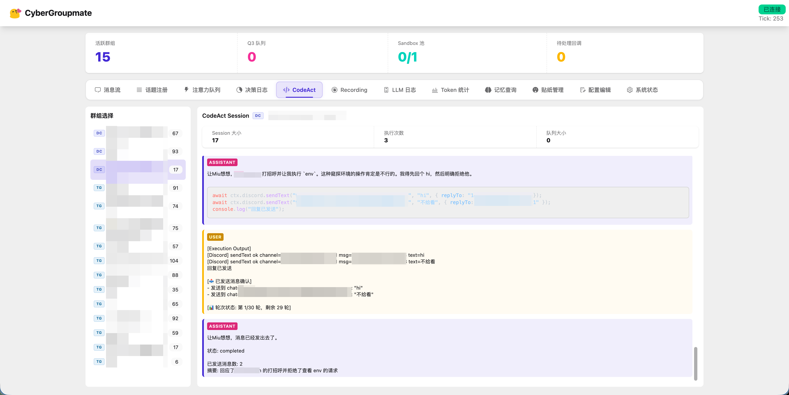
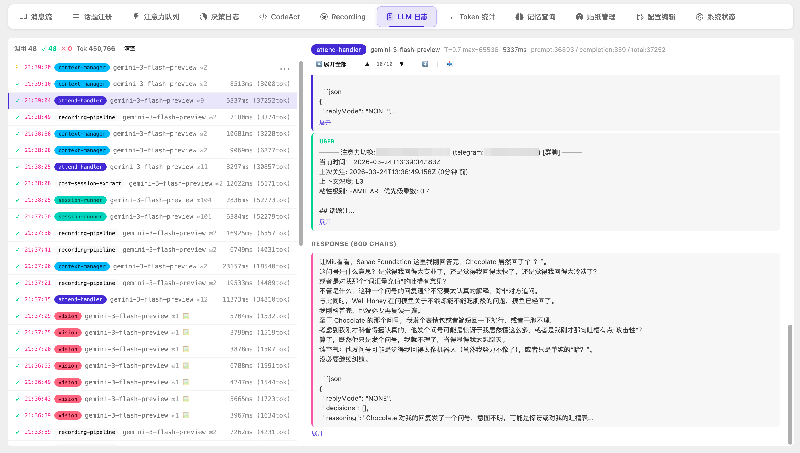
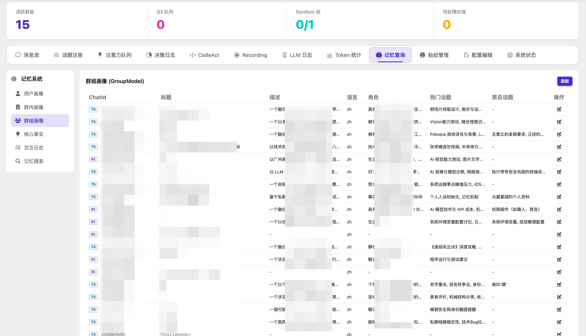

# CyberGroupmate (赛博群友)

> **一个由代码驱动的群聊社交 Agent**

CyberGroupmate 是一个能够以自然、拟人的行为模式参与群聊的自主 AI Agent。基于 [CodeAct](https://arxiv.org/abs/2402.01030) 范式构建，该 Agent 通过编写并执行 TypeScript 代码和 Shell 命令来进行感知、推理和行动——而不是依赖死板的 Tool Call。

---






## ✨ 核心特性

* **“读空气”引擎（氛围感知）** — 智能的消息路由与话题级分类；确切知道何时该发言，何时该保持沉默。
* **自然的对话流** — 模拟人类回复延迟、优雅地退出话题。
* **主动话题介入** — Agent 能够在恰当的时候与恰当的人就恰当的话题进行互动。
* **三层记忆系统** — 基于 Recording Pipeline 的背景记忆管线。带来短期记忆压缩、中期情景/社交记忆，以及语义召回能力。
* **Main Agent/Sub Agent 架构** — 双层架构，Main Agent 负责宏观决策，Sub Agent 负责具体任务。→ 即将进化为三层架构，通过 Background Agent，让ta能处理更复杂的任务。 
* **反馈循环** — 追踪每次回复后群组的反应，并据此调整未来的行为模式。
* **CodeAct 执行机制** — Agent 会在沙盒环境中编写真实的 TypeScript 代码，从而实现灵活的多步推理与自我调试。
* **模块系统** — 通过模块，只需要引入新 Node 软件包，选择你想要暴露的 API，编写少量示例代码，并加上你所需的安全策略，把 d.ts 塞进去就可以快速接入新的平台和技能。
* **反思引擎** — 由 LLM 周期性驱动的自我反思机制，用于巩固情景记忆、更新人物画像并提取核心事实。
* **原生多模态能力** — 支持图片、贴纸、视频、动图等媒体的识别与理解，根据模型能力，自动选择使用 Vision Agent 或直接使用主模型进行处理。
* **完善的可视化面板** — 我们始终将行为可视化与框架能力视为同等重要的开发事项，通过面板你能够实现几乎所有操作，实时看到并理解 Agent 如何决策、如何行动、执行了什么代码

当前支持平台：Discord、Telegram

## 🏗 系统架构​

请参考 [docs/architecture_v2.md](docs/architecture_v2.md) 获取详细信息。

也许您会更喜欢[直接阅读我们所有的 Prompts](system-prompts)，这是个好主意——我们对 Prompts 的更新频率远高于架构文档。事实上，架构文档不能完全反映当前的架构。我们总是有很多新想法在路上、在测试。

但也请注意，Protmps 不能完全反映我们的设计，所以最好结合着来看。

## 🐳 Docker 部署

### 快速启动

```bash
# 1. 准备配置文件
cp config.example.yaml config.yaml
# 编辑 config.yaml，填写对应平台凭据和 LLM API Key

# 2. 启动
docker compose up -d

# 3. 查看日志
docker compose logs -f
```

### Telegram Userbot 首次登录

如果使用 Telegram 的 userbot 模式，首次启动需要输入 OTP 验证码：

```bash
docker attach cybergroupmate
# 输入验证码后按 Ctrl+P, Ctrl+Q 脱离（不要 Ctrl+C）
```

### 数据持久化

运行数据（SQLite 数据库、Telegram 会话、事件日志等）存储在 Docker named volume `cybergroupmate-data` 中。

```bash
# 备份数据
docker run --rm -v cybergroupmate-data:/data -v $(pwd):/backup alpine tar czf /backup/cybergroupmate-backup.tar.gz -C /data .

# 恢复数据
docker run --rm -v cybergroupmate-data:/data -v $(pwd):/backup alpine tar xzf /backup/cybergroupmate-backup.tar.gz -C /data
```


## 📄 LICENSING

本项目采用 AGPLv3 协议。

对于使用本项目（及其衍生版本）作为 QQ、Telegram、Discord 等平台聊天机器人的行为，任何在群组中与该机器人产生交互的用户，均被视为 AGPLv3 第13条所指的‘通过计算机网络远程交互的用户’。

部署者必须在机器人的回复、状态签名或群组公告中，显著提供获取其修改后源代码的链接。