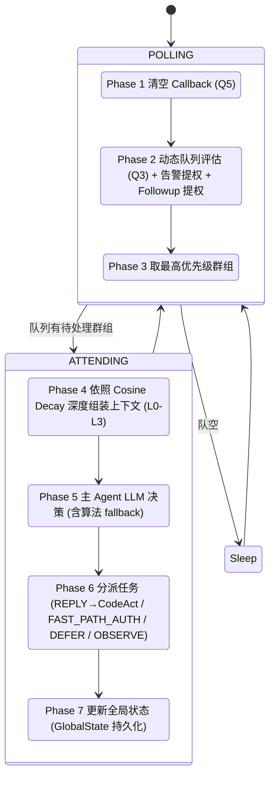
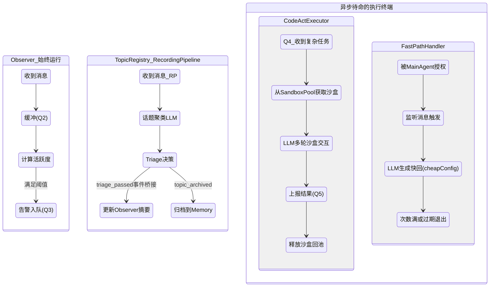
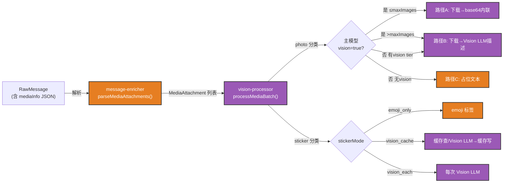
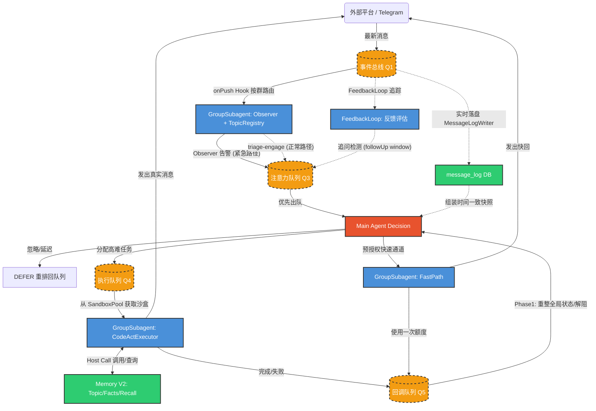

# CyberGroupmate 核心架构设计 (Architecture V2)

> **文档状态**: 最新设计与实现现状 (基于 Phase 6C S1-S8 重构完成)
> **创建日期**: 2026-03-16
> **核心演进**: 废弃了前期的单一路由器 (FastRouter) 与单例的录制流水线，全面拥抱 **主 Agent 集中决策 + Per-Group Subagent 并发感知与执行** 的双层架构。

## 1. 架构总览

CyberGroupmate 系统的核心设计哲学是 **速度分层：快决策 + 慢执行**。
系统被划分为四个主要的逻辑层，分别负责接入、总线、决策执行、以及记忆持久化。

### 1.1 系统分层
1. **基础设施接入层 (Platform Adapter)**: 将不同来源（如 Telegram）的事件标准化并推入系统。代理层只做收发，没有任何智能决策。
2. **全局事件总线 (NotificationCenter)**: 系统的心脏。负责所有事件的实时落盘 (`MessageLogWriter` → `message_log`)与同步 Hook 分发到 `GroupSubagent Observer` + `FeedbackLoop` 等。
3. **感知与智能层 (Main Agent & Subagents)**:
   - **Main Agent (决策层)**: 拥有全局视野。它像一个高速运转的单线程大脑，不断从注意力队列 (Q3) 中获取最需要关注的群组，统览全局上下文后做出决策（忽略、回复、延迟重审、授权快速通道），并将任务分派下去。自身维护一份 LLM 对话历史（经两层 Compact 防止膨胀），让 LLM 在跨 tick 时可以"记住"之前的决策和回调情况。
   - **Subagents (执行与感知层)**: 每个群组拥有一个独立的 `GroupSubagent` 容器实例。它是下设组件的宿主：`Observer`（感知器——计算活跃度、缓冲消息）、`TopicRegistry` + `RecordingPipeline`（话题聚类与记忆沉淀）、`CodeActExecutor`（深度执行器——独立沙盒）、`FastPathHandler`（快回应急）。
4. **统一记忆层 (Memory V2)**: SQLite 构筑的多层记忆（消息日志、话题节点、群组画像、人物画像、核心事实），结合定时/冷场/作息触发的 `Reflection` 反思机制与向量检索 (`sqlite-vec` / 纯 JS fallback)，以及上下文预算管理器 (`ContextManager`)，让 Agent 拥有类似人类的记忆衰减与认知。

---

## 2. 关键组件设计思路

### 2.1 主 Agent (Main Agent)
**核心概念**：系统最高指挥官。通过一套 **7-Phase 的串行注意力循环** (Main Event Loop) 来分配其"注意力"。它从不做实际的沙盒操作或消息拉取，而是通过观察发上来的摘要做宏观调度。

**上下文深度 (Cosine Decay)**：主 Agent 不会每次都去读取群里的全部信息。它使用余弦衰减算法，根据每个群组的 attend 次数在固定周期内自动切换上下文深度。深度周期 (`depthCyclePeriod`) 由群组的 Stickiness 等级决定（越亲密，深度巡检越频繁）。当有告警等紧急信号时，强制提升最低深度。四级深度为：只看摘要和分数 (L0)、加载群画像和历史回调 (L1)、追加消息原文 (L2)、全量深度摘要 (L3)。
**深度自动提升**：当 `topicDigests` 为空且无 `groupModel` 时（如新群/低活跃群），L0/L1 深度下 LLM 几乎无可用信息做决策，此时自动升级到 L2 以获取消息原文。

**对话历史管理**：主 Agent 维护自身的 LLM 对话历史 (`conversationHistory`)。每轮 attend 的上下文注入和 LLM 决策结果、以及 Phase 1 收到的 Callback 都会追加到历史中。超限时先做消息截断 (Layer 1)，再调用 `ContextManager.compact()` 做 LLM 压缩 (Layer 2)。

#### 主 Agent 注意力状态机

### 2.2 群组子代理 (GroupSubagent)
**核心概念**：被 Main Agent 调配的执行单元。针对每个 Telegram 群，系统都动态孵化一个 `GroupSubagent` 容器。容器持有以下核心组件：
1. **Observer (感知器)**：永远在运行。监听该群的消息，将它们放入内部 Q2 缓冲区。它**不调用 LLM**，纯靠算法计算**活跃度 (Engagement)**（基于消息频率 × 20 + 独立发言者 × 15 + @提及加成 20，上限 100）。当 Engagement 超阈值时向 Q3 发出高优告警；当条件满足时推荐 FastPath 授权。
2. **TopicRegistry + RecordingPipeline (话题系统)**：与 Observer 同级，由 `GroupSubagent` 直接持有。`RecordingPipeline` 独立维护消息缓冲与 LLM-based 话题聚类/摘要/Triage，通过事件桥接 (`topic:triage-passed`) 将话题摘要自动同步到 Observer 的 `topicDigests`，同时触发 `triage-engage` 事件将群组重新入队 Q3 拉起主 Agent 重评估（解决 flush 延迟导致的注意力盲区）。话题归档 (`topic:archived`) 时通知 Memory 做 `finalizeTopic()`。

**已分派话题追踪 (dispatchedTopicIds)**：`GroupSubagent` 维护一个 `dispatchedTopicIds: Set<string>` 集合。当 dispatch-handler 为某个话题分派 CodeAct 任务时，将 `topicId` 记入此集合。主 Agent 下次 attend 时将已分派话题列表注入 LLM prompt，明确提示 LLM 不要对同一话题重复分派回复任务。话题归档后自动清理。

**跨路径防重复 (lastAgentReplyAt)**：紧急路径（Observer 告警→CodeAct/FastPath）的回复发生在 triage 之前，因此 triage 不知道 agent 已回复过。`GroupSubagent` 维护 `lastAgentReplyAt` 时间戳，每当 callback 包含已发送消息时更新并同步到 `RecordingPipeline`。Pipeline 在 triage 决策阶段检查：如果某话题的最后一条消息早于 `lastAgentReplyAt`，自动标记为"已回复、不介入"，与 `_viaFastPath` 标记并列生效。
3. **CodeActExecutor (深度执行器)**：拥有完全隔离的 LLM 对话 Session 与通过 `SandboxPool` 按需获取的独立 Sandbox Worker。收到主 Agent 分派的 `CODEACT_REPLY` 任务后才被激活。它有自己的 Q4 任务队列实现串行执行，每个任务调用 `runCodeActSession()` 在沙盒中多轮 LLM 交互（可调用 Telegram API、Memory API、Web 搜索等 Host Call），完事后产出 Callback 到 Q5。Session 具备持久化与恢复能力（磁盘 JSON），以及两层 Compact 机制（Layer 1 结构化快速截断 + Layer 2 LLM token-budget 压缩）。
4. **FastPathHandler (应急反射神经)**：仅在主 Agent 显式预授权 (`FAST_PATH_AUTH`) 后才生效。收到授权后，用 `cheapConfig` LLM 自主生成快回复（受 `maxReplies` 次数与过期时间约束，支持 `preauthorizedActions` / `blockedActions` 以及 `__SKIP__` 跳过标记）。每次发送后产出 Callback 到 Q5 回报主 Agent。次数用尽或过期后自动禁用。

**Stickiness (群组亲密度)**：每个群组有一个 `GroupStickiness`，维护四个等级 `CORE → FAMILIAR → ACQUAINTANCE → STRANGER`。不同等级直接影响：优先级乘数 (`priorityMultiplier`)、Cosine Decay 深度周期 (`depthCyclePeriod`)、FastPath 资格 (`fastPathEligible`)、回复频率 (`replyFrequency`)、主动介入级别 (`initiativeLevel`) 等行为参数。亲密度可基于 `GroupModel` 的日均消息量与无交互天数自动升降级。

#### Subagent 状态流转图

### 2.3 记忆系统 V2 (Memory V2)
**核心概念**：不再是一股脑地把全量对话灌给 LLM，而建立"人类层级"的记忆管理体系：
1. **消息日志 (Message Log)**：由 `MessageLogWriter` 通过 NC Hook 实时将消息落盘到 SQLite `message_log` 表。`message_log` 是最底层的原始事实来源，决策时通过 `memory.getRecentMessages()` 获取时间对齐的快照。
2. **话题节点与中期记忆 (TopicNode / Episodic)**：群聊内容由 per-group `RecordingPipeline` 映射为一个个具有始末的 `TopicNode`（含摘要、关键词、参与者、情感等），存入 `topics` 表。同时维护每个人的群组画像 (`PersonGroupProfile`)。该画像的细腻度与此人在 Agent 心中的 **邓巴圈层 (`dunbar_tier`)** (1=核心~4=陌生) 直接挂钩，层级越高，画像特征捕获越多。
3. **核心事实 (Core Facts)**：长期有效的知识片段，由 Reflection 或手动存入 `core_facts` 表，支持 FTS5 全文检索和向量检索（`sqlite-vec` 可用时走 `vec0` 虚拟表，否则纯 JS `cosineSimilarity` fallback）。
4. **群组画像 (GroupModel)**：每个群组一份画像，记录群名、Agent 角色、活跃度、热点话题、禁忌话题、沟通规范等，在 Reflection 中动态更新。
5. **Reflection 反思引擎**：在冷场达标（沉默超阈值）、最大间隔到期、或处于非清醒时段时定时触发。Reflection 5 步流程：(a) 收集上次反思后的话题与交互数据 → (b) 量化统计每位参与者 → (c) LLM 生成结构化 JSON → (d) 写入画像增量/核心事实/群组模型更新/情感记忆合并/邓巴裁剪 → (e) 返回结果。合并机制支持渐进级联：>7天→周、>30天→月、>90天→季、>365天→年，只保留高显著性事件。
6. **上下文预算管理 (ContextManager)**：为 CodeActExecutor 和主 Agent 提供对话历史的智能压缩。核心能力包括：token 预算估算、消息分类（protected/compactable/disposable）、话题保护与 reply chain 保护（确保当前活跃话题上下文不被截断），以及 LLM 生成的 Context Briefing。

### 2.4 视觉处理管线 (Vision Pipeline)
**核心概念**：让 Agent "看得见图"。系统根据模型能力和配置自动选择三条处理路径，在 CodeActExecutor 执行期间按需处理消息中的图片和贴纸。主 Agent 决策阶段不做视觉处理（只看文本标签），视觉能力仅在执行层启用。

**架构分层**：
1. **消息富化器 (`message-enricher.ts`)**：管线入口。从 `RawMessage.mediaInfo` JSON 中解析出 `MediaAttachment[]`（含 fileId、uniqueFileId、type、emoji 等），调用 Vision 处理器批量处理后，将结果写回消息的 `processedMedia` 字段，最终输出格式化文本 + base64 图片列表。
2. **视觉处理器 (`vision-processor.ts`)**：核心调度。接收 `MediaAttachment[]`，将其分类为 photos 和 stickers 两类，分别按路径处理。
3. **下载函数 (`downloadFn`)**：由 `dispatch-handler.ts` 从 Telegram Adapter 构建（`telegram.downloadMedia` Host Call），经 `CodeActExecutor.setDependencies()` 注入到执行器，支持 file reference refetch（需要 chatId + messageId）和文件系统缓存（uniqueFileId 去重）。

**三条图片处理路径**：
| 路径 | 条件 | 行为 | 缓存策略 |
| :--- | :--- | :--- | :--- |
| **A: 原生多模态** | 主模型 `llmConfig.vision=true` | 前 `maxImagesPerContext` 张图下载后 base64 内联注入 LLM（`imageParts`），溢出部分降级为 B | 不缓存（每次需完整数据） |
| **B: Vision 辅助** | A 路溢出，或主模型不支持 vision 但配置了 `vision` tier LLM | 下载图片后调用 vision tier LLM 生成文本描述，以 `[📷 图片描述: ...]` 注入消息 | 内存缓存（`uniqueFileId → description`） |
| **C: 无 Vision** | 既无原生 vision 也无 vision tier LLM | 占位文本 `[📷 图片]` | 无 |

路径 A 下载失败时自动降级为 B（再失败降级为 C）。

**三种贴纸处理模式** (`VisionConfig.stickerMode`):
| 模式 | 行为 |
| :--- | :--- |
| `emoji_only` (默认) | 仅展示贴纸对应的 emoji 标签 `[🎭 贴纸: 😂]` |
| `vision_cache` | 首次下载+Vision LLM 识别（描述+emoji），结果写入 `StickerCache` 持久化，后续命中缓存 |
| `vision_each` | 每次都下载+Vision LLM 识别，不缓存 |

贴纸 Vision LLM 返回结构化 JSON `{"description": "...", "emoji": "🤣"}`，解析失败时 fallback 为原始文本。

**配置** (`config.yaml → vision`)：
- `maxImagesPerContext`: 单轮上下文最多内联图数（默认 3）
- `maxImageSize`: 大图压缩阈值长边像素（默认 1024）
- `stickerMode`: 贴纸处理模式
- LLM Profile 层面：`vision: true` 标记该 profile 支持多模态；`model_tiers.vision` 指定专用 vision tier

**调用时机**：
- **主 Agent 决策阶段**（`attend-handler`）：不做 Vision 处理，使用 `formatMessageLine(includeMediaTags: true)` 生成纯文本媒体标签（如 `[📷 图片]`、`[🎭 贴纸: 😂]`），让主脑知道消息附带了媒体类型即可。
- **CodeAct 执行阶段**（`code-act-executor.ts → executeWithSandbox()`）：使用完整的 `enrichMessages()` 管线，按需下载图片、调用 Vision LLM、生成描述或内联 base64，让执行层 LLM 能真正 "看到" 图片内容。

---

## 3. 组件间关系与数据流动

本系统不再是一个单纯的 Request-Response 直线，而是一个环形排队的自平衡闭环。通过 Q1 到 Q5 的解耦实现高并发。

### 关键队列与组件梳理
*   **Q1 (NotificationCenter, NC)**: 事件总线。接纳一切输入并通过 `onPush` Hook 同步分发到 `MessageLogWriter`（实时落盘）、`GroupSubagent.onMessage()`（Observer + RecordingPipeline）、`FeedbackLoop`（反馈追踪）。NC 同时支持 JSONL 文件持久化和跨进程事件注入（CLI 可追加 JSONL，NC 通过 `fs.watch` 检测并读入）。
*   **Q2 (Observer 内部 Buffer)**: Observer 的消息缓冲区。所有消息进入后参与 Engagement 计算，attend 后自动清空（`clearBuffer()`）。
*   **Q3 (DynamicAttentionQueue)**: 主 Agent 专属注意力队列。入队来源有五条路径：(1) DM 私聊或 @mention 消息到达时即时入队（必须回应的直接交互）；(2) Observer 检测到高 engagement 告警时即时入队（紧急路径）；(3) RecordingPipeline flush 后 triage 通过触发 `triage-engage` 事件入队（正常路径——triage 是 Q3 的核心看门人）；(4) DEFER 决策半优先级重新入队；(5) FeedbackLoop 追问检测——Agent 发言后开启短窗口（默认 90 秒），窗口内同群用户消息触发即时入队并重置 `lastAgentReplyAt` 使 triage 不跳过。**不对普通群消息无条件入队**，确保 Main Agent 的决策基于 triage 的结构化分析而非原始消息。支持时间衰减、block/unblock（CodeAct 执行中阻塞该群）、priority boost（告警/Followup 提权）。
*   **Q4 (CodeActExecutor 内部 Task Queue)**: 每个群组的 CodeActExecutor 内部的串行任务队列。主 Agent 分派 `CODEACT_REPLY` 后 enqueue，按序执行。
*   **Q5 (CallbackQueue)**: Subagent 向主 Agent 呈报完成结果的回执箱。CodeActExecutor 和 FastPathHandler 完成后将 `SubagentCallback` push 到此，由主 Agent Phase 1 drain。
*   **SandboxPool**: 全局 Sandbox 实例池，管理最大并发数和空闲超时回收。CodeActExecutor 执行时 acquire，完成后 release。每个 Sandbox 实例上注册了 Host Call 路由（Telegram API、Memory API、TaskList 等）。
*   **GlobalState**: 全局状态持久化（JSON 文件），记录最近决策日志、任务列表、pendingFollowups 等。主 Agent 系统 Prompt 中注入全局状态，确保跨 tick 状态一致感。
*   **FeedbackLoop**: 追踪 Agent 已发消息的后续群聊反响，用于评估 Agent 发言的效果。同时承担**追问检测**职责：Agent 发言后开启一个可配置的追问窗口（默认 90 秒），在窗口期内收到同群用户消息时判定为追问，立即将该群以 boost 优先级入队 Q3，并重置 `lastAgentReplyAt` 为 0 以绕过 RecordingPipeline 的 triage 防重复守卫。追问窗口到期后自动清理，每个 chatId 同时只维护一个窗口（新 Agent 消息会刷新窗口）。

---

## 4. Prompt 数据来源映射

架构将大量动态上下文组装后，精准投喂给最终组装成的 Prompt 供模型决策和操作使用：

| 目标 Prompt | 注水管道 (从何处拼装数据) | 核心变量呈现 (举例) |
| :--- | :--- | :--- |
| **主 Agent 系统指令** | 全局静态配置库 (`persona`)、全局状态 (`GlobalState`) | `{persona}` (底层人格设定), `{recentDecisions}` (最近决策记录), `{activeTasks}` (当前任务列表), `{attentionSummary}` (全局状态摘要) |
| **主 Agent 决策输入** (Attend Context) | 群消息的数据库快照 + Observer 产出的话题注册表 + 群组画像 + 历史 Callback + 已分派话题集 | `{topicDigests}`, `{messages}` (L2+深度消息原文), `{engagementScore}`, `{lastCallbacks}`, `{fastPathHistory}`, `{suggestedReplyMode}` (算法预估), `{alertReason}`, `{groupModel}`, `{stickinessLevel}`, `{timeSinceLastAttend}`, `{dispatchedTopicIds}` (已分派回复任务的话题ID，防重复) |
| **CodeActExecutor 任务指派** | Main Agent 派发到 Q4 的含明确方向的回复任务 + Memory 查询 + **Vision 管线**（`enrichMessages` 按需下载图片/贴纸并生成描述或 base64 内联） | `{targetMessages}` (含 reply-to 关系的消息原文 + 媒体描述/内联图), `{imageParts}` (路径 A 的 base64 图片数据), `{topicSummary}`, `{personContext}` (人物背景), `{contentDirection}` (主脑指示的方向), `{toneGuidance}` (语气指导), `{apiTypeDefs}` (沙盒 API 类型定义) |
| **FastPath 快速指令** | Main Agent 授权时圈定的配置选项 | `{preauthorizedActions}` (允许的行动), `{blockedActions}` (绝对不可涉及的话题), `{tonePreset}` (语气预设), `{maxReplyLength}`, `{repliesSent}` / `{maxReplies}` (已用/总额度) |
| **Reflection 定期反思输入** | MemoryV2 查出的上次反思后的话题与交互数据 + 已有画像 + 群组画像 | `{topics}` (带摘要/情感/AI介入状态), `{interactions}`, `{participantStats}` (量化统计), `{existingProfiles}`, `{groupModel}` |

---

## 5. 穿透式聊天演练 (End-to-End Chat Scenario)

**背景设定**：一个被 Agent 的 Stickiness 设置为 "FAMILIAR" 级别 (priorityMultiplier=1.2, depthCyclePeriod=15, fastPathEligible=true) 的游戏讨论群。

1. **[感知流入]** 群友 A 连续发了 3 张新游戏截图，群友 B 紧跟着发了一句 "**@CyberGroupmate 这画质可以啊，你觉得呢？你的配置跑得起来不？**"
   - 每条图片消息在入 `message_log` 时，其 `mediaInfo` 字段记录了 `{type:"photo", fileId, uniqueFileId, mimeType, width, height}` 元数据。
2. **[底层总线]** 消息毫秒级从 Telegram 适配器进入 **NotificationCenter**，通过 `onPush` Hook 同步路由到 `MessageLogWriter` 实时落盘至 SQLite `message_log`，以及对应群组的 `GroupSubagent.onMessage()`。
3. **[静默观察]** 消息同时被分发给 **Observer**（计算 Engagement：高频消息 + 多发言者 + @提及 → 飙升）和 **RecordingPipeline**（话题聚类 + LLM Triage）。Observer Engagement 超过告警阈值，通过 `buildQueueEntry()` 生成高级告警条目入队 **Q3**。此时图片只以 `[📷 图片]` 标签参与主脑决策（不做实际视觉处理）。
4. **[主脑调度]** **MainAgentLoop** 正处于串行 tick 循环中。Phase 2 遍历所有 Subagent 更新 Q3，检测到该群告警并 boost 优先级 +20。Phase 3 dequeue 发现该群优先级最高。
5. **[深思熟虑]** Phase 4 调用 `calculateDepth()` 根据 attendCount 和 depthCyclePeriod 计算 Cosine Decay 深度，因存在 alert 强制最低 L2。`buildGroupContext()` 组装含消息原文、群画像、历史 Callback 的上下文包。Phase 5 将系统 Prompt（含全局状态、最近决策、活跃任务）+ attend 上下文 + 对话历史拼装后交给 SOTA 模型做最终裁判。
6. **[战略分发]** Phase 6 根据 LLM 返回的 JSON 决策分派：
   - **决策 1 (深度解析)**: REPLY 动作，下发 `CODEACT_REPLY` 任务，`contentDirection`: "回忆以前推荐过的显卡，联网验证最新天梯图参数，给他们一个专业的调侃"。Q3 同时 block 该群防止重复 attend。
   - **决策 2 (防冷场)**: FAST_PATH_AUTH 动作，下发快速通道授权（`maxReplies=3, expiresAt=5分钟后, tonePreset=轻松`），允许 FastPath 随便找个硬件梗预热。
7. **[执行双响炮]** 本群的 Subagent 在各自的轨道上并行启动：
   - **FastPathHandler** 拿到授权，下一条消息到达时通过 `cheapConfig` LLM 生成一句快回并发送。产出成功 Callback 放入 Q5。
   - 同一时刻，**CodeActExecutor** 从 `SandboxPool` acquire 一个沙盒实例。执行前，`enrichMessages()` 管线启动 **Vision 处理**：3 张截图的 `mediaInfo` 被解析为 `MediaAttachment[]`，因主模型 `vision=true`，前 3 张图走 **路径 A**——通过 `downloadFn` 从 Telegram 下载图片并 base64 内联注入 LLM 的 `imageParts`，让模型直接 "看到" 游戏截图内容。若图片超过 `maxImagesPerContext` 限制，溢出部分自动降级为 **路径 B** 调用 vision tier LLM 生成文本描述（结果按 `uniqueFileId` 缓存，避免重复下载和识别）。随后将历史 Session + 本次任务 Prompt（含图片）注入，执行 `runCodeActSession()` 多轮 CodeAct 交互（调用 `memory.recall` 查 "上次给这哥们推的是 4070"、调用 Web 搜索获取最新数据），最终通过 Telegram Host Call 在群内发出详尽整活回复。完成后释放沙盒、持久化 Session、产出 Callback 送入 Q5。
8. **[收拢善后]** Callback 被主脑在下一 tick 的 Phase 1 drain：记录到 GlobalState、追加到 LLM 对话历史、标记任务完成、Q3 unblock 该群。直到深夜处于非清醒时段，**Reflection 引擎** 被定时器触发。它将白天这段看图聊硬件的对话收集为话题，量化统计参与者，调用 LLM 生成结构化反思 JSON，更新群友画像特征、存储核心事实、级联合并老旧情感记忆，并对邓巴层级超限的用户做精度裁剪和降级处理。
