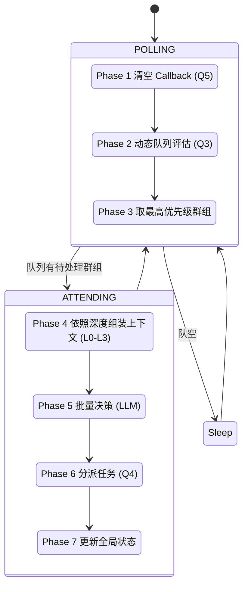
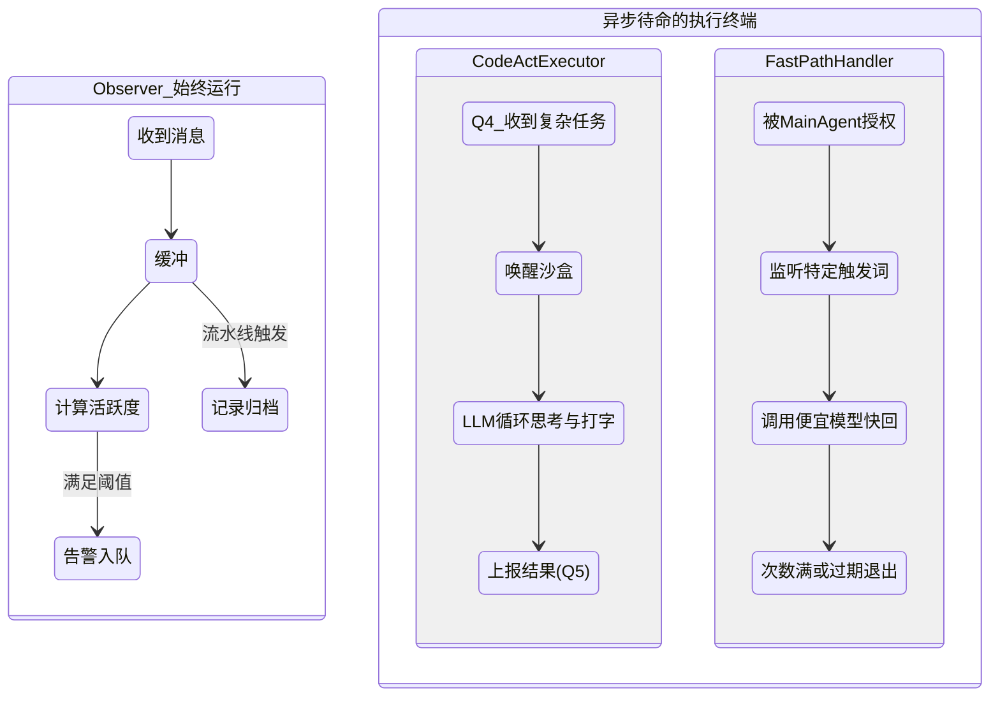
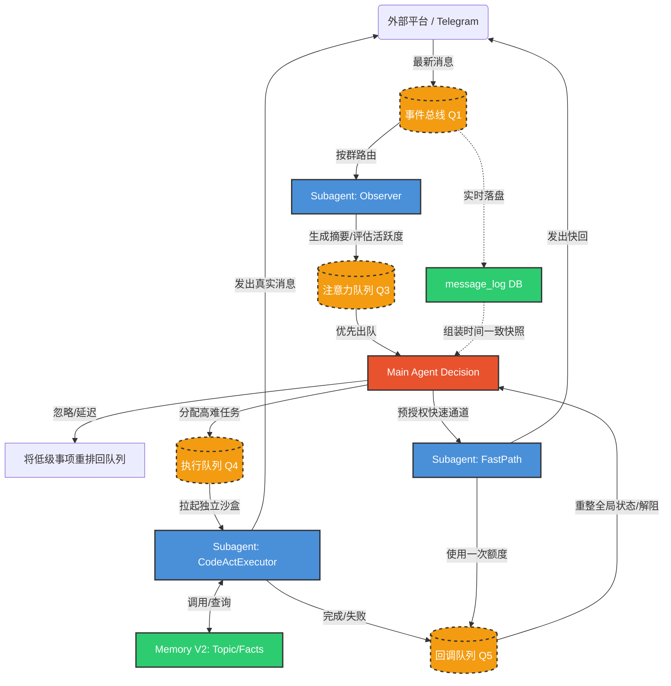

# CyberGroupmate 核心架构设计 (Architecture V2)

> **文档状态**: 最新设计与实现现状 (基于 Phase 6C S1-S8 重构完成)
> **创建日期**: 2026-03-16
> **核心演进**: 废弃了前期的单一路由器 (FastRouter) 与单例的录制流水线，全面拥抱 **主 Agent 集中决策 + Per-Group Subagent 并发感知与执行** 的双层架构。

## 1. 架构总览

CyberGroupmate 系统的核心设计哲学是 **速度分层：快决策 + 慢执行**。
系统被划分为四个主要的逻辑层，分别负责接入、总线、决策执行、以及记忆持久化。

### 1.1 系统分层
1. **基础设施接入层 (Platform Adapter)**: 将不同来源（如 Telegram）的事件标准化并推入系统。代理层只做收发，没有任何智能决策。
2. **全局事件总线 (Notification Center, Q1)**: 系统的心脏。负责所有事件的实时落盘 (`message_log`)与跨组件分发 (`GroupDispatcher`)。
3. **感知与智能层 (Main Agent & Subagents)**:
   - **Main Agent (决策层)**: 拥有全局视野。它像一个高速运转的单线程大脑，不断从优先队列 (Q3) 中获取最需要关注的群组，统览全局上下文后做出决策（忽略、回复、授权快速通道），并将任务分派下去。
   - **Subagents (执行与感知层)**: 每个群组拥有一个独立的 Subagent 实例。它默默在后台监听本群消息（Observer），将复杂的需要深度推理的动作放在独立的沙盒中执行（CodeActExecutor），并在高潮迭起时自主应答短平快的问题（FastPathHandler）。
4. **统一记忆层 (Memory V2)**: SQLite 构筑的三层记忆（短期上下文、中期基于情景的话题及群画像、长期核心事实），结合定时或冷场触发的 `Reflection` 反思机制，让 Agent 拥有类似人类的记忆衰减与认知。

---

## 2. 关键组件设计思路

### 2.1 主 Agent (Main Agent)
**核心概念**：系统最高指挥官。通过一套 **7-Phase 的串行注意力循环** (Main Event Loop) 来分配其“注意力”。它从不做实际的沙盒操作或消息拉取，而是通过观察发上来的摘要做宏观调度。
**上下文深度 (Cosine Decay)**：主 Agent 不会每次都去读取群里的所有历史。它使用余弦衰减算法结合群组粘性 (Stickiness)，动态决定在看一个群时，是只看一眼摘要 (L0)，还是深度研读完整上下文 (L3)。

#### 主 Agent 注意力状态机

### 2.2 群组子代理 (Subagent)
**核心概念**：被 Main Agent 调配的打工机。针对每个 Telegram 群，系统都动态孵化一个 Subagent。包含三个核心零部件：
1. **Observer (感知器)**：永远在运行。监听该群的消息、归档话题 (TopicRegistry) 以及录制 (RecordingPipeline)，并且不调用复杂的 LLM，仅靠轻量级算法计算**活跃度 (Engagement)**，在达到阈值时向主 Agent 发出告警。
2. **CodeActExecutor (深度执行器)**：拥有完全隔离的对话 Session 与沙盒 Worker。收到主 Agent 发给该群的 `CODEACT_REPLY` 后，它才被激活，自己调用 LLM 写代码、查数据库、发送长篇分析等，完事后上报。
3. **FastPathHandler (应急反射神经)**：**全系统唯一允许跳过主 Agent 决定回复内容的组件**，但必须由主 Agent 预授权。只针对高强度互动的活跃期，调用较快、较便宜的模型做简单的打招呼或附和。

#### Subagent 状态流转图

### 2.3 记忆系统 V2 (Memory V2)
**核心概念**：不再是一股脑地把全量对话灌给 LLM，而建立“人类层级”的检索体系：
1. **短期计算空间 (Working Memory)**：自动在 Session token 即将溢出时采取 Compaction 压缩历史消息，使用轻模型抽摘要，但不截断当前正在激烈交流的核心话题 (Active Turn Protection)。
2. **中期记忆与画像 (Episodic & Social Memory)**：群聊内容映射为一个个具有始末的话题节点 (`TopicNode`)；同时维护每个人的群组画像 (`PersonGroupProfile`)。该画像的细腻度与此人在 Agent 心中的 **邓巴圈层 (Dunbar Tier)** (1=核心~4=陌生) 直接挂钩，层级越高，画像特征捕获越多。
3. **长期与合并记忆 (Merged Memory)**：在 Agent 定期发呆（冷场触发/就寝模式触发）时进入 **Reflection**。由 Reflection 引擎把大量零散的话题交互合并提炼为年、季度、月度的关系变迁，只留下最深的影响。

---

## 3. 组件间关系与数据流动

本系统不再是一个单纯的 Request-Response 直线，而是一个环形排队的自平衡闭环。通过 Q1 到 Q5 的解耦实现高并发。

### 关键队列梳理
*   **Q1 (NG/Global Bus)**: 广纳一切输入，提供实时记录保障。
*   **Q3 (Attention Queue)**: 主 Agent 专属收件箱。Observer 往里头扔战报 (Digest Update/Alert)。
*   **Q4 (Execution Queue)**: 分配给局部各群的局部“厂长”任务单。
*   **Q5 (Callback Queue)**: Subagent 向主 Agent 呈报完成结果的回执箱。

---

## 4. Prompt 数据来源映射

架构将大量动态上下文组装后，精准投喂给最终组装成的 Prompt 供模型决策和操作使用：

| 目标 Prompt | 注水管道 (从何处拼装数据) | 核心变量呈现 (举例) |
| :--- | :--- | :--- |
| **主 Agent 系统指令** | 全局静态配置库、长事务维护清单 | `{persona}` (底层人格设定), `{globalTasks}` (跨群追踪的事务) |
| **主 Agent 决策输入** (Attend Context) | 群消息的数据库快照 + Observer 产出的话题注册表 + 群组粘性预设值 | `{topicRegistry}`, `{newMessagesSinceLastAttend}`, `{engagementScore}`, `{lastCallbacks}` |
| **CodeActExecutor 任务指派** | Main Agent 派发到 Q4 的包含明确方向的回复任务 | `{contextSnapshot.topicSummary}`, `{targetMessageIds}`, `{contentDirection}` (主脑指示的方向) |
| **FastPath 越权快速指令** | Main Agent 授权时圈定的配置选项 | `{preauthorizedActions}` (允许说什么如"只发表情"), `{blockedActions}` (绝对不可涉及的话题) |
| **Reflection 定期反思输入** | MemoryV2 查出的昨日至今零散互动与长期存储的用户级别 | `{unmergedEpisodes}`, `{currentDunbarTiers}` |

---

## 5. 穿透式聊天演练 (End-to-End Chat Scenario)

**背景设定**：一个被 Agent 设置为 "FAMILIAR" 级别的游戏讨论群。

1. **[感知流入]** 群友 A 连续发了 3 张新游戏截图，群友 B 紧跟着发了一句 "**@CyberGroupmate 这画质可以啊，你觉得呢？你的配置跑得起来不？**"
2. **[底层总线]** 消息毫秒级从 Telegram 适配器进入 **全局总线事件队列 (Q1)**，并被同步落盘到 SQLite 数据库的 `message_log`。
3. **[静默观察]** 专门为该群体实例化的 **Observer (感知器)** 接收并开始测算。由于短时间刷屏图片且带有专属艾特（高频强关注），该群 `Engagement` 算分飙升。Observer 立即生成一条高级告警丢进 **注意力队列 (Q3)**。
4. **[主脑调度]** **Main Agent** 正处于串行循环中，查阅 Q3 发现这个群优先级被强制拉满。主脑从数据库提取出与此时刻完全对齐的**快照 (MessageSnapshot)**，避免了处理期间新消息引发的精神错乱。
5. **[深思熟虑]** 主 Agent 评判当前需要深度上下文 (L3)。它将群友的截图事件、B 的发难以及此群过往是 "游戏老炮交流为主" 的人设属性打入 Prompt，提交大规模模型进行最终裁判。
6. **[战略分发]** 大模型判定后，主脑下达两份具体指令落入执行队列：
   - **决策 1 (深度解析)**: 下发一则必须用代码执行的任务 (`CODEACT_REPLY`)：“回忆一下我们以前推荐过的显卡，用代码联网验证最新天梯图参数，给他们一个专业的调侃”。
   - **决策 2 (防冷场)**: 考虑到联网耗时较长，同步下发快速通道授权 (`FAST_PATH_AUTH`)，允许 FastPath 随便找个硬件梗预热。
7. **[执行双响炮]** 本群的子进程在各自的轨道上并行启动：
   - **FastPathHandler** 拿到权限，瞬间用更快的轻频模型发了一张【猫猫震惊.jpg】并在群里回了一句：“这画质，显卡在起火的边缘试探了属于是”。紧接着产生成功流转凭证放入 Q5 回调区。
   - 同一时刻，**CodeActExecutor** 拉起独立的沙盒进程，执行自主编程。用其独立的会话查阅了 `MemoryV2` ("上次给这哥们推的是 4070")，然后获取 Web 搜索结果，最终在半分钟后于群内发出详尽的技术整活回复。随后产生最终通过凭证送入 Q5。
8. **[收拢善后]** 凭证被主脑在下一次巡查之初 (Phase 1) 回收核销，系统解除该群的专注占用分配。直到深夜发呆时间，**记忆中的 Reflection (反思引擎)** 启动，它将白天这段看图聊硬件的对话记作了一次增加感情积累的标志性事件。
