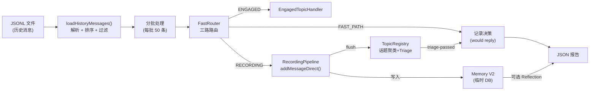
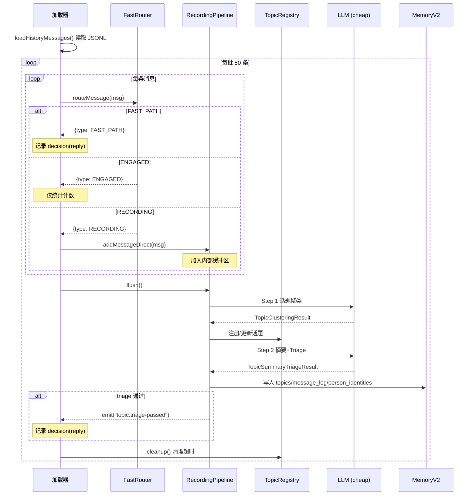
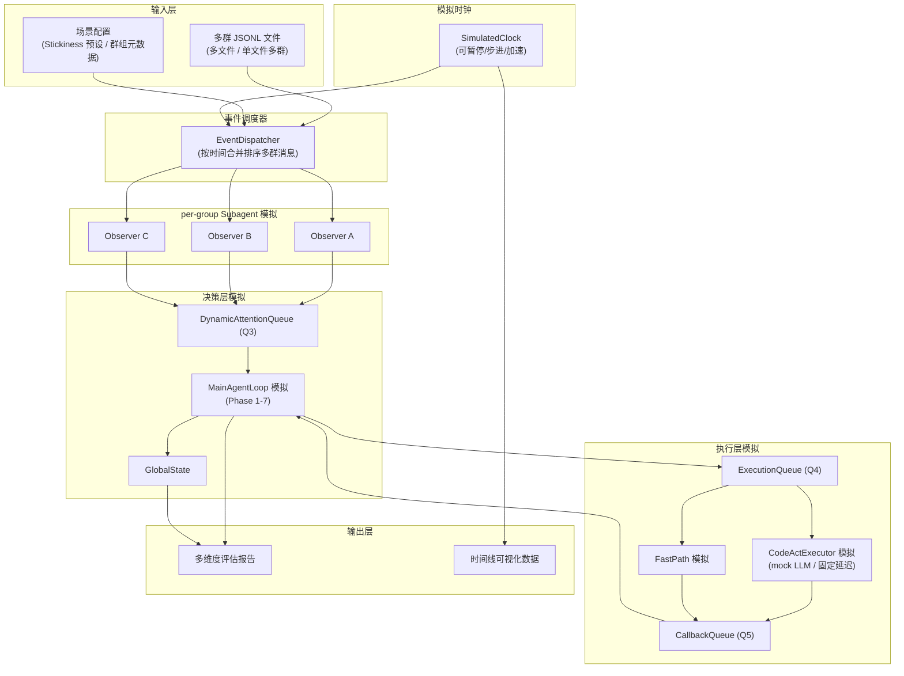
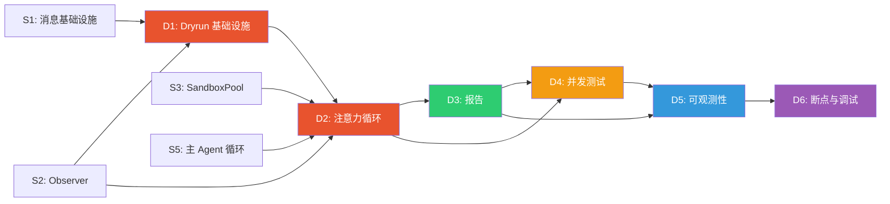
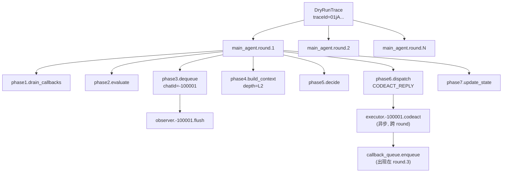

# Dryrun 系统分析与多群聊测试设计

> **文档版本**: 0.3.0  
> **创建时间**: 2026-03-13  
> **最后更新**: 2026-03-14  
> **状态**: 设计分析稿  
> **关联文档**: `Implementation_Plan.md` Phase 6.7/6C/7, `subagent.md` v0.5.0, `subtask.md`

---

## 目录

1. [当前 Dryrun 系统分析](#1-当前-dryrun-系统分析)
   - [1.1 架构概览](#11-架构概览)
   - [1.2 数据流详解](#12-数据流详解)
   - [1.3 组件初始化](#13-组件初始化)
   - [1.4 消息处理流程](#14-消息处理流程)
   - [1.5 输出与报告](#15-输出与报告)
   - [1.6 CLI 集成](#16-cli-集成)
   - [1.7 当前设计的局限性](#17-当前设计的局限性)
2. [Subagent 架构对 Dryrun 的影响](#2-subagent-架构对-dryrun-的影响)
   - [2.1 架构差异对比](#21-架构差异对比)
   - [2.2 新增需要测试的组件](#22-新增需要测试的组件)
3. [多群聊 Dryrun 设计方案](#3-多群聊-dryrun-设计方案)
   - [3.1 设计目标](#31-设计目标)
   - [3.2 多群聊 Dryrun 架构](#32-多群聊-dryrun-架构)
   - [3.3 数据输入格式](#33-数据输入格式)
   - [3.4 模拟时钟与事件调度](#34-模拟时钟与事件调度)
   - [3.5 Observer 模拟](#35-observer-模拟)
   - [3.6 主 Agent 注意力循环模拟](#36-主-agent-注意力循环模拟)
   - [3.7 CodeActExecutor / FastPath 模拟](#37-codeactexecutor--fastpath-模拟)
   - [3.8 报告扩展](#38-报告扩展)
4. [分布式系统中的锁问题分析](#4-分布式系统中的锁问题分析)
   - [4.1 关键共享资源与竞争点](#41-关键共享资源与竞争点)
   - [4.2 锁问题分类与分析](#42-锁问题分类与分析)
   - [4.3 Dryrun 中如何测试锁问题](#43-dryrun-中如何测试锁问题)
5. [实施建议](#5-实施建议)
6. [可观测性设计](#6-可观测性设计)
   - [6.1 Dryrun Trace 数据模型](#61-dryrun-trace-数据模型)
   - [6.2 结构化日志增强](#62-结构化日志增强)
   - [6.3 Span 层级与关联](#63-span-层级与关联)
   - [6.4 实时仪表盘数据](#64-实时仪表盘数据)
   - [6.5 Dryrun 报告中的可观测性聚合](#65-dryrun-报告中的可观测性聚合)
7. [断点与调试设计](#7-断点与调试设计)
   - [7.1 Dryrun 断点系统](#71-dryrun-断点系统)
   - [7.2 步进调试模式](#72-步进调试模式)
   - [7.3 条件断点](#73-条件断点)
   - [7.4 回放调试](#74-回放调试)
   - [7.5 调试接口与 CLI 集成](#75-调试接口与-cli-集成)
8. [未来扩展兼容性审查](#8-未来扩展兼容性审查)
   - [8.1 Phase 7 兼容性](#81-phase-7-兼容性)
   - [8.2 Appendix B 扩展兼容性](#82-appendix-b-扩展兼容性)
   - [8.3 Dryrun Harness 扩展点清单](#83-dryrun-harness-扩展点清单)
9. [架构冲突分析与修正](#9-架构冲突分析与修正)
10. [Dryrun Harness 实施细化](#10-dryrun-harness-实施细化)
    - [10.1 核心组件实例化蓝图](#101-核心组件实例化蓝图)
    - [10.2 消息分发流程](#102-消息分发流程)
    - [10.3 主循环实现细化](#103-主循环实现细化)
11. [测试环境 Examples](#11-测试环境-examples)
    - [11.1 Example A — 基础多群注意力竞争](#111-example-a--基础多群注意力竞争)
    - [11.2 Example B — FastPath + CodeAct 并发](#112-example-b--fastpath--codeact-并发)
    - [11.3 Example C — 高并发压力 + 锁测试](#113-example-c--高并发压力--锁测试)
    - [11.4 Example D — 端到端全流程 (Real LLM)](#114-example-d--端到端全流程-real-llm)
    - [11.5 JSONL 样本生成工具](#115-jsonl-样本生成工具)

---

## 1. 当前 Dryrun 系统分析

### 1.1 架构概览

当前 dryrun 系统实现位于 [`dry-run.ts`](file:///Users/arc/Documents/github/arc/CyberGroupmate/src/pipeline/dry-run.ts)，是 Phase 6.7 的交付物。其核心思路是：**离线重放历史 JSONL 消息文件，模拟 FastRouter + RecordingPipeline 的处理流程，评估 agent 在哪些消息上"会回复"，产出 JSON 评估报告**。



**核心特征**：
- **单群处理模型**：虽然可以处理所有群组消息（不传 `--chat-id`），但所有组件（TopicRegistry、RecordingPipeline、EngagedTopicHandler、FastRouter）都是**全局单例**，不区分群组
- **无时间模拟**：消息按时间排序后直接批量处理，不模拟"消息到达的时间间隔"
- **不模拟 Agent 决策**：只走到"是否回复"的判断，不运行 LLM 生成实际回复内容
- **不模拟消息发送**：`send: false` 始终为假

### 1.2 数据流详解

#### 输入

JSONL 文件每行一个 JSON 对象：

```json
{"id": "12345", "chat_id": "1001234567", "user_id": "67890", "user_name": "alice", "text": "今天吃什么", "date": "2026-03-01T12:00:00Z", "reply_to": "12340"}
```

`loadHistoryMessages()` 将其标准化为内部 `Message` 类型：
1. 解析每行 JSON
2. `normalizeChatId()` — 正数超级群 ID 自动取反（兼容 Telegram Desktop 导出格式）
3. `--chat-id` 过滤（可选）
4. 按 `timestamp` 升序排序
5. `--days` 过滤最近 N 天

#### 处理

消息按 50 条一批处理：

```
for 每批 50 条:
  for 批内每条消息:
    route = fastRouter.routeMessage(msg)
    switch route.type:
      FAST_PATH → 记录 decision (reply, 原因: direct_mention/reply_to_agent/private_chat)
      ENGAGED   → routeStats.engaged++ (不直接记录 decision)
      RECORDING → recordingPipeline.addMessageDirect(msg)
  
  await recordingPipeline.flush()    // 调 LLM 做话题聚类 + Triage
  registry.cleanup()                 // 清理超时话题
```

关键事件监听：
- `recordingPipeline.on("topic:triage-passed")` — 话题通过 Triage 时记录 decision
- `registry.on("topic:archived")` — 话题归档时调 `memory.finalizeTopic()`

#### 输出

`DryRunResult` 包含：
| 字段 | 说明 |
|------|------|
| `totalMessages` | 总消息数 |
| `wouldReply` / `wouldIgnore` | 回复/沉默计数 |
| `decisions[]` | 每条回复决策的详情（触发消息、原因、pipeline trace） |
| `totalTokens` | LLM token 消耗 |
| `totalTimeMs` | 总耗时 |
| `memoryStats` | Memory V2 表统计（topics/facts/messages/persons/profiles） |
| `reflectionResults` | Reflection 结果（可选） |

### 1.3 组件初始化

```typescript
// 模型配置（三层）
cheapConfig  = resolveTierProfile("cheap", appConfig)
midConfig    = resolveTierProfile("mid", appConfig)
sotaConfig   = resolveTierProfile("sota", appConfig)

// 核心组件（全部全局单例）
memory            = new MemoryStoreV2(dbPath)           // 临时 DB，每次运行前删除重建
registry          = new TopicRegistry()                  // 全局单例
recordingPipeline = new RecordingPipeline(registry, ...)  // 全局单例
engagedHandler    = new EngagedTopicHandler(registry, ...) // 全局单例
fastRouter        = new FastRouter(registry, engagedHandler, recordingPipeline, agentUserId)
modelRouter       = new ModelRouter(midConfig, ...)
```

### 1.4 消息处理流程



### 1.5 输出与报告

`saveDryRunReport()` 将结果写入 JSON 文件（`<input>.dry-run-report.json`）：

```json
{
  "totalMessages": 500,
  "wouldReply": 23,
  "wouldIgnore": 477,
  "decisions": [...],
  "summary": {
    "replyRate": "4.6%",
    "totalTimeMs": 45000
  },
  "memoryStats": {
    "topics": 15,
    "facts": 0,
    "messages": 500,
    "persons": 12
  }
}
```

### 1.6 CLI 集成

```bash
# 基本用法
npx tsx src/cli.ts dry-run workspace/dryrun/chat1_test.jsonl

# 带选项
npx tsx src/cli.ts dry-run chat.jsonl --chat-id -100123456 --days 7 --reflect

# 自定义 memory DB 路径
npx tsx src/cli.ts dry-run chat.jsonl --memory-db /tmp/test.db
```

辅助工具：
- `tests/scripts/bootstrap-dryrun-db.ts` — 创建预填充种子数据的 Memory V2 数据库，用于验证 recall/browse 功能
- `src/tools/tg-to-jsonl.ts` — Telegram JSON 导出 → JSONL 转换

### 1.7 当前设计的局限性

| # | 局限 | 影响 |
|---|------|------|
| 1 | **全局单例组件**：TopicRegistry / RecordingPipeline / FastRouter 不按群组隔离 | 多群消息混合在同一个注册表中，话题可能跨群误聚类 |
| 2 | **无时间模拟**：消息直接按序处理，不模拟到达间隔 | 无法测试 engagement 评分的时间衰减、flush 时机、超时清理等时间敏感逻辑 |
| 3 | **无注意力循环**：不模拟主 Agent 的优先级排序和串行处理 | 无法评估多群竞争时的注意力分配合理性 |
| 4 | **不模拟并发**：单线程顺序执行 | 无法发现 Q3/Q4/Q5 队列的竞态条件 |
| 5 | **单维度评估**：只有"reply/ignore"二元决策 | 无法评估回复质量、时机、模式选择等多维度指标 |
| 6 | **无 Subagent 组件**：不包含 Observer、CodeActExecutor、FastPath | Subagent 架构的核心路径完全未覆盖 |
| 7 | **单 chatId 过滤**：`--chat-id` 只能选一个群 | 无法测试多群同时活跃的并发场景 |

---

## 2. Subagent 架构对 Dryrun 的影响

### 2.1 架构差异对比

| 维度 | 现有 Dryrun (Phase 6) | Subagent 架构 (Phase 7+) |
|------|----------------------|--------------------------|
| **消息路由** | FastRouter 全局单例，三路分发 | NC → GroupDispatcher → per-group Observer (Q1→Q2) |
| **话题管理** | TopicRegistry 全局单例 | per-group TopicRegistry (Observer 持有) |
| **消息处理** | RecordingPipeline 全局单例批量 flush | per-group RecordingPipeline + Observer 的 Q2 buffer |
| **决策层** | 无（只到 Triage 判断） | 主 Agent 注意力循环 Phase 1-7 |
| **执行层** | 无 | CodeActExecutor (Q4) + FastPath |
| **回调处理** | 无 | Q5 Callback → Main Agent Phase 1 |
| **优先级** | 无 | DynamicAttentionQueue (Q3) + Cosine Decay |
| **并发模型** | 单线程顺序 | Observer 并行 + Main Agent 串行出队 + CodeAct 后台执行 |
| **群组间交互** | 无 | GlobalState + pendingFollowups 跨群追踪 |

### 2.2 新增需要测试的组件

```
                新架构需覆盖的测试面
                ═══════════════════

感知层 (per-group)
├── Observer.onMessage()          消息消费 + Q2 buffer
├── Observer.flushBuffer()        话题聚类 + Triage
├── Observer.getEngagementScore() 纯算法 engagement 计算
├── Observer.checkAlert()         engagement 阈值告警
├── Observer.checkFastPathRequest() 高 engagement + FP 过期检测
└── per-group TopicRegistry/RecordingPipeline 隔离性

决策层 (全局)
├── DynamicAttentionQueue.evaluate()   动态队列评估
├── DynamicAttentionQueue.dequeue()    优先级排序
├── getContextDepth() (Cosine Decay)   上下文深度计算
├── estimateReplyCount()               单/批量回复模式判断
├── buildContextPackage()              L0-L3 分级上下文构建
└── makeDecisions()                    LLM 决策输出解析

执行层 (per-group)
├── CodeActExecutor.execute()          independentSession + Sandbox
├── FastPath.execute()                 预授权范围内 mid-tier LLM 快速回复
├── SandboxPool                        多 Sandbox 并行管理
├── ExecutionQueue (Q4)                串行任务执行
└── CallbackQueue (Q5)                 回调收集 + drain

全局协调
├── SubagentManager                    生命周期管理
├── GlobalState + TaskList             跨群任务追踪
├── GroupStickiness                    群组自适应
├── block/unblock 机制                 CodeAct 执行期间群组隔离
└── 跨群传话 (pendingFollowups)         多群联动
```

---

## 3. 多群聊 Dryrun 设计方案

### 3.1 设计目标

1. **多群同时活跃**：同时模拟 2-10 个群组的消息流，测试注意力分配
2. **时间模拟**：模拟真实的消息到达时间间隔，触发时间相关的逻辑
3. **全链路覆盖**：消息进入 → Observer 感知 → Q3 排序 → 主 Agent 决策 → Q4 分派 → Q5 回调 → 全局状态更新
4. **并发场景模拟**：模拟多群同时高活跃、多个 CodeAct 并行执行等场景
5. **可重现性**：相同输入始终产出相同结果（确定性调度）
6. **分布式锁问题检测**：在 Dryrun 中暴露竞态条件和死锁风险

### 3.2 多群聊 Dryrun 架构



### 3.3 数据输入格式

#### 方案 A：多文件输入

```bash
npx tsx src/cli.ts dry-run \
  --group workspace/dryrun/group_a.jsonl \
  --group workspace/dryrun/group_b.jsonl \
  --group workspace/dryrun/group_c.jsonl \
  --scenario workspace/dryrun/scenario.yaml
```

#### 方案 B：单文件多群（现有格式兼容）

现有 JSONL 已包含 `chat_id` 字段。多群消息可以在同一个文件中混合，自动按 `chat_id` 分组。

#### 场景配置文件

```yaml
# scenario.yaml
groups:
  "-100001":
    title: "旅行交流群"
    stickiness: CORE
  "-100002":
    title: "技术讨论"
    stickiness: FAMILIAR
  "-100003":
    title: "大学同学群"
    stickiness: CORE
  "-100004":
    title: "行业交流"
    stickiness: ACQUAINTANCE

simulation:
  timeScale: 1.0          # 1.0 = 实时，0 = 尽快处理
  pollIntervalMs: 5000     # 主 Agent 轮询间隔
  maxRounds: 100           # 最大模拟轮次
  mockCodeActDelayMs: 5000 # CodeAct 模拟延迟
  mockFastPathDelayMs: 1000 # FastPath 模拟延迟

evaluation:
  enableTimeline: true     # 输出时间线数据
  compareWithBaseline: null # 对比基线报告路径
```

### 3.4 模拟时钟与事件调度

#### SimulatedClock

一个可控的虚拟时钟，替代 `Date.now()`，使所有时间相关逻辑可被确定性控制：

```typescript
interface SimulatedClock {
  now(): number;                 // 当前模拟时间
  advance(ms: number): void;    // 推进时间
  advanceTo(timestamp: number): void; // 推进到指定时间
  setSpeed(multiplier: number): void; // 0=步进, 1=实时, 10=快进
}
```

**注意力循环中所有 `Date.now()` 引用必须替换为 `clock.now()`**——这是使 Dryrun 具有确定性和可重现性的关键。

#### EventDispatcher

将多群消息按全局时间线合并排序，然后驱动模拟时钟逐步推进：

```typescript
class EventDispatcher {
  // 加载所有群的消息，按全局 timestamp 排序
  loadMessages(files: Map<string, string>): void;
  
  // 返回下一批应该到达的事件（时间窗口内的所有消息）
  nextBatch(windowMs: number): Message[];
  
  // 是否还有未分发的事件
  hasMore(): boolean;
}
```

**关键设计**：EventDispatcher 按照模拟时钟推进，每次推进一个时间窗口（如 5 秒），取出该窗口内所有群的消息，分发到对应群的 Observer。这样可以自然模拟"群 A 和群 B 同时有消息到达"的场景。

### 3.5 Observer 模拟

每个群组拥有独立的 Observer 实例，持有独立的 TopicRegistry 和 RecordingPipeline：

```typescript
class DryRunObserver {
  chatId: string;
  topicRegistry: TopicRegistry;      // per-group 实例
  recordingPipeline: RecordingPipeline; // per-group 实例
  
  // 消费消息（Q2 buffer）
  onMessage(msg: Message): void;
  
  // flush 并生成 TopicDigest → Q3
  async flush(): Promise<AttentionQueueEntry>;
  
  // engagement 评分
  getEngagementScore(): number;
  
  // 告警检测
  checkAlert(): ObserverAlert | null;
}
```

**与现有 Dryrun 的差异**：现有 Dryrun 的 `addMessageDirect()` + 全局 `flush()` 替换为 per-group Observer 的独立 `onMessage()` + per-group `flush()`。

### 3.6 主 Agent 注意力循环模拟

模拟 `subagent.md` §4.5 中的 Phase 1-7：

```typescript
async function simulatedMainAgentLoop(
  clock: SimulatedClock,
  queue: DynamicAttentionQueue,
  callbackQueue: CallbackQueue,
  observers: Map<string, DryRunObserver>,
  globalState: MainAgentGlobalState,
  config: SimulationConfig,
): Promise<SimulationTrace> {
  
  const trace: SimulationTrace = { rounds: [] };
  
  for (let round = 0; round < config.maxRounds; round++) {
    const roundTrace: RoundTrace = { timestamp: clock.now(), phase: {} };
    
    // Phase 1: Drain Callbacks (Q5)
    const callbacks = callbackQueue.drain();
    for (const cb of callbacks) {
      queue.unblock(cb.chatId);
      roundTrace.phase.drainedCallbacks = callbacks.length;
    }
    
    // Phase 2: 动态队列评估 (Q3)
    for (const [chatId, obs] of observers) {
      queue.enqueueOrUpdate(obs.buildQueueEntry());
    }
    queue.evaluate();
    
    // Phase 3: Dequeue 最高优先级群组
    const next = queue.dequeue();
    if (!next) {
      clock.advance(config.pollIntervalMs);
      continue;
    }
    
    // Phase 4: 构建时间一致上下文（Cosine Decay）
    const depth = getContextDepth(next);
    next.attendCycle++;
    roundTrace.phase.attendedGroup = next.chatId;
    roundTrace.phase.contextDepth = depth;
    
    // Phase 5: 决策（mock LLM / 基于规则的决策器）
    const replyMode = estimateReplyCount({...});
    const decisions = await mockDecisionMaker(next, depth, replyMode);
    roundTrace.phase.decisions = decisions;
    
    // Phase 6: 分派
    for (const d of decisions) {
      if (d.type === 'CODEACT_REPLY') {
        // mock CodeAct — 固定延迟后产出 callback
        scheduleCallback(clock, callbackQueue, d, config.mockCodeActDelayMs);
        queue.block(next.chatId);
      } else if (d.type === 'FAST_PATH_AUTH') {
        // mock FastPath 授权
      }
    }
    
    // Phase 7: 更新全局状态
    next.lastAttendedAt = clock.now();
    
    trace.rounds.push(roundTrace);
    clock.advance(config.pollIntervalMs);
  }
  
  return trace;
}
```

**Mock 决策器选项**：

| 模式 | LLM 调用 | 适用场景 |
|------|---------|---------|
| **Rule-based** | 无 | 快速验证队列调度、优先级排序、block/unblock 机制 |
| **Mock LLM** | Mock 固定 JSON 输出 | 验证 JSON 解析、决策分派逻辑 |
| **Real LLM** | 实际调用 cheap/mid model | 端到端评估决策质量（慢且费 token） |

### 3.7 CodeActExecutor / FastPath 模拟

在 Dryrun 中不需要真实执行 CodeAct 代码。模拟方式：

```typescript
function scheduleCallback(
  clock: SimulatedClock,
  callbackQueue: CallbackQueue,
  task: CodeActReplyTask,
  delayMs: number,
): void {
  // 在模拟时钟推进到 delayMs 后，自动向 Q5 推入 callback
  clock.onAdvancePast(clock.now() + delayMs, () => {
    callbackQueue.enqueue({
      chatId: task.chatId,
      taskId: task.taskId,
      source: 'CODE_ACT',
      type: 'COMPLETED',
      result: {
        sentMessageIds: [`sim_msg_${task.taskId}`],
        replyContent: `[模拟回复] ${task.contextSnapshot.contentDirection}`,
        sessionSummary: 'dryrun simulation',
        tokensUsed: 0,
        duration: delayMs,
      },
    });
  });
}
```

**FastPath 模拟**：授权后按 `mockFastPathDelayMs` 延迟产出 callback，模拟 `maxRepliesBeforeReauth` 计数。

### 3.8 报告扩展

```typescript
interface MultiGroupDryRunResult extends DryRunResult {
  // === 现有指标 ===
  totalMessages: number;
  wouldReply: number;
  wouldIgnore: number;
  decisions: DryRunDecision[];
  
  // === 新增：per-group 维度 ===
  perGroupStats: Map<string, {
    chatId: string;
    chatTitle: string;
    stickiness: string;
    totalMessages: number;
    wouldReply: number;
    avgEngagement: number;
    maxEngagement: number;
    alertCount: number;
    fastPathAuthCount: number;
    codeActTaskCount: number;
    avgContextDepth: number;
    attendCount: number;
    avgAttendInterval: number;   // 平均被关注间隔(ms)
  }>;
  
  // === 新增：注意力分配维度 ===
  attentionDistribution: {
    totalRounds: number;
    emptyRounds: number;         // 队列空的轮次
    roundsPerGroup: Map<string, number>;
    avgQueueLength: number;
    maxQueueLength: number;
    blockEvents: Array<{ chatId: string; start: number; end: number; duration: number }>;
  };
  
  // === 新增：时间线 ===
  timeline: Array<{
    timestamp: number;
    event: 'MESSAGE' | 'ALERT' | 'ATTEND' | 'DECISION' | 'CALLBACK' | 'BLOCK' | 'UNBLOCK';
    chatId: string;
    details: Record<string, unknown>;
  }>;
  
  // === 新增：锁与竞争检测 ===
  concurrencyReport: {
    maxConcurrentCodeActs: number;
    deadlockRisks: string[];     // 检测到的潜在死锁模式
    resourceContention: Array<{
      resource: string;
      contenders: string[];
      timestamp: number;
    }>;
  };
}
```

---

## 4. 分布式系统中的锁问题分析

### 4.1 关键共享资源与竞争点

虽然 CyberGroupmate 是单进程 Node.js 应用（非真正分布式），但其异步并发架构引入了类似分布式系统中的竞争问题。以下是关键共享资源：

```
         共享资源与访问者矩阵
         ═══════════════════

共享资源                    写入者                     读取者
────────────────────────── ─────────────── ───────────────
Q3 (AttentionQueue)        Observer (多个)            Main Agent (1 个)
                           Main Agent (adjust/block)

Q5 (CallbackQueue)         CodeActExecutor (多个)     Main Agent (1 个 drain)
                           FastPath (多个)

GlobalState                Main Agent (Phase 7)       Main Agent (Phase 5 读取)
                                                      CodeActExecutor (host_call)

TopicRegistry (per-group)  Observer (onMessage)       Observer (getDigest)
                           RecordingPipeline (flush)  Main Agent (context build)

Memory V2 (SQLite)         RecordingPipeline (flush)  CodeActExecutor (recall)
                           Reflection                 Main Agent (context build)
                           CodeActExecutor (update)

SandboxPool                CodeActExecutor (acquire)  CodeActExecutor (execute)
                           SandboxPool (release/gc)
```

### 4.2 锁问题分类与分析

#### 4.2.1 Q3 写入竞争：Observer 并行上报 vs Main Agent 读取

**问题描述**：多个 Observer 可能同时调用 `queue.enqueueOrUpdate()`，而 Main Agent 正在 `evaluate()` + `dequeue()`。

**风险评级**：🟡 中等

**分析**：

在 Node.js 的单线程事件循环中，同步操作天然是原子的。但如果 `evaluate()` 中包含异步操作（如 LLM 调用），则存在以下时序问题：

```
时间线:
  t=0    Main Agent 开始 evaluate() (读 Q3 快照)
  t=1    Observer A 推入新 entry (Q3 变更)
  t=2    Main Agent 基于旧快照的 dequeue() (可能错过 A 的更新)
  t=3    Main Agent 完成 dequeue → 处理一个优先级较低的群
```

**缓解方案**：
- `evaluate()` 应当是同步的（纯计算，无 I/O）
- 在 `dequeue()` 之前重新检查 Q3 是否有新更新
- Dryrun 中可以通过记录"evaluate 时 Q3 的大小 vs dequeue 时 Q3 的大小"来检测此问题

**Dryrun 测试方法**：插入一个 `delayedObserverUpdate` 事件，在 `evaluate()` 和 `dequeue()` 之间触发 Observer 上报，验证系统是否正确处理了该更新。

#### 4.2.2 Q5 Callback 竞争：多 CodeAct 并行 → drain 时序

**问题描述**：多个 CodeActExecutor 可能异步并行执行（不同群组），它们的 callback 到达 Q5 的时序不确定。Main Agent 的 Phase 1 `drain()` 可能在部分 callback 到达前执行。

**风险评级**：🟢 低（设计上已处理——未到达的 callback 下一轮再 drain）

**分析**：

```
时间线:
  t=0    Phase 6: 分派 群A Task1, 群B Task2
  t=5    群B Task2 完成 → callback → Q5
  t=6    Main Agent Phase 1: drain Q5 → 只拿到 群B callback → unblock(B)
         群A 仍然 blocked
  t=10   群A Task1 完成 → callback → Q5
  t=11   Main Agent Phase 1: drain Q5 → 拿到群A callback → unblock(A)
```

**这是正确行为**，但需要测试确保：
1. 群 A 在 blocked 期间不被 dequeue
2. 群 A 的 Observer 在 blocked 期间仍然可以接收消息（设计中明确指出）
3. 群 A unblock 后，累积的 Observer alert 正确生效

**Dryrun 测试方法**：构造场景——两个群同时被分派 CodeAct 任务，群 B 先完成，验证群 B 被 unblock 而群 A 仍 blocked。

#### 4.2.3 SandboxPool 资源耗尽

**问题描述**：当并发 CodeActExecutor 数量超过 `maxInstances` 时，SandboxPool 需要等待释放或淘汰 LRU 实例。

**风险评级**：🟡 中等

**分析**：

```
SandboxPool maxInstances = 5

场景：6 个群同时被分派 CODEACT_REPLY
  群 A-E → SandboxPool.acquire() → 各获得一个 sandbox（使用 5 个）
  群 F → SandboxPool.acquire() → ??? 

选项 1: 等待（阻塞）— 可能导致主循环卡住
选项 2: 淘汰 LRU — 可能 kill 正在执行的 sandbox
选项 3: 拒绝 — 返回错误，task 失败
```

**潜在死锁**：如果 `acquire()` 是阻塞等待，且等待写在 Main Agent 的 Phase 6 分派路径中，会阻塞整个主循环。但 CodeActExecutor 的执行应该是异步的（不阻塞主循环），所以只要分派本身不等待 sandbox，就不会死锁。

**Dryrun 测试方法**：设置 `maxSandboxInstances=2`，同时分派 3 个 CodeAct 任务，验证：
1. 前 2 个正常执行
2. 第 3 个的处理策略（排队/拒绝/等待）
3. 主循环不被阻塞

#### 4.2.4 Memory V2 (SQLite) 并发读写

**问题描述**：SQLite 使用 WAL 模式允许并发读，但写入仍然是串行的。多个组件同时写入可能导致 `SQLITE_BUSY`。

**风险评级**：🟡 中等

**分析**：

潜在的写入冲突：
1. **RecordingPipeline flush** (per-group, 各自写入 topics/message_log)  
   与  
2. **CodeActExecutor** (host_call memory.update, 写入 core_facts/person_profiles)  
   与  
3. **Reflection** (写入 topics/core_facts/person_group_profiles, 批量 merge)

如果两个群的 RecordingPipeline 同时 flush，WAL 模式下一般不会报错，但 `finalizeTopic()` 的 `UPDATE` 和 Reflection 的批量 `INSERT` 可能争抢。

**Dryrun 测试方法**：

```typescript
// 模拟并发写入场景
test("Memory V2 并发写入不丢数据", async () => {
  const memory = new MemoryStoreV2(":memory:");
  
  // 模拟 3 个群同时 flush 写入
  await Promise.all([
    flushGroup(memory, "group_a", 50),  // 写入 50 条 message_log
    flushGroup(memory, "group_b", 50),
    flushGroup(memory, "group_c", 50),
  ]);
  
  // 验证：150 条全部写入，无丢失
  const count = memory.db.prepare("SELECT COUNT(*) as cnt FROM message_log").get();
  assert.strictEqual(count.cnt, 150);
});
```

#### 4.2.5 FastPath 重入：Observer 触发 vs FastPath 执行

**问题描述**：FastPath 被授权后，Observer 检测到触发消息并调用 `onTriggerMessage()`。如果两条消息快速到达，可能同时触发两次 `execute()`。

**风险评级**：🟡 中等

**设计中已考虑**：`subtask.md` S4 测试用例 #10 明确要求"并发消息不重复触发"。

**Dryrun 测试方法**：构造场景——FastPath 授权后，在 1ms 内快速投递 2 条 @agent 消息，验证只触发 1 次 execute。

#### 4.2.6 GlobalState 读写一致性

**问题描述**：Main Agent Phase 5（决策）读取 GlobalState，Phase 7（更新）写入 GlobalState。如果 CodeActExecutor 通过 host_call 的 `skills.taskList.add()` 也在修改 GlobalState（如场景 5 跨群传话），可能导致丢失更新。

**风险评级**：🔴 高

**分析**：

```
时间线:
  t=0    Phase 5: 读取 GlobalState (snapshot)
  t=1    CodeActExecutor 通过 host_call: skills.taskList.add("传话任务")
         → GlobalState 被修改
  t=2    Phase 7: 覆盖写入 GlobalState (基于 t=0 的 snapshot)
         → t=1 的 taskList.add 被覆盖丢失!
```

**缓解方案**：
- GlobalState 的修改应通过原子操作（CAS 或 merge-update），不是整体覆盖
- 或：CodeActExecutor 的 host_call 修改不直接写 GlobalState，而是产出到 callback 中，由 Main Agent Phase 1 合并
- Dryrun 中需要检测"GlobalState 在 Phase 5 读取后到 Phase 7 写入前是否被其他组件修改"

**Dryrun 测试方法**：

```typescript
test("GlobalState 不丢失并发写入", async () => {
  // Phase 5 读取 GlobalState (taskList 为空)
  // 分派 CodeAct 到群 E
  // CodeAct 执行期间通过 host_call 写入 taskList
  // Phase 7 更新 GlobalState
  // 验证：taskList 中包含 CodeAct 写入的条目
});
```

#### 4.2.7 block/unblock 时序与 Observer 累积

**问题描述**：群组被 block 后，Observer 仍然运行并累积消息和告警。当 unblock 时，累积的告警需要正确反映到 Q3 中。

**风险评级**：🟢 低（但易被忽略）

**Dryrun 测试方法**：

```
1. 群 A 被 block (CodeAct 执行中)
2. 群 A 收到 5 条新消息 (Observer 继续运行)
3. 群 A Observer 产出 ALERT (engagement > 阈值)
4. CodeAct 完成 → callback → unblock(A)
5. 验证：Q3 中群 A 的 priority 正确反映了累积的消息和 alert
```

### 4.3 Dryrun 中如何测试锁问题

#### 4.3.1 Dryrun 专用并发模拟模式

由于 Dryrun 在单线程中运行（无真正并发），需要通过 **事件交错注入** 来模拟并发：

```typescript
interface ConcurrencyTestHook {
  // 在指定的两个操作之间注入事件
  injectBetween(
    before: 'evaluate' | 'dequeue' | 'phase5_read' | 'phase7_write',
    after:  'evaluate' | 'dequeue' | 'phase5_read' | 'phase7_write',
    event: () => void,
  ): void;
}
```

用法示例：
```typescript
hooks.injectBetween('phase5_read', 'phase7_write', () => {
  // 模拟 CodeAct host_call 修改 GlobalState
  globalState.taskList.push(newTask);
});
```

#### 4.3.2 竞争条件检测器

在 Dryrun 模式下，为关键共享资源添加访问日志：

```typescript
class ResourceAccessTracker {
  private accessLog: Array<{
    resource: string;     // 资源名
    operation: 'read' | 'write';
    accessor: string;     // 组件名
    timestamp: number;
    stackTrace?: string;
  }> = [];
  
  // 分析 accessLog 检测问题模式
  analyze(): ConcurrencyReport {
    return {
      // ① 写后读未感知：写入后另一组件读到旧值
      staleReads: this.findStaleReads(),
      // ② 并发写入：两个写入没有互斥
      concurrentWrites: this.findConcurrentWrites(),
      // ③ 读-修改-写竞争：读和写之间有其他写入
      lostUpdates: this.findLostUpdates(),
    };
  }
}
```

#### 4.3.3 确定性重放与变异测试

基于确定性的 SimulatedClock，Dryrun 可以做变异测试：

```
原始时间线:     msg1(t=0) → msg2(t=100) → msg3(t=200)
变异 1（压缩）: msg1(t=0) → msg2(t=1)   → msg3(t=2)    // 极端并发
变异 2（交错）: msg2(t=0) → msg1(t=100) → msg3(t=200)   // 乱序到达
变异 3（丢失）: msg1(t=0) → msg3(t=200)                  // 消息丢失
```

对于每种变异，验证系统最终状态的一致性：
- 所有已写入 Memory 的消息不丢失
- Q3 最终没有永久 blocked 的群组
- GlobalState 的 taskList 无遗漏任务

#### 4.3.4 场景化锁测试矩阵

| # | 场景 | 测试的锁问题 | 验证点 |
|---|------|-------------|--------|
| L1 | 3 个 Observer 同时上报 Q3 | Q3 写入竞争 | 3 个 entry 都存在于 Q3 |
| L2 | evaluate() 中间有新上报 | Q3 读写交错 | 新上报不丢失 |
| L3 | 2 个群同时 block, callback 交错到达 | block/unblock 时序 | 双方最终都 unblock |
| L4 | SandboxPool 达上限 | 资源耗尽 | 无死锁，任务最终完成或明确失败 |
| L5 | RecordingPipeline 并发 flush 写 SQLite | Memory 写入竞争 | 无数据丢失 |
| L6 | CodeAct host_call 写 GlobalState vs Phase 7 | GlobalState 丢失更新 | taskList 无遗漏 |
| L7 | FastPath 2 条消息快速重入 | FastPath 重入 | 只执行 1 次 |
| L8 | blocked 群 Observer 累积 alert → unblock | 累积状态释放 | unblock 后 Q3 优先级正确 |
| L9 | Reflection 写入 vs RecordingPipeline 写入 | SQLite WAL 并发 | 两者数据均完整 |
| L10 | 100 群 Observer 同时上报 | Q3 性能/竞争 | evaluate 完成时间 < 100ms |

---

## 5. 实施建议

### 5.1 分阶段实施路径

```
Phase D1: 基础设施（~2 天）
  ├── SimulatedClock 实现
  ├── EventDispatcher 实现
  ├── per-group Observer 适配（复用 S2 实现）
  └── 多群 JSONL 加载

Phase D2: 注意力循环模拟（~3 天）
  ├── DynamicAttentionQueue 接入
  ├── simulatedMainAgentLoop
  ├── Mock 决策器（rule-based + mock LLM）
  └── block/unblock + callback 闭环

Phase D3: 报告与分析（~2 天）
  ├── MultiGroupDryRunResult 输出
  ├── per-group 统计
  ├── 时间线数据
  └── CLI 扩展

Phase D4: 锁与并发测试（~2 天）
  ├── ResourceAccessTracker
  ├── ConcurrencyTestHook
  ├── 场景化锁测试矩阵 L1-L10
  └── 变异测试框架

Phase D5: 可观测性（~2 天）
  ├── DryRunTrace / DryRunSpan 数据模型
  ├── logger.ts 增强（simTs/spanId/traceId）
  ├── RoundSnapshot NDJSON stream
  ├── DryRunObservabilityReport 聚合
  └── Span 命名空间约定

Phase D6: 断点与调试（~3 天）
  ├── Breakpoint 引擎（16 个断点位置）
  ├── 交互式 Debug Shell (readline)
  ├── 条件断点 eval 上下文
  ├── StateSnapshot + rewind
  └── CLI --debug / --break / --trace 集成
```

### 5.2 与 S1-S8 子任务的依赖关系



> [!IMPORTANT]
> D1-D4 的实施应在 S2 + S5 完成后进行。可以与 S6-S8 并行。

### 5.3 向后兼容

新的 Dryrun 系统应向后兼容现有用法：

```bash
# 现有用法仍然工作（单群 / 全部群）
npx tsx src/cli.ts dry-run chat.jsonl

# 新增多群模式
npx tsx src/cli.ts dry-run chat.jsonl --multi-group --scenario config.yaml

# 新增锁测试模式
npx tsx src/cli.ts dry-run chat.jsonl --concurrency-test
```

当不传 `--multi-group` 时，fallback 到现有的全局单例模式；传了 `--multi-group` 时，使用新的 per-group Observer + 注意力循环模拟。

---

## 6. 可观测性设计

> [!NOTE]
> 本节设计基于现有 `logger.ts` 的 JSON/text 双格式输出能力（模块标签 + level 过滤），并对齐 `Implementation_Plan.md` Appendix B 中 "可观测性 Dashboard" 的未来扩展方向。

### 6.1 Dryrun Trace 数据模型

Dryrun 中的每一次运行产出一个完整的 `DryRunTrace`，它是所有可观测性数据的根容器。与现有 `DryRunResult`（只关心最终统计）不同，`DryRunTrace` 记录**过程**。

```typescript
/** 一次 Dryrun 运行的完整 Trace */
interface DryRunTrace {
  /** 运行唯一 ID (ULID) */
  traceId: string;
  /** 运行开始时间（真实时钟） */
  startedAt: string;
  /** 运行结束时间 */
  endedAt: string;
  /** 模拟时间范围 (SimulatedClock 的 start/end) */
  simulatedTimeRange: { start: number; end: number };

  /** 所有 Span（有序列表） */
  spans: DryRunSpan[];

  /** 聚合指标 */
  metrics: DryRunMetrics;

  /** 配置快照（用于重现） */
  configSnapshot: {
    scenario: object;
    appConfig: object;
    gitCommit?: string;
  };
}

/** 单个操作的 Span */
interface DryRunSpan {
  spanId: string;
  parentSpanId?: string;      // 构成 Span 树
  traceId: string;

  /** 操作名称（结构化命名空间） */
  operation: string;           // e.g. "observer.flush", "main_agent.phase3.dequeue"
  /** 关联的 chatId（如果有） */
  chatId?: string;
  /** 关联的 round 编号 */
  round?: number;

  /** 时间信息 */
  startTime: number;           // SimulatedClock 时间
  endTime: number;
  wallClockDuration: number;   // 真实耗时 (ms)

  /** 属性（操作相关的结构化数据） */
  attributes: Record<string, unknown>;

  /** 事件列表（Span 内的离散打点） */
  events: Array<{
    name: string;
    timestamp: number;
    attributes?: Record<string, unknown>;
  }>;

  /** 状态 */
  status: 'OK' | 'ERROR' | 'SKIPPED';
  errorMessage?: string;
}
```

**命名空间约定** — 从 `logger.ts` 的 `createLogger(module)` 模块标签自然延伸：

```
observer.<chatId>.onMessage          消息接收
observer.<chatId>.flush              话题聚类+Triage
observer.<chatId>.engagement         Engagement 计算
attention_queue.evaluate             Q3 动态评估
attention_queue.dequeue              Q3 出队
main_agent.round.<n>                 主循环第 n 轮
main_agent.phase1.drain_callbacks    Phase 1
main_agent.phase3.dequeue            Phase 3
main_agent.phase4.build_context      Phase 4
main_agent.phase5.decide             Phase 5 决策
main_agent.phase6.dispatch           Phase 6 分派
main_agent.phase7.update_state       Phase 7
executor.<chatId>.codeact            CodeAct 执行
executor.<chatId>.fastpath           FastPath 执行
callback_queue.enqueue               Q5 入队
callback_queue.drain                 Q5 批量取出
memory.flush                         Memory 写入
memory.recall                        Memory 检索
```

### 6.2 结构化日志增强

现有 `logger.ts` 的 JSON 模式已输出 `{ts, level, module, msg, data}`。为 Dryrun 模式增加 `spanId` 和 `traceId` 关联：

```typescript
interface DryRunLogEntry {
  ts: string;           // 真实时钟 ISO
  simTs: number;        // 模拟时钟 timestamp (新增)
  level: LogLevel;
  module: string;
  msg: string;
  data?: Record<string, unknown>;
  // 可观测性关联 (新增)
  traceId?: string;
  spanId?: string;
  chatId?: string;
  round?: number;
}
```

**实现方式**：`SimulatedClock` 注入到 `createLogger` 的全局配置中。当 `dryrunMode = true` 时，每条日志自动附加 `simTs`。`spanId` 通过 `AsyncLocalStorage`（或简单的 context 传递）在 span 作用域内自动附加。

```typescript
// 增强 logger.ts
export function enableDryRunMode(clock: SimulatedClock, traceId: string): void {
  globalConfig.dryrunMode = true;
  globalConfig.simClock = clock;
  globalConfig.traceId = traceId;
}
```

### 6.3 Span 层级与关联



关键关联规则：
- **同 round 的所有 phase span** 共享 `parentSpanId = round span`
- **Observer span** 与触发它的 round 关联，但记录自己的 `chatId`
- **跨 round 的 CodeAct span**：`startTime` 在 round N，`endTime` 在 round M。`parentSpanId = round N 的 dispatch span`
- **Callback span**：`parentSpanId = 对应的 executor span`（通过 `taskId` 关联）

### 6.4 实时仪表盘数据

Dryrun 每个 round 结束后产出一条 `RoundSnapshot`，可被前端实时消费或事后分析：

```typescript
interface RoundSnapshot {
  round: number;
  simTimestamp: number;
  wallClockMs: number;           // 本 round 真实耗时

  // Q3 状态
  queueSize: number;
  queueActive: number;
  queueBlocked: number;
  topPriority: number;
  attendedChatId: string | null;

  // per-group 摘要
  groups: Array<{
    chatId: string;
    engagement: number;
    bufferSize: number;
    blocked: boolean;
    topicCount: number;
    newMessages: number;
  }>;

  // 本 round 决策
  decisions: Decision[];

  // 累计指标
  cumulativeReplies: number;
  cumulativeIgnores: number;
  activeCodeActTasks: number;
  activeFastPaths: number;

  // LLM 调用统计
  llmCalls: { model: string; tokens: number; latencyMs: number }[];
}
```

**输出通道**：
- **NDJSON stream**：`--output-stream <path>` 将 `RoundSnapshot` 逐行写入，支持 `tail -f` 实时监控
- **WebSocket**（可选）：与 Implementation_Plan Appendix B 的 Grafana Dashboard 对齐，通过 WebSocket 推送到前端
- **报告聚合**：运行结束后从所有 `RoundSnapshot` 聚合为最终 metrics

### 6.5 Dryrun 报告中的可观测性聚合

扩展 §3.8 的 `MultiGroupDryRunResult`，新增 `observability` 字段：

```typescript
interface DryRunObservabilityReport {
  /** 总 LLM 调用统计 */
  llmStats: {
    totalCalls: number;
    totalTokens: number;
    totalLatencyMs: number;
    byModel: Record<string, { calls: number; tokens: number; avgLatencyMs: number }>;
    byComponent: Record<string, { calls: number; tokens: number }>;
    // 长尾分析
    p50LatencyMs: number;
    p95LatencyMs: number;
    p99LatencyMs: number;
  };

  /** Pipeline 时序分析 */
  pipelineTiming: {
    /** 消息到达 → Observer flush 的平均延迟 */
    avgObserverFlushDelayMs: number;
    /** Observer flush → Q3 enqueue 延迟 */
    avgQ3EnqueueDelayMs: number;
    /** Q3 enqueue → Main Agent attend 延迟（排队等待时间） */
    avgQueueWaitMs: number;
    maxQueueWaitMs: number;
    /** Main Agent attend → CodeAct callback 延迟 */
    avgCodeActDurationMs: number;
    /** 端到端：消息到达 → 回复 callback 的总延迟 */
    avgEndToEndMs: number;
  };

  /** 操作 SLA 达标率 */
  slaCompliance: {
    /** Observer flush < 5s */
    observerFlushUnder5s: number;  // 百分比
    /** 端到端 < 25s（硬上限） */
    endToEndUnder25s: number;
    /** Q3 排队 < 30s */
    queueWaitUnder30s: number;
  };

  /** Span 总览 */
  spanSummary: {
    totalSpans: number;
    errorSpans: number;
    spansByOperation: Record<string, { count: number; avgDurationMs: number }>;
  };
}
```

---

## 7. 断点与调试设计

> [!IMPORTANT]
> Dryrun 的核心价值不仅是"能跑"——而是"能停下来看"。断点系统使开发者能在多群并发模拟中精确定位问题，理解系统在特定时刻的完整状态。

### 7.1 Dryrun 断点系统

断点是 Dryrun 模拟引擎的一等公民。当命中断点时，`SimulatedClock` 暂停，所有状态冻结，等待调试者检查或继续。

```typescript
/** 断点位置枚举——对应主循环和 Subagent 的关键决策点 */
type BreakpointLocation =
  // 主循环
  | 'round_start'               // 每轮开始
  | 'phase1_after_drain'        // drain callbacks 后
  | 'phase2_after_evaluate'     // Q3 评估后
  | 'phase3_after_dequeue'      // dequeue 后（拿到目标群组）
  | 'phase5_after_decide'       // LLM 决策后
  | 'phase6_after_dispatch'     // 分派后
  | 'phase7_after_state_update' // 状态更新后
  // Observer
  | 'observer_on_message'       // Observer 收到消息
  | 'observer_after_flush'      // Observer flush 完成
  | 'observer_alert'            // Observer 产出告警
  // Executor
  | 'executor_task_start'       // CodeAct/FastPath 开始执行
  | 'executor_task_complete'    // 执行完成，callback 入 Q5
  // Memory
  | 'memory_after_write'        // Memory 写入后
  // 全局
  | 'block_event'               // 群组被 block
  | 'unblock_event';            // 群组被 unblock

/** 断点定义 */
interface Breakpoint {
  id: string;
  location: BreakpointLocation;
  /** 条件表达式（JS，在当前上下文中 eval） */
  condition?: string;
  /** 是否启用 */
  enabled: boolean;
  /** 命中次数限制 (0 = 无限) */
  hitCountLimit: number;
  currentHitCount: number;
}
```

### 7.2 步进调试模式

```bash
# 步进模式启动
npx tsx src/cli.ts dry-run chat.jsonl --multi-group --debug

# 进入交互式调试器
🔍 Dryrun Debug Shell (type 'help' for commands)
dryrun> 
```

**调试命令**：

| 命令 | 说明 |
|------|------|
| `continue` / `c` | 继续执行到下一个断点 |
| `step` / `s` | 执行一个 round |
| `step-phase` | 执行当前 round 的下一个 phase |
| `step-message` | 推进到下一条消息到达 |
| `break <location> [condition]` | 设置断点 |
| `delete <bp-id>` | 删除断点 |
| `list` | 列出所有断点 |
| `inspect queue` | 查看 Q3 当前状态 |
| `inspect observer <chatId>` | 查看 Observer 状态 |
| `inspect global-state` | 查看 GlobalState |
| `inspect memory <chatId>` | 查看 Memory 统计 |
| `inspect timeline [last N]` | 查看最近 N 条时间线事件 |
| `watch <expr>` | 添加 watch 表达式 |
| `eval <expr>` | 在当前上下文执行 JS |
| `snapshot [path]` | 导出当前完整状态快照 |
| `rewind <round>` | 回退到指定 round（需要启用快照） |
| `quit` | 退出 |

### 7.3 条件断点

条件断点允许在海量消息中精确停在感兴趣的时刻：

```bash
# 当群 -100001 的 engagement 超过 80 时暂停
dryrun> break observer_alert chatId === "-100001" && engagement > 80

# 当主 Agent 决定回复某个话题时暂停
dryrun> break phase5_after_decide decisions.some(d => d.action === "REPLY")

# 当同时有 3 个以上群被 block 时暂停（检测资源耗尽）
dryrun> break phase6_after_dispatch blockedCount >= 3

# 当模拟时间超过指定时刻时暂停
dryrun> break round_start simClock.now() > 1709500000000
```

**条件上下文变量**：

| 变量 | 类型 | 说明 |
|------|------|------|
| `chatId` | `string` | 当前操作关联的群组 |
| `round` | `number` | 当前 round 编号 |
| `simClock` | `SimulatedClock` | 模拟时钟 |
| `queue` | `DynamicAttentionQueue` | Q3 队列 |
| `decisions` | `Decision[]` | 当前决策结果 |
| `engagement` | `number` | 当前群 engagement |
| `blockedCount` | `number` | 当前被 block 的群数 |
| `globalState` | `MainAgentGlobalState` | 全局状态 |
| `callbacks` | `SubagentCallback[]` | 刚 drain 的 callbacks |

### 7.4 回放调试

启用快照后，Dryrun 在每个 round 结束时保存完整状态快照，支持**回退**到任意历史 round：

```typescript
interface StateSnapshot {
  round: number;
  simTimestamp: number;

  // 完整状态
  queueState: AttentionQueueEntry[];
  observerStates: Map<string, {
    buffer: BufferedMessage[];
    engagement: number;
    topicDigests: TopicDigest[];
    totalMessageCount: number;
  }>;
  callbackQueue: SubagentCallback[];
  globalState: MainAgentGlobalState;
  pendingCodeActTasks: CodeActReplyTask[];

  // 可选：Memory DB 的 SQLite 快照
  memoryCheckpoint?: string;  // 文件路径
}
```

**快照策略**：
- **默认**：不启用（节省内存）
- **`--debug`**：每 round 保存轻量快照（不含 Memory DB）
- **`--debug --full-snapshots`**：每 N 轮保存含 DB 的完整快照
- **`--debug --snapshot-interval 10`**：每 10 轮快照一次

### 7.5 调试接口与 CLI 集成

```bash
# 完整调试模式
npx tsx src/cli.ts dry-run chat.jsonl --multi-group --debug

# 非交互式：设置断点（命中时输出状态并暂停 → 按 Enter 继续）
npx tsx src/cli.ts dry-run chat.jsonl --multi-group \
  --break phase5_after_decide \
  --break observer_alert

# 只输出 trace，不暂停（事后分析）
npx tsx src/cli.ts dry-run chat.jsonl --multi-group --trace trace.ndjson

# 步进模式：每个 round 暂停
npx tsx src/cli.ts dry-run chat.jsonl --multi-group --debug --step

# round 级回放
npx tsx src/cli.ts dry-run chat.jsonl --multi-group --debug --replay-from 42
```

**调试输出格式**（命中断点时）：

```
═══════════════════════════════════════════════════════
🔴 Breakpoint hit: phase5_after_decide (round 23)
   SimTime: 2026-03-01T12:05:30.000Z
   ChatId: -100001 ("旅行交流群")
═══════════════════════════════════════════════════════
  Q3: 4 entries (2 active, 2 blocked)
    -100001 ★ priority=72.3 (CORE, engagement=85)
    -100002   priority=41.0 (FAMILIAR, engagement=30)
    -100003   [BLOCKED] reason="codeact_executing"
    -100004   [BLOCKED] reason="codeact_executing"

  Decisions:
    [REPLY] topic="京都岚山旅行攻略" confidence=0.78
    [OBSERVE] topic="新番讨论" confidence=0.4

  GlobalState.taskList: 2 items
    [HIGH] "传话: 群A→群B 关于旅行信息"
    [LOW]  "关注 alice 的技术选型问题"
═══════════════════════════════════════════════════════
dryrun> _
```

---

## 8. 未来扩展兼容性审查

> [!IMPORTANT]
> 本节对照 `Implementation_Plan.md` 中 Phase 7 的全部 Task 和 Appendix B 的扩展路径，逐项审查 Dryrun Harness 的设计是否能支撑。

### 8.1 Phase 7 兼容性

| Task | 内容 | Dryrun Harness 支撑方案 | 需要新增的扩展点 |
|------|------|------------------------|----------------|
| **7.1 Playbook System** | SOTA 每日生成 GroupPlaybook → 注入到决策上下文 | `scenario.yaml` 中可预设 Playbook 内容；`GroupContextPackage.L1+` 已包含 `playbook` 字段；Mock 决策器在 `phase4.build_context` 中注入 | ⬜ `PlaybookProvider` 接口：`getPlaybook(chatId) → GroupPlaybook`，支持从文件/DB/mock 加载 |
| **7.2 Skill Auto-Generation** | 弱模型连续失败 → SOTA 介入生成 Skill | Dryrun 中 CodeAct 是 mock 的，不会真正失败。需要**失败注入器** | ⬜ `FailureInjector`：按概率/规则给 mock CodeAct 注入失败，触发 SOTA 介入路径 |
| **7.3 CoT Template Distillation** | SOTA 成功交互 → 提取思维链模板 | Dryrun Trace 的 Span 树天然记录了决策路径，可作为 CoT 提取输入 | ⬜ `TraceToCoTExtractor`：从 `DryRunTrace` 中提取成功 REPLY 的 Span 链 → 模板候选 |
| **7.4 Cost Control** | DailyBudget 预算管控 | Dryrun Trace 已统计 `llmStats.totalTokens/totalCalls`；加入预算模拟 | ⬜ `BudgetSimulator`：在 round 循环中模拟 `DailyBudget` 消耗，触发 PASSIVE_ONLY 降级 |
| **7.5 Degradation Strategy** | 三级降级（API 失败 → 纯记忆 → 停止） | 需要在 mock LLM 层模拟 API 失败 | ⬜ `APIFailureSimulator`：按场景注入连续 API 错误，验证降级/恢复行为 |

### 8.2 Appendix B 扩展兼容性

| 扩展方向 | Dryrun Harness 支撑方案 | 就绪状态 |
|---------|------------------------|---------|
| **多平台 (Discord 等)** | `PlatformAdapter` 抽象已就绪；JSONL 输入格式与平台无关（只需 `id/chat_id/user_id/text/date`）；`scenario.yaml` 可增加 `platform` 字段 | ✅ 就绪 |
| **向量记忆** | Memory 层是接口化的；Dryrun 创建独立 DB 实例；向量搜索替换不影响 Dryrun 层 | ✅ 就绪 |
| **可观测性 Dashboard** | §6.4 的 `RoundSnapshot` NDJSON stream + WebSocket 推送已预留；Span 模型对齐 OpenTelemetry 语义 | ✅ 就绪 |
| **Human-in-the-loop** | 断点系统（§7）天然支持人工审批模拟——在 `phase6_after_dispatch` 设断点等于手动审批 | ✅ 就绪 |
| **Fine-tuning** | Trace 数据包含完整的 input→decision→outcome 三元组；可直接用于 SFT 数据集构建 | ⬜ 需增加 `TraceToSFTExporter` |
| **自主学新工具** | CodeAct sandbox 的 `npm install` 行为在 Dryrun 中被 mock；需要 mock 的 package registry | ⬜ 需增加 `MockPackageRegistry` |

### 8.3 Dryrun Harness 扩展点清单

以下是 Dryrun Harness 设计中预留的所有扩展点，确保未来的任何 Phase 7 Task 或 Appendix B 扩展都能无缝接入：

```typescript
/** Dryrun Harness 扩展点注册表 */
interface DryRunHarnessExtensions {
  // ─── 输入层 ───
  /** 消息来源适配器（替换 JSONL 文件读取） */
  messageSource: MessageSource;        // 接口: nextBatch() → Message[]
  /** 场景配置加载器 */
  scenarioLoader: ScenarioLoader;      // 接口: load(path) → ScenarioConfig

  // ─── 感知层 ───
  /** Observer 工厂（可替换为自定义 Observer） */
  observerFactory: (chatId: string, config: ObserverConfig) => Observer;
  /** Engagement 计算策略（可替换算法） */
  engagementStrategy: (buffer: Message[], window: number) => number;

  // ─── 决策层 ───
  /** LLM 提供者（mock/real/hybrid） */
  llmProvider: LLMProvider;            // 接口: call(prompt, config) → response
  /** 决策器（rule-based/mock/real） */
  decisionMaker: DecisionMaker;        // 接口: decide(context) → Decision[]
  /** Playbook 提供者 */
  playbookProvider?: PlaybookProvider;  // 接口: get(chatId) → GroupPlaybook | null
  /** 预算模拟器 */
  budgetSimulator?: BudgetSimulator;   // 接口: consume(tokens) → isOverBudget

  // ─── 执行层 ───
  /** CodeAct 执行模拟器 */
  codeActSimulator: CodeActSimulator;  // 接口: execute(task) → callback (延迟)
  /** 失败注入器 */
  failureInjector?: FailureInjector;   // 接口: shouldFail(task) → Error | null
  /** API 失败模拟器 */
  apiFailureSimulator?: APIFailureSimulator;

  // ─── 可观测性 ───
  /** Trace 收集器 */
  traceCollector: TraceCollector;      // 接口: startSpan/endSpan
  /** Snapshot 输出 */
  snapshotWriter?: SnapshotWriter;     // 接口: write(RoundSnapshot)
  /** 断点处理器 */
  breakpointHandler?: BreakpointHandler;

  // ─── 报告层 ───
  /** 报告格式化器（可扩展输出格式） */
  reportFormatters: ReportFormatter[]; // 接口: format(result) → string
  /** SFT 数据导出器 */
  sftExporter?: TraceToSFTExporter;
  /** CoT 模板提取器 */
  cotExtractor?: TraceToCoTExtractor;
}
```

**扩展点加载方式**：

```yaml
# scenario.yaml 中声明扩展
extensions:
  llmProvider: "mock"               # "mock" | "real" | "hybrid"
  playbook: "workspace/playbook.json"
  failureInjection:
    codeActFailRate: 0.1            # 10% 的 CodeAct mock 返回失败
    apiFailPattern: "burst"         # "random" | "burst" | "gradual"
    apiFailBurstLength: 5
  budget:
    maxTokens: 2000000
    maxAPICalls: 300
  sftExport: "workspace/sft-dataset.jsonl"
```

> [!TIP]
> 每个扩展点的接口都设计为单一职责——一个扩展点只做一件事。这保证了组合灵活性。例如，测试 Cost Control 只需替换 `budgetSimulator`，不影响其他组件。

---

## 9. 架构冲突分析与修正

> [!WARNING]
> 对照 `subagent.md` v0.5.0、`notification-center.ts`、`group-subagent.ts`、`subagent-manager.ts` 和 `Implementation_Plan.md` Phase 6C 的实际代码，发现以下 6 个 Dryrun 设计与真实架构的不一致点。**每条不一致都必须在实施前修正**。

### 冲突 C1：DEFERRED_RE_ENTRY 源类型缺失

**真实架构** (`subagent.md` §2.1, §13.1 D1 类型)：Main Agent Phase 5 可以输出 `DEFER` 决策，这会导致一个 `DEFERRED_RE_ENTRY` 条目重新入队 Q3，延迟后重新被 attend。

**Dryrun 设计 (§3.6)** 中的 `simulatedMainAgentLoop` 没有实现 DEFER → 重新入队路径。

**修正**：在 Phase 6 分派逻辑中增加：
```typescript
case 'DEFER':
  // 重新入队，降低优先级，延迟后再次被 dequeue
  queue.enqueueOrUpdate({
    chatId: next.chatId,
    priority: next.priority * 0.5,  // 衰减
    source: 'DEFERRED_RE_ENTRY',
  });
  break;
```

### 冲突 C2：NC batchWindow/urgentWords 语义未模拟

**真实架构** (`notification-center.ts` L173-L233)：NC 的 `drain()` 有复杂的批量收集逻辑——`batchWindow`（30s 默认）+ `urgentWords`（`?`/`？`/`呢`/`吗`含问号的消息立即触发）。非紧急消息会在队列中积攒最多 30 秒。

**Dryrun 设计** 中的 `EventDispatcher` 直接按时间窗口切分消息，没有模拟 NC 的 urgent 判断。

**修正**：`EventDispatcher` 增加 urgent 检测逻辑：
```typescript
class EventDispatcher {
  private urgentWords = ['?', '？', '呢', '吗'];
  
  isUrgent(msg: Message): boolean {
    if (msg.isMention || msg.replyToAgent) return true;
    return this.urgentWords.some(w => (msg.text ?? '').includes(w));
  }
  
  // nextBatch 中：如果窗口内有 urgent 消息，立即触发（不等待 batchWindow）
  nextBatch(windowMs: number): { messages: Message[]; triggeredByUrgent: boolean } { ... }
}
```

### 冲突 C3：markAttended() 清空 Observer buffer

**真实代码** (`group-subagent.ts` L98-103)：`GroupSubagent.markAttended()` 除了更新 `lastAttendedAt` 和 `attendCount`，还会调用 `observer.clearBuffer()`——这意味着 attend 后，Observer 的 Q2 buffer 被清空，后续 engagement 基于清空后的新消息重算。

**Dryrun 设计** (§3.6 Phase 7) 中只更新了 `lastAttendedAt`，没有触发 `observer.clearBuffer()`。

**修正**：在 simulatedMainAgentLoop 的 Phase 7 增加：
```typescript
// Phase 7: 更新全局状态
const subagent = subagentManager.get(next.chatId);
subagent.markAttended();  // 内含 clearBuffer()
```

### 冲突 C4：SubagentManager 生命周期未模拟

**真实代码** (`subagent-manager.ts` L90-107)：`SubagentManager.releaseIdle()` 在每轮主循环中可能回收空闲 10 分钟以上的 Subagent 实例。

**Dryrun 设计** 假设所有群组的 Observer 在整个模拟期间都存活。

**修正**：在 `simulatedMainAgentLoop` 中定期调用 `releaseIdle()`（在多群长时间模拟中检测对已回收 Subagent 的访问是否导致错误）。

### 冲突 C5：GroupContextPackage 字段名不一致

**`subagent.md` §4.1** 中的 `GroupContextPackage` 使用 `rawMessages`、`newMessagesSinceLastAttend`、`messageSummary` 等字段。

**`src/subagent/types.ts`** 中的 `GroupContextPackage` 使用 `messages`、`topicDigests`、`deepSummary` 等字段。

**影响**：Dryrun Mock 决策器构建 `GroupContextPackage` 时应以 `types.ts`（代码实际类型）为准，而不是 `subagent.md`（设计文档）。`subagent.md` 中的部分字段名待未来对齐。

### 冲突 C6：NC pushHooks 分发链

**真实代码** (`notification-center.ts` L83-84, L138-145)：NC 通过 `pushHooks` 同步触发 S1 的 `MessageLogWriter`（实时落盘）和 `GroupDispatcher`（按 chatId 分发到各 Observer）。

**Dryrun 设计** 中的 `EventDispatcher` 跳过了 NC 层，直接按时间窗口从 JSONL 读取消息分发到 Observer。这是**合理的简化**（Dryrun 不需要实时落盘，消息已在 JSONL 文件中），但需要确保：
1. 消息到达 Observer 时携带的字段与 `NotificationEvent` 一致（特别是 `_id`、`_ts`、`_urgent`）
2. 如果需要测试 NC 层的行为（如 batchWindow），应提供 `NCSimulator` 可选组件插入分发链

**修正**：在 `EventDispatcher` 中将 JSONL 消息统一转换为 `NotificationEvent` 格式：
```typescript
function jsonlToNCEvent(msg: Message): NotificationEvent {
  return {
    _id: msg.id ?? ulid(),
    _ts: msg.date ?? new Date(msg.timestamp).toISOString(),
    type: 'telegram.message',
    chatId: msg.chat_id,
    userId: msg.user_id,
    text: msg.text,
    _urgent: isUrgentMessage(msg),
    // ... 其他字段映射
  };
}
```

---

## 10. Dryrun Harness 实施细化

### 10.1 核心组件实例化蓝图

```typescript
/** Dryrun Harness 启动函数 */
async function runMultiGroupDryRun(config: MultiGroupDryRunConfig): Promise<MultiGroupDryRunResult> {
  // ─── 时钟与 Trace ───
  const clock = new SimulatedClock(config.startTimestamp);
  const traceId = ulid();
  const traceCollector = new TraceCollector(traceId);
  enableDryRunMode(clock, traceId);  // §6.2

  // ─── 输入层 ───
  const dispatcher = new EventDispatcher(clock);
  for (const [chatId, filePath] of config.groupFiles) {
    dispatcher.loadMessages(chatId, filePath);
  }

  // ─── 感知层 — 复用真实代码 ───
  const subagentManager = new SubagentManager({
    idleTimeout: config.simulation.idleTimeoutMs ?? 600_000,
    observerConfig: {
      engagementWindowMs: config.simulation.engagementWindowMs ?? 300_000,
      mentionKeywords: config.agentMentionKeywords ?? [],
    },
    stickinessProvider: (chatId) => config.groups[chatId]?.stickiness,
  });

  // ─── 决策层 — 复用真实组件 ───
  const queue = new DynamicAttentionQueue({
    timeDecayPerSecond: config.simulation.timeDecayPerSecond ?? 0.001,
    maxSize: 100,
  });
  const callbackQueue = new CallbackQueue();
  const globalState: MainAgentGlobalState = {
    lastActiveAt: new Date().toISOString(),
    taskList: [],
    recentDecisions: [],
    pendingFollowups: [],
    attentionSummary: '',
  };

  // ─── Memory ───
  const dbPath = config.memoryDbPath ?? `/tmp/dryrun-${traceId}.db`;
  const memory = new MemoryStoreV2(dbPath);

  // ─── 决策器选择 ───
  const decider = config.decisionMode === 'real'
    ? new RealLLMDecider(config.llmConfig)
    : config.decisionMode === 'mock'
      ? new MockLLMDecider(config.mockDecisions)
      : new RuleBasedDecider(config.rules);

  // ─── 断点引擎（如果 debug 模式） ───
  const debugger = config.debug ? new BreakpointEngine(config.breakpoints) : null;

  // ════════════════════════════════
  //  主模拟循环
  // ════════════════════════════════
  const result = await simulateMainLoop({
    clock, dispatcher, subagentManager, queue, callbackQueue,
    globalState, memory, decider, traceCollector, debugger,
    config: config.simulation,
  });

  // ─── 报告生成 ───
  memory.close();
  return buildReport(result, traceCollector, config);
}
```

### 10.2 消息分发流程

Dryrun 中消息的分发路径**镜像真实 NC → GroupDispatcher → Observer 链**，但用静态文件输入替代实时 NC：

```
真实运行:  Telegram → PlatformAdapter → NC.push() → pushHook(MessageLogWriter)
                                                   → pushHook(GroupDispatcher)
                                                       → subagentManager.getOrCreate(chatId)
                                                       → observer.onMessage(event)

Dryrun:    JSONL → EventDispatcher.loadMessages() → 按时间排序
           clock.advance() → EventDispatcher.nextBatch()
                           → for each msg:
                               event = jsonlToNCEvent(msg)
                               subagent = subagentManager.getOrCreate(event.chatId)
                               subagent.observer.onMessage(event)  // ← 直接复用真实 Observer
                               subagent.touch()
```

**关键决策**：Dryrun **直接复用** `Observer`、`DynamicAttentionQueue`、`CallbackQueue` 等真实组件，而不是 mock 它们。只有 CodeActExecutor 和 FastPath 被 mock（因为需要 Sandbox + LLM 调用）。

### 10.3 主循环实现细化

```typescript
async function simulateMainLoop(deps: SimDeps): Promise<SimResult> {
  const { clock, dispatcher, subagentManager, queue, callbackQueue,
          globalState, memory, decider, traceCollector, debugger: dbg,
          config } = deps;

  const timeline: TimelineEvent[] = [];
  const snapshots: StateSnapshot[] = [];
  let round = 0;

  while (dispatcher.hasMore() || !callbackQueue.isEmpty) {
    round++;
    const roundSpan = traceCollector.startSpan(`main_agent.round.${round}`, { round });

    // ═══ 推进时钟，分发消息到 Observers ═══
    const batch = dispatcher.nextBatch(config.pollIntervalMs);
    for (const msg of batch.messages) {
      const event = jsonlToNCEvent(msg);
      const sa = subagentManager.getOrCreate(event.chatId as string);
      sa.observer.onMessage(event);
      sa.touch();
      timeline.push({ timestamp: clock.now(), event: 'MESSAGE', chatId: event.chatId as string,
                       details: { text: (event.text as string)?.slice(0, 80) } });
    }

    // ═══ Phase 1: Drain Callbacks (Q5) ═══
    await dbg?.check('phase1_after_drain', { round, callbacks: callbackQueue.peek() });
    const callbacks = callbackQueue.drain();
    for (const cb of callbacks) {
      queue.unblock(cb.chatId);
      timeline.push({ timestamp: clock.now(), event: 'UNBLOCK', chatId: cb.chatId,
                       details: { taskId: cb.taskId, status: cb.status } });
    }

    // ═══ Phase 2: 更新 Q3 ═══
    for (const sa of subagentManager.getAllSubagents()) {
      queue.enqueueOrUpdate(sa.buildQueueEntry());

      // Observer 告警检测 (C1 修正：含 FAST_PATH_REQUEST)
      const alert = sa.observer.checkAlert();
      if (alert) {
        queue.boost(sa.chatId, 15);
        timeline.push({ timestamp: clock.now(), event: 'ALERT', chatId: sa.chatId,
                         details: { engagement: alert.engagementScore } });
      }
    }
    queue.evaluate();
    await dbg?.check('phase2_after_evaluate', { round, queue });

    // ═══ Phase 3: Dequeue ═══
    const next = queue.dequeue();
    if (!next) {
      clock.advance(config.pollIntervalMs);
      roundSpan.end('OK');
      continue;
    }
    timeline.push({ timestamp: clock.now(), event: 'ATTEND', chatId: next.chatId,
                     details: { priority: next.priority, stickiness: next.stickinessLevel } });
    await dbg?.check('phase3_after_dequeue', { round, chatId: next.chatId, queue });

    // ═══ Phase 4: Context depth (Cosine Decay) ═══
    const sa = subagentManager.get(next.chatId)!;
    const depth = getContextDepth(next);
    const ctx: GroupContextPackage = {
      depth: depth as 0|1|2|3, chatId: next.chatId,
      snapshotTimestamp: new Date(clock.now()).toISOString(),
      topicDigests: next.topicDigests,
      engagementScore: sa.observer.getEngagementScore(),
    };

    // ═══ Phase 5: 决策 ═══
    const replyMode = estimateReplyCount(next, sa);
    const result = await decider.decide(ctx, globalState, replyMode);
    timeline.push({ timestamp: clock.now(), event: 'DECISION', chatId: next.chatId,
                     details: { replyMode, decisions: result.decisions } });
    await dbg?.check('phase5_after_decide', { round, chatId: next.chatId, decisions: result.decisions });

    // ═══ Phase 6: 分派 ═══
    let hasCodeAct = false;
    for (const d of result.decisions) {
      switch (d.action) {
        case 'REPLY':
          // Mock CodeAct — 固定延迟后向 Q5 投递 callback
          scheduleCallback(clock, callbackQueue, next.chatId, d, config.mockCodeActDelayMs);
          hasCodeAct = true;
          break;
        case 'FAST_PATH_AUTH':
          // Mock FastPath 授权
          break;
        case 'DEFER':
          // C1 修正：重新入队
          queue.enqueueOrUpdate({
            chatId: next.chatId, priority: next.priority * 0.5,
            basePriority: next.basePriority * 0.5, enqueuedAt: clock.now(),
          });
          break;
      }
    }
    if (hasCodeAct) {
      queue.block(next.chatId, 'codeact_executing');
      timeline.push({ timestamp: clock.now(), event: 'BLOCK', chatId: next.chatId, details: {} });
    }

    // ═══ Phase 7: 更新状态 ═══
    sa.markAttended();  // C3 修正：含 clearBuffer()
    globalState.lastActiveAt = new Date(clock.now()).toISOString();
    await dbg?.check('phase7_after_state_update', { round, globalState });

    // ═══ 快照（debug 模式） ═══
    if (dbg) snapshots.push(captureSnapshot(round, clock, queue, subagentManager, callbackQueue, globalState));

    // ═══ Subagent 生命周期管理 (C4 修正) ═══
    if (round % 50 === 0) subagentManager.releaseIdle();

    roundSpan.end('OK');
    clock.advance(config.pollIntervalMs);
  }

  return { timeline, snapshots, rounds: round, globalState };
}
```

---

## 11. 测试环境 Examples

> [!NOTE]
> 以下 4 个 Example 从简到繁，覆盖 Dryrun 的核心测试场景。每个 Example 包含完整 `scenario.yaml`、JSONL 样本数据结构、和预期输出验证点。

### 11.1 Example A — 基础多群注意力竞争

**目标**: 验证 Q3 优先级排序 + Cosine Decay + Stickiness 对注意力分配的影响。

**群组设置 (3群)**:

| 群 | chatId | Stickiness | 消息量 | 话题特征 |
|----|--------|-----------|--------|---------|
| 旅行交流群 | `-100001` | CORE | 80条/10min | 旅行攻略讨论 (agent 有经验) |
| 技术讨论群 | `-100002` | FAMILIAR | 30条/10min | Rust vs Go 性能辩论 |
| 闲聊水群 | `-100003` | STRANGER | 120条/10min | 表情包+日常闲聊 |

```yaml
# workspace/dryrun/examples/a-attention/scenario.yaml
groups:
  "-100001":
    title: "旅行交流群"
    stickiness:
      level: CORE
      priorityMultiplier: 1.0
      depthCyclePeriod: 10
      fastPathEligible: true
      overactiveThreshold: 100
  "-100002":
    title: "技术讨论群"
    stickiness:
      level: FAMILIAR
      priorityMultiplier: 0.7
      depthCyclePeriod: 20
      fastPathEligible: true
      overactiveThreshold: 100
  "-100003":
    title: "闲聊水群"
    stickiness:
      level: STRANGER
      priorityMultiplier: 0.2
      depthCyclePeriod: 50
      fastPathEligible: false
      overactiveThreshold: 100

simulation:
  timeScale: 0           # 尽快处理
  pollIntervalMs: 5000
  maxRounds: 100
  mockCodeActDelayMs: 3000
  mockFastPathDelayMs: 1000

agentMentionKeywords: ["@CyberGroupmate", "@赛博群友"]

evaluation:
  enableTimeline: true
```

**JSONL 样本** (`a-group-travel.jsonl`):

```jsonl
{"id":"1","chat_id":"-100001","user_id":"u1","user_name":"alice","text":"有人去过京都的岚山吗","date":"2026-03-01T12:00:00Z"}
{"id":"2","chat_id":"-100001","user_id":"u2","user_name":"bob","text":"去过，秋天去的，红叶超美","date":"2026-03-01T12:00:15Z"}
{"id":"3","chat_id":"-100001","user_id":"u3","user_name":"carol","text":"我也想去，但感觉交通很麻烦？","date":"2026-03-01T12:00:30Z"}
{"id":"4","chat_id":"-100001","user_id":"u1","user_name":"alice","text":"对啊从大阪过去要多久","date":"2026-03-01T12:00:45Z"}
{"id":"5","chat_id":"-100001","user_id":"u2","user_name":"bob","text":"JR大概一个半小时？但是我记得有更快的","date":"2026-03-01T12:01:10Z"}
{"id":"6","chat_id":"-100001","user_id":"u4","user_name":"dave","text":"坐阪急转岚电更快一小时出头","date":"2026-03-01T12:01:25Z"}
{"id":"7","chat_id":"-100001","user_id":"u3","user_name":"carol","text":"哇感觉好复杂","date":"2026-03-01T12:01:40Z"}
{"id":"8","chat_id":"-100001","user_id":"u1","user_name":"alice","text":"有没有那种一日券之类的","date":"2026-03-01T12:01:55Z"}
```

**验证点**：
- ✅ CORE 群 (`-100001`) 应最先被 attend（优先级最高）
- ✅ STRANGER 群 (`-100003`) 在 100 轮中被 attend 的次数应远小于 CORE 群
- ✅ 注意力分配比例应大致符合 `priorityMultiplier` 比例（1.0 : 0.7 : 0.2）
- ✅ Cosine Decay 使 CORE 群（cycle=10）在连续 attend 后深度从 L0→L1→L2 周期性变化

### 11.2 Example B — FastPath + CodeAct 并发

**目标**: 验证 FastPath 授权 → 快速回复 → reauth 到期、CodeAct block/unblock、两者回调并发到达 Q5。

**群组设置 (3群)**:

| 群 | chatId | 场景 |
|----|--------|------|
| 高活跃群 | `-100010` | CORE，持续高 engagement，触发 FastPath 授权 |
| @提问群 | `-100011` | FAMILIAR，有 3 条 @agent 消息，触发 CodeAct |
| 安静群 | `-100012` | ACQUAINTANCE，仅 2 条消息，不触发任何操作 |

```yaml
# workspace/dryrun/examples/b-fastpath/scenario.yaml
groups:
  "-100010":
    title: "高活跃群"
    stickiness: { level: CORE, priorityMultiplier: 1.0, depthCyclePeriod: 10, fastPathEligible: true, overactiveThreshold: 100 }
  "-100011":
    title: "@提问群"
    stickiness: { level: FAMILIAR, priorityMultiplier: 0.7, depthCyclePeriod: 20, fastPathEligible: true, overactiveThreshold: 100 }
  "-100012":
    title: "安静群"
    stickiness: { level: ACQUAINTANCE, priorityMultiplier: 0.4, depthCyclePeriod: 35, fastPathEligible: false, overactiveThreshold: 100 }

simulation:
  timeScale: 0
  pollIntervalMs: 3000
  maxRounds: 50
  mockCodeActDelayMs: 8000    # CodeAct 模拟 8s 执行
  mockFastPathDelayMs: 500    # FastPath 模拟 0.5s
```

**JSONL 关键消息** (`b-concurrent.jsonl`):

```jsonl
{"id":"b1","chat_id":"-100010","user_id":"u10","user_name":"eve","text":"哈哈哈太搞笑了","date":"2026-03-02T14:00:00Z"}
{"id":"b2","chat_id":"-100010","user_id":"u11","user_name":"frank","text":"笑死我了","date":"2026-03-02T14:00:02Z"}
{"id":"b3","chat_id":"-100010","user_id":"u12","user_name":"grace","text":"这个梗太好了","date":"2026-03-02T14:00:04Z"}
{"id":"b4","chat_id":"-100010","user_id":"u10","user_name":"eve","text":"还有更绝的","date":"2026-03-02T14:00:06Z"}
{"id":"b5","chat_id":"-100010","user_id":"u11","user_name":"frank","text":"快发快发","date":"2026-03-02T14:00:08Z"}
{"id":"b6","chat_id":"-100011","user_id":"u20","user_name":"alice","text":"@CyberGroupmate 你能帮我查一下上周讨论的那个 Rust benchmark 吗","date":"2026-03-02T14:00:10Z"}
{"id":"b7","chat_id":"-100010","user_id":"u13","user_name":"henry","text":"@CyberGroupmate 你也来评价一下这个梗","date":"2026-03-02T14:00:12Z"}
{"id":"b8","chat_id":"-100011","user_id":"u21","user_name":"bob","text":"@CyberGroupmate 还有上次那个 Go 的内存对比数据","date":"2026-03-02T14:00:20Z"}
```

**验证点**：
- ✅ `-100010` 高 engagement → 主 Agent 授权 FastPath
- ✅ `b7` (@agent 在高活跃群) → FastPath 快速回复（不走 CodeAct）
- ✅ `b6` 和 `b8` (@agent 在提问群) → CodeAct 执行
- ✅ `-100011` 在 CodeAct 执行期间被 block，`-100010` 不受影响
- ✅ CodeAct callback 到达后 `-100011` 正确 unblock
- ✅ 安静群 (`-100012`) 在 50 轮中被 attend ≤ 2 次

### 11.3 Example C — 高并发压力 + 锁测试

**目标**: 验证 5 群同时高活跃、SandboxPool 耗尽、Observer 累积告警、GlobalState 并发安全。对应 §4.3 锁测试矩阵 L1-L10。

**群组设置 (5群)**:

| 群 | chatId | Stickiness | 压力特征 |
|----|--------|-----------|---------|
| A | `-100020` | CORE | 20 条/min，含 3 条 @agent |
| B | `-100021` | CORE | 25 条/min，突发 burst |
| C | `-100022` | FAMILIAR | 15 条/min，2 条 @agent |
| D | `-100023` | FAMILIAR | 10 条/min，1 条长消息 (>200字) |
| E | `-100024` | ACQUAINTANCE | 5 条/min，纯闲聊 |

```yaml
# workspace/dryrun/examples/c-stress/scenario.yaml
groups:
  "-100020": { title: "核心群A", stickiness: { level: CORE, priorityMultiplier: 1.0, depthCyclePeriod: 10, fastPathEligible: true, overactiveThreshold: 100 } }
  "-100021": { title: "核心群B", stickiness: { level: CORE, priorityMultiplier: 1.0, depthCyclePeriod: 10, fastPathEligible: true, overactiveThreshold: 100 } }
  "-100022": { title: "熟悉群C", stickiness: { level: FAMILIAR, priorityMultiplier: 0.7, depthCyclePeriod: 20, fastPathEligible: true, overactiveThreshold: 100 } }
  "-100023": { title: "熟悉群D", stickiness: { level: FAMILIAR, priorityMultiplier: 0.7, depthCyclePeriod: 20, fastPathEligible: true, overactiveThreshold: 100 } }
  "-100024": { title: "认识群E", stickiness: { level: ACQUAINTANCE, priorityMultiplier: 0.4, depthCyclePeriod: 35, fastPathEligible: false, overactiveThreshold: 100 } }

simulation:
  timeScale: 0
  pollIntervalMs: 2000        # 加快轮询
  maxRounds: 200
  mockCodeActDelayMs: 10000   # CodeAct 10s (故意慢，测试 block 累积)
  mockFastPathDelayMs: 500
  maxSandboxInstances: 2      # 限制为 2 个并发 (测试 L4 SandboxPool 耗尽)

concurrencyTest:
  enabled: true
  injectBetween:
    - before: "phase5_read"
      after: "phase7_write"
      inject: "globalState.taskList.push({id:'injected',description:'并发注入',status:'PENDING',priority:'LOW',createdAt:new Date().toISOString(),updatedAt:new Date().toISOString()})"
```

**验证点** (对应 §4.3.4 锁测试矩阵)：
- ✅ **L1**: 5 个 Observer 同时上报 → Q3 中有 5 条 entry
- ✅ **L3**: A 和 B 同时被 block → callback 交错到达 → 双方最终 unblock
- ✅ **L4**: `maxSandboxInstances=2`，3+ 群同时需要 CodeAct → 第 3 个排队/降级
- ✅ **L6**: `concurrencyTest.injectBetween` 注入 GlobalState 修改 → 验证无丢失
- ✅ **L8**: block 期间 Observer 累积的 alert → unblock 后 Q3 优先级正确反映
- ✅ **L10**: 性能：`evaluate()` 在 5 群全活跃时完成 < 50ms

### 11.4 Example D — 端到端全流程 (Real LLM)

**目标**: 使用真实 LLM（cheap model）进行端到端评估。评估 Recording Pipeline 话题聚类质量、Triage 判断准确率、决策合理性。

**群组设置 (3群)** — 使用真实导出的 Telegram 聊天记录：

```yaml
# workspace/dryrun/examples/d-e2e/scenario.yaml
groups:
  "-100030": { title: "日本旅行交流群", stickiness: { level: CORE, priorityMultiplier: 1.0, depthCyclePeriod: 10, fastPathEligible: true, overactiveThreshold: 100 } }
  "-100031": { title: "二次元研究所", stickiness: { level: FAMILIAR, priorityMultiplier: 0.7, depthCyclePeriod: 20, fastPathEligible: true, overactiveThreshold: 100 } }
  "-100032": { title: "大学同学群", stickiness: { level: CORE, priorityMultiplier: 1.0, depthCyclePeriod: 10, fastPathEligible: true, overactiveThreshold: 100 } }

simulation:
  timeScale: 0
  pollIntervalMs: 5000
  maxRounds: 50
  mockCodeActDelayMs: 5000
  mockFastPathDelayMs: 1000

extensions:
  llmProvider: "real"         # 使用真实 LLM
  llmTier: "cheap"            # Gemini Flash

evaluation:
  enableTimeline: true
  compareWithBaseline: "workspace/dryrun/examples/d-e2e/baseline.json"
```

**验证点**：
- ✅ Recording Pipeline 话题聚类：每个群的话题数符合预期（无跨群误聚类）
- ✅ Triage 准确率：@ agent 消息 100% 通过 Triage
- ✅ 注意力分配：CORE 群的 attend 次数 > FAMILIAR 群
- ✅ 成本估算：总 token 消耗在 `DailyBudget` 预算范围内
- ✅ 与基线对比：wouldReply 数量偏差 < 20%

### 11.5 JSONL 样本生成工具

为方便快速创建测试数据，提供脚本化的 JSONL 生成工具：

```typescript
// workspace/dryrun/scripts/generate-sample.ts
import { writeFileSync } from 'node:fs';

interface GenerateConfig {
  chatId: string;
  users: Array<{ id: string; name: string }>;
  messageCount: number;
  startTime: string;        // ISO 8601
  avgIntervalMs: number;    // 消息平均间隔
  mentionKeyword?: string;  // @ 关键词
  mentionRate?: number;     // @ 概率 (0-1)
  topics: string[];         // 话题池（随机选取作为消息内容前缀）
}

function generateJSONL(config: GenerateConfig): string {
  const lines: string[] = [];
  let t = new Date(config.startTime).getTime();

  for (let i = 0; i < config.messageCount; i++) {
    const user = config.users[Math.floor(Math.random() * config.users.length)];
    const topic = config.topics[Math.floor(Math.random() * config.topics.length)];
    const isMention = Math.random() < (config.mentionRate ?? 0);
    const text = isMention
      ? `${config.mentionKeyword} ${topic}`
      : topic;

    lines.push(JSON.stringify({
      id: `msg_${config.chatId}_${i}`,
      chat_id: config.chatId,
      user_id: user.id,
      user_name: user.name,
      text,
      date: new Date(t).toISOString(),
    }));

    t += config.avgIntervalMs + (Math.random() - 0.5) * config.avgIntervalMs * 0.5;
  }

  return lines.join('\n') + '\n';
}

// 用法示例：生成 Example A 的旅行群消息
const output = generateJSONL({
  chatId: '-100001',
  users: [
    { id: 'u1', name: 'alice' },
    { id: 'u2', name: 'bob' },
    { id: 'u3', name: 'carol' },
    { id: 'u4', name: 'dave' },
  ],
  messageCount: 80,
  startTime: '2026-03-01T12:00:00Z',
  avgIntervalMs: 7500,  // ~ 8 条/min
  mentionKeyword: '@CyberGroupmate',
  mentionRate: 0.05,    // 5% 的消息 @agent
  topics: [
    '京都岚山好玩吗',
    '从大阪怎么去',
    '交通券怎么买',
    '竹林拍照好看',
    '猴子公园值得去吗',
    '推荐哪家抹茶',
    '要住一晚吗还是当天来回',
    '红叶季人多不多',
  ],
});

writeFileSync('workspace/dryrun/examples/a-attention/a-group-travel.jsonl', output);
```

**运行**:
```bash
npx tsx workspace/dryrun/scripts/generate-sample.ts
```
