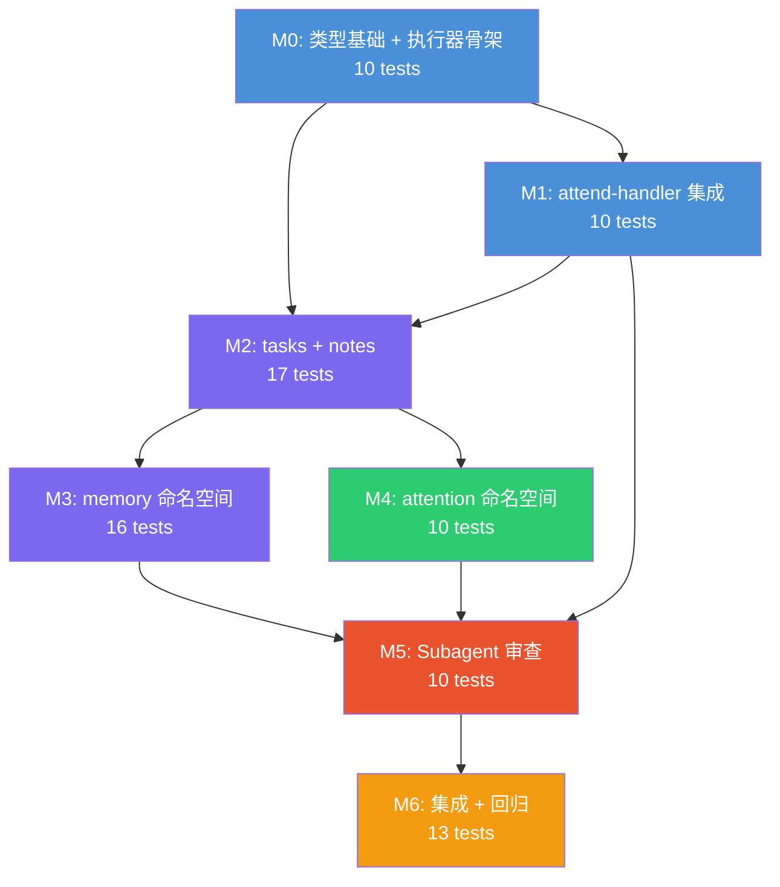

# MiniCodeAct — 详细实施子任务

> **关联设计文档**: `minicodeact.md` v1.4
> **关联代码**: `attend-handler.ts`, `dispatch-handler.ts`, `global-state.ts`, `types.ts`
> **创建时间**: 2026-04-04
> **状态**: ✅ 实施完成 (138/138 测试通过)

---

## 前置审计结论

### minicodeact.md 与现有代码的对齐分析

| 维度 | 现有代码状态 | minicodeact.md 设计 | Gap |
|------|-------------|---------------------|-----|
| **Decision 类型** | 无 `miniCodeActs` 字段 (`types.ts:304`) | Decision 含 `miniCodeActs?: MiniCodeActCall[]` | 需扩展类型定义 |
| **AttendResult 类型** | 无 `miniCodeActResults` 字段 (`types.ts:292`) | AttendResult 含 `miniCodeActResults?: MiniCodeActResult[]` | 需扩展类型定义 |
| **attend-handler JSON 解析** | 显式字段提取，丢弃未知字段 (`attend-handler.ts:332`) | 需提取 `miniCodeActs` 字段 | 需修改解析逻辑 |
| **对话历史追加顺序** | MiniCodeAct 不存在 | 严格 prompt→decision→report 时序 | 需要在 attend-handler 中正确排列 |
| **Prompt 模板** | 无 `MINI_CODE_ACT_REPORT` 类型 | 独立 harness 消息模板 | 需新增模板文件 + 注册 |
| **System Prompt** | 无 MiniCodeAct API 概览 (`mainagent-main-system.md`) | 始终完整暴露 API 签名 | 需修改 system prompt |
| **GlobalState** | 无 `notes` 存储 (`global-state.ts`) | 需要 `notes: AgentNote[]` | 需扩展 GlobalState |
| **ATTENTION prompt** | 无笔记区块 (`mainagent-attention.md`) | 需要 `{{#hasNotes}}` 工作台区块 | 需修改 attention 模板 |
| **MemoryV2** | 无按别名模糊搜索 | 需要 `searchByAlias()` 方法 | 需新增查询方法 |
| **SubagentCallback** | 无 `corrections` 字段 (`types.ts:136`) | Subagent 审查修正机制 | 需扩展类型 + Phase 1 处理 |
| **Subagent task prompt** | 无 MiniCodeAct Report 区块 | 需 `{{#hasMiniCodeActReport}}` 注入 | 需修改 task prompt |

### 可直接复用的现有 API

- `GlobalState.addTask()` / `updateTaskStatus()` / `addFollowup()` / `completeFollowup()` → tasks 命名空间
- `GlobalState.recordDecision()` → 审计追踪
- `MemoryStoreV2.upsertCoreFact()` → memory.writeCoreFact
- `MemoryStoreV2.upsertPersonIdentity()` → memory.updateIdentity
- `MemoryStoreV2.getProfilesForChat()` → memory.getProfile (需封装)
- `DynamicAttentionQueue.boost()` / `enqueueOrUpdate()` → attention.boost / scheduleRevisit
- `prompt-renderer.ts` Handlebars 风格模板渲染器 → 注册新模板类型

---

## M0: 类型基础 + 执行器骨架

### M0.1 — 类型定义扩展

**目标**: 为 MiniCodeAct 所需的所有类型提供基础定义。

#### [MODIFY] `src/subagent/types.ts`

在 `Decision` 接口中新增字段：
```typescript
interface Decision {
    // ... 现有字段 ...
    /** MiniCodeAct 即时操作列表（可选） */
    miniCodeActs?: MiniCodeActCall[];
}
```

在 `AttendResult` 接口中新增字段：
```typescript
interface AttendResult {
    // ... 现有字段 ...
    /** MiniCodeAct 执行结果（Phase 5.5 附加） */
    miniCodeActResults?: MiniCodeActResult[];
}
```

新增 MiniCodeAct 专用类型：
```typescript
/** MiniCodeAct 调用描述 */
interface MiniCodeActCall {
    /** 调用目标，格式 "namespace.method" */
    call: string;
    /** 调用参数 */
    args: Record<string, unknown>;
}

/** MiniCodeAct 执行结果 */
interface MiniCodeActResult {
    call: string;
    success: boolean;
    result?: unknown;
    error?: string;
    /** 人类可读的一句话结果 */
    summary: string;
}

/** Agent 工作笔记 */
interface AgentNote {
    id: string;
    content: string;
    tags: string[];
    relatedChatId?: string;
    expiresAt?: string;
    createdAt: string;
}
```

在 `SubagentCallback` 接口中新增字段：
```typescript
interface SubagentCallback {
    // ... 现有字段 ...
    /** MiniCodeAct 修正建议（Subagent 审查后返回） */
    corrections?: Array<{
        originalCall: string;
        issue: string;
        suggestedFix: MiniCodeActCall;
    }>;
}
```

确保所有新类型均 `export`。

### M0.2 — MiniCodeAct 执行器核心

**目标**: 创建中央执行器，路由 `namespace.method` 到具体处理函数。

#### [NEW] `src/main-agent/minicodeact-executor.ts`

```typescript
import type { MiniCodeActCall, MiniCodeActResult } from "../subagent/types.js";

/** 执行器依赖 */
export interface MiniCodeActDeps {
    globalState: GlobalState;
    memory: MemoryStoreV2;
    attentionQueue: DynamicAttentionQueue;
    subagentManager: SubagentManager;
}

/** 单个处理器签名 */
type MiniCodeActHandler = {
    (args: Record<string, unknown>, chatId: string, deps: MiniCodeActDeps): unknown;
    describe(args: Record<string, unknown>): string;
};

/** namespace.method → handler 映射表 */
const HANDLER_MAP: Record<string, Record<string, MiniCodeActHandler>> = {};

/** 注册处理器（每个 Sprint 中按命名空间添加） */
export function registerHandlers(
    namespace: string,
    handlers: Record<string, MiniCodeActHandler>,
): void { ... }

/** 
 * 执行 MiniCodeAct 调用列表。
 * 安全限制：每次 attend 最多 MAX_PER_ATTEND=8 条。
 * 所有操作 try-catch 隔离，失败不影响主流程。
 */
export function executeMiniCodeActs(
    calls: MiniCodeActCall[],
    chatId: string,
    deps: MiniCodeActDeps,
): MiniCodeActResult[] { ... }
```

**实现要点**：
1. `calls.slice(0, 8)` 限流
2. `call.call.split(".")` 解析 namespace 和 method
3. 查找 `HANDLER_MAP[namespace]?.[method]`，找不到返回 `success: false`
4. try-catch 包裹每个 handler 调用
5. 返回 `MiniCodeActResult[]`

### M0.3 — 结果格式化工具

#### [NEW] `src/main-agent/minicodeact-formatter.ts`

```typescript
/**
 * 将 MiniCodeActResult[] 格式化为人类可读的报告文本。
 * 用于注入到 MINI_CODE_ACT_REPORT prompt 模板的 {{results}} 变量。
 */
export function formatMiniCodeActReport(results: MiniCodeActResult[]): string { ... }
```

输出格式示例：
```
✅ memory.writeCoreFact → 已写入核心事实: user_456 "对花生严重过敏" [biographical]
❌ attention.boost → 失败: 目标群组不存在
```

### M0 测试计划

#### 单元测试 `tests/minicodeact/m0-types-executor.test.ts`

| # | 测试用例 | 验证点 |
|---|---------|--------|
| 1 | `MiniCodeActCall` 类型校验 | `{ call: "tasks.add", args: {...} }` 符合类型 |
| 2 | `executeMiniCodeActs()` 空调用列表 | 返回空数组 `[]` |
| 3 | `executeMiniCodeActs()` 未知 namespace | 返回 `{ success: false, error: "Unknown method..." }` |
| 4 | `executeMiniCodeActs()` 未知 method | 返回 `{ success: false, error: "Unknown method..." }` |
| 5 | `executeMiniCodeActs()` 限流 MAX=8 | 传入 10 条，只执行前 8 条 |
| 6 | `executeMiniCodeActs()` handler 抛异常 | 返回 `{ success: false, error: "..." }`，不中断后续 |
| 7 | `registerHandlers()` 注册后可调用 | 注册 mock handler → executeMiniCodeActs 调用成功 |
| 8 | `formatMiniCodeActReport()` 成功项 | 包含 `✅` 和 summary |
| 9 | `formatMiniCodeActReport()` 失败项 | 包含 `❌` 和 error |
| 10 | `formatMiniCodeActReport()` 空列表 | 返回 "(无操作)" 或空字符串 |

### M0 Milestone

| 验收标准 | 验证方式 |
|---------|--------|
| `types.ts` 中 Decision/AttendResult/SubagentCallback 扩展字段可编译 | `tsc --noEmit` 0 新增错误 |
| 执行器骨架可注册 handler 并路由调用 | 单元测试 #2-7 |
| 限流和异常隔离行为正确 | 单元测试 #5-6 |
| 格式化输出人类可读 | 单元测试 #8-10 |
| 全部 10 个测试通过 | `npm test -- --grep m0` |

---

## M1: attend-handler 集成 + Prompt 模板

### M1.1 — attend-handler 中 JSON 解析修改

**目标**: 在 LLM 决策 JSON 解析中提取 `miniCodeActs` 字段，不丢弃。

#### [MODIFY] `src/main-agent/attend-handler.ts`

找到 decision 解析的 `.map()` 逻辑（约 L332-341），在现有字段提取后新增：
```typescript
miniCodeActs: Array.isArray(d.miniCodeActs) ? d.miniCodeActs : undefined,
```

### M1.2 — Phase 5.5 执行分支

**目标**: 在 attend-handler 中 LLM 决策返回后、return 前，插入 MiniCodeAct 执行逻辑。

#### [MODIFY] `src/main-agent/attend-handler.ts`

在现有的对话历史追加逻辑（`appendToHistory`）之后、`return llmResult` 之前，插入：

```typescript
// ═══ Phase 5.5: MiniCodeAct 即时执行 ═══
const allMiniCodeActs: MiniCodeActCall[] = [];
for (const decision of llmResult.decisions) {
    if (decision.miniCodeActs?.length) {
        allMiniCodeActs.push(...decision.miniCodeActs);
    }
}

if (allMiniCodeActs.length > 0) {
    const results = executeMiniCodeActs(allMiniCodeActs, entry.chatId, {
        globalState, memory, attentionQueue: q3, subagentManager,
    });

    const reportPrompt = renderPrompt("MINI_CODE_ACT_REPORT", {
        chatId: entry.chatId,
        results: formatMiniCodeActReport(results),
        timestamp: new Date().toISOString(),
    });
    await mainLoop.appendToHistory({ role: "user", content: reportPrompt });

    for (const r of results) {
        globalState.recordDecision(entry.chatId,
            `MINI_ACT: ${r.call} → ${r.success ? "OK" : "FAIL"} ${r.summary}`);
    }

    llmResult.miniCodeActResults = results;
}
```

**关键**: 确保对话历史追加顺序为 ①prompt → ②decision → ③report。检查现有 `appendToHistory` 的位置，report 追加必须在 prompt/decision 之后。

### M1.3 — MINI_CODE_ACT_REPORT Prompt 模板

#### [NEW] `system-prompts/main-agent/mainagent-minicodeact-report.md`

```markdown
═══ [MiniCodeAct 执行报告] {{chatId}} ({{timestamp}}) ═══

{{results}}
```

#### [MODIFY] `src/main-agent/prompt-renderer.ts`

在 `PROMPT_FILE_MAP`（或等效的模板注册结构）中新增：
```typescript
MINI_CODE_ACT_REPORT: "main-agent/mainagent-minicodeact-report.md",
```

### M1.4 — System Prompt API 概览注入

#### [MODIFY] `system-prompts/main-agent/mainagent-main-system.md`

在文件末尾（`## 运行环境` 之后、`## 输出格式要求` 之前）新增 MiniCodeAct API 概览。内容见 `minicodeact.md` §9.1。

同时在输出格式的 JSON 示例中展示 `miniCodeActs` 字段：
```json
{
  "replyMode": "SINGLE",
  "decisions": [{
    "action": "REPLY",
    "miniCodeActs": [
      { "call": "namespace.method", "args": { } }
    ]
  }]
}
```

### M1 测试计划

#### 单元测试 `tests/minicodeact/m1-attend-integration.test.ts`

| # | 测试用例 | 验证点 |
|---|---------|--------|
| 1 | JSON 解析提取 miniCodeActs | LLM 返回含 miniCodeActs 的 JSON → Decision 对象含该字段 |
| 2 | JSON 解析无 miniCodeActs 时为 undefined | LLM 返回不含 miniCodeActs → 字段为 undefined |
| 3 | Phase 5.5 无 miniCodeActs 时跳过 | 决策中无 miniCodeActs → 不调用 executeMiniCodeActs |
| 4 | Phase 5.5 有 miniCodeActs 时执行 | mock executeMiniCodeActs → 验证被调用 |
| 5 | 对话历史追加顺序正确 | 检查 appendToHistory 调用顺序: user(prompt) → assistant(json) → user(report) |
| 6 | miniCodeActResults 附加到 AttendResult | dispatch-handler 可读取该字段 |
| 7 | MINI_CODE_ACT_REPORT 模板渲染 | renderPrompt 输出包含 chatId、timestamp、results |
| 8 | System Prompt 包含 MiniCodeAct API 概览 | 加载 mainagent-main-system.md 含 "即时操作" 段落 |

#### 集成测试（mock LLM）

| # | 测试用例 | 验证点 |
|---|---------|--------|
| 9 | 完整 attend 流程: LLM 输出含 miniCodeActs | attend → 解析 → Phase 5.5 执行 → report 写入 history → return |
| 10 | 完整 attend 流程: LLM 输出不含 miniCodeActs | attend → 解析 → 跳过 Phase 5.5 → return（行为与旧代码一致） |

### M1 Milestone

| 验收标准 | 验证方式 |
|---------|--------|
| attend-handler 正确解析 miniCodeActs 字段 | 单元测试 #1-2 |
| Phase 5.5 执行分支在有/无 miniCodeActs 时行为正确 | 单元测试 #3-4 |
| 对话历史追加顺序满足时序因果链 | 单元测试 #5 |
| MINI_CODE_ACT_REPORT 模板可渲染 | 单元测试 #7 |
| 不含 miniCodeActs 时行为与旧代码完全一致（无回归） | 集成测试 #10 |
| 全部 10 个测试通过 | `npm test -- --grep m1` |

---

## M2: tasks + notes 命名空间

### M2.1 — tasks 处理器

**目标**: 实现 `tasks.add`, `tasks.update`, `tasks.addFollowup`, `tasks.completeFollowup` 四个方法。

#### [NEW] `src/main-agent/minicodeact-handlers/tasks.ts`

```typescript
import { registerHandlers } from "../minicodeact-executor.js";

// tasks.add → GlobalState.addTask()
// tasks.update → GlobalState.updateTaskStatus()
// tasks.addFollowup → GlobalState.addFollowup()
// tasks.completeFollowup → GlobalState.completeFollowup()
```

**实现要点**：
- `tasks.add`: 从 args 提取 `description (required)`, `chatId (optional)`, `priority (optional, default "MEDIUM")`。调用 `deps.globalState.addTask()`。summary 返回 `已创建任务: "${description}" (${priority}) [taskId: ${task.id}]`。
- `tasks.update`: 从 args 提取 `taskId (required)`, `status (required)`。调用 `deps.globalState.updateTaskStatus()`。返回成功/失败。
- `tasks.addFollowup`: 从 args 提取 `sourceChatId`, `targetChatId`, `description`。调用 `deps.globalState.addFollowup()`。
- `tasks.completeFollowup`: 从 args 提取 `followupId`。调用 `deps.globalState.completeFollowup()`。

### M2.2 — notes 处理器 + GlobalState 扩展

**目标**: 实现 `notes.add`, `notes.remove`，并在 GlobalState 中新增 notes 存储。

#### [MODIFY] `src/main-agent/global-state.ts`

在 `MainAgentGlobalState` 接口（通过 `types.ts`）和 `defaultState()` 中新增：
```typescript
notes: AgentNote[];
```

新增方法：
```typescript
addNote(content: string, tags?: string[], relatedChatId?: string, expiresAt?: string): AgentNote
removeNote(noteId: string): boolean
getNotes(chatId?: string): AgentNote[]
cleanExpiredNotes(): number
```

#### [NEW] `src/main-agent/minicodeact-handlers/notes.ts`

```typescript
// notes.add → GlobalState.addNote()
// notes.remove → GlobalState.removeNote()
```

### M2.3 — ATTENTION Prompt 笔记注入

**目标**: 在 ATTENTION prompt 中新增笔记工作台区块。

#### [MODIFY] `system-prompts/main-agent/mainagent-attention.md`

在 `{{#activePersons}}` 区块之后新增：
```markdown
{{#hasNotes}}
## 工作笔记
{{notes}}
{{/hasNotes}}
```

#### [MODIFY] `src/main-agent/attend-handler.ts`

在构建 attention prompt 变量时，从 GlobalState 读取 notes 并注入：
```typescript
const notes = globalState.getNotes(entry.chatId);
// 先清理过期笔记
globalState.cleanExpiredNotes();
variables.hasNotes = notes.length > 0;
variables.notes = notes.map(n => `- [${n.id}] ${n.content} (${n.tags.join(", ")})`).join("\n");
```

### M2 测试计划

#### 单元测试 `tests/minicodeact/m2-tasks-notes.test.ts`

| # | 测试用例 | 验证点 |
|---|---------|--------|
| 1 | `tasks.add` 正常调用 | GlobalState.taskList 长度 +1, 返回 taskId |
| 2 | `tasks.add` 缺少 description | 返回 `{ success: false }` |
| 3 | `tasks.add` 自定义 priority | priority="HIGH" 被正确设置 |
| 4 | `tasks.update` 正常调用 | 任务状态更新为指定值 |
| 5 | `tasks.update` 无效 taskId | 返回 `{ success: false }` |
| 6 | `tasks.addFollowup` 正常调用 | pendingFollowups 长度 +1 |
| 7 | `tasks.completeFollowup` 正常调用 | followup 状态变为 DONE |
| 8 | `notes.add` 正常调用 | GlobalState.notes 长度 +1 |
| 9 | `notes.add` 含 tags 和 expiresAt | 返回的 note 含正确 tags 和 expiresAt |
| 10 | `notes.remove` 正常调用 | notes 长度 -1 |
| 11 | `notes.remove` 无效 noteId | 返回 `{ success: false }` |
| 12 | `cleanExpiredNotes()` 清理过期笔记 | 过期笔记被删除, 未过期保留 |
| 13 | `getNotes(chatId)` 按 chatId 过滤 | 只返回关联指定 chatId 的笔记 |
| 14 | GlobalState save/load 包含 notes | JSON round-trip 后 notes 数据还在 |
| 15 | ATTENTION prompt 含工作笔记区块 | 有 notes 时模板渲染包含 "工作笔记" 标题 |

#### 端到端测试

| # | 测试用例 | 验证点 |
|---|---------|--------|
| 16 | LLM 输出 `tasks.add` miniCodeAct → Phase 5.5 执行 → GlobalState 含新任务 | 完整链路 |
| 17 | LLM 输出 `notes.add` → 下次 attend 时 ATTENTION prompt 含该笔记 | 持续性反馈 |

### M2 Milestone

| 验收标准 | 验证方式 |
|---------|--------|
| tasks 4 个方法均可通过 executeMiniCodeActs 正确调用 | 单元测试 #1-7 |
| notes 2 个方法 + GlobalState 扩展正确 | 单元测试 #8-14 |
| notes 过期清理和 chatId 过滤生效 | 单元测试 #12-13 |
| ATTENTION prompt 中笔记区块正确渲染 | 单元测试 #15 |
| 端到端链路验证通过 | 测试 #16-17 |
| 全部 17 个测试通过 | `npm test -- --grep m2` |

---

## M3: memory 命名空间

### M3.1 — memory.writeCoreFact 处理器

#### [NEW] `src/main-agent/minicodeact-handlers/memory.ts`

```typescript
// memory.writeCoreFact:
//   args: { subject, content, category, confidence? }
//   → deps.memory.upsertCoreFact({ subject, content, category, confidence, source: "minicodeact" })
//   → summary: 已写入核心事实: ${subject} "${content}" [${category}]
```

**实现要点**：
- `source: "minicodeact"` 区分来源（vs `source: "reflection"` 或 `source: "pipeline"`）
- 需检查 `MemoryStoreV2.upsertCoreFact()` 是否接受 source 参数。如果当前不接受，需在 M3.2 中扩展。

### M3.2 — MemoryStoreV2 source 字段扩展

#### [MODIFY] `src/memory-v2/index.ts`

如果 `upsertCoreFact()` 不支持 `source` 参数，新增之：
```typescript
upsertCoreFact(params: {
    subject: string;
    content: string;
    category: string;
    confidence?: number;
    source?: string;  // NEW: "minicodeact" | "reflection" | "pipeline"
}): void
```

在 `core_facts` 表中，检查是否有 `source` 列。如果没有，执行 migration：
```sql
ALTER TABLE core_facts ADD COLUMN source TEXT DEFAULT 'pipeline';
```

### M3.3 — memory.updateIdentity 处理器

```typescript
// memory.updateIdentity:
//   args: { userId, displayName?, addAlias?, removeAlias? }
//   → 通过 deps.memory.getPersonIdentity(userId) 获取当前身份
//   → 修改 displayName / 增删 alias
//   → deps.memory.upsertPersonIdentity(updated)
```

### M3.4 — memory.searchIdentity 处理器 + MemoryV2 扩展

**目标**: 实现按别名/昵称模糊搜索用户，返回含消歧信息的结果。

#### [MODIFY] `src/memory-v2/index.ts`

新增方法：
```typescript
/**
 * 按别名或显示名模糊搜索用户身份。
 * 对 display_name 和 aliases JSON 数组做 LIKE 匹配。
 */
searchByAlias(query: string, limit?: number): PersonIdentity[]
```

SQL 实现：
```sql
SELECT * FROM person_identity
WHERE display_name LIKE '%' || ? || '%'
   OR aliases LIKE '%' || ? || '%'
LIMIT ?
```

#### 执行器增强

searchIdentity 处理器需要结合当前 chatId 的上下文补充消歧字段：

```typescript
// memory.searchIdentity:
//   args: { query }
//   1. candidates = deps.memory.searchByAlias(query)
//   2. 对每个候选, 检查是否在当前 chatId 的 activePersons 中
//   3. 如果在, 加载 recentMessageCount 和 dunbarTier
//   4. 返回 { results: [{ userId, displayName, aliases, inCurrentChat, ... }] }
```

### M3.5 — memory.getProfile 处理器

```typescript
// memory.getProfile:
//   args: { userId, chatId }
//   → deps.memory.getProfilesForChat(chatId) → 过滤指定 userId
//   → 返回 { traits, interests, communicationStyle, dunbarTier }
```

### M3.6 — memory.updateProfile 处理器

```typescript
// memory.updateProfile:
//   args: { userId, chatId, addTraits?, removeTraits?, ... }
//   → deps.memory.getPersonGroupProfile(userId, chatId)
//   → 修改 traits/interests
//   → deps.memory.upsertPersonGroupProfile(updated)
```

### M3 测试计划

#### 单元测试 `tests/minicodeact/m3-memory.test.ts`

需要 SQLite in-memory 数据库（参考现有 memory-v2 测试的 bootstrap 方法）。

| # | 测试用例 | 验证点 |
|---|---------|--------|
| 1 | `memory.writeCoreFact` 正常写入 | DB 中新增 core_fact, source="minicodeact" |
| 2 | `memory.writeCoreFact` 缺少 subject | 返回 `{ success: false }` |
| 3 | `memory.writeCoreFact` 默认 confidence | 未指定 confidence 时使用 1.0 |
| 4 | `memory.updateIdentity` 修改 displayName | DB 中 display_name 更新 |
| 5 | `memory.updateIdentity` 添加 alias | aliases 数组新增元素 |
| 6 | `memory.updateIdentity` 删除 alias | aliases 数组移除元素 |
| 7 | `memory.updateIdentity` 无效 userId | 自动创建新 PersonIdentity |
| 8 | `searchByAlias()` 按 displayName 匹配 | 查询 "张" → 返回含 "张三" 的用户 |
| 9 | `searchByAlias()` 按 alias 匹配 | "老王" 在 aliases 中 → 返回该用户 |
| 10 | `searchByAlias()` 无匹配 | 返回空数组 |
| 11 | `memory.searchIdentity` 补充 inCurrentChat | 当前群内用户标记 true, 其他 false |
| 12 | `memory.searchIdentity` 跨群重名消歧 | 两个 "老王" 返回不同 userId |
| 13 | `memory.getProfile` 正常查询 | 返回 traits, dunbarTier 等字段 |
| 14 | `memory.getProfile` 用户不存在 | 返回空或 null |
| 15 | `memory.updateProfile` 添加 traits | traits 数组新增元素 |
| 16 | source 字段区分 | writeCoreFact source="minicodeact" vs 现有 source="pipeline" |

### M3 Milestone

| 验收标准 | 验证方式 |
|---------|--------|
| writeCoreFact 正确写入 SQLite 并标注 source | 单元测试 #1-3, #16 |
| updateIdentity 修改 displayName/aliases 正确 | 单元测试 #4-7 |
| searchByAlias 模糊查询 + 消歧信息返回正确 | 单元测试 #8-12 |
| getProfile / updateProfile 读写正确 | 单元测试 #13-15 |
| 全部 16 个测试通过 | `npm test -- --grep m3` |

---

## M4: attention 命名空间

### M4.1 — attention.boost 处理器

#### [NEW] `src/main-agent/minicodeact-handlers/attention.ts`

```typescript
// attention.boost:
//   args: { chatId, amount, reason }
//   → 参数校验: amount 限制 1-50
//   → deps.attentionQueue.boost(chatId, amount)
//   → summary: 已提升 ${chatId} 优先级 +${amount}
```

### M4.2 — attention.scheduleRevisit 处理器

```typescript
// attention.scheduleRevisit:
//   args: { chatId, delayMinutes, reason }
//   → setTimeout 或定时器: delayMinutes 分钟后执行 q3.enqueueOrUpdate()
//   → 需要一个 pending revisit 列表（内存中即可，重启丢失可接受）
```

#### [MODIFY] `src/subagent/attention-queue.ts`

如果 `DynamicAttentionQueue` 没有 `boost()` 方法，需要新增：
```typescript
boost(chatId: string, amount: number): boolean {
    const entry = this.entries.get(chatId);
    if (!entry) return false;
    entry.priority += amount;
    entry.basePriority += amount;
    return true;
}
```

### M4.3 — attention.revokeFastPath 处理器

```typescript
// attention.revokeFastPath:
//   args: { chatId, reason }
//   → deps.subagentManager.get(chatId)?.fastPathHandler?.revoke()
//   → summary: 已撤销 ${chatId} 的 FastPath 授权
```

### M4.4 — attention.adjustStickiness 处理器

```typescript
// attention.adjustStickiness:
//   args: { chatId, targetLevel: "CORE"|"FAMILIAR"|"ACQUAINTANCE"|"STRANGER", reason }
//   → 只允许相邻等级变更
//   → deps.attentionQueue.get(chatId) → 修改 stickinessLevel
//   → deps.subagentManager.get(chatId)?.stickiness.level → 持久化
//   → summary: 已将 ${chatId} 亲密度调整为 ${targetLevel}
```

### M4 测试计划

#### 单元测试 `tests/minicodeact/m4-attention.test.ts`

| # | 测试用例 | 验证点 |
|---|---------|--------|
| 1 | `attention.boost` 正常提升 | Q3 中条目 priority 增加 |
| 2 | `attention.boost` amount 超限 | amount=100 → 被裁剪到 50 |
| 3 | `attention.boost` 目标不存在 → 自动入队 | 调用 enqueueOrUpdate + success=true + autoEnqueued=true |
| 4 | `attention.scheduleRevisit` 定时入队 | delayMinutes=1 → 60 秒后 Q3 出现条目 |
| 5 | `attention.revokeFastPath` 正常撤销 | FastPathHandler.enabled=false |
| 6 | `attention.revokeFastPath` 无 FastPath | 返回 `{ success: false }` |
| 7 | `attention.adjustStickiness` 向上调整 | ACQUAINTANCE → FAMILIAR |
| 8 | `attention.adjustStickiness` 向下调整 | FAMILIAR → ACQUAINTANCE |
| 9 | `attention.adjustStickiness` 边界不越级 | CORE + UP → 仍是 CORE |
| 10 | `attention.adjustStickiness` 目标不存在 | 返回 `{ success: false }` |

### M4 Milestone

| 验收标准 | 验证方式 |
|---------|--------|
| boost 限流和 Q3 优先级修改正确 | 单元测试 #1-3 |
| scheduleRevisit 定时入队机制生效 | 单元测试 #4 |
| revokeFastPath 正确撤销授权 | 单元测试 #5-6 |
| adjustStickiness 相邻等级约束正确 | 单元测试 #7-10 |
| 全部 10 个测试通过 | `npm test -- --grep m4` |

---

## M5: Subagent 审查 + corrections 机制

### M5.1 — Subagent task prompt 注入 MiniCodeAct Report

**目标**: 让 Subagent 在 task prompt 中看到 MiniCodeAct 的执行结果以便审查。

#### [MODIFY] `system-prompts/executor/subagent-execution-task.md`

在 `## 本次任务执行方案` 和 `## 话题摘要` 之间新增：
```markdown
{{#hasMiniCodeActReport}}
## ⚡ 预执行操作结果
以下操作已在任务分派前由主 Agent 即时执行。请审查结果是否准确，
如发现偏差请在最终总结中指出。
{{miniCodeActReport}}
{{/hasMiniCodeActReport}}
```

#### [MODIFY] `src/main-agent/dispatch-handler.ts`

在构建 `CodeActReplyTask` 的 `contextSnapshot` 时，注入 miniCodeActResults：
```typescript
if (result.miniCodeActResults?.length) {
    contextSnapshot.miniCodeActReport = formatMiniCodeActReport(result.miniCodeActResults);
    contextSnapshot.hasMiniCodeActReport = true;
}
```

### M5.2 — Phase 1 corrections 处理

**目标**: 在 MainAgentLoop Phase 1 drain callbacks 时，解析 corrections 字段并执行纠正。

#### [MODIFY] `src/main-agent/main-agent-loop.ts`

在 Phase 1 的 callback 处理循环中，新增 corrections 解析：
```typescript
for (const cb of callbacks) {
    // ... 现有逻辑 ...

    // 处理 corrections
    if (cb.corrections?.length) {
        for (const correction of cb.corrections) {
            log.info("correction from subagent", {
                chatId: cb.chatId,
                originalCall: correction.originalCall,
                issue: correction.issue,
            });
            const fixResults = executeMiniCodeActs(
                [correction.suggestedFix],
                cb.chatId,
                { globalState, memory, attentionQueue, subagentManager },
            );
            // 纠正结果写入决策日志
            for (const r of fixResults) {
                globalState.recordDecision(cb.chatId,
                    `CORRECTION: ${r.call} → ${r.success ? "OK" : "FAIL"} (${correction.issue})`);
            }
        }
    }
}
```

### M5.3 — Callback 消息中展示 corrections

#### [MODIFY] `src/main-agent/main-agent-loop.ts`

在 `formatCallbackMessage()` 或其调用处，当 `cb.corrections` 存在时追加信息：
```
[Callback] COMPLETED ...
⚠️ Subagent 修正建议: 
  - memory.writeCoreFact: 用户不是不吃辣，只是这次点了不辣的 → 已执行纠正
```

### M5 测试计划

#### 单元测试 `tests/minicodeact/m5-guardrail.test.ts`

| # | 测试用例 | 验证点 |
|---|---------|--------|
| 1 | task prompt 含 MiniCodeAct Report | `hasMiniCodeActReport=true` 时模板输出含 "预执行操作结果" |
| 2 | task prompt 无 MiniCodeAct Report | `hasMiniCodeActReport=false` 时不含该区块 |
| 3 | dispatch-handler 注入 miniCodeActReport | contextSnapshot 含 report 字符串 |
| 4 | Phase 1 处理无 corrections 的 callback | 正常流程不受影响 |
| 5 | Phase 1 处理含 corrections 的 callback | executeMiniCodeActs 被调用 |
| 6 | corrections 中 suggestedFix 执行成功 | recordDecision 含 "CORRECTION: OK" |
| 7 | corrections 中 suggestedFix 执行失败 | recordDecision 含 "CORRECTION: FAIL" |
| 8 | 多个 corrections 依次执行 | 2 个 corrections → 2 个 fixResults |

#### 端到端测试

| # | 测试用例 | 验证点 |
|---|---------|--------|
| 9 | 完整流程: miniCodeAct writeCoreFact → Subagent corrections → Phase 1 纠正 | 最终 DB 中 core_fact 被覆盖为纠正后的值 |
| 10 | 完整流程: miniCodeAct tasks.add → Subagent corrections cancel → task 状态变 CANCELLED | 纠正链路端到端 |

### M5 Milestone

| 验收标准 | 验证方式 |
|---------|--------|
| Subagent task prompt 正确注入 MiniCodeAct Report | 单元测试 #1-3 |
| Phase 1 corrections 处理路径完整 | 单元测试 #4-8 |
| 端到端纠正链路验证通过 | 测试 #9-10 |
| 全部 10 个测试通过 | `npm test -- --grep m5` |

---

## M6: 集成测试 + 安全回归

### M6.1 — 端到端场景测试

以 `minicodeact.md` §12 附录中的 4 个范例为蓝本，使用 mock LLM：

| # | 场景 | 验证点 |
|---|------|--------|
| 1 | 范例 1: 跨群待办 | miniCodeAct addFollowup → Q3 受 boost → 下一 tick attend → ATTENTION prompt 含待办 → REPLY dispatch → completeFollowup |
| 2 | 范例 2: 长期记忆写入 | writeCoreFact → DB 持久化 → 后续 attend 时 Phase 4 注入 user context |
| 3 | 范例 3: 定时提醒 (scheduler mock) | setReminder(如果实现) 或直接验证 task → 定时 boost → attend |
| 4 | 范例 4: 身份查验 | searchIdentity → 结果写入 history → 下一 tick LLM 可见 |

### M6.2 — 安全约束验证

| # | 测试用例 | 验证点 |
|---|---------|--------|
| 5 | 每次 attend 最多 8 条 miniCodeAct | 传入 12 条 → 只执行 8 条 |
| 6 | boost amount 限制 1-50 | amount=100 → 裁剪到 50 |
| 7 | adjustStickiness 只允许相邻等级 | STRANGER → CORE 直接跳级 → 失败 |
| 8 | 未知 namespace.method 静默失败 | 不 crash、不影响 REPLY 分派 |
| 9 | handler 异常不影响主流程 | handler throw → 其余 miniCodeActs 继续执行 |

### M6.3 — 回归测试

| # | 测试用例 | 验证点 |
|---|---------|--------|
| 10 | 不含 miniCodeActs 的 attend 行为不变 | 对比旧代码: 相同输入 → 相同 AttendResult |
| 11 | dispatch-handler 对 REPLY/IGNORE/DEFER 行为不变 | 现有分派逻辑无回归 |
| 12 | GlobalState save/load 向后兼容 | 旧版 global-state.json (无 notes 字段) → load 不 crash |
| 13 | tsc 编译通过 | `tsc --noEmit` 0 新增类型错误 |

### M6 Milestone

| 验收标准 | 验证方式 |
|---------|--------|
| 4 个端到端场景全部通过 | 测试 #1-4 |
| 安全约束全部生效 | 测试 #5-9 |
| 无回归 | 测试 #10-13 |
| 全部 13 个测试通过 | `npm test -- --grep m6` |

---

## 实施顺序、依赖与 Milestone 路线图



## Milestone 路线图

| Milestone | 阶段 | 累计天数 | 测试数 | 关键交付物 | Gate 条件 |
|-----------|------|---------|--------|-----------|----------|
| **M0** | 类型 + 执行器 | Day 1 | 10 | types.ts 扩展, minicodeact-executor.ts, formatter | 10/10 pass, tsc 0 error |
| **M1** | attend 集成 | Day 3 | 20 | attend-handler Phase 5.5, prompt 模板, system prompt | 10/10 新 pass, 无回归 |
| **M2** | tasks + notes | Day 5 | 37 | tasks 4 方法, notes 2 方法, GlobalState 扩展, ATTENTION 工作台 | 17/17 新 pass |
| **M3** | memory | Day 8 | 53 | memory 6 方法, searchByAlias 新查询, source 字段 | 16/16 新 pass |
| **M4** | attention | Day 10 | 63 | attention 4 方法, Q3 boost, stickiness 调整 | 10/10 新 pass |
| **M5** | guardrail | Day 12 | 73 | task prompt 注入, corrections 处理, 端到端纠正流程 | 10/10 新 pass |
| **M6** | 集成 + 回归 | Day 14 | 86 | 4 场景 E2E, 安全验证, 回归测试 | **全部 86 tests pass**, tsc clean |
| **M7** | Edge Cases | Day 15 | 112 | 边界情况 + Bug 验证 | 26 额外覆盖 |
| **M8** | scheduler | Day 16 | 138 | scheduler 4 方法 + GlobalState + 持久化 | **全部 138 tests pass** |

## 估时汇总

| 阶段 | 新文件 | 修改文件 | 测试文件 | 测试用例 | 估时 |
|------|-------|---------|---------|---------|------|
| M0 | 2 | 1 (types.ts) | 1 | 10 | 1 天 |
| M1 | 1 (prompt template) | 3 (attend-handler, prompt-renderer, system prompt) | 1 | 10 | 2 天 |
| M2 | 2 (handlers) | 3 (global-state, attention prompt, attend-handler) | 1 | 17 | 2 天 |
| M3 | 1 (handler) | 1 (memory-v2) | 1 | 16 | 3 天 |
| M4 | 1 (handler) | 1 (attention-queue) | 1 | 10 | 2 天 |
| M5 | 0 | 3 (task prompt, dispatch-handler, main-agent-loop) | 1 | 10 | 2 天 |
| M6 | 0 | 0 | 1 | 13 | 2 天 |
| **合计** | **7** | **12** | **7** | **86** | **~14 天** |

---

## 文件变更清单

### 新增文件

| 文件路径 | Sprint | 说明 |
|:---------|:-------|:-----|
| `src/main-agent/minicodeact-executor.ts` | M0 | 中央执行器：路由 + 限流 + 异常隔离 |
| `src/main-agent/minicodeact-formatter.ts` | M0 | 结果格式化工具 |
| `system-prompts/main-agent/mainagent-minicodeact-report.md` | M1 | MINI_CODE_ACT_REPORT prompt 模板 |
| `src/main-agent/minicodeact-handlers/tasks.ts` | M2 | tasks 命名空间 4 个方法 |
| `src/main-agent/minicodeact-handlers/notes.ts` | M2 | notes 命名空间 2 个方法 |
| `src/main-agent/minicodeact-handlers/memory.ts` | M3 | memory 命名空间 6 个方法 |
| `src/main-agent/minicodeact-handlers/attention.ts` | M4 | attention 命名空间 4 个方法 |

### 修改文件

| 文件路径 | Sprint | 修改范围 |
|:---------|:-------|:---------|
| `src/subagent/types.ts` | M0 | Decision + AttendResult + SubagentCallback 类型扩展 |
| `src/main-agent/attend-handler.ts` | M1, M2 | JSON 解析 + Phase 5.5 分支 + notes 注入 |
| `src/main-agent/prompt-renderer.ts` | M1 | 注册 MINI_CODE_ACT_REPORT 模板 |
| `system-prompts/main-agent/mainagent-main-system.md` | M1 | 新增 MiniCodeAct API 概览段落 |
| `src/main-agent/global-state.ts` | M2 | notes 存储 + CRUD 方法 |
| `system-prompts/main-agent/mainagent-attention.md` | M2 | 新增工作笔记区块 |
| `src/memory-v2/index.ts` | M3 | searchByAlias() 新查询 + source 字段 |
| `src/subagent/attention-queue.ts` | M4 | boost() 方法 (如不存在) |
| `system-prompts/executor/subagent-execution-task.md` | M5 | 新增 MiniCodeAct Report 注入区块 |
| `src/main-agent/dispatch-handler.ts` | M5 | contextSnapshot 注入 miniCodeActReport |
| `src/main-agent/main-agent-loop.ts` | M5 | Phase 1 corrections 处理 |

### 测试文件

| 文件路径 | Sprint | 用例数 |
|:---------|:-------|:-------|
| `tests/minicodeact/m0-types-executor.test.ts` | M0 | 10 |
| `tests/minicodeact/m1-attend-integration.test.ts` | M1 | 10 |
| `tests/minicodeact/m2-tasks-notes.test.ts` | M2 | 17 |
| `tests/minicodeact/m3-memory.test.ts` | M3 | 16 |
| `tests/minicodeact/m4-attention.test.ts` | M4 | 10 |
| `tests/minicodeact/m5-guardrail.test.ts` | M5 | 10 |
| `tests/minicodeact/m6-integration.test.ts` | M6 | 13 |
| `tests/minicodeact/m7-edge-cases.test.ts` | M7 | 26 |
| `tests/minicodeact/m8-scheduler.test.ts` | M8 | 25 |

### 新增文件 (仅记录在实施中新增但未在原计划中的文件)

| 文件路径 | Sprint | 说明 |
|:---------|:-------|:-----|
| `src/main-agent/minicodeact-handlers/scheduler.ts` | M8 | scheduler 命名空间 4 个方法 |
