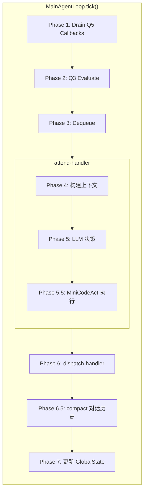
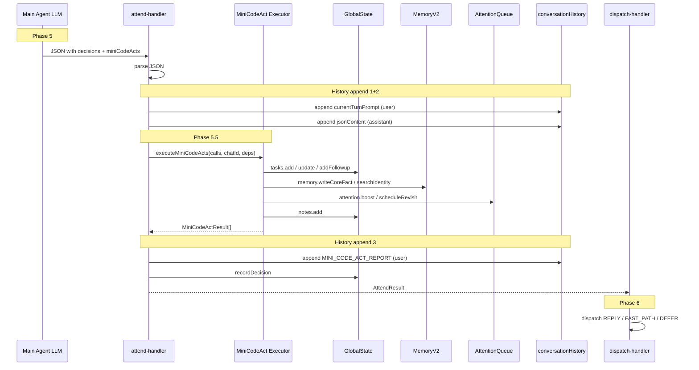
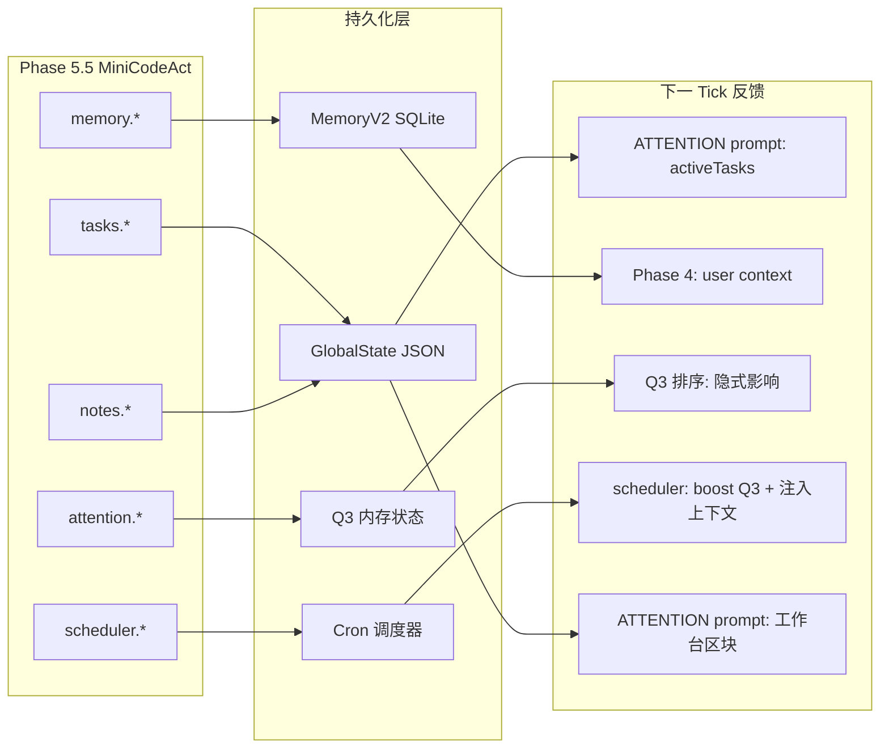
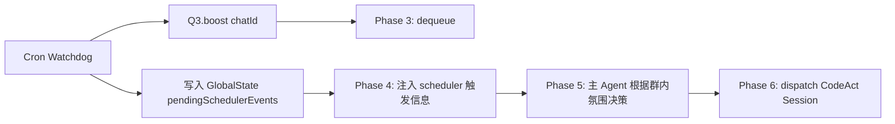
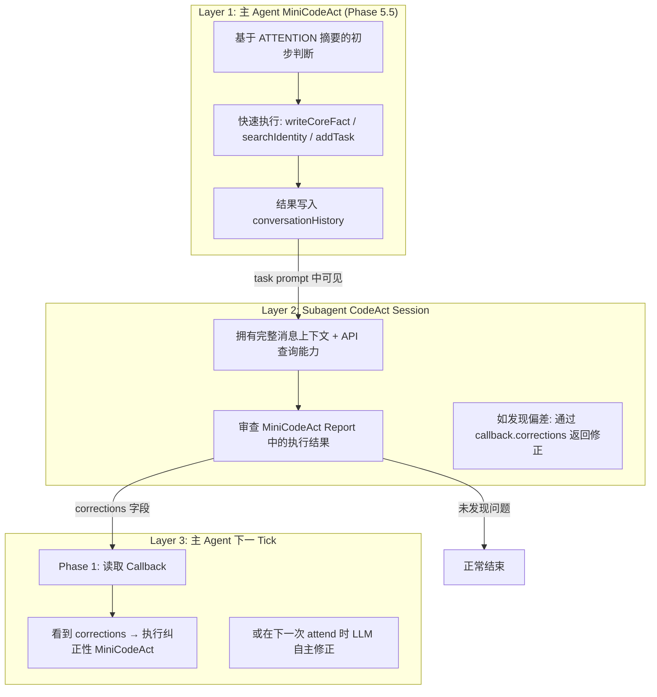
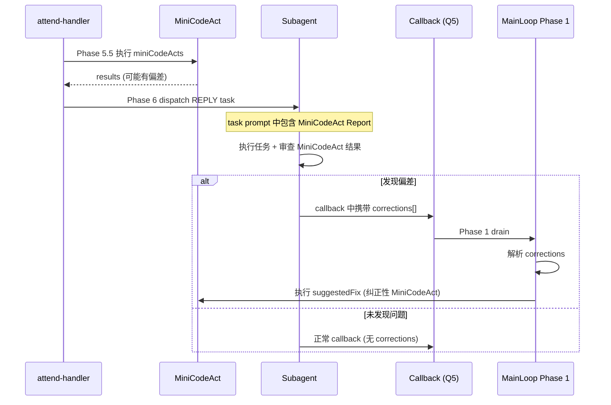

# MiniCodeAct：主 Agent 轻量代码行为层

> **版本号**: 1.4
> **文档状态**: 实施完成，138 测试全部通过
> **最后修改日期**: 2026-04-04
> **创建日期**: 2026-03-25
> **前置依赖**: roast.md, subagent.md, architecture_v2.md

## 1. 问题陈述

### 1.1 当前架构的「行为真空」

目前的主 Agent（Main Agent）是一个**纯 JSON 决策器**——它只输出结构化决策（REPLY / IGNORE / DEFER / FAST_PATH_AUTH / OBSERVE）和自然语言的 `contentDirection`，然后完全依赖 SubAgent（CodeActExecutor）去执行所有代码行为和消息发送。

```
Main Agent 决策 → dispatch-handler → CodeActExecutor → Sandbox → 发消息
      ↑                                                         ↓
      └──── callback (Q5) ← ─ ─ ─ ─ ─ ─ ─ ─ ─ ─ ─ ─ ─ ─ ─ ─ ┘
```

这意味着**任何**需要代码执行的行为，无论多轻量，都必须走完整的 CodeAct 流程：
1. Main Agent LLM 调用 → JSON 决策
2. dispatch-handler 构建 CodeActReplyTask
3. CodeActExecutor 入队 Q4
4. SandboxPool.acquire() 获取/启动 Sandbox Worker
5. LLM 多轮 CodeAct Session
6. Callback → Q5 → 下一 tick Phase 1 处理

**最短路径都是 2 次 LLM 调用 + 1 次 Sandbox 启动**。

### 1.2 哪些场景被「过度服务」了？

有一类操作具备以下特征：
- **结果确定性高**：不需要 LLM 去"想"怎么做，只需要机械执行
- **输入信息充足**：主 Agent 在决策时已经持有完成操作所需的全部信息
- **不涉及消息发送**：操作目标是修改系统内部状态，而非对外通信
- **延迟敏感**：用户期望即时生效，不应等待 CodeAct 全流程

这类操作目前被迫绕道 Subagent 执行，造成：
- **不必要的延迟**：5-30 秒的 Sandbox + LLM 开销用于一个 0.1 秒能完成的操作
- **Token 浪费**：为一个 `GlobalState.addTask()` 调用启动一个完整的 CodeAct Session
- **认知割裂**：主 Agent 决定要做什么，但自己无法直接做到，必须通过"传话"让别人执行

---

## 2. MiniCodeAct 的定义与定位

### 2.1 什么是 MiniCodeAct

MiniCodeAct 是一组在 **主 Agent 决策阶段（attend-handler, Phase 5）直接执行的轻量级副作用操作**。

它不是一个新的执行环境或沙盒——它是在 attend-handler 中，LLM 决策返回后 **立即在宿主进程同步执行**的结构化 API 调用。执行结果被追加到主 Agent 对话历史，供后续 tick 的 LLM 感知。

```
Phase 5: LLM 决策 → 解析 JSON
       ↓
Phase 5.5: ✨ MiniCodeAct 执行 → 结果写入对话历史
       ↓
Phase 6: dispatch-handler 分派 REPLY / FAST_PATH / DEFER
```

### 2.2 核心原则

1. **不暴露通用代码执行**：主 Agent 不会获得 `eval()` 或沙盒访问权。MiniCodeAct 是**预定义的 API 签名集合**，LLM 只能调用已声明的方法。
2. **不阻塞注意力循环**：所有操作必须是同步或极快的异步（< 100ms）。任何需要网络请求或 LLM 调用的操作不在此范围。
3. **与现有决策兼容**：MiniCodeAct 是决策的附加字段，可以与 REPLY/IGNORE/DEFER 等 action 共存。一个决策可以同时说"回复这个话题"并"把这件事加到 TODO"。
4. **只触及 host 进程内已有的 API**：不引入新的底层能力，只让主 Agent 能直接调用 `GlobalState`、`Memory`、`AttentionQueue` 等已有组件。
5. **遵循 CodeAct 设计哲学**：使用完整的 `.d.ts` 类型签名暴露能力，主 Agent 通过阅读签名理解可用操作，与 Sandbox 中的 CodeAct 模块保持一致的认知模型。

### 2.3 与三速架构的关系（参考 roast.md）

roast.md 提出了三速认知架构（反射 / 思考 / 调研）。MiniCodeAct 属于**思考层的能力补全**：

```
反射 (ms)  ─── FastPath                   消息发送
思考 (秒)  ─── Main Agent + MiniCodeAct    内部状态写入 ← NEW
执行 (秒-分)── CodeActExecutor             复杂任务 + 消息发送
调研 (分-时)── Background Agent            深度调查 + 系统操作
```

MiniCodeAct 填补了"思考层能做决策但不能执行简单动作"的空白，让主 Agent 不必为每个微小的状态变更都启动一个完整的 CodeAct Session。

---

## 3. 关键设计决策（已确认）

### 3.1 执行时机：attend-handler (Phase 5 后)

MiniCodeAct 在 attend-handler 中执行，**介于 LLM 决策返回和 dispatch 之间**。

**理由**：
- CodeActExecutor 可以感知 MiniCodeAct 的副作用（如新写入的 core_fact、刚添加的 TODO）
- 主 Agent 的对话历史中能看到执行结果，后续 tick 的 LLM 可以据此调整行为
- MiniCodeAct 的成败不应影响 REPLY 等主要决策的分派

### 3.2 结果反馈：独立 Prompt 模板 + 正确的时序追加

MiniCodeAct 的执行结果 **必须正确反馈给系统**。反馈通过三个通道实现：

1. **独立 Prompt 模板**：新增 `MINI_CODE_ACT_REPORT` prompt 类型（位于 `system-prompts/main-agent/mainagent-minicodeact-report.md`），作为专用的 harness 消息模板渲染执行报告，独立于 ATTENTION prompt 和 CALLBACK prompt。
2. **审计追踪**：同时记录到 `GlobalState.recentDecisions`，在下一次 ATTENTION prompt 中可见。
3. **CodeAct 可见**：因为 MiniCodeAct 在 attend-handler 中先于 dispatch 执行，CodeActExecutor 构建 task prompt 时可以读取到已变更的状态。

**对话历史追加顺序（时序因果链）**：

```typescript
// attend-handler.ts Phase 5 -> 5.5 -> return 的正确顺序

// 1. 先追加本轮 attention 上下文（LLM 看到的输入）
await mainLoop.appendToHistory({ role: "user", content: currentTurnPrompt });
// 2. 再追加 LLM 的决策输出
await mainLoop.appendToHistory({ role: "assistant", content: jsonContent });

// 3. 最后追加 MiniCodeAct 执行报告（作为决策的后果，role: user）
if (miniResults.length > 0) {
    const reportPrompt = renderPrompt("MINI_CODE_ACT_REPORT", {
        chatId: entry.chatId,
        results: formatMiniCodeActResults(miniResults),
    });
    await mainLoop.appendToHistory({ role: "user", content: reportPrompt });

    for (const r of miniResults) {
        globalState.recordDecision(entry.chatId,
            `MINI_ACT: ${r.call} -> ${r.success ? "OK" : "FAIL"} ${r.summary}`);
    }
}
```

> **设计说明**：顺序 1->2->3 确保 LLM 在下一轮 attend 时看到自然的时序因果链——先看到群组上下文（是什么导致了决策），再看到自己的决策（做了什么），然后看到决策中 MiniCodeAct 部分的执行结果（决策的后果）。这与 Callback 消息的处理方式一致（Callback 结果作为 `role: user` 追加在决策之后）。

### 3.3 API 签名风格：完整 `.d.ts` 声明，始终完整暴露

遵循 CodeAct 的设计哲学（参考 `progressive-disclosure-in-codeact.md`），MiniCodeAct 的能力以**完整的 TypeScript 声明文件**暴露：

- 主 Agent 的 system prompt 中注入 `.d.ts` 签名（与 Sandbox 模块的 `{{apiTypeDefs}}` 类似）
- 每个方法有精确的参数类型、返回值类型和 JSDoc 注释
- 按功能分类组织为命名空间（`tasks`、`memory`、`attention`、`scheduler`、`notes`）

> **关于 Progressive Disclosure**：与 CodeAct 的渐进暴露不同，MiniCodeAct 的 API 子集足够小（~20 个方法），**不使用** Progressive Disclosure 策略。完整的 API 签名列表始终固化在 system prompt 中，不随 depth 等级变化。这对 LLM 来说是有益的——它始终拥有完整的能力认知，并且不会因为某次深度较浅就"忘记"可以添加 TODO。

这不是散碎的 `op` 枚举，而是 Agent 可以"阅读文档"后"写调用"的 API 集——只不过"代码"以 JSON 结构化 callsite 的形式嵌入决策输出中。

### 3.4 架构全景：MiniCodeAct 在主循环 7 阶段中的位置



### 3.5 数据流：从决策到反馈的完整闭环



### 3.6 持续性反馈路径图



---

## 4. MiniCodeAct API 声明 (`minicodeact.d.ts`)

以下是完整的类型签名。按功能域分为 5 个命名空间。

### 4.1 任务管理 (tasks)

本命名空间提供任务与 TODO 的管理能力，包括增加本地或者跨群的待办事项，以及更新它们的状态。让主 Agent 能够在决策时顺手记下待办，并在全局状态中可见，避免因记录简单待办而触发完整的 CodeAct 流程。

**持续性反馈机制**：
未完成的 `tasks` 会作为一个专门的段落被持续注入到每一轮的 Main Agent System Prompt (或 ATTENTION Prompt 的可变上下文区域中)，直至任务被标记为 `DONE`、`CANCELLED` 或过期。这使得主 Agent 在每次处理消息前都能意识到「我身上还有这几个活没干」。

```typescript
declare namespace tasks {
    /**
     * 添加一条待办任务到全局任务列表。
     * 任务在 ATTENTION prompt 的「当前任务列表」中可见。
     *
     * @param description - 任务描述（如 "明天提醒 user_123 买菜"）
     * @param chatId - 关联的群组 chatId（可选，不填则为全局任务）
     * @param priority - 优先级，默认 "MEDIUM"
     * @returns 创建的任务 ID
     *
     * @example
     * { "call": "tasks.add", "args": { "description": "提醒小明带文件", "priority": "HIGH" } }
     */
    function add(
        description: string,
        chatId?: string,
        priority?: "LOW" | "MEDIUM" | "HIGH"
    ): { taskId: string };

    /**
     * 更新已有任务的状态。
     *
     * @param taskId - 任务 ID（来自 tasks.add 返回值或任务列表）
     * @param status - 目标状态
     * @returns 是否更新成功
     *
     * @example
     * { "call": "tasks.update", "args": { "taskId": "abc-123", "status": "DONE" } }
     */
    function update(
        taskId: string,
        status: "PENDING" | "IN_PROGRESS" | "DONE" | "CANCELLED"
    ): { success: boolean };

    /**
     * 创建一条跨群待办事项。
     * 系统会在 Phase 2 中自动 boost 目标群的优先级，
     * 确保主 Agent 在后续 tick 中 attend 到目标群时看到这条待办。
     *
     * @param sourceChatId - 发起请求的群组
     * @param targetChatId - 需要执行待办的目标群组
     * @param description - 待办描述（如 "转告 B 群明天聚会改到 7 点"）
     * @returns 待办 ID
     *
     * @example
     * { "call": "tasks.addFollowup", "args": {
     *     "sourceChatId": "tg:group_A", "targetChatId": "tg:group_B",
     *     "description": "转告聚会时间改为 19:00"
     * } }
     */
    function addFollowup(
        sourceChatId: string,
        targetChatId: string,
        description: string
    ): { followupId: string };

    /**
     * 将跨群待办标记为已完成。
     *
     * @param followupId - 待办 ID
     * @returns 是否更新成功
     */
    function completeFollowup(
        followupId: string
    ): { success: boolean };
}
```

### 4.2 记忆与身份管理 (memory)

本命名空间用于操作代理的记忆库，特别是身份和画像的管理。不仅支持主 Agent 按照用户的要求显式写入和更新身份配置以及长期记忆，还额外补充了对于用户系统内标识和画像标签的**简单检索能力**。当遇到类似「你知道老王是谁吗」需要确认用户信息时，这种极宽容但响应极快的检索可以避免因确认基本盘信息而启动全量 CodeAct。

**持续性反馈机制**：
`memory` 的写入（如 core_fact 和群体画像更新）会持久化到 SQLite 数据库中。在后续回合中，当主 Agent 通过 Attend Handler 处理带有这些用户的群组消息时，Phase 4 上下文组装阶段会自动将这些更新后的身份标签、核心事实作为预加载的 `user Context` 随消息提取出来并注入 prompt。形成长期且静默的持续性提示。检索操作（如 `searchIdentity`）则直接将结果反馈到本回合结束时的对话历史记录 (conversationHistory) 中，下次决策（Tick）即可读取使用。

#### `searchIdentity` 鲁棒性设计

身份检索面临以下复杂情况，需要在返回结果中提供足够的消歧信息：

1. **跨群重名**：不同群的用户可能使用相同的昵称（如两个不同的人在不同群都叫「老王」）。返回结果必须包含 `userId` + 所有已知 `aliases`，让 LLM 结合当前群的 `activePersons` 做出判断。
2. **同群重名**：同一个群内不同用户恰好使用相同的别名。返回结果应携带该用户在当前 `chatId` 中的 `dunbarTier` 和 `recentMessageCount`（如果可用），帮助 LLM 推断「老王」更可能指的是哪一位。
3. **候选不在当前群**：搜索是全局的，候选用户可能不在当前处理的群聊中。返回结果应标注 `inCurrentChat: boolean`，让 LLM 知道该候选人是否在当前上下文中活跃。

因此，`searchIdentity` 的实际返回类型比基础签名更丰富（执行器在路由时会自动注入上下文信息）：

```typescript
// searchIdentity 的增强返回类型（执行器自动补充消歧字段）
type SearchIdentityResult = {
    results: Array<{
        userId: string;
        displayName: string;
        aliases: string[];
        /** 该用户是否出现在当前 attend 的群组中 */
        inCurrentChat: boolean;
        /** 如果在当前群，最近消息数（辅助消歧） */
        recentMessageCount?: number;
        /** 该用户的邓巴层级（辅助判断亲密度） */
        dunbarTier?: number;
        /** 最后一次在当前群出现的时间 */
        lastSeenInChat?: string;
        /** 匹配类型: exact=displayName精确匹配, alias=别名精确匹配, fuzzy=模糊匹配 */
        matchType: "exact" | "alias" | "fuzzy";
    }>
};
```

> **实现注意**：MemoryV2 目前没有按别名模糊搜索的方法。需要新增 `searchByAlias(query: string): PersonIdentity[]` 查询方法，对 `aliases` JSON 数组和 `display_name` 字段做 LIKE 匹配。返回结果由执行器结合当前 `chatId` 的 `activePersons` 列表补充 `inCurrentChat` 和 `recentMessageCount` 字段。

```typescript
declare namespace memory {
    /**
     * 核心事实分类。
     * - biographical: 个人信息（生日、职业、过敏等）
     * - preference: 偏好（喜欢/讨厌的事物）
     * - anecdote: 趣事/黑历史
     * - opinion: 观点/立场
     * - plan: 计划/意图
     * - relationship: 人际关系
     * - general: 通用事实
     */
    type FactCategory =
        | "biographical" | "preference" | "anecdote"
        | "opinion" | "plan" | "relationship" | "general";

    /**
     * 写入一条核心事实到长期记忆。
     * 核心事实是跨群共享的持久化知识片段。
     * 仅在用户**显式声明**时使用（如 "记住我对花生过敏"），
     * 不要用于推测或隐含信息。
     *
     * @param subject - 事实主体（通常是 userId，如 "user_12345"）
     * @param content - 事实内容（如 "对花生过敏"）
     * @param category - 事实分类
     * @param confidence - 置信度 0-1，用户显式声明时为 1.0，推断时较低。默认 0.9
     * @returns 写入的事实 ID
     *
     * @example
     * { "call": "memory.writeCoreFact", "args": {
     *     "subject": "user_456", "content": "对花生严重过敏",
     *     "category": "biographical", "confidence": 1.0
     * } }
     */
    function writeCoreFact(
        subject: string,
        content: string,
        category: FactCategory,
        confidence?: number
    ): { factId: string };

    /**
     * 更新用户的身份信息。
     * 用于纠正/补充用户的显示名、别名等。
     *
     * @param userId - 用户 ID（composite 格式，如 "tg:12345"）
     * @param displayName - 新的显示名（可选，不填则不更新）
     * @param addAlias - 添加一个别名（可选）
     * @param removeAlias - 移除一个别名（可选）
     * @returns 是否更新成功
     *
     * @example
     * { "call": "memory.updateIdentity", "args": {
     *     "userId": "tg:12345", "displayName": "小华",
     *     "addAlias": "华哥"
     * } }
     */
    function updateIdentity(
        userId: string,
        displayName?: string,
        addAlias?: string,
        removeAlias?: string
    ): { success: boolean };

    /**
     * 更新用户在当前群的画像标签。
     * 用于显式记录用户声明的特征、偏好变更等。
     *
     * @param userId - 用户 ID
     * @param chatId - 群组 ID
     * @param addTraits - 追加的性格特征标签
     * @param removeTraits - 移除的性格特征标签
     * @param addInterests - 追加的兴趣标签
     * @param removeInterests - 移除的兴趣标签
     * @param relationToAgent - 更新与 Agent 的关系描述
     * @returns 是否更新成功
     */
    function updateProfile(
        userId: string,
        chatId: string,
        addTraits?: string[],
        removeTraits?: string[],
        addInterests?: string[],
        removeInterests?: string[],
        relationToAgent?: string
    ): { success: boolean };

    /**
     * 搜索并匹配用户的身份信息。
     * 当只知道用户的别名、昵称或部分信息时，可用此方法确认系统内的 exact userId，
     * 以便用于后续的操作或 CodeAct 指令。
     * 这是一个快速的模糊匹配查询。
     *
     * @param query - 搜索关键字（昵称，别名或模糊名称）
     * @returns 匹配到的用户身份列表 (包含 userId, displayName, aliases)
     *
     * @example
     * { "call": "memory.searchIdentity", "args": { "query": "华哥" } }
     */
    function searchIdentity(
        query: string
    ): { results: Array<{ userId: string; displayName: string; aliases: string[] }> };

    /**
     * 获取用户在指定群组内的基础画像（Profile）。
     * 用于在决策阶段即时获取某人的简单画像、关系描述、沟通偏好或邓巴层级。
     *
     * @param userId - 用户的确切 ID
     * @param chatId - 所在群组 ID
     * @returns 用户的群组画像概要
     *
     * @example
     * { "call": "memory.getProfile", "args": { "userId": "tg:12345", "chatId": "tg:group_123" } }
     */
    function getProfile(
        userId: string,
        chatId: string
    ): { dunbarTier: number; traits: string[]; relationToAgent: string; communicationStyle?: string } | null;
}
```

### 4.3 注意力控制 (attention)

本命名空间主要支持主 Agent 修改并干预自身的注意力分配管线。通过提升特定群聊优先级、设置延迟唤醒或是修改群聊的亲密度等级，不仅可以应对急需关注的例外状况，也有助于避免精力耗散在低优先级群聊。

**持续性反馈机制**：
注意力变更不体现为具体的文字任务信息，而是通过直接干预主循环的调度管线（例如修改亲密度等级映射出的优先级乘数、立即将其入队 Q3 顶端、或者屏蔽被叫群组的快回能力）来隐式地改变系统的响应频率和顺序。在执行如调整 Stickiness 或 Boost 等操作时，操作本身及附带的 reason 会在一段时间内写入 `GlobalState.recentDecisions`，作为「最近做过的系统决策」在接下来几次的 attention loop 中被 Agent 感知，防止 Agent 不断重复下达 Boost 决定。

```typescript
declare namespace attention {
    /**
     * 提升某个群组在注意力队列 (Q3) 中的优先级。
     * 使主 Agent 更快地 attend 到该群。
     *
     * @param chatId - 目标群组 chatId
     * @param amount - 提升量（1-50），越高越优先
     * @param reason - 提升原因（审计用）
     * @returns 提升后的优先级值
     *
     * @example
     * { "call": "attention.boost", "args": {
     *     "chatId": "tg:group_123", "amount": 20, "reason": "用户有紧急请求"
     * } }
     */
    function boost(
        chatId: string,
        amount: number,
        reason: string
    ): { newPriority: number };

    /**
     * 安排在指定延迟后重新关注某个群组。
     * 实现 "5 分钟后再看看这个群" 的效果。
     *
     * @param chatId - 目标群组 chatId
     * @param delayMinutes - 延迟时间（分钟）
     * @param reason - 重访原因（会注入到下次 attend 上下文）
     *
     * @example
     * { "call": "attention.scheduleRevisit", "args": {
     *     "chatId": "tg:group_456", "delayMinutes": 5,
     *     "reason": "等用户回复后再跟进"
     * } }
     */
    function scheduleRevisit(
        chatId: string,
        delayMinutes: number,
        reason: string
    ): { scheduledAt: string };

    /**
     * 调整群组的亲密度等级 (Stickiness)。
     * 只允许相邻等级间的升/降级（如 STRANGER→ACQUAINTANCE 可以，STRANGER→CORE 不可以）。
     * 变更会影响 priorityMultiplier、depthCyclePeriod、FastPath 资格等行为参数。
     *
     * @param chatId - 目标群组 chatId
     * @param targetLevel - 目标亲密度等级
     * @param reason - 调整原因（审计用）
     * @returns 是否调整成功（跨级调整将被拒绝）
     *
     * @example
     * { "call": "attention.adjustStickiness", "args": {
     *     "chatId": "tg:group_789", "targetLevel": "FAMILIAR",
     *     "reason": "群内有核心用户且活跃度持续很高"
     * } }
     */
    function adjustStickiness(
        chatId: string,
        targetLevel: "CORE" | "FAMILIAR" | "ACQUAINTANCE" | "STRANGER",
        reason: string
    ): { success: boolean; currentLevel: string };

    /**
     * 撤销某个群组的 FastPath 预授权。
     * 立即停止 FastPath 的自动回复。
     *
     * @param chatId - 目标群组 chatId
     * @param reason - 撤销原因
     *
     * @example
     * { "call": "attention.revokeFastPath", "args": {
     *     "chatId": "tg:group_123", "reason": "FastPath 回复跑偏了，需要重新评估"
     * } }
     */
    function revokeFastPath(
        chatId: string,
        reason: string
    ): { success: boolean };
}
```

### 4.4 定时调度 (scheduler)

> **前置依赖**：Cron 调度子系统
本命名空间为系统接入时间的维度，使主 Agent 能够创建定时提醒或是重复性周期任务。任务触发时需要回到主 Agent 的决策循环中，由其在合适的上下文下 dispatch Subagent 执行。

**持续性反馈机制**：
cron 和 reminder 操作的生命周期跨越未来。它们一旦注册成功，对当前的主 Agent 变现为一条 success 发送确认。当未来约定的时间节点到达时，触发流程如下：

1. **Watchdog 检测**：独立定时器（或 Phase 1.5）扫描到期任务。
2. **通知主 Agent，而非直接推送消息**：Watchdog **不会**作为 System User 直接向群组发送消息。相反，它会执行以下操作：
   - 将触发事件作为 `SCHEDULER_TRIGGER` 类型写入 `GlobalState.pendingSchedulerEvents`
   - 对目标群组执行 `Q3.boost(chatId, HIGH_PRIORITY)` 使其迅速被 attend
   - 在 attend 时，Phase 4 上下文组装阶段将到期的 scheduler 事件注入 ATTENTION prompt
3. **主 Agent 决策**：主 Agent 看到 scheduler 事件上下文后，自主决定是否需要回复、何时回复、以何种语气和方式回复。它可以 dispatch 一个 CodeAct Session 来处理提醒（如 @用户 + 发消息），从而实现**读空气**——根据群内当前的对话氛围决定介入时机和表达方式，而不是机械地插入一条系统通知。



> **设计理由**：直接推送消息会跳过主 Agent 的判断力。例如用户说「5 分钟后提醒我拿外卖」，5 分钟后群里正在激烈讨论某个话题，此时生硬插入提醒会很突兀。通过让主 Agent 经过完整的 attend 流程，它可以选择在话题间歇时自然地提到提醒，或者在语气上做出适配，实现有分寸的介入。

```typescript
declare namespace scheduler {
    /**
     * 设置一次性定时提醒。
     * 触发时系统会将描述注入 Q3，让主 Agent attend 到对应群并决定如何通知用户。
     *
     * @param chatId - 提醒目标群组
     * @param description - 提醒内容（如 "提醒小明下午三点开会"）
     * @param triggerAt - 触发时间 (ISO 8601)
     * @param requestedBy - 请求提醒的用户 ID（可选）
     * @returns 提醒任务 ID
     *
     * @example
     * { "call": "scheduler.setReminder", "args": {
     *     "chatId": "tg:group_123",
     *     "description": "提醒开会",
     *     "triggerAt": "2026-04-04T15:00:00+08:00"
     * } }
     */
    function setReminder(
        chatId: string,
        description: string,
        triggerAt: string,
        requestedBy?: string
    ): { reminderId: string };

    /**
     * 设置周期性定时任务。
     * 每次触发时创建一个 CodeActReplyTask 或入队 Q3。
     *
     * @param chatId - 关联群组
     * @param description - 任务描述（如 "每天早上 9 点发送天气"）
     * @param cronExpr - cron 表达式 (如 "0 9 * * *")
     * @param taskTemplate - 每次触发时创建的任务 contentDirection
     * @returns 周期任务 ID
     *
     * @example
     * { "call": "scheduler.setCron", "args": {
     *     "chatId": "tg:group_456",
     *     "description": "每日天气播报",
     *     "cronExpr": "0 9 * * *",
     *     "taskTemplate": "查询今日天气并在群里播报"
     * } }
     */
    function setCron(
        chatId: string,
        description: string,
        cronExpr: string,
        taskTemplate: string
    ): { cronId: string };

    /**
     * 取消一个已设置的提醒或周期任务。
     *
     * @param id - 提醒或周期任务 ID
     * @returns 是否取消成功
     */
    function cancel(
        id: string
    ): { success: boolean };

    /**
     * 查看当前的调度列表。
     *
     * @param chatId - 仅查看指定群组的调度（可选，不填则查看全部）
     * @returns 调度事件列表
     *
     * @example
     * { "call": "scheduler.list", "args": { "chatId": "tg:group_123" } }
     */
    function list(
        chatId?: string
    ): { events: Array<{ id: string; type: string; description: string; triggerAt?: string; cronExpr?: string; triggered: boolean }> };
}
```

### 4.5 笔记 (notes)

本命名空间将主 Agent 提供相当于「内部记事本」或「工作记忆区」的能力。不同于常规对话内文可能会因为 Session Compact 被裁剪掉，工作笔记跨越 Tick 对主 Agent 可见，有利于 Agent 用于持续追踪某个复杂事件或积累上下文观察。

**持续性反馈机制**：
仍然在有效期内的所有 notes，将会在 Phase 4 进行 prompt 组装的时候，抽取到主 Agent 对于该群或该对象的 ATTENTION prompt "工作台"区块中。类似于贴在屏幕边缘的便利贴，它们对于被交互对象隐形，但对于每次接管处理的主 Agent 来说随时可见，直到 Agent 显式移除它或它自然过期。

```typescript
declare namespace notes {
    /**
     * 添加一条工作笔记。
     * 笔记是主 Agent 的持久化工作记忆，不会被对话历史 compact 清除。
     * 用于跨 tick 保存重要观察、发现或思考。
     *
     * @param content - 笔记内容
     * @param tags - 可选标签（用于筛选和关联）
     * @param relatedChatId - 关联群组（可选）
     * @param expiresAt - 过期时间 ISO 8601（可选，过期后自动清除）
     * @returns 笔记 ID
     *
     * @example
     * { "call": "notes.add", "args": {
     *     "content": "user_123 在 A 群说不喝酒，但在 B 群约了酒局，下次可以吐槽",
     *     "tags": ["矛盾", "吐槽素材"],
     *     "relatedChatId": "tg:group_A"
     * } }
     */
    function add(
        content: string,
        tags?: string[],
        relatedChatId?: string,
        expiresAt?: string
    ): { noteId: string };

    /**
     * 删除一条笔记。
     *
     * @param noteId - 笔记 ID
     * @returns 是否删除成功
     */
    function remove(
        noteId: string
    ): { success: boolean };
}
```

---

## 5. 场景退还分析与多层 Guardrail 设计

### 5.1 从群聊完整生命周期审视 MiniCodeAct 退还候选

以下场景来源于对 Subagent (CodeActExecutor) 实际执行流程的审查。这些操作目前完全由 Subagent 在 Sandbox 中执行，但从信息充足性和时效性的角度，部分可以"退还"给主 Agent 的 MiniCodeAct 层，在 Phase 5.5 即时完成前置动作，Subagent 则专注于核心任务（消息发送 + 复杂交互）。

#### 场景 A: 回复前的身份预查询

**当前路径**：主 Agent 在 ATTENTION prompt 中看到"张总说他不来了"，做出 REPLY 决策 → Subagent 启动 → 第 1 轮先执行 `memory.recall("张总")` 查询身份 → 第 2 轮拿到结果后才能组织回复内容。

**退还方案**：主 Agent 在决策时已经可以判断"需要先确认张总是谁"，直接附加 `memory.searchIdentity({ query: "张总" })`。Subagent 启动时在 task prompt 中就能看到"张总 = userZ (张三)"，省去第 1 轮查询，直接进入回复组织。

```json
{
  "action": "REPLY",
  "contentDirection": "回应张总不来的消息，安排其他人替补",
  "miniCodeActs": [
    { "call": "memory.searchIdentity", "args": { "query": "张总" } }
  ]
}
```

> **节省**：1 轮 LLM 调用 + 对应 token 消耗。

#### 场景 B: 回复时顺手写入的「承诺」

**当前路径**：用户说"帮我记住下次聚会带蛋糕"。Subagent 回复完后通常不会主动写入 core_fact（memory API 在 sandbox 中是只读的），这个信息要么丢失，要么依赖异步 Pipeline 的 post-session fact extraction 去捕获。

**退还方案**：主 Agent 在决策时就识别到这是一个显式的记忆请求，直接通过 `memory.writeCoreFact` 写入，无需等待异步 Pipeline。

```json
{
  "action": "REPLY",
  "contentDirection": "轻松回复好的，记住了",
  "miniCodeActs": [
    { "call": "memory.writeCoreFact", "args": {
      "subject": "tg:user_bob", "content": "下次聚会承诺带蛋糕",
      "category": "plan", "confidence": 1.0
    }}
  ]
}
```

> **关键优势**：sandbox 中 memory 是只读 API。MiniCodeAct 弥补了 Subagent 无法在执行过程中写入 core_fact 的架构限制。

#### 场景 C: 话题元信息标注

**当前路径**：主 Agent 看到群里开始讨论敏感话题（如政治争论），做出 OBSERVE 决策。这个判断信息不会被记录。

**退还方案**：主 Agent 在 OBSERVE 的同时，通过 `notes.add` 写入"群 X 正在进行政治讨论，暂不介入"，供后续 tick 参考。

```json
{
  "action": "OBSERVE",
  "reason": "群内正在讨论政治话题，不介入",
  "miniCodeActs": [
    { "call": "notes.add", "args": {
      "content": "群 tg:groupA 正在进行政治讨论，暂时保持沉默",
      "tags": ["敏感话题", "暂不介入"],
      "relatedChatId": "tg:groupA",
      "expiresAt": "2026-04-04T02:00:00Z"
    }}
  ]
}
```

#### 场景 D: 对话降温后的亲密度调整

**当前路径**：主 Agent 发现某个群的对话频率和互动质量上升/下降，这个判断只留在 `reasoning` 中，不产生系统状态变更。下次 attend 时这个洞察已丢失。

**退还方案**：主 Agent 在做出决策的同时，通过 `attention.adjustStickiness` 调整亲密度等级。

```json
{
  "action": "REPLY",
  "contentDirection": "参与讨论",
  "miniCodeActs": [
    { "call": "attention.adjustStickiness", "args": {
      "chatId": "tg:groupA",
      "targetLevel": "FAMILIAR",
      "reason": "群内连续三天活跃讨论，互动频率明显上升"
    }}
  ]
}
```

#### 场景 E: Subagent 执行前的上下文预加载

**当前路径**：Subagent 启动后第一件事通常是调用 `memory.recall()` 查询背景。对于常见的"关于 X 的历史记录"查询，这个步骤是固定开销。

**退还方案**：主 Agent 在 REPLY 决策时，如果 `contentDirection` 暗示需要某类背景信息，可以预先通过 `memory.getProfile` 查询相关人物画像。结果植入 MiniCodeAct Report → Subagent 在 task prompt 中直接可见。

```json
{
  "action": "REPLY",
  "contentDirection": "回应 Alice 的旅行提问，参考她之前的偏好",
  "miniCodeActs": [
    { "call": "memory.getProfile", "args": {
      "userId": "tg:user_alice",
      "chatId": "tg:groupA"
    }}
  ]
}
```

> **注意**：这只是浅层画像查询（同步、\<100ms）。如果需要深度语义搜索（`recall`/`browseHistory`），仍需 Subagent 在 Sandbox 中执行。

#### 场景 F: 跨群信息同步的前置标记

**当前路径**：用户在群 A 提到"群 B 那个讨论结果是什么"。Subagent 收到 REPLY 后，需要先跨群查询信息，但它只能访问当前群的上下文。

**退还方案**：主 Agent 同时 attend 多群（串行），它已经拥有全局视角。在做 REPLY 决策的同时，通过 `tasks.addFollowup` 创建跨群关联，并在 `contentDirection` 中注入已知信息。

```json
{
  "action": "REPLY",
  "contentDirection": "告诉用户群B昨天讨论的结论是...",
  "miniCodeActs": [
    { "call": "tasks.addFollowup", "args": {
      "sourceChatId": "tg:groupA",
      "targetChatId": "tg:groupB",
      "description": "用户询问群B讨论结果，后续需在群B确认"
    }}
  ]
}
```

### 5.2 多层 Guardrail：Subagent 对 MiniCodeAct 的审查与修正

MiniCodeAct 在 Phase 5.5 执行时，主 Agent 的决策是基于 **ATTENTION prompt 的摘要级上下文**（L1/L2 深度），信息密度远低于 Subagent 在 Sandbox 中拥有的 **完整消息上下文 + API 查询结果**。因此，MiniCodeAct 的执行可能存在判断偏差。系统需要一个多层 guardrail 设计来确保鲁棒性。

#### 5.2.1 核心原则：MiniCodeAct 是「初步判断」，Subagent 是「深度确认」



#### 5.2.2 Subagent 审查机制：callback.corrections

当 Subagent 在执行过程中发现 MiniCodeAct 的结果有误时，它可以在 callback 中携带 `corrections` 字段，建议主 Agent 在下一 tick 执行纠正：

```typescript
// SubagentCallback 类型扩展
interface SubagentCallback {
    // ... 现有字段 ...

    /**
     * MiniCodeAct 修正建议。
     * Subagent 在执行过程中发现 MiniCodeAct 的先前执行有误时，
     * 可通过此字段建议主 Agent 在下一 tick 执行纠正。
     */
    corrections?: Array<{
        /** 原始 MiniCodeAct 调用 */
        originalCall: string;
        /** 问题描述 */
        issue: string;
        /** 建议的纠正操作 */
        suggestedFix: MiniCodeActCall;
    }>;
}
```

**具体场景举例**：

**场景 1: 身份判断错误**

```
Tick 1 MiniCodeAct:
  memory.searchIdentity("老王") → 返回 2 个候选: userA (王明), userB (王伟)
  主 Agent 在 contentDirection 中猜测是 userA

Tick 1 Subagent:
  Subagent 在完整消息上下文中看到"老王刚从东京回来"
  → memory.recall("王伟 东京") → 发现 userB 才是去了东京的那个
  → callback.corrections: [{
      originalCall: "memory.searchIdentity",
      issue: "主 Agent 猜测 '老王' 是 userA，但根据上下文应该是 userB",
      suggestedFix: { call: "memory.updateIdentity",
        args: { userId: "tg:userB", addAlias: "老王" } }
    }]

Tick 2 主 Agent:
  Phase 1 读取 callback → 看到 corrections
  → 自动执行 memory.updateIdentity 将 "老王" 关联到 userB
  → 下次遇到"老王"时 searchIdentity 就能正确返回
```

**场景 2: 记忆写入判断偏差**

```
Tick 1 MiniCodeAct:
  memory.writeCoreFact("tg:userA", "不吃辣", "preference", 1.0)
  → 主 Agent 基于摘要"userA 说不要辣的"直接写入

Tick 1 Subagent:
  Subagent 看完完整上下文发现 userA 原话是"给我不要辣的（一份），另外给老李来个超辣的"
  → 这里 userA 自己并不是不吃辣，只是这次点了不辣的
  → callback.corrections: [{
      originalCall: "memory.writeCoreFact",
      issue: "userA 不是不吃辣，只是这次点了不辣的。core_fact 判断有误",
      suggestedFix: { call: "memory.writeCoreFact",
        args: { subject: "tg:userA", content: "点餐时会根据心情选择辣度",
          category: "preference", confidence: 0.6 } }
    }]

Tick 2 主 Agent:
  Phase 1 → 看到 corrections → 覆盖之前写入的 core_fact
```

**场景 3: 任务创建不当**

```
Tick 1 MiniCodeAct:
  tasks.add("下次推荐奶茶", "HIGH")
  → 主 Agent 基于摘要认为用户在找奶茶推荐

Tick 1 Subagent:
  Subagent 看完上下文发现用户只是在吐槽奶茶太甜了，不是在求推荐
  → callback.corrections: [{
      originalCall: "tasks.add",
      issue: "用户是在吐槽奶茶太甜，不是求推荐。任务不需要。",
      suggestedFix: { call: "tasks.update",
        args: { taskId: "刚创建的 taskId", status: "CANCELLED" } }
    }]
```

#### 5.2.3 corrections 处理流程



#### 5.2.4 Guardrail 层级总结

| 层级 | 执行者 | 信息深度 | 作用 | 典型动作 |
|:---|:---|:---|:---|:---|
| L1: 决策层 | 主 Agent LLM | ATTENTION 摘要 (浅) | 初步判断 + 快速执行 | writeCoreFact, searchIdentity, addTask |
| L2: 执行层 | Subagent LLM | 完整消息 + API 查询 (深) | 审查 L1 结果 + 深度确认 | corrections 建议 |
| L3: 反馈层 | 主 Agent 下一 Tick | L1 + L2 结果汇总 | 消化 corrections + 执行纠正 | 覆盖 core_fact, 取消 task |
| L4: 后台层 | Pipeline / Reflection | 大规模历史回顾 | 系统性审计长期记忆质量 | fact merging, 异常检测 |

> **设计理由**：这个多层 guardrail 确保了 MiniCodeAct 的"快"不会牺牲"准"。主 Agent 可以大胆地做出初步判断并立即执行（因为大部分情况下判断是对的），但当 Subagent 在深度执行过程中发现问题时，系统有清晰的纠正路径。这避免了两种极端：
> - ❌ 因为害怕判断偏差而完全不让主 Agent 执行任何操作（丧失 MiniCodeAct 的价值）
> - ❌ 因为主 Agent 已经执行了就认为结果一定正确（丧失纠错能力）

### 5.3 MiniCodeAct Report 在 Subagent Task Prompt 中的注入

为了让 Subagent 能够审查 MiniCodeAct 的执行结果，MiniCodeAct Report 需要在 `subagent-execution-task.md` 模板中显式注入：

```markdown
## 本次任务执行方案（需严格执行）
{{decisions}}
语气: {{toneGuidance}}

{{#hasMiniCodeActReport}}
## ⚡ 预执行操作结果
以下操作已在任务分派前由主 Agent 即时执行。请审查结果是否准确，
如发现偏差请在 callback 中携带 corrections 建议。
{{miniCodeActReport}}
{{/hasMiniCodeActReport}}

## 话题摘要
{{topicSummary}}
```

这样 Subagent 在开始执行前就能看到：
- 主 Agent 写入了什么 core_fact
- 主 Agent 查询了什么身份信息
- 主 Agent 创建了什么任务
- 这些操作的结果摘要

如果 Subagent 在后续执行中发现这些结果有误（例如通过 `memory.recall()` 做了更深入的查询），它可以在 callback 中报告修正建议。

---

## 6. 决策输出格式

### 6.1 JSON 结构

MiniCodeAct 调用以 `miniCodeActs` 数组嵌入决策 JSON，每个元素为一个 API callsite：

```json
{
  "replyMode": "SINGLE",
  "decisions": [{
    "action": "REPLY",
    "contentDirection": "告诉他已经记住了花生过敏",
    "toneGuidance": "温暖友好",
    "confidence": 0.9,
    "reason": "用户显式请求记忆",
    "miniCodeActs": [
      {
        "call": "memory.writeCoreFact",
        "args": {
          "subject": "user_456",
          "content": "对花生严重过敏",
          "category": "biographical",
          "confidence": 1.0
        }
      },
      {
        "call": "tasks.add",
        "args": {
          "description": "下次推荐餐厅时注意 user_456 的花生过敏",
          "priority": "HIGH"
        }
      }
    ]
  }],
  "reasoning": "用户明确要求记住过敏信息，同时创建提醒任务"
}
```

### 6.2 与 action 的共存关系

| action | 共存 miniCodeActs 的典型场景 |
|:---|:---|
| `REPLY` | 回复 + 写记忆/添加任务/创建 followup |
| `OBSERVE` | 不回复但记住用户说的重要信息 |
| `IGNORE` | 不关注但记录观察笔记 |
| `DEFER` | 延迟关注 + 设定重访计划 |
| `FAST_PATH_AUTH` | 授权快回 + 同时添加相关任务 |

纯 MiniCodeAct 场景（与 OBSERVE 共存）完全合法：

```json
{
  "action": "OBSERVE",
  "reason": "用户随口提到换了手机号，不需要回复但值得记住",
  "miniCodeActs": [
    { "call": "memory.writeCoreFact", "args": {
      "subject": "user_123", "content": "换了新手机号", "category": "biographical"
    }}
  ]
}
```

---

## 7. 执行机制详设

### 7.1 attend-handler 集成位置

> **注意**：对话历史的追加顺序对 LLM 的时序理解至关重要。参见 3.2 节。

```typescript
// attend-handler.ts Phase 5 -> 5.5 -> return

// Phase 5: LLM 决策
const parsed = JSON.parse(jsonStr);
const llmResult: AttendResult = {
    chatId: entry.chatId,
    replyMode: parsed.replyMode ?? "NONE",
    decisions: parsed.decisions.map((d: any) => ({
        action: d.action ?? "REPLY",
        topicId: d.topicId || undefined,
        targetMessageIds: Array.isArray(d.targetMessageIds) ? d.targetMessageIds : undefined,
        contentDirection: d.contentDirection,
        toneGuidance: d.toneGuidance,
        suggestedEmojis: Array.isArray(d.suggestedEmojis) ? d.suggestedEmojis : undefined,
        confidence: d.confidence ?? 0.5,
        reason: d.reason ?? "",
        // NEW: 提取 miniCodeActs 字段（不能被丢弃！）
        miniCodeActs: Array.isArray(d.miniCodeActs) ? d.miniCodeActs : undefined,
    })),
    reasoning: parsed.reasoning ?? "",
};

// 对话历史追加 (严格时序: 1->2->3)
// 1. 先追加本轮 attention 上下文
await mainLoop.appendToHistory({ role: "user", content: currentTurnPrompt });
// 2. 再追加 LLM 的决策输出
await mainLoop.appendToHistory({ role: "assistant", content: jsonContent });

// Phase 5.5: MiniCodeAct 即时执行
const allMiniCodeActs: MiniCodeActCall[] = [];
for (const decision of llmResult.decisions) {
    if (decision.miniCodeActs?.length) {
        allMiniCodeActs.push(...decision.miniCodeActs);
    }
}

if (allMiniCodeActs.length > 0) {
    const results = executeMiniCodeActs(allMiniCodeActs, entry.chatId, {
        globalState, memory, attentionQueue: q3, subagentManager,
    });

    // 3. 最后追加执行报告 (使用独立的 prompt 模板)
    const reportPrompt = renderPrompt("MINI_CODE_ACT_REPORT", {
        chatId: entry.chatId,
        results: formatMiniCodeActReport(results),
        timestamp: new Date().toISOString(),
    });
    await mainLoop.appendToHistory({ role: "user", content: reportPrompt });

    // 审计日志
    for (const r of results) {
        globalState.recordDecision(entry.chatId,
            `MINI_ACT: ${r.call} -> ${r.success ? "OK" : "FAIL"} ${r.summary}`);
    }

    // 附加到 AttendResult，让 dispatch-handler 也能感知
    llmResult.miniCodeActResults = results;
}

return llmResult;
```

### 7.2 MiniCodeAct 执行器

```typescript
// minicodeact-executor.ts

interface MiniCodeActCall {
    call: string;     // "tasks.add", "memory.writeCoreFact", etc.
    args: Record<string, unknown>;
}

interface MiniCodeActResult {
    call: string;
    success: boolean;
    result?: unknown;
    error?: string;
    summary: string;  // 人类可读的一句话结果
}

/**
 * 路由并执行 MiniCodeAct 调用。
 * 所有操作同步或极快异步，不阻塞注意力循环。
 */
function executeMiniCodeActs(
    calls: MiniCodeActCall[],
    chatId: string,
    deps: MiniCodeActDeps,
): MiniCodeActResult[] {
    // 安全限制：每次 attend 最多 N 条
    const MAX_PER_ATTEND = 8;
    const limited = calls.slice(0, MAX_PER_ATTEND);

    return limited.map(call => {
        try {
            const [namespace, method] = call.call.split(".");
            const handler = HANDLER_MAP[namespace]?.[method];
            if (!handler) {
                return { call: call.call, success: false,
                    error: `Unknown method: ${call.call}`,
                    summary: `未知操作 ${call.call}` };
            }
            const result = handler(call.args, chatId, deps);
            return { call: call.call, success: true, result,
                summary: handler.describe(call.args) };
        } catch (err) {
            return { call: call.call, success: false,
                error: String(err),
                summary: `${call.call} 执行失败: ${String(err).slice(0, 100)}` };
        }
    });
}
```

### 7.3 结果反馈 Prompt 模板

新增 `system-prompts/main-agent/mainagent-minicodeact-report.md`，注册为 prompt 类型 `MINI_CODE_ACT_REPORT`：

```markdown
═══ [MiniCodeAct 执行报告] {{chatId}} ({{timestamp}}) ═══

{{results}}
```

渲染后的示例：

```
═══ [MiniCodeAct 执行报告] tg:group_12345 (2026-04-03T15:30:00Z) ═══

✅ memory.writeCoreFact -> 已写入核心事实: user_456 "对花生严重过敏" [biographical]
✅ tasks.add -> 已创建任务: "下次推荐餐厅时注意花生过敏" (HIGH) [taskId: abc-123]
✅ memory.searchIdentity -> 找到 2 个候选: userZ (张三, 别名: 张总) [当前群✓], userW (张伟) [当前群✗]
❌ attention.boost -> 失败: 目标群组不存在
```

这条消息作为独立的 harness 提示消息出现在 `conversationHistory` 中（`role: user`，位于 LLM 决策之后），LLM 在下一次 attend 时就能看到上一轮 miniCodeAct 的执行结果。其前缀 `[MiniCodeAct 执行报告]` 使得 LLM 可以立刻识别出这是系统反馈而非用户输入。

---

## 8. 用例分级总结

### ✅ 强候选 (Phase 0-1 实施)

| 命名空间 | 方法 | 用例 | 前置依赖 |
|:---|:---|:---|:---|
| `tasks` | `add` | 用户请求记 TODO | 无（已有 GlobalState API） |
| `tasks` | `update` | 用户说任务完成了 | 无 |
| `tasks` | `addFollowup` | 跨群传话/待办 | 无 |
| `tasks` | `completeFollowup` | 跨群待办完成 | 无 |
| `memory` | `writeCoreFact` | 用户显式声明要记住的事实 | Memory 写入方法暴露 |
| `memory` | `updateIdentity` | 用户纠正名字/别名 | Memory 写入方法暴露 |
| `memory` | `searchIdentity` | 根据别名或昵称确认用户 ID | Memory 检索功能支持 |
| `memory` | `getProfile` | 查看某人的基础群组画像偏好 | Memory 检索功能支持 |
| `notes` | `add` | 主 Agent 记录跨 tick 观察 | GlobalState 扩展 |
| `notes` | `remove` | 清理过期笔记 | GlobalState 扩展 |

### ⚠️ 中等候选 (Phase 2-3 实施)

| 命名空间 | 方法 | 用例 | 前置依赖 |
|:---|:---|:---|:---|
| `attention` | `boost` | 提升某群优先级 | 无 |
| `attention` | `scheduleRevisit` | 延迟重访 | Q3 定时入队机制 |
| `attention` | `adjustStickiness` | 调整群组亲密度 | 约束规则设计 |
| `attention` | `revokeFastPath` | 撤销 FastPath | 无 |
| `memory` | `updateProfile` | 更新用户画像标签 | Memory 写入方法暴露 |
| `scheduler` | `setReminder` | 定时提醒 | Cron 调度子系统 |
| `scheduler` | `setCron` | 周期任务 | Cron 调度子系统 |
| `scheduler` | `cancel` | 取消调度 | Cron 调度子系统 |

### ❌ 不适合 MiniCodeAct

| 能力 | 原因 | 正确路径 |
|:---|:---|:---|
| 用户上下文搜索 (recall) | 异步、涉及向量搜索和 LLM | CodeAct Session |
| 消息发送 | 需要 persona 和 LLM 参与 | CodeAct / FastPath |
| 文件操作 / 网络请求 | 长耗时、需要沙盒 | CodeAct / Background Agent |
| 复杂数据分析 | LLM-intensive | Background Agent |

---

## 9. Prompt 注入策略

### 9.1 System Prompt 中的 API 概览（始终完整暴露）

在 `mainagent-main-system.md` 中新增 MiniCodeAct 段落。由于 MiniCodeAct 的 API 子集足够小，**始终完整固化在 system prompt 中**，不随 depth 变化，不使用 Progressive Disclosure。

```markdown
## 即时操作 (MiniCodeActs)

在 decisions 中可附加 miniCodeActs 字段来执行即时操作。
操作在你做出决策后立即执行，执行结果会在下一轮作为 [MiniCodeAct 执行报告] 反馈给你。
格式: { "call": "namespace.method", "args": { ... } }

### tasks — 任务管理
- tasks.add(description, chatId?, priority?): 添加待办任务
- tasks.update(taskId, status): 更新任务状态
- tasks.addFollowup(sourceChatId, targetChatId, description): 创建跨群待办
- tasks.completeFollowup(followupId): 完成跨群待办

### memory — 记忆写入与身份查询
- memory.writeCoreFact(subject, content, category, confidence?): 写入长期记忆（仅限用户显式声明）
- memory.updateIdentity(userId, displayName?, addAlias?, removeAlias?): 更新身份信息
- memory.updateProfile(userId, chatId, addTraits?, removeTraits?, ...): 更新群组画像
- memory.searchIdentity(query): 按别名/昵称搜索用户（返回含 inCurrentChat 和消歧信息）
- memory.getProfile(userId, chatId): 获取用户在群内的画像摘要

### attention — 注意力控制
- attention.boost(chatId, amount, reason): 提升群组优先级（目标不在 Q3 时自动入队）
- attention.scheduleRevisit(chatId, delayMinutes, reason): 安排延迟重访
- attention.adjustStickiness(chatId, targetLevel, reason): 调整亲密度等级（含持久化）
- attention.revokeFastPath(chatId, reason): 撤销 FastPath 授权

### scheduler — 定时调度
- scheduler.setReminder(chatId?, description, triggerAt, requestedBy?): 设置一次性提醒
- scheduler.setCron(chatId?, description, cronExpr, taskTemplate): 设置周期任务
- scheduler.cancel(id): 取消调度
- scheduler.list(chatId?): 查看调度列表

### notes — 工作笔记
- notes.add(content, tags?, relatedChatId?): 记录观察或思考
```

### 9.2 新增 Prompt 类型：MINI_CODE_ACT_REPORT

在 `prompt-renderer.ts` 的 `PROMPT_FILE_MAP` 中新增：

```typescript
MINI_CODE_ACT_REPORT: "main-agent/mainagent-minicodeact-report.md",
```

对应模板文件 `system-prompts/main-agent/mainagent-minicodeact-report.md`：

```markdown
═══ [MiniCodeAct 执行报告] {{chatId}} ({{timestamp}}) ═══

{{results}}
```

### 9.3 Token 预算

API 概览约 350-450 tokens，在 system prompt 总量 (~2500 tokens) 中约占 17%。完整暴露所有方法签名是有必要的——LLM 在任何深度层级都应当知道它可以顺手添加 TODO 或记录用户事实，这不应该被深度等级隐藏。

---

## 10. 安全与约束

### 10.1 防护措施

| 风险 | 缓解措施 |
|:---|:---|
| LLM 生成无效的 call | 严格解析 `namespace.method` + 参数校验，未知 call 静默跳过 |
| 过度执行 | 每次 attend 最多 8 条 miniCodeAct |
| 写入虚假 core_fact | 仅限用户显式声明（prompt 中明确约束），confidence 字段标注来源 |
| BOOST 滥用 | amount 限制 1-50，每 tick 总 boost 上限 100 |
| Stickiness 跳级 | 只允许相邻等级变更 |
| 执行失败影响主流程 | try-catch 隔离，失败只记日志不影响 REPLY 分派 |

### 10.2 审计追踪

- 每个 MiniCodeAct 的执行结果记录到 `GlobalState.recentDecisions`（下次 ATTENTION prompt 可见）
- 写入 `conversationHistory`（LLM 可反思执行历史）
- 结构化日志 `log.info("miniCodeAct")`（运维可追溯）

---

## 11. 实施路径

### Sprint 0: 基础框架 + tasks + notes

1. 创建 `src/main-agent/minicodeact-executor.ts` — 执行器核心
2. 创建 `src/main-agent/minicodeact.d.ts` — 类型声明（供文档和 prompt 注入）
3. 扩展 `Decision` 类型加入 `miniCodeActs?: MiniCodeActCall[]`
4. 在 `attend-handler.ts` Phase 5 后加入执行分支
5. 实现 `tasks.*`（4 个方法）— 直接调用已有 GlobalState API
6. 实现 `notes.*`（2 个方法）— 扩展 GlobalState 加入 notes 存储
7. 结果写入 `conversationHistory` + `recentDecisions`
8. 更新 `mainagent-main-system.md` system prompt

### Sprint 1: memory 写入

1. 暴露 `MemoryStoreV2` 的 `upsertCoreFact()` / `upsertPersonIdentity()` 方法
2. 实现 `memory.writeCoreFact`、`memory.updateIdentity`
3. 添加来源标记（`source: "minicodeact"` vs `source: "reflection"`）
4. 实现 `memory.updateProfile`

### Sprint 2: attention 控制

1. 实现 `attention.boost`、`attention.revokeFastPath`
2. 实现 `attention.scheduleRevisit`（需要定时入队机制）
3. 实现 `attention.adjustStickiness`（含相邻等级约束）

### Sprint 3: scheduler

1. ✅ scheduler 命名空间已实现（`minicodeact-handlers/scheduler.ts`）
2. ✅ `GlobalState.schedulerEvents` 持久化存储
3. ✅ `setReminder` / `setCron` / `cancel` / `list` 四个方法
4. ✅ System Prompt API 概览包含 scheduler
5. ⚠️ Watchdog 触发机制（Phase 1.5 扫描到期 reminders → boost Q3）待集成到主循环

---

## 12. 附录：跨越生命周期的调用范例

为了更清晰地说明 MiniCodeAct 与主 Agent 整体架构的协作，以下提供涵盖完整生命周期的参考范例。

### 范例 1: 跨群待办 (tasks.addFollowup) 的生命周期

**场景**：用户 Alice 在群A（`tg:groupA`）对 Agent 说：“帮我跟群B里的小明说一下，明天开会改到下午三点了。”
**Tick 1: 接收请求与制定待办**
1. 主 Agent (在处理群A) 收到请求。
2. LLM 输出决策：
   ```json
   {
     "decisions": [{
       "action": "REPLY", "contentDirection": "告诉Alice已经记下来了，会去转达",
       "miniCodeActs": [{
         "call": "tasks.addFollowup",
         "args": { "sourceChatId": "tg:groupA", "targetChatId": "tg:groupB", "description": "转告小明: 明天开会改到下午三点" }
       }]
     }]
   }
   ```
3. `attend-handler` 执行该 MiniCodeAct，生成任务 `followup-1` 并向 `conversationHistory` 追加成功结果。`action` 为 `REPLY` 被 dispatch。
4. CodeActSession 执行 `REPLY`，并在群A发消息：“没问题，我这就去群B跟小明说。” 

**Tick 2: 注意力干预**
1. `addFollowup` 自动在主循环的调度中，立刻为 `tg:groupB` 提升在注意力队列（Q3）中的优先级。

**Tick 3: 触发后续跟进**
1. 循环迅速切到 `tg:groupB`。
2. 因为存在待办，在 Phase 4 组装 prompt 时，`ATTENTION prompt` 顶部出现：`[待办任务] followup-1: 转告小明: 明天开会改到下午三点 (来自 群A)`。
3. Agent 判断当前群内环境，发消息：“@小明，群A的Alice让我转告你明天的会改到下午三点了。”
4. （同时或稍后的 Tick）Agent 发送如下决策完成待办：
   ```json
   { "action": "OBSERVE", "miniCodeActs": [{ "call": "tasks.completeFollowup", "args": { "followupId": "followup-1" } }] }
   ```

### 范例 2: 长期记忆修改 (memory.writeCoreFact) 的生命周期

**场景**：用户 Bob（`userId: tg:userBob`）在群里随口一句：“记住，我可是资深咖啡控，每天必须三杯。”
**Tick 1: 写入持久层**
1. 主 Agent 判断此为明确需记忆的信息，输出决策：
   ```json
   {
     "action": "REPLY", "contentDirection": "调皮地回复他小心睡不着觉",
     "miniCodeActs": [{ "call": "memory.writeCoreFact", "args": { "subject": "tg:userBob", "content": "资深咖啡控，每天三杯", "category": "preference", "confidence": 1.0 }}]
   }
   ```
2. `attend-handler` 调用 `memory-v2` 执行写库 (SQLite)。
3. 发送回复。

**Tick N: 利用背景数据**
1. 两周后，有人在群里讨论送 Bob 什么生日礼物。
2. 主 Agent 的 `attend-handler` (Phase 4) 在加载当前活跃用户数据时，检索到 `tg:userBob` 有一条高置信度的 `core_fact`。
3. `ATTENTION prompt` 的 `用户背景` 区块注入了 `[Bob] 偏好: 资深咖啡控，每天三杯`。
4. 主 Agent 直接基于系统预置的静默上下文决定：“大家可以考虑送他好一点的咖啡豆或者咖啡机配件啊~”。整个过程完全不需要启动 CodeAct去主动 `recall`。

### 范例 3: 定时提醒 (scheduler.setReminder) 的生命周期

**场景**：用户在群组中说：“半小时后提醒我拿外卖”。
**Tick 1: 设定闹钟**
1. 主 Agent 解析时间，输出：
   ```json
   {
      "action": "REPLY", "contentDirection": "好的，半小时后叫你",
      "miniCodeActs": [{ "call": "scheduler.setReminder", "args": { "chatId": "tg:group1", "description": "提醒拿外卖", "triggerAt": "2026-04-03T23:30:00+08:00" } }]
   }
   ```
2. 时间系统接受请求并持久化该闹钟。Agent 做简单回复。

**Tick 2: 时间流逝与唤醒（经由主 Agent 决策）**
1. 半小时后，系统的 Cron Watchdog 在主循环 Phase 1.5 扫描中检出该到期任务。
2. Watchdog 将触发事件写入 `GlobalState.pendingSchedulerEvents`，同时对 `tg:group1` 执行 `Q3.boost(50)`。
3. `tg:group1` 因高优先级被迅速 dequeue，进入 attend 流程。
4. 在 Phase 4 上下文组装时，ATTENTION prompt 中注入 scheduler 事件：`[⏰ 定时提醒到期] 提醒拿外卖 (设定于 30 分钟前)`。
5. 主 Agent 看到提醒上下文后，结合群内当前的对话氛围做出判断——如果群里正在热聊，它可能在话题间歇时自然地提及；如果群里很安静，它直接 dispatch 一个 CodeAct Session 来 @用户发送提醒。
6. 这种「读空气」的能力是直接推送消息所不具备的——主 Agent 在 attend 时拥有完整的群组上下文，能够选择最佳的介入时机和表达方式。

### 范例 4: 对话内查询重试 (memory.searchIdentity) 的生命周期

**场景**：用户说：“张总说明天他也不来。”，但系统中该用户的 displayName 不是张总。
**Tick 1: 发起身份查验尝试**
1. 主 Agent 无法确定“张总”是谁，不确定如何回应或记录，同时不想开启全量的 Subagent 流程拖慢速度。它选择 `OBSERVE` 并发起检索：
    ```json
    { "action": "OBSERVE", "miniCodeActs": [{ "call": "memory.searchIdentity", "args": { "query": "张总" } } ]}
    ```
2. `attend-handler` 执行检索发现数据库内存有一个含有别名 `张总` 的用户，其正式 `userId` 为 `tg:userZ`。并将结果写回本轮的 `conversationHistory`：
   `> memory.searchIdentity 结果: 找到了1个用户: userZ (张三, 别名: 张总)`

**Tick 2: 获得结论再次推进**
1. 因为是同一段对话周期（在 `conversationHistory` 未紧缩之前），下一次的主 Agent 轮次里，AI 能够直接阅读到上一轮查库返回的结果。
2. 主 Agent 了解到这是在说 `tg:userZ`，它可以继续正常对话，或者此时发起一个关联 `tg:userZ` 的 `tasks.add`。由于是毫秒级的即刻查表，用户根本感知不到 Agent 曾「想了一下」。

