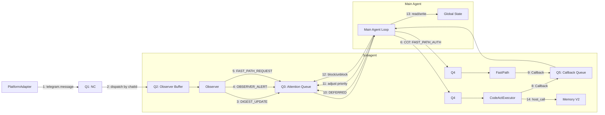
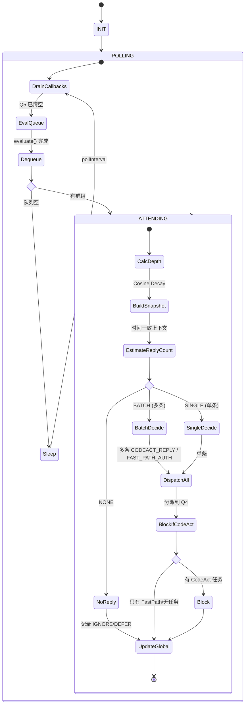
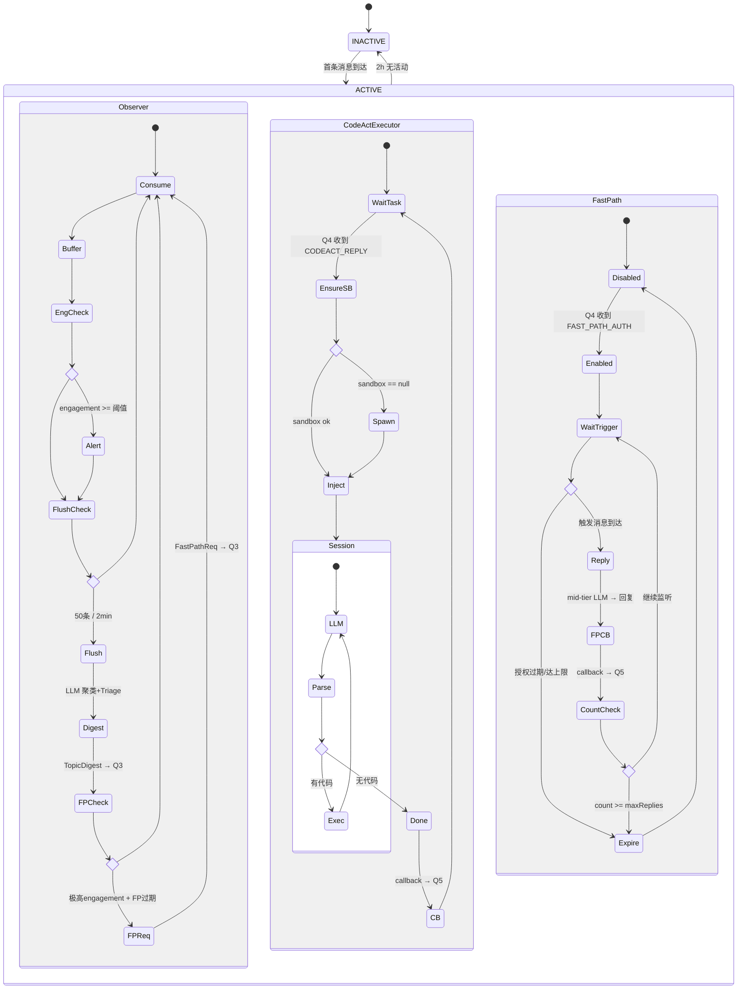

# Subagent Notification 处理工作流 — 设计大纲

> **文档版本**: 0.5.0  
> **创建时间**: 2026-03-10  
> **最后更新**: 2026-03-13  
> **状态**: 设计讨论稿 (已整合第四轮反馈)  
> **上游依赖**: `Implementation_Plan.md` Phase 6B 完成, Phase 7 规划中

> [!IMPORTANT]
> **核心不变式**：所有关于"是否回复"和"回复什么内容"的决策，**只在主 Agent 中发生**。Subagent 的任何组件都不做内容决策。唯一例外是 FastPath，经主 Agent 预授权后在严格限定范围内自主回复。

---

## 0. 核心设计哲学

### 速度分层：快决策 + 慢执行

- **主 Agent（快层）**：拥有所有群组的完整上下文，快速扫过消息，做出所有决策（包括回复内容），分派执行任务。
- **Subagent（慢层）**：三个组件各司其职——Observer 提供感知、CodeActExecutor 执行复杂操作、FastPath 在授权范围内快速回复。

```
  主 Agent（快层·决策者）              Subagent（慢层·执行者）
  ┌──────────────────────┐            ┌──────────────────────────┐
  │ 完整上下文            │            │ Observer (始终运行)       │
  │ 所有决策权            │ ←感知上报─ │  · 消息消费+话题聚类     │
  │ 批量指令分派          │            │  · Engagement 评分       │
  │ Callback 审查        │            │  · 告警/FastPath 请求    │
  │ 全局状态+TaskList     │ ─指令分派→ │                          │
  │ 动态队列评估          │            │ CodeActExecutor (按需)    │
  │ 多/单条回复判断       │            │  · 执行复杂回复          │
  │                      │ ←回调──── │  · 独立 Session+Sandbox  │
  │                      │            │                          │
  │                      │ ─预授权──→ │ FastPath (高engagement)  │
  │                      │ ←回调──── │  · 预授权范围内快速回复   │
  └──────────────────────┘            └──────────────────────────┘
```

---

## 1. 消息时间一致性

### 1.1 实时落盘 + 快照读取

消息在群组中实时生成，同步落盘到 `message_log`。主 Agent 读取时以 NC 事件时间戳为切片点：

```typescript
interface MessageSnapshot {
  chatId: string;
  snapshotTimestamp: number;         // NC 事件批次中该群最晚的时间戳
  messages: Message[];               // 截止 snapshotTimestamp 的完整消息
  newSinceLastAttend: Message[];     // 自上次主 agent 关注以来的新消息
  topicRegistry: TopicDigest[];      // 同一时间切片下的话题状态
}
```

处理期间新到达的消息**不出现在当前视图**中，下次轮询才可见。

---

## 2. 消息队列架构

### 2.1 队列全景图

```
┌──────────────────────────────────────────────────────────────────┐
│                         消息队列架构                               │
│                                                                  │
│  Q1: NotificationCenter (全局事件总线)                             │
│  ├─ 来源: PlatformAdapter 实时推入                                │
│  ├─ 副作用: 每条消息实时写入 message_log                           │
│  └─ 消费: GroupDispatcher 按 chatId 分发到各 Subagent              │
│                    │                                             │
│      ┌─────────────┼─────────────┐                               │
│      ▼             ▼             ▼                               │
│  Q2: 群组 Inbound Buffer (每个 Subagent·Observer 内部)            │
│  ├─ 来源: Q1 分发的该群消息                                       │
│  ├─ 消费: Observer 消费 → Recording Pipeline → TopicDigest        │
│  └─ 产出: 上报到 Q3                                               │
│                    │                                             │
│                    ▼                                             │
│  Q3: 主 Agent 注意力队列 (Priority Queue, 主 Agent 动态评估)       │
│  ├─ 来源:                                                        │
│  │   · Observer 周期上报 (DIGEST_UPDATE)                          │
│  │   · Observer 告警 (OBSERVER_ALERT)                             │
│  │   · Observer FastPath 请求 (FAST_PATH_REQUEST)                 │
│  │   · 主 Agent 自身的延迟重入 (DEFERRED_RE_ENTRY)                │
│  ├─ 消费: 主 Agent 串行出队                                       │
│  └─ 特性: 主 Agent 每轮 evaluate() 动态调整                       │
│                    │                                             │
│               主 agent 决策                                       │
│          (批量 / 单条, 由 decision 逻辑决定)                      │
│                    │                                             │
│      ┌─────────────┼─────────────┐                               │
│      ▼             │             ▼                               │
│  Q4: 群组 Execution Queue (每个 Subagent 内部)                    │
│  ├─ 来源: 主 Agent 分派的 ReplyTask                               │
│  ├─ 消费:                                                        │
│  │   · CodeActExecutor 消费 CODEACT_REPLY 类型                    │
│  │   · FastPath 消费 FAST_PATH_AUTH 类型                          │
│  └─ 注意: 没有 SimpleDecider — 简单发送由主 Agent 直接指令         │
│                    │                                             │
│                    ▼                                             │
│  Q5: Callback 队列 (全局单实例)                                   │
│  ├─ 来源:                                                        │
│  │   · CodeActExecutor 执行完成                                   │
│  │   · FastPath 回复完成                                          │
│  ├─ 消费: 主 Agent 每轮 Phase 1 drain                             │
│  └─ 效果: unblock 对应群组, 更新全局状态                           │
│                                                                  │
└──────────────────────────────────────────────────────────────────┘
```

### 2.2 各队列定义

```typescript
// --- Q3 条目 ---
interface AttentionQueueEntry {
  chatId: string;
  
  // 来源标记
  source: 'DIGEST_UPDATE' | 'OBSERVER_ALERT' | 'FAST_PATH_REQUEST' | 'DEFERRED_RE_ENTRY';
  
  // 排序信号
  priority: number;                    // 综合优先级 (0-100)
  
  // Observer 提供的感知数据
  topicDigest: TopicDigest[];
  engagementScore: number;
  urgentSignals: string[];             // @、reply-to-agent
  fastPathRequested: boolean;
  pendingMessageCount: number;
  
  // 调度元数据
  snapshotTimestamp: number;           // 对应的时间切片
  lastAttendedAt: number;
  attendCycle: number;                 // Cosine Decay 计数
  stickiness: GroupStickiness;
  
  // 状态
  blocked: boolean;                    // CodeAct 执行中 → 不参与轮询
}

// --- Q4 任务 ---
type ReplyTask =
  | CodeActReplyTask
  | FastPathAuthTask;

interface CodeActReplyTask {
  taskId: string;
  type: 'CODEACT_REPLY';
  chatId: string;
  targetMessageIds: string[];          // 可以针对多条消息
  topicId: string;
  contextSnapshot: {
    topicSummary: string;
    recentMessages: Message[];
    personContext: string;
    toneGuidance: string;
    contentDirection: string;
  };
  replyStrategy: ReplyStrategy;
  maxResponseTime: number;             // 默认 30s
}

interface FastPathAuthTask {
  taskId: string;
  type: 'FAST_PATH_AUTH';
  chatId: string;
  config: FastPathConfig;
}

// --- Q5 回调 ---
interface SubagentCallback {
  chatId: string;
  taskId: string;
  source: 'CODE_ACT' | 'FAST_PATH';
  type: 'COMPLETED' | 'FAILED' | 'TIMEOUT';
  result: {
    sentMessageIds: string[];
    replyContent: string;
    sessionSummary: string;
    tokensUsed: number;
    duration: number;
  };
  error?: string;
}
```

---

## 3. Subagent 三组件架构

### 3.0 组件间关系总览

```
┌──────────────────────────────────────────────────────────────┐
│                     Subagent (群组 A)                          │
│                                                              │
│  NC事件 ──→ ┌─────────────────────────────────────────┐      │
│             │ ① Observer (始终运行)                    │      │
│             │                                         │      │
│             │  Q2 Buffer → Recording Pipeline         │      │
│             │    → TopicRegistry 更新                  │      │
│             │    → Engagement 评分                     │      │
│             │                                         │      │
│             │  产出: ──→ Q3 (TopicDigest 上报)         │      │
│             │         ──→ Q3 (ObserverAlert 告警)      │      │
│             │         ──→ Q3 (FastPathRequest)         │      │
│             └─────────────────────────────────────────┘      │
│                                                              │
│  Q4 ────→ ┌─────────────────────────────────────────┐        │
│           │ ② CodeActExecutor (按需启动)              │        │
│  (CODEACT │                                         │        │
│  _REPLY)  │  独立 LLM Session + 独立 Sandbox         │        │
│           │  执行复杂多步回复操作                      │        │
│           │                                         │        │
│           │  产出: ──→ Q5 (Callback)                 │        │
│           └─────────────────────────────────────────┘        │
│                                                              │
│  Q4 ────→ ┌─────────────────────────────────────────┐        │
│           │ ③ FastPath (高 engagement 时激活)         │        │
│  (FAST_   │                                         │        │
│  PATH_    │  主 agent 预授权范围内自主快速回复         │        │
│  AUTH)    │  mid-tier LLM 调用                       │        │
│           │  ★ 唯一允许非主 agent 发起内容决策的组件   │        │
│           │                                         │        │
│           │  产出: ──→ Q5 (Callback)                 │        │
│           └─────────────────────────────────────────┘        │
│                                                              │
│  说明:                                                       │
│  · Observer 和 CodeActExecutor/FastPath 可并行运行            │
│  · Observer 在所有状态下持续运行 (包括 CodeAct 执行期间)       │
│  · 没有 SimpleDecider：简单回复由主 agent 直接决定内容        │
│    并通过 CodeActExecutor 发送                               │
└──────────────────────────────────────────────────────────────┘
```

### 3.1 Observer

**职责**: 纯感知管道，不做任何内容决策。

```typescript
interface Observer {
  chatId: string;

  // === 消费 ===
  onMessage(event: NCEvent): void;          // Q1 → Q2

  // === Recording Pipeline (含定期 LLM 聚类调用) ===
  flushBuffer(): Promise<void>;              // 话题聚类 + Triage

  // === 产出给 Q3 ===
  getDigest(): TopicDigest[];                // 话题快照
  getMessageSnapshot(upTo: number): MessageSnapshot;

  // === Engagement 评估 (纯算法, 无 LLM) ===
  getEngagementScore(): number;
  checkAlert(): ObserverAlert | null;        // → Q3 OBSERVER_ALERT
  checkFastPathRequest(): boolean;           // → Q3 FAST_PATH_REQUEST
}
```

**Observer 不做的事**：
- ❌ 不调用 LLM 生成回复
- ❌ 不决定是否回复
- ❌ 不发送任何消息到群组
- ❌ 不维护 LLM Session

### 3.2 CodeActExecutor

**职责**: 接收主 Agent 的指令，在独立环境中执行复杂回复。支持 **双语言代码块**：JavaScript/TypeScript 代码块可调用 Host Call API（Telegram、Memory、Web），Bash/Shell 代码块通过 `child_process.exec()` 直接执行 CLI 命令（ffmpeg、curl 等），默认 `cwd` 为 `workspace/`。执行前通过 `enrichMessages()` 管线下载媒体文件到 `workspace/Downloads/`，使 bash 代码块可直接操作已下载的图片、视频、文档。

```typescript
interface CodeActExecutor {
  chatId: string;

  // === 独立资源 ===
  session: {
    messages: ChatMessage[];                  // 独立对话历史
    lastCompactedAt: number;
    totalTokensUsed: number;
  };
  sandbox: Sandbox | null;                   // 独立 worker 进程

  // === 执行 ===
  execute(task: CodeActReplyTask): Promise<SubagentCallback>;
  // 1. 确保 sandbox 运行中
  // 2. 将 task.contextSnapshot 注入 session
  // 3. CodeAct 多轮交互 (search memory, compose reply, send)
  // 4. 产出 callback → Q5
}
```

**CodeActExecutor 不做的事**：
- ❌ 不自主决定是否回复（由主 Agent 决定）
- ❌ 不监控消息流（由 Observer 负责）
- ❌ 不做 topic triage（由 Observer 的 Recording Pipeline 负责）

**CodeActExecutor 处理的场景**：
- ✅ 需要搜索 Memory V2 的回复
- ✅ 需要拉取历史消息的回复
- ✅ 需要多步推理的复杂问答
- ✅ 涉及发送多媒体/格式化内容
- ✅ 主 Agent 决定了方向但需要 CodeAct 细化和执行的回复
- ✅ 需要通过 bash 代码块操作已下载的媒体文件（如 ffmpeg 转码、zip 压缩等）

**双语言代码块支持**：

| 代码块类型 | 执行方式 | 能力 | 用途 |
|---|---|---|---|
| `javascript` / `typescript` | Sandbox Worker `executeCode()` | 完整 Host Call API（Telegram、Memory、Web 等） | API 调用、数据查询、消息发送 |
| `bash` / `shell` / `sh` | `child_process.exec()`，cwd = `workspace/` | CLI 工具（ffmpeg、curl、zip 等） | 文件操作、媒体转码、系统工具 |

### 3.3 FastPath

**职责**: 高 engagement 时段，在主 Agent 预授权范围内快速回复。**这是唯一允许 subagent 自主生成回复内容的组件**。

```typescript
interface FastPathHandler {
  chatId: string;
  enabled: boolean;                          // 由主 Agent 授权
  config: FastPathConfig | null;

  // === 触发 ===
  onTriggerMessage(msg: Message): void;      // Observer 检测到触发消息后调用

  // === 执行 ===
  execute(trigger: Message): Promise<SubagentCallback>;
  // mid-tier LLM: 在 preauthorizedActions 范围内生成回复
}

interface FastPathConfig {
  preauthorizedActions: string[];            // 如 ["回答直接问题", "简短回应", "表情反应"]
  blockedActions: string[];                  // 如 ["讨论敏感话题", "发送链接"]
  model: string;                             // mid-tier (如 Gemini Flash)
  maxReplyLength: number;                    // 字符上限 (默认 200)
  maxRepliesBeforeReauth: number;            // 最多连续回复 N 次后需重新授权 (默认 3)
  expiresAt: number;                         // 授权过期时间 (默认 5 min)
  tonePreset: string;                        // 语气约束
}
```

**FastPath 约束链**:
1. 主 Agent 必须显式授权（通过 `FAST_PATH_AUTH` 任务）
2. 只在 `preauthorizedActions` 范围内行动
3. 有 `maxRepliesBeforeReauth` 上限
4. 有 `expiresAt` 时间限制
5. 每次回复产生 callback → Q5，主 Agent 下次轮询审查
6. 主 Agent 随时可以撤销授权

---

## 4. 主 Agent 设计

### 4.1 完整上下文包

```typescript
interface GroupContextPackage {
  chatId: string;
  chatTitle: string;
  snapshotTimestamp: number;

  // === 时间一致的消息视图 ===
  rawMessages: Message[];                 // 截止 snapshotTimestamp 的完整消息
  newMessagesSinceLastAttend: Message[];  // 上次关注以来的新消息
  messageSummary: string;                 // Recording Pipeline 摘要

  // === 话题与评估 ===
  topicRegistry: TopicDigest[];
  engagementScore: number;

  // === 持久化上下文 ===
  groupModel: GroupModel;
  activePersons: PersonGroupProfile[];
  playbook: GroupPlaybook | null;

  // === Subagent 历史 ===
  lastCallbacks: SubagentCallback[];      // 本次以来的所有 callback
  pendingCodeActTasks: CodeActReplyTask[];
  fastPathEnabled: boolean;
  fastPathHistory: SubagentCallback[];    // FastPath 回复记录

  // === 粘性 ===
  stickiness: GroupStickiness;
}
```

### 4.2 多条/单条回复决策逻辑

主 Agent 根据多维信号综合判断本次应该生成多少条回复指令：

```typescript
interface ReplyCountSignals {
  engagementScore: number;         // 群组实时活跃度
  newMessageCount: number;         // 自上次关注以来的新消息数
  distinctTopicCount: number;      // 不同话题线程数
  mentionCount: number;            // 直接 @ agent 的消息数
  avgMessageLength: number;        // 新消息平均长度（信息密度）
  stickiness: GroupStickiness;     // 群组粘性
  timeSinceLastAttend: number;     // 距上次关注的时间（ms）
}

function estimateReplyCount(signals: ReplyCountSignals): 'NONE' | 'SINGLE' | 'BATCH' {
  // 无回复
  if (signals.engagementScore < 20 && signals.mentionCount === 0) {
    return 'NONE';
  }

  // 批量回复条件（模拟用户看完一段对话后集中回复多条）
  if (
    signals.newMessageCount >= 10 ||          // 积压较多消息
    signals.distinctTopicCount >= 2 ||         // 多个话题线程
    signals.mentionCount >= 2 ||               // 被多次 @
    (signals.engagementScore >= 60 &&          // 高活跃度
     signals.timeSinceLastAttend > 5 * 60_000) // 且已有一段时间未关注
  ) {
    return 'BATCH';
  }

  return 'SINGLE';
}
```

**BATCH 模式下的决策输出示例**：
```typescript
// 主 Agent 审视消息后生成多条决策
const result: AttendResult = {
  chatId: 'group_A',
  decisions: [
    // 话题1: 旅行讨论 → 用 CodeAct 查记忆回复
    {
      type: 'CODEACT_REPLY',
      task: {
        targetMessageIds: ['msg_38', 'msg_39'],
        contentDirection: '回忆之前去京都的经验，推荐行程',
        // ...
      }
    },
    // 话题2: 有人直接 @ 问简单问题 → 也用 CodeAct 但给出简洁方向
    {
      type: 'CODEACT_REPLY',
      task: {
        targetMessageIds: ['msg_42'],
        contentDirection: '简短回答"够了，一天可以覆盖"',
        // ...
      }
    },
    // 话题3: 闲聊不参与
    { type: 'IGNORE', topicId: 'topic_xyz', reason: '私人话题' },
    // 授权 FastPath（群组正在高活跃期）
    { type: 'FAST_PATH_AUTH', config: { preauthorizedActions: ['简短回应'], ... } },
  ]
};
```

### 4.3 动态队列评估

```typescript
interface DynamicAttentionQueue {
  entries: Map<string, AttentionQueueEntry>;

  // 每轮轮询开始时动态评估
  evaluate(): void;
  // · 合并同群组多次上报 (取最新 TopicDigest)
  // · 根据 callback 结果调整优先级 (如 CodeAct 失败 → 提升重试)
  // · FastPath 请求 → 提升该群优先级
  // · 处理过久未关注的群组 → 时间衰减提升
  // · 清理已 IDLE 的群组条目

  enqueueOrUpdate(entry: AttentionQueueEntry): void;
  boost(chatId: string): void;
  block(chatId: string): void;
  unblock(chatId: string): void;
  dequeue(): AttentionQueueEntry | null;
  adjustPriority(chatId: string, delta: number, reason: string): void;
}
```

### 4.4 全局状态与 TaskList Skill

```typescript
interface MainAgentGlobalState {
  taskList: AgentTask[];
  activeGroupsSummary: string;
  recentDecisions: DecisionRecord[];
  pendingFollowups: FollowupItem[];
  currentFocus: string | null;
  lastUpdatedAt: number;
}

// Skill 接口
// skills.taskList.add(description, chatIds?)
// skills.taskList.update(id, status, notes?)
// skills.taskList.list(filter?)
// skills.taskList.getGlobalState()
// skills.taskList.updateSummary(summary)
```

### 4.5 主 Agent 注意力循环

```typescript
async function mainAgentLoop() {
  const queue = new DynamicAttentionQueue();     // Q3
  const callbackQueue = new CallbackQueue();     // Q5
  const globalState = loadGlobalState();

  while (running) {
    // ═══ Phase 1: Drain Callbacks (Q5) ═══
    for (const cb of callbackQueue.drain()) {
      globalState.recentDecisions.push(toRecord(cb));
      getSubagent(cb.chatId).markTaskComplete(cb.taskId);
      queue.unblock(cb.chatId);
    }

    // ═══ Phase 2: 动态队列评估 (Q3) ═══
    for (const sa of getAllSubagents()) {
      queue.enqueueOrUpdate(sa.observer.buildQueueEntry());
    }
    for (const alert of checkObserverAlerts()) {
      queue.boost(alert.chatId);
    }
    queue.evaluate();

    // ═══ Phase 3: 取出最高优先级群组 ═══
    const next = queue.dequeue();
    if (!next) { await sleep(pollInterval); continue; }

    // ═══ Phase 4: 构建时间一致上下文 ═══
    const depth = getContextDepth(next);           // Cosine Decay
    next.attendCycle++;
    const ctx = buildContextPackage(next, depth);

    // ═══ Phase 5: 决策 (含多/单条判断) ═══
    const replyMode = estimateReplyCount({
      engagementScore: ctx.engagementScore,
      newMessageCount: ctx.newMessagesSinceLastAttend.length,
      distinctTopicCount: ctx.topicRegistry.filter(t => t.state === 'ACTIVE').length,
      mentionCount: ctx.urgentSignals?.length ?? 0,
      avgMessageLength: avg(ctx.newMessagesSinceLastAttend.map(m => m.text?.length ?? 0)),
      stickiness: ctx.stickiness,
      timeSinceLastAttend: Date.now() - (next.lastAttendedAt ?? 0),
    });
    const result = await makeDecisions(ctx, globalState, replyMode);

    // ═══ Phase 6: 分派 ═══
    const sa = getSubagent(next.chatId);
    let hasCodeActTask = false;
    for (const d of result.decisions) {
      switch (d.type) {
        case 'CODEACT_REPLY':
          sa.codeActExecutor.enqueue(d.task);  // → Q4
          hasCodeActTask = true;
          break;
        case 'FAST_PATH_AUTH':
          sa.fastPath.authorize(d.config);     // → Q4
          break;
        // IGNORE / DEFER → 只记录
      }
    }
    if (hasCodeActTask) {
      queue.block(next.chatId);  // 只有 CodeAct 才 block
    }

    // ═══ Phase 7: 更新全局状态 ═══
    if (result.globalStateUpdate) applyUpdate(globalState, result.globalStateUpdate);
    if (result.stickinessUpdate) sa.stickiness = { ...sa.stickiness, ...result.stickinessUpdate };
    next.lastAttendedAt = Date.now();
    saveGlobalState(globalState);
    // → 立即回到 Phase 1
  }
}
```

---

## 5. 组件间通信完整矩阵

### 5.1 所有通信路径一览

| # | 发送方 | 接收方 | 通道 | 消息类型 | 触发条件 |
|---|-------|-------|------|---------|---------|
| 1 | PlatformAdapter | NC (Q1) | push | `telegram.message` | 新消息到达 |
| 2 | NC (Q1) | Observer (Q2) | dispatch by chatId | 群组消息 | 自动分发 |
| 3 | Observer | Q3 | push | `DIGEST_UPDATE` | Recording Pipeline flush 后 |
| 4 | Observer | Q3 | push | `OBSERVER_ALERT` | engagement >= 阈值 |
| 5 | Observer | Q3 | push | `FAST_PATH_REQUEST` | 极高 engagement + FastPath 已过期 |
| 6 | Main Agent | Q4 (CodeActExecutor) | push | `CODEACT_REPLY` | 决策=需要复杂回复 |
| 7 | Main Agent | Q4 (FastPath) | push | `FAST_PATH_AUTH` | 决策=授权快速通道 |
| 8 | CodeActExecutor | Q5 | push | Callback | 任务完成/失败/超时 |
| 9 | FastPath | Q5 | push | Callback | 快速回复完成 |
| 10 | Main Agent | Q3 | internal | `DEFERRED_RE_ENTRY` | DEFER 决策后重新入队 |
| 11 | Main Agent | Q3 | adjust | priority change | 动态评估时 |
| 12 | Main Agent | Q3 | block/unblock | 状态变更 | CodeAct 开始/callback 到达 |
| 13 | Main Agent | GlobalState | read/write | 状态持久化 | 每轮 Phase 7 |
| 14 | CodeActExecutor | Memory V2 | host_call | recall/update | CodeAct 执行中 |

### 5.2 通信路径可视化



---

## 6. 完整状态流程图

### 6.1 主 Agent 状态机



### 6.2 Subagent 组件状态机



---

## 7. Cosine Decay 上下文深度

```typescript
function getContextDepth(entry: AttentionQueueEntry): 0 | 1 | 2 | 3 {
  if (entry.urgentSignals.length > 0) return 3;
  if (entry.source === 'OBSERVER_ALERT' || entry.fastPathRequested) return 2;

  const T = entry.stickiness.depthCyclePeriod;
  const cycle = entry.attendCycle % T;
  const decay = (1 - Math.cos(2 * Math.PI * cycle / T)) / 2;

  if (decay < 0.3) return 0;
  if (decay < 0.6) return 1;
  if (decay < 0.85) return 2;
  return 3;
}
```

| 深度 | 内容 | Token |
|------|------|-------|
| L0 | TopicDigest only | 0 |
| L1 | + GroupModel + Playbook + callbacks | 0 |
| L2 | + 消息原文 + cheap model 判断 | ~1K |
| L3 | + SOTA 深度分析 + 完整历史 | ~5-10K |

---

## 8. 群组粘性

```typescript
interface GroupStickiness {
  familiarity: 'CORE' | 'FAMILIAR' | 'ACQUAINTANCE' | 'STRANGER';
  replyFrequency: number;
  initiativeLevel: number;
  tonePreset: string;
  priorityMultiplier: number;          // 0.2-1.0
  depthCyclePeriod: number;            // Cosine Decay 周期
  fastPathEligible: boolean;           // 是否允许 FastPath
  maxInterventionsPerHour: number;
  cooldownAfterIntervention: number;
  overactiveThreshold: number;
  overactiveStrategy: 'REDUCE_FREQUENCY' | 'INCREASE_SELECTIVITY' | 'MUTE_TEMPORARY';
  lastUpdated: number;
  feedbackHistory: FeedbackSummary;
}
```

| 等级 | priority | depthCycle | fastPath | 行为摘要 |
|------|---------|-----------|----------|---------|
| CORE | 1.0 | 10 | ✅ | 频繁深审, 积极回复, FastPath 可用 |
| FAMILIAR | 0.7 | 20 | ✅ | 适度关注, 选择性回复 |
| ACQUAINTANCE | 0.4 | 35 | ❌ | 偶尔浏览, 谨慎回复 |
| STRANGER | 0.2 | 50 | ❌ | 极少关注, 几乎只响应 @ |

---

## 9. 与 Phase 7 协同

- **Playbook**: 注入 CodeActExecutor session + 主 agent 决策参考
- **Cost Control**: 全局 budget 管控, per-subagent sandbox/session 纳入
- **TaskList Skill**: `skills.taskList.*`

---

## 10. 实施路线

| 阶段 | 内容 | 估时 |
|------|------|------|
| **S1** | 时间一致性 + Q1 分组 + message_log 实时落盘 | 2天 |
| **S2** | SubagentManager + Observer + Q2/Q3 | 3天 |
| **S3** | Sandbox 多实例化 + CodeActExecutor + Q4/Q5 | 3天 |
| **S4** | FastPath + 授权机制 | 2天 |
| **S5** | 主 Agent 循环 + Cosine Decay + 批量决策 + 动态队列 | 3天 |
| **S6** | Global State + TaskList Skill | 2天 |
| **S7** | 多/单条回复信号逻辑 + Stickiness | 2天 |
| **S8** | 集成测试 + Dry-Run | 2天 |

---

## 11. 术语表

| 术语 | 定义 |
|------|------|
| **Main Agent** | 快层。持有所有决策权, 串行审视, 批量指令 |
| **Observer** | Subagent 感知组件。始终运行, 不做内容决策 |
| **CodeActExecutor** | Subagent 执行组件。独立 Session+Sandbox, 执行主 Agent 指令。支持 JS + bash 双语言代码块，媒体文件自动下载到 workspace/Downloads/ |
| **FastPath** | Subagent 快速回复组件。唯一允许自主内容决策的组件, 需主 Agent 预授权 |
| **MediaDownloader** | 媒体下载管理器。将聊天媒体保存到 workspace/Downloads/, 按 uniqueFileId 去重, 3 天自动清理, 过期后通过 adapter refetch 重新下载 |
| **Snapshot Timestamp** | 时间切片点, 保证消息视图一致性 |
| **Block/Unblock** | CodeAct 执行期间群组从 Q3 临时移除 |
| **Q1-Q5** | 五个显式消息队列 |
| **BATCH/SINGLE** | 主 Agent 根据多维信号判断的回复模式 |

---

## 12. Prompt 注入点分析

### 12.1 注入点全景

系统中有 **7 个需要 prompt 注入的位置**，按生命周期阶段分为三类：

```
生命周期阶段          注入点                              Prompt 类型
───────────────────────────────────────────────────────────────────
感知层 (Observer)
  └─ ➊ Recording Pipeline LLM 调用   →  结构化 Triage prompt

决策层 (Main Agent)
  ├─ ➋ Main Agent 系统 prompt         →  Orchestrator 人格 + 规则
  ├─ ➌ Attend 上下文注入 prompt        →  GroupContextPackage 结构化注入
  └─ ➍ Decision 决策 prompt            →  决策输出格式约束

执行层 (Subagent)
  ├─ ➎ CodeActExecutor 任务注入       →  Task handover 结构化注入
  ├─ ➏ FastPath 系统 prompt            →  预授权约束 + 人格
  └─ ➐ Callback 结果注入              →  执行结果回注到主 Agent session
```

### 12.2 各注入点详细分析

#### ➊ Recording Pipeline Triage Prompt

**位置**: Observer 内部，Recording Pipeline flush 时调用  
**频率**: 每次 flush（约每 2 分钟或 50 条消息）  
**模型**: cheap model (Gemini Flash)  
**不变**: 与现有 Phase 6A 设计一致

```
[System]
你是一个群聊话题分析器。分析以下群聊消息，完成：
1. 话题聚类：将消息分组为不同话题线程
2. 话题摘要：每个话题一句话摘要
3. Triage 判断：评估每个话题是否值得 agent 介入

输出 JSON 格式。

[User]
群组: {{chatTitle}} ({{chatId}})
消息 (共 {{count}} 条, 时间范围 {{timeRange}}):
{{formattedMessages}}

当前 Playbook 摘要: {{playbookSummary}}
```

---

#### ➋ Main Agent 系统 Prompt

**位置**: Main Agent session 初始化  
**频率**: 一次（session 开始时）  
**模型**: mid-to-SOTA model

```
[System]
你是 CyberGroupmate 的主调度 Agent。你的职责是快速审视多个群组的消息状态，
做出是否回复、怎么回复的决策，并将执行任务分派给各群组的 Subagent。

你所有的决策基于以下上下文信息被注入。你可用主动调用 skills.taskList 管理
全局任务。

## 核心规则
1. 你是唯一的决策者。审视消息 → 判断 → 分派。不亲自回复消息。
2. 你的注意力是串行的。一次只处理一个群组。
3. 你看到的消息截止至 snapshotTimestamp，处理期间的新消息你看不到。
4. 你可以一次生成多条回复指令（BATCH 模式），模拟用户看完一段对话后批量回复。
5. 对于简单回复和复杂回复，都通过 CODEACT_REPLY 分派给 subagent 执行。
   你在 contentDirection 中给出明确的内容方向。
6. 只有在高 engagement 场景下才授权 FastPath。

## 当前全局状态
{{globalState}}

## 当前任务列表
{{taskList}}
```

---

#### ➌ Attend 上下文注入 Prompt

**位置**: Main Agent 每次轮询到一个群组时  
**频率**: 每次轮询  
**格式**: 结构化 user message 注入到 main agent session

```
[User — 系统自动注入]
═══ 注意力切换: {{chatTitle}} ({{chatId}}) ═══
快照时间: {{snapshotTimestamp}}
上次关注: {{lastAttendedAt}} ({{timeSinceLastAttend}} 前)
上下文深度: L{{depth}}

## 话题注册表
{{#each topicRegistry}}
- [{{state}}] {{label}} ({{messageCount}}条, {{participantCount}}人, 最后活跃 {{lastActivityAt}})
  摘要: {{recentContext}}
  Triage: {{#if triagePassed}}✅ 建议介入 (confidence={{triageConfidence}}, 原因: {{triageReason}}){{else}}⬜ 不介入{{/if}}
{{/each}}

## 新消息 (自上次关注以来, 共 {{newMessageCount}} 条)
{{#if depth >= 2}}
{{#each newMessagesSinceLastAttend}}
[{{timestamp}}] {{senderName}}: {{text}}
{{/each}}
{{else}}
(L{{depth}} 深度, 消息原文省略。摘要: {{messageSummary}})
{{/if}}

## Engagement
分数: {{engagementScore}}/100
{{#if observerAlert}}⚠️ 观察者告警: {{alertReason}}{{/if}}

## 上次 Subagent 执行结果
{{#each lastCallbacks}}
- [{{source}}] {{type}}: {{result.replyContent}} ({{result.duration}}ms, {{result.tokensUsed}} tokens)
{{/each}}
{{#if fastPathHistory.length}}
## FastPath 回复历史
{{#each fastPathHistory}}
- {{result.replyContent}} → {{type}}
{{/each}}
{{/if}}

## 群组画像
粘性: {{stickiness.familiarity}} | 回复频率: {{stickiness.replyFrequency}} | 语气: {{stickiness.tonePreset}}

## 请决策
基于以上信息，输出你的决策（JSON 格式的 AttendResult）。
```

---

#### ➍ Decision 输出格式 Prompt

**位置**: ➌ 的尾部，约束 LLM 输出格式  
**格式**: 嵌入在 ➌ 中

```
输出格式要求（JSON）:
{
  "replyMode": "NONE" | "SINGLE" | "BATCH",
  "decisions": [
    {
      "type": "CODEACT_REPLY",
      "targetMessageIds": ["msg_38", "msg_39"],
      "topicId": "topic_travel",
      "contentDirection": "回忆之前的京都经验，推荐一天行程",
      "toneGuidance": "随意友好",
      "model": "gemini-flash"
    },
    {
      "type": "IGNORE",
      "topicId": "topic_gossip",
      "reason": "私人话题不参与"
    },
    {
      "type": "FAST_PATH_AUTH",
      "preauthorizedActions": ["简短回应直接问题", "表情反应"],
      "maxRepliesBeforeReauth": 3,
      "expiresInMinutes": 5
    }
  ],
  "stickinessUpdate": null,
  "globalNotes": "群A最近讨论旅行较多，记录到 taskList"
}
```

---

#### ➎ CodeActExecutor 任务注入 Prompt

**位置**: Subagent CodeActExecutor 收到 CODEACT_REPLY 时，注入到独立 session  
**频率**: 每个 CODEACT_REPLY 任务  
**模型**: 由 ReplyStrategy.model 指定

```
[User — 任务注入]
═══ 回复任务 {{taskId}} ═══
群组: {{chatTitle}}
目标消息:
{{#each targetMessages}}
  [{{timestamp}}] {{senderName}}: {{text}}
{{/each}}

话题摘要: {{contextSnapshot.topicSummary}}
相关人物: {{contextSnapshot.personContext}}

## 主 Agent 指令
内容方向: {{contentDirection}}
语气: {{toneGuidance}}
最大长度: {{maxLength}} 字符
回复目标消息 ID: {{targetMessageIds}}

## 约束
- 你是 {{persona.name}}，在群里像普通人一样说话
- 按照上面的内容方向和语气生成回复
- 使用 ctx.tg.sendText() 发送

请生成回复代码。
```

---

#### ➏ FastPath 系统 Prompt

**位置**: FastPath Handler 收到授权时初始化  
**频率**: 每次授权  
**模型**: mid-tier (Gemini Flash)

```
[System]
你是 {{persona.name}}，在群 {{chatTitle}} 中快速回复消息。

## 授权范围
你被授权执行以下行为：
{{#each preauthorizedActions}}
- {{this}}
{{/each}}

## 禁止行为
{{#each blockedActions}}
- ❌ {{this}}
{{/each}}

## 约束
- 最大回复长度: {{maxReplyLength}} 字符
- 语气: {{tonePreset}}
- 不主动发起新话题
- 不透露自己是 AI
- 收到不确定的问题时不回复（宁可漏回不可错回）

[User]
触发消息:
[{{msg.timestamp}}] {{msg.senderName}}: {{msg.text}}

请直接输出回复内容（纯文本，不含其他格式）。如果不应回复，输出 "__SKIP__"。
```

---

#### ➐ Callback 结果注入 Prompt

**位置**: Main Agent 在 Phase 1 处理 Q5 callback 时，注入到 session  
**频率**: 每个 callback  
**格式**: 系统自动注入的 user message

```
[User — Callback 通知]
═══ Subagent 执行结果 ═══
群组: {{chatTitle}} ({{chatId}})
任务: {{taskId}} ({{source}})
状态: {{type}}
耗时: {{result.duration}}ms | Token: {{result.tokensUsed}}

{{#if type === 'COMPLETED'}}
已发送消息:
{{#each result.sentMessageIds}}
  - msg_id: {{this}}
{{/each}}
回复内容: "{{result.replyContent}}"
Session 摘要: {{result.sessionSummary}}
{{else}}
错误: {{error}}
{{/if}}
```

### 12.3 Prompt 类型分类汇总

| 类别 | 注入点 | 触发频率 | 模型 | Token 开销 |
|------|-------|---------|------|-----------|
| **结构化分析** | ➊ Triage | ~每 2 分钟/群 | cheap | ~500 |
| **系统人格** | ➋ Main System | 一次 | mid-SOTA | ~800 |
| **上下文注入** | ➌ Attend | 每次轮询 | (注入不调LLM) | ~200-2K |
| **决策约束** | ➍ Decision | 每次轮询 | (含在➌中) | (含在➌中) |
| **任务 Handover** | ➎ CodeAct Task | 每个 CODEACT_REPLY | mid-SOTA | ~500-1K |
| **快速约束** | ➏ FastPath | 每次授权 | mid | ~300 |
| **结果回注** | ➐ Callback | 每个 callback | (注入不调LLM) | ~100-300 |

---

## 13. Handover 消息类型目录

### 13.1 消息类型分类

系统中跨组件传递的消息分为 **4 类 8 种**：

```
类型 A: 感知上报 (Observer → Q3 → Main Agent)
  A1: DIGEST_UPDATE      — 定期话题摘要更新
  A2: OBSERVER_ALERT     — 强 engagement 告警
  A3: FAST_PATH_REQUEST  — 请求 FastPath 授权

类型 B: 决策下达 (Main Agent → Q4 → Subagent)
  B1: CODEACT_REPLY      — 复杂回复任务
  B2: FAST_PATH_AUTH     — FastPath 授权/撤销

类型 C: 执行回调 (Subagent → Q5 → Main Agent)
  C1: CODEACT_CALLBACK   — CodeAct 执行结果
  C2: FAST_PATH_CALLBACK — FastPath 回复结果

类型 D: 内部控制 (Main Agent 内部)
  D1: DEFERRED_RE_ENTRY  — 延迟重新入队
```

### 13.2 各类型格式与示例

#### A1: DIGEST_UPDATE

```json
{
  "type": "DIGEST_UPDATE",
  "chatId": "-100123456",
  "chatTitle": "日本旅行交流群",
  "timestamp": 1741898400000,
  "topicDigest": [
    {
      "topicId": "topic_kyoto_trip",
      "label": "京都行程规划",
      "state": "ACTIVE",
      "messageCount": 8,
      "participantCount": 3,
      "recentContext": "alice 在问京都一天够不够玩，bob 推荐了岚山路线",
      "triagePassed": true,
      "triageConfidence": 0.72,
      "triageReason": "旅行话题, agent 有相关经验可分享"
    }
  ],
  "engagementScore": 45,
  "pendingMessageCount": 12
}
```

#### A2: OBSERVER_ALERT

```json
{
  "type": "OBSERVER_ALERT",
  "chatId": "-100123456",
  "alertType": "HIGH_ENGAGEMENT",
  "engagementScore": 78,
  "triggerReason": "3 人在 2 分钟内连续讨论, 1 条直接 @agent",
  "topicDigest": [ "..." ],
  "timestamp": 1741898460000
}
```

#### A3: FAST_PATH_REQUEST

```json
{
  "type": "FAST_PATH_REQUEST",
  "chatId": "-100123456",
  "reason": "engagement=82, 已有 2 条 @agent, FastPath 授权已过期",
  "timestamp": 1741898520000
}
```

#### B1: CODEACT_REPLY

```json
{
  "type": "CODEACT_REPLY",
  "taskId": "task_20260313_001",
  "chatId": "-100123456",
  "targetMessageIds": ["msg_38", "msg_39"],
  "topicId": "topic_kyoto_trip",
  "contextSnapshot": {
    "topicSummary": "alice 在问京都一天够不够玩",
    "recentMessages": [
      { "id": "msg_38", "sender": "alice", "text": "京都一天够玩吗？想去岚山和金阁寺" },
      { "id": "msg_39", "sender": "bob", "text": "岚山半天差不多 但金阁寺要看排队" }
    ],
    "personContext": "alice: 旅行爱好者, 上次聊过大阪。bob: 去过京都多次",
    "toneGuidance": "随意友好, 像熟人分享经验",
    "contentDirection": "回忆之前去京都的经验，推荐一天的行程安排（岚山早上+金阁寺下午）"
  },
  "replyStrategy": {
    "model": "gemini-flash",
    "maxLength": 200
  },
  "maxResponseTime": 30000
}
```

#### B2: FAST_PATH_AUTH

```json
{
  "type": "FAST_PATH_AUTH",
  "taskId": "task_20260313_fp_001",
  "chatId": "-100123456",
  "config": {
    "preauthorizedActions": ["回答直接问题", "简短回应", "表情反应"],
    "blockedActions": ["讨论敏感话题", "发送链接", "主动发起新话题"],
    "model": "gemini-flash",
    "maxReplyLength": 150,
    "maxRepliesBeforeReauth": 3,
    "expiresAt": 1741898820000,
    "tonePreset": "随意"
  }
}
```

#### C1: CODEACT_CALLBACK

```json
{
  "type": "COMPLETED",
  "source": "CODE_ACT",
  "chatId": "-100123456",
  "taskId": "task_20260313_001",
  "result": {
    "sentMessageIds": ["msg_93"],
    "replyContent": "一天够的 岚山+嵯峨野半天 下午可以去金阁寺 不用住那边",
    "sessionSummary": "查了 memory 中京都相关记录, 构造了行程推荐回复",
    "tokensUsed": 1240,
    "duration": 8500
  }
}
```

#### C2: FAST_PATH_CALLBACK

```json
{
  "type": "COMPLETED",
  "source": "FAST_PATH",
  "chatId": "-100123456",
  "taskId": "task_20260313_fp_r01",
  "result": {
    "sentMessageIds": ["msg_95"],
    "replyContent": "对 去过两次了 确实一天差不多",
    "sessionSummary": "FastPath 快速回应 alice 的追问",
    "tokensUsed": 380,
    "duration": 1200
  }
}
```

---

## 附录 A: 多群组场景详细分析

> 以下 5 个场景演示系统在不同负载模式下的完整行为。每个场景包含时间线、各 Q 的状态变化、主 agent 决策过程、subagent 执行过程。
>
> 群组设定：
> - **群 A** "旅行交流群" — CORE, engagement 基准中等
> - **群 B** "技术讨论" — FAMILIAR, engagement 基准中等
> - **群 C** "大学同学群" — CORE, engagement 基准高
> - **群 D** "行业交流" — ACQUAINTANCE, engagement 基准低
> - **群 E** "项目组" — FAMILIAR, engagement 基准中等

---

### 场景 1：多群同时消息，一个群深度讨论

**背景**：群 A-D 同时有消息活动。群 B 在进行深度技术讨论。

```
时间线:
━━━━━━━━━━━━━━━━━━━━━━━━━━━━━━━━━━━━━━━━━━━━━━━━━━━━━
t=0:00  群A: alice 发了日常消息 (3条)
        群B: bob 发了长篇技术分析 (1条, 300字) + carol, dave 跟进讨论 (5条)
        群C: eve 发了个表情包 (1条)
        群D: frank 问了个行业问题 (1条)

═══ Observer 阶段 (各群独立运行) ═══

群A Observer:
  buffer=[3条], engagement=22, 无告警
  → Q3: DIGEST_UPDATE (priority=22×1.0=22)

群B Observer:
  buffer=[6条], 检测到长消息(300字)+多人讨论
  engagement=68 → ⚠️ 超过阈值(60)
  → Q3: OBSERVER_ALERT (priority 被 boost)
  → Q3 最终 priority≈78 (68×0.7=47.6 + alert boost +30)

群C Observer:
  buffer=[1条], engagement=8, 无告警
  → Q3: DIGEST_UPDATE (priority=8×1.0=8)

群D Observer:
  buffer=[1条], engagement=15, 无告警
  → Q3: DIGEST_UPDATE (priority=15×0.4=6)

═══ 主 Agent 轮询 ═══

Phase 2 — 队列评估后排序:
  Q3: [群B: 78] > [群A: 22] > [群C: 8] > [群D: 6]

Phase 3 — 出队群B (最高优先级)

Phase 4 — 构建群 B 上下文:
  · Cosine Decay: attendCycle=3, T=20 → depth=L1
  · 但有 OBSERVER_ALERT → 强制升为 L2
  · 加载: TopicDigest + GroupModel + 消息原文 + cheap model 判断

Phase 5 — 主 agent 审视群 B:
  prompt 注入(➌):
    "═══ 注意力切换: 技术讨论 ═══
     话题: [ACTIVE] Rust vs Go 性能分析 (6条, 3人)
     摘要: bob 发了详细分析, carol 质疑测试方法, dave 补充数据
     Triage: ✅ 建议介入 (confidence=0.78)
     新消息: [完整原文...]
     Engagement: 68/100 ⚠️ 观察者告警"

  主 agent 决策:
    replyMode = SINGLE (单话题线程, 只有 1 个话题)
    decisions = [
      { type: "CODEACT_REPLY",
        targetMessageIds: ["msg_101", "msg_103"],    ← bob 的分析 + dave 的数据
        contentDirection: "从 memory 中回忆之前讨论过的 benchmark,
                          补充 IO 密集 vs CPU 密集场景的区别",
        model: "gemini-flash" }
    ]

Phase 6 — 分派 + block:
  → Q4(群B): CODEACT_REPLY
  → Q3: block(群B)

Phase 7 — 更新状态, 立即回到 Phase 1

━━ 主 agent 继续处理其他群 (群B 的 subagent 在后台执行) ━━

Phase 3 — 出队群A (priority=22)
Phase 4 — depth=L0 (Cosine Decay, 非紧急)
Phase 5 — 只看 TopicDigest: "日常闲聊, 无介入建议"
  decisions = [{ type: "IGNORE", reason: "日常闲聊" }]
  → 不分派, 继续

Phase 3 — 出队群C (priority=8)
  → decisions = [{ type: "IGNORE", reason: "只有表情包" }]

Phase 3 — 出队群D (priority=6)
  → decisions = [{ type: "DEFER", reason: "ACQUAINTANCE群, 非紧急问题下次看" }]

Phase 3 — 队列空, sleep(pollInterval)

━━ 群B CodeActExecutor 执行完成 ━━

CodeActExecutor:
  → session 注入任务 (➎)
  → memory.recall("Rust Go benchmark 性能")
  → 构造回复: "之前看过类似的测试 IO 密集场景确实 Go 略快..."
  → ctx.tg.sendText(chatB, reply, { replyTo: msg_101 })
  → callback → Q5

━━ 下一轮主 agent 轮询 ━━

Phase 1 — drain Q5:
  → 收到群B callback (COMPLETED)
  → unblock(群B)
  → 记录到 globalState.recentDecisions
```

---

### 场景 2：多个群同时激烈讨论

**背景**：群 A、B、C 同时在高频讨论不同话题。主 agent 需要快速在多群间切换。

```
时间线:
━━━━━━━━━━━━━━━━━━━━━━━━━━━━━━━━━━━━━━━━━━━━━━━━━━━━━
t=0:00  群A: 15条新消息 (讨论五一旅行计划)
        群B: 12条新消息 (讨论新框架选型)
        群C: 20条新消息 (讨论群聚会安排)

Observer 结果:
  群A: engagement=55, 2个话题 (旅行目的地+酒店推荐), Triage均通过
  群B: engagement=50, 1个话题 (框架选型), Triage通过
  群C: engagement=62 + ALERT, 1个话题 (聚会安排), Triage通过

Q3 排序: [群C: 62×1.0+alert=92] > [群A: 55×1.0=55] > [群B: 50×0.7=35]

═══ Round 1: 处理群 C ═══

主 agent 审视群 C (L2, 因 alert):
  20条消息, 讨论聚会时间+地点
  estimateReplyCount:
    newMessageCount=20, distinctTopics=1, mentions=0,
    engagement=62, timeSinceLastAttend=15min
    → SINGLE (虽然消息多但只有 1 个话题线程)

  decisions = [
    { type: "CODEACT_REPLY",
      targetMessageIds: ["msg_201"],         ← eve 的提案消息
      contentDirection: "支持周六方案，提议具体餐厅（参考之前的聚会记录）" }
  ]
  → Q4(群C): CODEACT_REPLY → block(群C)

═══ Round 2: 立即处理群 A ═══

主 agent 审视群 A (L1, Cosine Decay):
  15条消息, 2个话题线程
  estimateReplyCount:
    newMessageCount=15, distinctTopics=2, mentions=0,
    engagement=55, timeSinceLastAttend=20min
    → BATCH (2 个不同话题)

  decisions = [
    { type: "CODEACT_REPLY",
      targetMessageIds: ["msg_301", "msg_302"],
      topicId: "topic_destination",
      contentDirection: "推荐镰仓, 比较适合一日游" },
    { type: "CODEACT_REPLY",
      targetMessageIds: ["msg_308"],
      topicId: "topic_hotel",
      contentDirection: "推荐新宿那边的酒店, 交通方便" }
  ]
  → Q4(群A): 2 个 CODEACT_REPLY → block(群A)

═══ Round 3: 立即处理群 B ═══

主 agent 审视群 B (L0, Cosine Decay 低深度):
  只看 TopicDigest: "框架选型讨论, 建议介入"
  estimateReplyCount:
    newMessageCount=12, distinctTopics=1, mentions=0
    → SINGLE

  decisions = [
    { type: "CODEACT_REPLY",
      contentDirection: "分享使用 Vite 的经验, 简短实用" }
  ]
  → Q4(群B): CODEACT_REPLY → block(群B)

═══ Round 4-N: 所有群都 blocked, 等待 callbacks ═══

主 agent sleep, 等待 Q5
  → 群C callback 先到 (8s) → unblock(群C)
  → 群B callback 到 (12s) → unblock(群B)
  → 群A 的 2 个 task callback 到 (15s, 18s) → 都完成后 unblock(群A)

主 agent 处理所有 callbacks, 更新 globalState
```

---

### 场景 3：一个群高频 @ 通知

**背景**：群 A-C 正常讨论。群 C 中有人高频 @agent 问问题。

```
时间线:
━━━━━━━━━━━━━━━━━━━━━━━━━━━━━━━━━━━━━━━━━━━━━━━━━━━━━
t=0:00  群A: 5条日常消息
        群B: 3条技术讨论
        群C: eve @agent "帮我查一下上次讨论的那个链接"

群C Observer:
  检测到 @agent → urgentSignals=["@agent by eve"]
  engagement=75 (直接 @)
  → Q3: OBSERVER_ALERT

Q3: [群C: urgent=L3强制] > [群A: 22] > [群B: 15]

═══ Round 1: 群 C (L3 深度, 因为直接 @) ═══

主 agent 审视 (SOTA analysis):
  完整消息原文 + 历史上下文 + 人物画像
  decisions = [
    { type: "CODEACT_REPLY",
      targetMessageIds: ["msg_401"],
      contentDirection: "搜索 memory 中 eve 提到的链接, 找到后回复",
      model: "claude-sonnet-4" }           ← SOTA 因为复杂检索
  ]
  → block(群C)

t=0:05  群C CodeActExecutor 执行中...

t=0:10  群C: eve @agent "找到了吗？还有另一个问题..."
        群C: alice @agent "顺便也帮我查一下那个..."

群C Observer (持续运行中, 即使 blocked):
  检测到 2 条新 @ → engagement=88
  → Q3: OBSERVER_ALERT (但群 C 是 blocked, alert 被暂存)

t=0:15  群C CodeActExecutor callback 到达 Q5
        → unblock(群C)
        → 暂存的 alert 生效 → Q3 boost(群C)

═══ Round 2: 再次处理群 C ═══

主 agent 审视 (新 snapshot, 包含 msg_401-msg_404):
  已收到第一个回复的 callback + 2 条新 @
  estimateReplyCount:
    mentionCount=2, distinctTopics=2
    → BATCH

  decisions = [
    { type: "CODEACT_REPLY",
      targetMessageIds: ["msg_402"],
      contentDirection: "回答 eve 的第二个问题" },
    { type: "CODEACT_REPLY",
      targetMessageIds: ["msg_403"],
      contentDirection: "帮 alice 查她要的内容" },
    { type: "FAST_PATH_AUTH",                    ← 高频 @ 场景, 授权 FastPath
      config: { preauthorizedActions: ["回答直接问题"],
                maxRepliesBeforeReauth: 3, expiresInMinutes: 5 } }
  ]
  → 2 个 CODEACT_REPLY → block(群C)
  → FastPath 授权生效

t=0:25  群C: eve @agent "对了还有个小问题..."
        → FastPath 触发 (已授权, 在范围内):
          mid-tier LLM → "你说～" / 直接回答简单问题
          → callback → Q5

t=0:30  群C CodeAct 任务完成 → callback → Q5
        主 agent 下次 Phase 1 一并处理所有 callbacks
```

---

### 场景 4：多群高频 @，FastPath 动态决策

**背景**：群 A、B、C 同时有人高频 @agent。主 agent 需要决判哪些群给 FastPath。

```
时间线:
━━━━━━━━━━━━━━━━━━━━━━━━━━━━━━━━━━━━━━━━━━━━━━━━━━━━━
t=0:00  群A (CORE): alice @agent + bob @agent  → engagement=82
        群B (FAMILIAR): carol @agent            → engagement=65
        群C (CORE): dave @agent + eve @agent + frank @agent → engagement=91
        群D (ACQUAINTANCE): george @agent       → engagement=55

Observer 结果:
  群A: ALERT, urgentSignals=2, fastPathRequested=true
  群B: ALERT, urgentSignals=1
  群C: ALERT, urgentSignals=3, fastPathRequested=true
  群D: urgentSignals=1 (但 ACQUAINTANCE, 无 fastPathEligible)

Q3 排序: [群C: 91+alert] > [群A: 82+alert] > [群B: 65+alert] > [群D: 55×0.4=22]

═══ Round 1: 群 C (最紧急, 3 人同时 @) ═══

主 agent 审视 L3:
  3 人分别问了不同问题
  estimateReplyCount: mentionCount=3, distinctTopics=3 → BATCH

  decisions = [
    { type: "CODEACT_REPLY", targetMsgs: ["msg_dave"],
      contentDirection: "dave 的问题需要查 memory" },
    { type: "CODEACT_REPLY", targetMsgs: ["msg_eve"],
      contentDirection: "eve 的问题直接回答" },
    { type: "CODEACT_REPLY", targetMsgs: ["msg_frank"],
      contentDirection: "frank 的问题简短回复" },
    { type: "FAST_PATH_AUTH",
      config: { preauthorizedActions: ["回答直接问题", "确认信息"],
                maxRepliesBeforeReauth: 5, expiresInMinutes: 10 } }
  ]
  ★ 群 C 是 CORE + engagement=91 → 给较宽的 FastPath 授权 (5次, 10分钟)
  → block(群C)

═══ Round 2: 群 A ═══

  decisions = [
    { type: "CODEACT_REPLY", targetMsgs: ["msg_alice", "msg_bob"],
      contentDirection: "一并回答 alice 和 bob 的问题" },
    { type: "FAST_PATH_AUTH",
      config: { maxRepliesBeforeReauth: 3, expiresInMinutes: 5 } }
  ]
  ★ 群 A 是 CORE + engagement=82 → 给标准 FastPath 授权
  → block(群A)

═══ Round 3: 群 B ═══

  decisions = [
    { type: "CODEACT_REPLY", targetMsgs: ["msg_carol"],
      contentDirection: "回答 carol 的技术问题" }
  ]
  ★ 群 B 是 FAMILIAR, engagement=65 → 不授权 FastPath (阈值 70)
  → block(群B)

═══ Round 4: 群 D ═══

  decisions = [
    { type: "CODEACT_REPLY", targetMsgs: ["msg_george"],
      contentDirection: "简短礼貌回答" }
  ]
  ★ 群 D 是 ACQUAINTANCE → fastPathEligible=false, 不可授权
  → block(群D)

═══ FastPath 动态授权判断逻辑 ═══

  shouldAuthorizeFastPath(ctx):
    if (!ctx.stickiness.fastPathEligible) return false     ← 群D 被过滤
    if (ctx.engagementScore < 70) return false               ← 群B 被过滤
    if (ctx.recentFeedback === 'negative') return false
    return true                                              ← 群A, 群C 通过

  fastPathGenerosity(ctx):   // 决定授权宽度
    if (ctx.stickiness.familiarity === 'CORE' && ctx.engagementScore > 85)
      → { maxReplies: 5, expires: 10min }                  ← 群C
    else
      → { maxReplies: 3, expires: 5min }                   ← 群A
```

---

### 场景 5：多群讨论，agent 被用于跨群交互/传话

**背景**：群 A 和群 E 中的用户在利用 agent 相互传话。群 B、C 正常讨论。

```
时间线:
━━━━━━━━━━━━━━━━━━━━━━━━━━━━━━━━━━━━━━━━━━━━━━━━━━━━━
t=0:00  群A: alice @agent "帮我问一下群E的 bob，周末那个活动几点开始"
        群B: 3条技术讨论
        群C: 5条日常闲聊
        群E: bob @agent "帮我跟群A的 alice 说，活动改到下午三点了"

═══ Observer 阶段 ═══

群A Observer: engagement=70, urgentSignals=["@agent"], Triage=介入
群E Observer: engagement=65, urgentSignals=["@agent"], Triage=介入

Q3: [群A: 70+alert] > [群E: 65×0.7+alert] > [群B/C: 低]

═══ Round 1: 群 A ═══

主 agent 审视 L3 (直接 @):
  消息: alice 请求 agent 去群 E 问 bob 活动时间

  主 agent 决策:
    → 识别这是跨群交互需求
    → 用 skills.taskList 记录任务:
      skills.taskList.add("帮 alice 问 bob 活动时间", ["群A", "群E"])
    → globalState.pendingFollowups.push({
        type: "CROSS_GROUP_QUERY",
        from: { chatId: "群A", user: "alice" },
        to: { chatId: "群E", user: "bob" },
        query: "周末活动几点开始"
      })

  decisions = [
    { type: "CODEACT_REPLY",
      targetMessageIds: ["msg_alice"],
      contentDirection: "告诉 alice '好的我去问问'" }
  ]
  → block(群A)

═══ Round 2: 群 E ═══

主 agent 审视 L3 (直接 @):
  消息: bob 也在跟 agent 传话, 说活动改到下午三点

  主 agent 检查 globalState.pendingFollowups:
    → 发现群A alice 正在等这个答案!
    → 两个方向的传话可以合并处理

  decisions = [
    { type: "CODEACT_REPLY",
      targetMessageIds: ["msg_bob"],
      contentDirection: "告诉 bob '好的我转告 alice'" }
  ]
  → block(群E)

  ★ 同时更新 taskList:
    skills.taskList.update(taskId, "IN_PROGRESS",
      "bob 说活动改到下午三点。等群A unblock 后需要转告 alice")

═══ Callback 处理 ═══

t=0:10  群A callback: 已发送 "好的我去问问"
        → unblock(群A)

t=0:12  群E callback: 已发送 "好的我转告"  
        → unblock(群E)

═══ Round N: 主 agent 检查 pendingFollowups ═══

  → 发现 taskList 中有待转告任务
  → 群 A 已 unblock → 主动将群 A 优先级提升 (+20)

  下次轮询到群 A:
  decisions = [
    { type: "CODEACT_REPLY",
      targetMessageIds: [],           ← 主动发起, 非回复
      contentDirection: "告诉 alice: bob 说活动改到下午三点了" }
  ]
  → skills.taskList.update(taskId, "DONE")

═══ 关键设计点 ═══

  1. 跨群交互的"记忆"保存在 globalState.pendingFollowups 中
  2. 主 agent 的 taskList 跟踪跨群任务的状态
  3. 两个群的处理可以在不同轮次完成, globalState 保证不丢失
  4. 主 agent 主动提升有 pending followup 的群组优先级
  5. 这是主 agent "capable 的人" 模型的典型体现:
     记住别人托付的事 → 去另一个群问 → 回来转告
```
