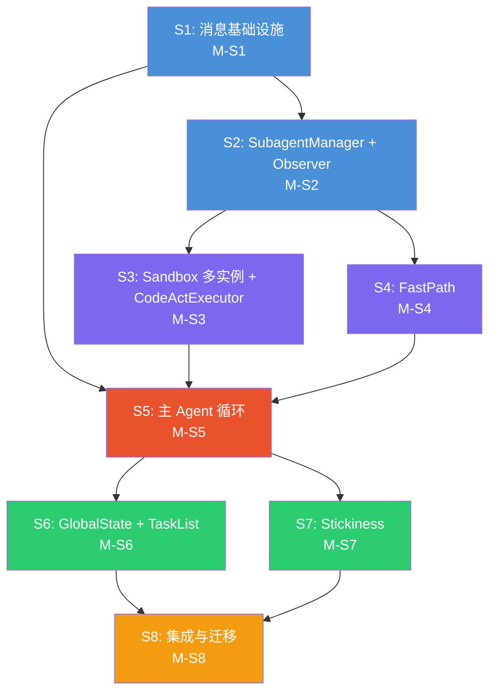

# Subagent Architecture — 详细实施子任务

> **关联设计文档**: `subagent.md` v0.5.0  
> **关联总体规划**: `Implementation_Plan.md` Phase 7+ 扩展  
> **创建时间**: 2026-03-13  
> **状态**: 待审阅

---

## 前置审计結論

### subagent.md 与现有代码的对齐分析

| 维度 | 现有代码状态 | subagent.md 设计 | Gap |
|------|-------------|-----------------|-----|
| **NC 队列** | 单一全局队列 `NotificationCenter`，单一 `drain()` | Q1 全局事件总线 + Q2 per-group buffer | NC 需增加 per-chatId dispatch |
| **Sandbox** | 单实例 `new Sandbox()`，`main.ts:688` | per-subagent 独立 Sandbox | 需要 `SandboxPool` 多实例管理 |
| **Session** | 单一 `messages: ChatMessage[]`，Phase 5 的 scope 隔离 | per-subagent 独立 `ChatMessage[]` | 需要 per-group session 管理 |
| **主循环** | `mainEventLoop()` 单循环消费所有事件 | 主 Agent 注意力循环 (Phase 1-7 串行) | 需要完全重构 |
| **TopicRegistry** | 全局单例 | per-subagent Observer 持有 | 需要分组实例化 |
| **RecordingPipeline** | 全局单例 | per-subagent Observer 内 | 需要分组实例化 |
| **FastRouter** | 全局单例，区分 FAST_PATH/ENGAGED/RECORDING | 取消独立组件，功能整合到 Observer | 需要重新分配职责 |
| **EngagedTopicHandler** | 全局单例 | 保留逻辑，下沉到 CodeActExecutor | 需要迁移 |
| **ReplyPipeline** | 全局共享，生成 ReplyTask | 保留共享，但 ReplyTask 由主 Agent 生成 | 需要调整调用方 |
| **FeedbackLoop** | 全局共享 | 保留共享 | 兼容 |
| **GlobalState/TaskList** | 不存在 | 主 Agent 维护全局状态 + skills.taskList | 新增 |
| **message_log** | 由 RecordingPipeline 批量写入 | 实时落盘（NC 推入时写入） | 需要调整写入时机 |
| **Cosine Decay** | 不存在 | 控制上下文深度 L0-L3 | 新增 |
| **FastPath** | `FastRouter` 中的 FAST_PATH 概念 | 独立 FastPath Handler + 预授权机制 | 语义不同，需重新实现 |
| **Stickiness** | 不存在 | per-group GroupStickiness | 新增 |
| **Prompt 注入** | 硬编码 system prompt + event 格式化 | 7 个结构化注入点 (§12) | 需要模板化 |

### 一致性确认

subagent.md 中引用的以下现有概念与代码**一致**，可直接复用：
- `Topic` / `TopicState` / `TriageDecision` / `Message` 类型 (pipeline/types.ts)
- Recording Pipeline 的 Step 1-4 处理流程
- `memory.recall()` / `memory.browseHistory()` 的 host-call 桥接机制
- `ContextAssembler` 的 sceneFocus + latentMemory 组装逻辑
- `ReplyPipeline` 的 FULL_CODEACT / GUIDED / ENFORCED 三模式
- `ModelRouter` 的路由规则框架
- `FeedbackLoop` 的简化版 engagement 检测

---

## S1: 消息基础设施改造

### S1.1 — message_log 实时落盘

**目标**: 消息到达 NC 时同步写入 `message_log`，保证主 Agent 可以按 snapshotTimestamp 读取一致视图。

**现状**: `message_log` 由 `RecordingPipeline.flush()` Step 4 批量写入（延迟 2 min+）。

**修改**:

#### [MODIFY] `notification-center.ts`
- 在 `push()` 方法中，对 `telegram.message` 类型事件，同步调用 `messageLogWriter.write(event)` 写入 `message_log`
- 增加 `messageLogWriter` 依赖注入接口
- 保留原有 JSONL 事件日志不变

#### [NEW] `src/event/message-log-writer.ts`
- `MessageLogWriter` 类，接受 `MemoryStoreV2` 实例
- `write(event: NCEvent)`: 将 telegram.message 事件解析为 `message_log` 行并写入 SQLite
- 幂等写入（重复 messageId 跳过）

#### [MODIFY] `src/pipeline/recording-pipeline.ts`
- Step 4 的 `message_log` 写入改为 `INSERT OR IGNORE`（因为 S1.1 已经实时写入）
- 保持 topic/embedding 等其他写入不变

### S1.2 — NC per-chatId dispatch

**目标**: NC 支持按 chatId 分发事件到各 Subagent 的 Q2 buffer。

#### [MODIFY] `notification-center.ts`
- 新增 `subscribe(chatId: string, handler: (event) => void)` 方法
- `push()` 时，除了入总队列，同时调用匹配 chatId 的 handler
- 新增 `subscribeCatchAll(handler)` 用于监听所有事件（主 Agent 用）

#### [NEW] `src/event/group-dispatcher.ts`
- `GroupDispatcher` 类：管理 chatId → handler 的注册表
- 接入 NC 的 subscribe 接口
- 支持动态注册/注销群组

### S1.3 — MessageSnapshot 读取

**目标**: 主 Agent 可以按 snapshotTimestamp 读取时间一致的消息视图。

#### [NEW] `src/memory-v2/message-snapshot.ts`
- `buildMessageSnapshot(chatId, snapshotTimestamp, lastAttendedAt)`: 从 `message_log` 查询
- 返回 `MessageSnapshot` 接口（如 subagent.md §1.1）

### S1 测试计划

#### 单元测试 `tests/subagent/s1-message-infra.test.ts`

| # | 测试用例 | 验证点 |
|---|---------|--------|
| 1 | `MessageLogWriter` 写入 telegram.message 事件 | `message_log` 表新增对应行, 字段映射正确 |
| 2 | `MessageLogWriter` 幂等写入 | 相同 messageId 重复写入不报错，不重复 |
| 3 | `MessageLogWriter` 忽略非 telegram.message 事件 | `system.*` 类事件不写入 message_log |
| 4 | NC `push()` 触发实时落盘 | push 一条 telegram.message 后，立即能从 message_log 查到 |
| 5 | NC `subscribe(chatId)` 只收到指定群消息 | push 群 A/B 消息，群 A 订阅者只收群 A |
| 6 | NC `subscribeCatchAll()` 收到所有消息 | push 群 A/B 消息，catchAll 全收 |
| 7 | `GroupDispatcher` 动态注册/注销 | 注册 → 收到消息 → 注销 → 不再收到 |
| 8 | `buildMessageSnapshot()` 时间一致性 | 写入 t=100,200,300 的消息，snapshot(250) 只返回 t≤250 的 |
| 9 | `buildMessageSnapshot()` 按 chatId 过滤 | 多群消息混合，snapshot 只返回指定 chatId |
| 10 | Recording Pipeline `INSERT OR IGNORE` 兼容 | 实时写入后，Pipeline flush 不 crash |

#### 集成测试
- 完整流程：NC push → 实时落盘 → GroupDispatcher 分发 → MessageSnapshot 查询
- 并发安全：多线程同时 push 100 条消息，message_log 无遗漏无重复

### S1 Milestone: **M-S1 消息实时化**

| 验收标准 | 验证方式 |
|---------|--------|
| `telegram.message` 推入 NC 后 **<50ms** 可从 `message_log` 查到 | 单元测试 #4 |
| `buildMessageSnapshot(chatId, ts)` 返回结果不含 ts 之后的消息 | 单元测试 #8 |
| NC per-chatId subscribe 正确路由到指定 handler | 单元测试 #5-6 |
| Recording Pipeline flush 与实时写入无冲突 | 单元测试 #10 |
| 全部 10 个单元测试通过，`tsc` 0 错误 | `npm test -- --grep s1` |

---

## S2: SubagentManager + Observer 组件

### S2.1 — SubagentManager 骨架

**目标**: 管理所有群组的 Subagent 实例生命周期。

#### [NEW] `src/subagent/subagent-manager.ts`
- `SubagentManager` 类
  - `getOrCreate(chatId): GroupSubagent` — 按需创建
  - `getAllSubagents(): GroupSubagent[]`
  - `releaseIdle(maxIdleMs)` — 释放长时间无活动的 subagent
- 持有 NC、MemoryStoreV2、AppConfig 引用

### S2.2 — GroupSubagent 骨架

**目标**: 每个群组的 Subagent 容器，持有三个组件。

#### [NEW] `src/subagent/group-subagent.ts`
- `GroupSubagent` 类
  - `chatId: string`
  - `observer: Observer`
  - `codeActExecutor: CodeActExecutor`
  - `fastPath: FastPathHandler`
  - `stickiness: GroupStickiness`
  - `buildQueueEntry(): AttentionQueueEntry`

### S2.3 — Observer 组件

**目标**: per-group Observer，消费消息、维护 TopicRegistry、计算 Engagement。

#### [NEW] `src/subagent/observer.ts`
- `Observer` 类
  - 持有 per-group `TopicRegistry` 实例
  - 持有 per-group `RecordingPipeline` 实例
  - `onMessage(event: NCEvent)` — 加入 Q2 buffer
  - `getDigest(): TopicDigest[]`
  - `getMessageSnapshot(upTo): MessageSnapshot`
  - `getEngagementScore(): number` — 纯算法计算（如 subagent.md §3.4）
  - `checkAlert(): ObserverAlert | null`
  - `checkFastPathRequest(): boolean`

**关键决策**: `TopicRegistry` 和 `RecordingPipeline` 从全局单例改为 per-group 实例化。需要修改它们的构造函数接受 chatId 过滤。

#### [MODIFY] `src/pipeline/topic-registry.ts`
- 构造函数增加 `chatId?: string` 过滤参数
- 如果指定了 chatId，`register()` / `get()` / `getActive()` 只操作该 chatId 的话题
- 向后兼容：不指定 chatId 时保持全局行为（用于测试和 dry-run）

#### [MODIFY] `src/pipeline/recording-pipeline.ts`
- 构造函数增加 `chatId` 参数
- `onMessage()` 只接受指定 chatId 的消息
- 事件 emission 不变

### S2.4 — Q3 注意力队列

#### [NEW] `src/subagent/attention-queue.ts`
- `DynamicAttentionQueue` 类（如 subagent.md §4.3）
  - `enqueueOrUpdate()`, `boost()`, `block()`, `unblock()`, `dequeue()`, `evaluate()`
  - 内部 `Map<string, AttentionQueueEntry>`
  - `evaluate()` 实现：合并同群上报、时间衰减、FastPath 请求处理

### S2 测试计划

#### 单元测试 `tests/subagent/s2-subagent-observer.test.ts`

| # | 测试用例 | 验证点 |
|---|---------|--------|
| 1 | `SubagentManager.getOrCreate()` 创建新实例 | 返回 GroupSubagent, chatId 匹配 |
| 2 | `SubagentManager.getOrCreate()` 复用已有实例 | 两次调用同 chatId 返回同一对象 |
| 3 | `SubagentManager.releaseIdle()` 回收超时实例 | lastActivity 超过阈值的被释放 |
| 4 | `Observer.onMessage()` 写入 Q2 buffer | buffer 中包含消息 |
| 5 | `Observer.getDigest()` 返回 TopicDigest | flush 后有话题摘要 |
| 6 | `Observer.getEngagementScore()` 纯算法计算 | 高频多人消息 → 高分, 低频 → 低分 |
| 7 | `Observer.checkAlert()` 超阈值触发告警 | engagement ≥ 60 → 返回 OBSERVER_ALERT |
| 8 | `Observer.checkAlert()` 未超阈值不告警 | engagement < 60 → 返回 null |
| 9 | per-group TopicRegistry 隔离 | 群 A/B 各自的话题互不可见 |
| 10 | per-group RecordingPipeline 隔离 | 群 A/B 各自 flush, 不交叉 |
| 11 | `DynamicAttentionQueue.enqueueOrUpdate()` 新增条目 | dequeue 返回该条目 |
| 12 | `DynamicAttentionQueue.enqueueOrUpdate()` 更新已有条目 | priority 取最高值 |
| 13 | `DynamicAttentionQueue.dequeue()` 返回最高优先级 | 多条目中优先级最高的先出 |
| 14 | `DynamicAttentionQueue.block()` / `unblock()` | block 后 dequeue 跳过, unblock 后恢复 |
| 15 | `DynamicAttentionQueue.evaluate()` 时间衰减 | 长时间未处理的条目 priority 下降 |

#### 集成测试
- NC push 3 群消息 → GroupDispatcher → 3 个 Observer 各自收到 → 各自产出独立 TopicDigest
- Observer ALERT → 注入 Q3 → Q3 排序正确

### S2 Milestone: **M-S2 感知层就绪**

| 验收标准 | 验证方式 |
|---------|--------|
| `SubagentManager` 可按需创建/获取/回收 Subagent | 单元测试 #1-3 |
| Observer 消费消息后产出正确 TopicDigest | 单元测试 #4-5 |
| Engagement 计算值域 0-100, 符合 subagent.md §3.4 公式 | 单元测试 #6 |
| Observer ALERT 在 engagement ≥ 60 时产生 | 单元测试 #7-8 |
| per-group TopicRegistry/RecordingPipeline 完全隔离 | 单元测试 #9-10 |
| Q3 优先级排序正确, block/unblock 行为一致 | 单元测试 #11-15 |
| 全部 15 个单元测试通过, `tsc` 0 错误 | `npm test -- --grep s2` |

---

## S3: Sandbox 多实例化 + CodeActExecutor

### S3.1 — SandboxPool

**目标**: 管理多个 Sandbox worker 进程实例。

#### [NEW] `src/sandbox/sandbox-pool.ts`
- `SandboxPool` 类
  - `acquire(chatId): Sandbox` — 获取或创建 sandbox
  - `release(chatId)` — 释放 sandbox（不立即 kill，超时后回收）
  - `maxInstances: number` (默认 5)
  - `idleTimeout: number` (默认 10 min)
  - 内部 LRU 管理

#### [MODIFY] `src/sandbox/sandbox.ts`
- 不修改现有 Sandbox 类
- 每个实例已经是独立 worker 进程，SandboxPool 只管多实例调度

### S3.2 — CodeActExecutor

**目标**: per-group CodeAct 执行器，持有独立 LLM Session 和 Sandbox。

#### [NEW] `src/subagent/code-act-executor.ts`
- `CodeActExecutor` 类
  - `session: { messages: ChatMessage[], lastCompactedAt }` — 独立对话历史
  - `sandbox: Sandbox | null` — 通过 SandboxPool 获取
  - `execute(task: CodeActReplyTask): Promise<SubagentCallback>`
    1. 通过 SandboxPool.acquire() 获取或复用 sandbox
    2. 将 task.contextSnapshot 注入到 session（Prompt ➎ 模板）
    3. 调用 `runCodeActSession()` 在独立 session 中执行
    4. 完成后产出 callback
    5. 不释放 sandbox（等 SandboxPool 超时回收）
  - `enqueue(task)` — 入 Q4，串行执行

#### [NEW] `src/subagent/types.ts`
- 所有 subagent 相关类型定义
  - `AttentionQueueEntry`, `CodeActReplyTask`, `FastPathAuthTask`, `SubagentCallback`
  - `FastPathConfig`, `GroupStickiness`, `GroupContextPackage`
  - `MainAgentGlobalState`, `AgentTask`
  - `TopicDigest`, `ObserverAlert`, `MessageSnapshot`
  - `AttendResult`, `Decision`

### S3.3 — Q4 + Q5 队列

#### [NEW] `src/subagent/execution-queue.ts`
- `ExecutionQueue` 类 (per-subagent Q4)

#### [NEW] `src/subagent/callback-queue.ts`
- `CallbackQueue` 类 (全局 Q5)
  - `enqueue(cb: SubagentCallback)`
  - `drain(): SubagentCallback[]`

### S3 测试计划

#### 单元测试 `tests/subagent/s3-sandbox-executor.test.ts`

| # | 测试用例 | 验证点 |
|---|---------|--------|
| 1 | `SandboxPool.acquire()` 创建新 sandbox | 返回可用 Sandbox, isAlive()=true |
| 2 | `SandboxPool.acquire()` 复用空闲 sandbox | 同 chatId 二次调用返回同一实例 |
| 3 | `SandboxPool.acquire()` 达到上限排队 | maxInstances=2, 第 3 个 acquire 等待或获取 LRU |
| 4 | `SandboxPool` 空闲超时回收 | 空闲 > idleTimeout 后实例被 stop() |
| 5 | `CodeActExecutor.execute()` 正常流程 | 注入 Prompt ➎ → 执行 → 返回 COMPLETED callback |
| 6 | `CodeActExecutor.execute()` 执行超时 | maxResponseTime 超过后返回 ERROR callback |
| 7 | `CodeActExecutor.execute()` sandbox 崩溃恢复 | sandbox 异常退出后重新 acquire → 重试 |
| 8 | `CodeActExecutor` 独立 session 持久化 | 两次 execute 的 session messages 连续 |
| 9 | `ExecutionQueue` 串行执行 | enqueue 2 个 task, 验证按顺序完成 |
| 10 | `CallbackQueue.drain()` 返回所有 pending | enqueue 3 个 callback, drain 一次拿全 |
| 11 | `CallbackQueue.drain()` 清空后为空 | drain 后再 drain 返回空数组 |

#### 集成测试（需要真实 Sandbox worker）
- CodeActExecutor 注入简单代码任务 → sandbox 执行 `console.log()` → 验证 callback 输出
- 2 个 CodeActExecutor 并行使用不同 sandbox → 互不干扰

### S3 Milestone: **M-S3 执行层就绪**

| 验收标准 | 验证方式 |
|---------|--------|
| SandboxPool 可管理 2-5 个并行 Sandbox 实例 | 单元测试 #1-4 |
| CodeActExecutor 从 SandboxPool 获取 sandbox, 注入 Prompt ➎, 执行, 返回 callback | 单元测试 #5 |
| 超时和崩溃场景有 graceful 处理 | 单元测试 #6-7 |
| 每个 CodeActExecutor 持有独立 session 历史 | 单元测试 #8 |
| Q4 串行、Q5 批量 drain 行为正确 | 单元测试 #9-11 |
| 全部 11 个单元测试通过, `tsc` 0 错误 | `npm test -- --grep s3` |

---

## S4: FastPath Handler

### S4.1 — FastPathHandler

#### [NEW] `src/subagent/fast-path-handler.ts`
- `FastPathHandler` 类（如 subagent.md §3.3）
  - `enabled: boolean`, `config: FastPathConfig | null`
  - `authorize(config)` — 主 Agent 授权
  - `revoke()` — 撤销授权
  - `onTriggerMessage(msg: Message)` — Observer 检测到触发消息后调用
  - `execute(trigger: Message): Promise<SubagentCallback>`
    - 使用 Prompt ➏ 模板（单次 mid-tier LLM 调用）
    - 限制 `maxRepliesBeforeReauth`
    - 检查 `expiresAt`
  - 产出 callback → Q5

### S4 测试计划

#### 单元测试 `tests/subagent/s4-fast-path.test.ts`

| # | 测试用例 | 验证点 |
|---|---------|--------|
| 1 | `authorize()` 后 enabled=true | config 正确设置 |
| 2 | `revoke()` 后 enabled=false | config 被清空 |
| 3 | 未授权时 `onTriggerMessage()` 不触发 | 返回 null / 不执行 |
| 4 | 授权后 `execute()` 返回回复内容 | callback.type=COMPLETED, replyContent 非空 |
| 5 | `execute()` 返回 `__SKIP__` 时不发消息 | callback.type=SKIPPED |
| 6 | 达到 `maxRepliesBeforeReauth` 自动禁用 | 第 N+1 次 execute 返回 disabled |
| 7 | 过期后自动禁用 | expiresAt 过后 execute 返回 disabled |
| 8 | FastPath callback 正确入 Q5 | CallbackQueue 中有对应 callback |
| 9 | Prompt ➏ 模板渲染 | 包含 preauthorizedActions, blockedActions, tonePreset |
| 10 | 并发消息不重复触发 | 2 条消息快速到达只触发 1 次 execute |

#### 集成测试（mock LLM）
- authorize → 3 条 @agent 消息 → FastPath 回复 3 次 → 第 4 条自动 disable
- authorize → 等 >expiresMinutes → 下一条消息不触发

### S4 Milestone: **M-S4 快速回复通道就绪**

| 验收标准 | 验证方式 |
|---------|--------|
| 主 Agent 可通过 `authorize(config)` 动态开启 FastPath | 单元测试 #1-3 |
| FastPath 使用 mid-tier LLM 产出回复, 延迟 < 2s (mock) | 单元测试 #4 |
| `__SKIP__` 机制生效 | 单元测试 #5 |
| maxReplies 和 expiresAt 自动禁用 | 单元测试 #6-7 |
| Callback 正确回流 Q5 | 单元测试 #8 |
| 全部 10 个单元测试通过 | `npm test -- --grep s4` |

---

## S5: 主 Agent 注意力循环

### S5.1 — MainAgentLoop

**目标**: 完全重构 `main.ts` 中的 `mainEventLoop()`，替换为 subagent.md 中的 Phase 1-7 注意力循环。

#### [NEW] `src/main-agent/main-agent-loop.ts`
- `mainAgentLoop()` 异步函数（如 subagent.md §4.5）
  - Phase 1: Drain Q5 callbacks
  - Phase 2: 动态队列评估
  - Phase 3: Dequeue 最高优先级
  - Phase 4: 构建时间一致上下文 (Cosine Decay)
  - Phase 5: 批量决策
  - Phase 6: 分派到 subagent
  - Phase 7: 更新全局状态

### S5.2 — Cosine Decay

#### [NEW] `src/main-agent/cosine-decay.ts`
- `getContextDepth(entry: AttentionQueueEntry): 0 | 1 | 2 | 3`
- 如 subagent.md §7

### S5.3 — Decision Maker

#### [NEW] `src/main-agent/decision-maker.ts`
- `makeDecisions(ctx, globalState, replyMode): AttendResult`
  - 使用 Prompt ➌ + ➍ 模板
  - 调用 LLM 生成 JSON 格式的 `AttendResult`
  - 解析并验证输出
- `estimateReplyCount(signals): NONE | SINGLE | BATCH`

### S5.4 — GroupContextPackage 构建

#### [NEW] `src/main-agent/context-builder.ts`
- `buildContextPackage(entry, depth): GroupContextPackage`
  - L0: TopicDigest only
  - L1: + GroupModel + Playbook + callbacks
  - L2: + 消息原文 + cheap model 判断
  - L3: + SOTA 深度分析 + 完整历史
- 使用 `MessageSnapshot` (S1.3) + `ContextAssembler` (现有) 组装

### S5.5 — Prompt 模板系统

#### [NEW] `workspace/agent-docs/prompts/main-agent-system.md`
- 主 Agent 系统 Prompt（模板 ➋）

#### [NEW] `workspace/agent-docs/prompts/attend-context.md`
- Attend 上下文注入模板（模板 ➌ + ➍）

#### [NEW] `workspace/agent-docs/prompts/codeact-task.md`
- CodeActExecutor 任务注入模板（模板 ➎）

#### [NEW] `workspace/agent-docs/prompts/fastpath-system.md`
- FastPath 系统 Prompt（模板 ➏）

#### [NEW] `src/main-agent/prompt-renderer.ts`
- Handlebars 风格模板渲染器
- 加载 `.md` 模板 + 注入变量 → 生成 prompt 字符串

### S5.6 — main.ts 重构

#### [MODIFY] `src/main.ts`
- `main()` 函数重构：
  - 初始化 `SubagentManager`, `SandboxPool`, `GroupDispatcher`, `CallbackQueue`, `DynamicAttentionQueue`
  - NC 事件由 `GroupDispatcher` 分发到各 Subagent Observer
  - 启动 `mainAgentLoop()` 替代现有 `mainEventLoop()`
  - 保留 bootstrap 逻辑（用于初始化 Telegram 连接等）
  - 保留 Reflection 定时器
- 删除旧的 `mainEventLoop()` 和 `formatEvents()` 等辅助函数
- `FastRouter` / `EngagedTopicHandler` 单例移除，由 per-group Observer/CodeActExecutor 承担

### S5 测试计划

#### 单元测试 `tests/subagent/s5-main-agent.test.ts`

| # | 测试用例 | 验证点 |
|---|---------|--------|
| 1 | Cosine Decay depth=L0 (新 attend, cycle 初期) | 返回 0 |
| 2 | Cosine Decay depth=L2 (cosine 谷底) | 返回 2 |
| 3 | Cosine Decay ALERT 强制升级 | depth<2 时有 ALERT → 升至 L2+ |
| 4 | `estimateReplyCount()` 无 mention, 1 话题 → SINGLE | replyMode=SINGLE |
| 5 | `estimateReplyCount()` 2+ 话题 → BATCH | replyMode=BATCH |
| 6 | `estimateReplyCount()` engagement<20, 无 mention → NONE | replyMode=NONE |
| 7 | `buildContextPackage()` L0 只含 TopicDigest | 无 messages, 无 GroupModel |
| 8 | `buildContextPackage()` L2 含消息原文 | messages 数组非空 |
| 9 | `buildContextPackage()` L3 含完整历史 | 历史消息 + deepSummary |
| 10 | Prompt ➋ 模板渲染 | 包含 globalState, taskList 变量 |
| 11 | Prompt ➌ 模板渲染 | 包含 topicRegistry, engagementScore, callbacks |
| 12 | Prompt ➎ 模板渲染 | 包含 targetMessages, contentDirection |
| 13 | `makeDecisions()` JSON 解析 | LLM 返回的 JSON 可被解析为 AttendResult |
| 14 | `makeDecisions()` JSON 格式异常回退 | 非法 JSON → 返回 NONE 决策 |

#### 主循环集成测试 `tests/subagent/s5-loop-integration.test.ts`

| # | 测试用例 | 验证点 |
|---|---------|--------|
| 15 | Phase 1: Q5 callback → unblock | drain callback → Q3 对应群 unblock |
| 16 | Phase 2-3: Q3 排序 + dequeue | 3 群入队, 最高 priority 先出 |
| 17 | Phase 4-5: 上下文构建 + 决策 (mock LLM) | 决策输出合规 |
| 18 | Phase 6: CODEACT_REPLY → Q4 + block | subagent Q4 收到 task, Q3 被 block |
| 19 | Phase 6: FAST_PATH_AUTH → FastPath handler | FastPath 被 authorize |
| 20 | 完整双轮: 群 A 决策→执行→callback→unblock→再轮询 | 两轮循环无 crash |

### S5 Milestone: **M-S5 决策层就绪**

| 验收标准 | 验证方式 |
|---------|--------|
| Cosine Decay 计算正确, 0/1/2/3 四档覆盖 | 单元测试 #1-3 |
| `estimateReplyCount()` 信号逻辑正确 | 单元测试 #4-6 |
| GroupContextPackage 四级深度构建正确 | 单元测试 #7-9 |
| 4 个 Prompt 模板渲染输出合规 | 单元测试 #10-12 |
| `makeDecisions()` LLM 输出解析 + 异常容错 | 单元测试 #13-14 |
| 主循环 Phase 1-7 完整跑通 (mock LLM) | 集成测试 #15-20 |
| `main.ts` 重构后系统可正常启动和 bootstrap | 手动验证 |
| 全部 20 个测试通过, `tsc` 0 错误 | `npm test -- --grep s5` |

---

## S6: Global State + TaskList Skill

### S6.1 — GlobalState 管理

#### [NEW] `src/main-agent/global-state.ts`
- `MainAgentGlobalState` 持久化（JSON 文件 `workspace/global-state.json`）
- `loadGlobalState()` / `saveGlobalState()`
- `AgentTask` CRUD 操作

### S6.2 — TaskList Skill

#### [NEW] `src/sandbox/skills/task-list.ts`
- `skills.taskList.add()`, `.update()`, `.list()`, `.getGlobalState()`, `.updateSummary()`
- 通过 host-call 桥接到 `GlobalState` 实例

#### [MODIFY] `src/sandbox/sandbox-worker.ts`
- 注入 `skills.taskList` 命名空间到 sandbox globalThis

### S6 测试计划

#### 单元测试 `tests/subagent/s6-global-state.test.ts`

| # | 测试用例 | 验证点 |
|---|---------|--------|
| 1 | `loadGlobalState()` 首次启动 | 返回默认空 state |
| 2 | `saveGlobalState()` + 重新 `load()` | 持久化 round-trip |
| 3 | `addTask()` 新增任务 | taskList 长度 +1, 状态=PENDING |
| 4 | `updateTask()` 状态更新 | PENDING→IN_PROGRESS→DONE |
| 5 | `listTasks()` 按状态过滤 | 只返回指定状态 |
| 6 | `pendingFollowups` 跨群任务管理 | add → 查询 → 完成 lifecycle |
| 7 | `recentDecisions` 记录 | 添加决策记录, 验证时间戳排序 |
| 8 | `skills.taskList.add()` 通过 host-call | sandbox 中调用→ 实际写入 globalState |
| 9 | `skills.taskList.list()` 通过 host-call | sandbox 中调用→ 返回正确任务列表 |
| 10 | GlobalState JSON 文件损坏恢复 | 写入非法 JSON→ load 返回默认值 |

### S6 Milestone: **M-S6 全局状态就绪**

| 验收标准 | 验证方式 |
|---------|--------|
| GlobalState 持久化到 `workspace/global-state.json`, load/save round-trip | 单元测试 #1-2 |
| AgentTask CRUD 完整 | 单元测试 #3-5 |
| 跨群 pendingFollowups 可追踪 | 单元测试 #6 |
| Sandbox 中 `skills.taskList.*` 可通过 host-call 正常调用 | 单元测试 #8-9 |
| 损坏恢复不 crash | 单元测试 #10 |
| 全部 10 个测试通过 | `npm test -- --grep s6` |

---

## S7: GroupStickiness + 自适应

### S7.1 — Stickiness 数据模型

#### [NEW] `src/subagent/stickiness.ts`
- `GroupStickiness` 接口实现
- 预设值表（CORE/FAMILIAR/ACQUAINTANCE/STRANGER）
- `updateStickiness(current, feedback): GroupStickiness` — 自适应更新规则

### S7.2 — Stickiness 持久化

#### [MODIFY] `src/memory-v2/index.ts`
- `group_models` 表增加 `stickiness` JSON 字段
- `getGroupStickiness(chatId)` / `setGroupStickiness(chatId, stickiness)`

### S7 测试计划

#### 单元测试 `tests/subagent/s7-stickiness.test.ts`

| # | 测试用例 | 验证点 |
|---|---------|--------|
| 1 | 预设值 CORE | priorityMultiplier=1.0, fastPathEligible=true |
| 2 | 预设值 STRANGER | priorityMultiplier=0.2, fastPathEligible=false |
| 3 | `updateStickiness()` positive feedback → 升级 | ACQUAINTANCE → FAMILIAR |
| 4 | `updateStickiness()` negative feedback → 降级 | FAMILIAR → ACQUAINTANCE |
| 5 | `updateStickiness()` 不越界 | CORE + positive → 仍是 CORE |
| 6 | `updateStickiness()` overactive 策略触发 | 超过 overactiveThreshold → 策略改变 |
| 7 | `getGroupStickiness()` 从 MemoryV2 读取 | 返回保存的 stickiness |
| 8 | `setGroupStickiness()` 写入 MemoryV2 | 写入后 get 返回相同值 |
| 9 | 首次获取返回 STRANGER 默认值 | 未设置过的群组返回默认 |
| 10 | Stickiness 影响 Q3 优先级计算 | CORE 群 engagement=50 > STRANGER 群 engagement=50 |

### S7 Milestone: **M-S7 群组自适应就绪**

| 验收标准 | 验证方式 |
|---------|--------|
| 4 级预设值正确 (CORE/FAMILIAR/ACQUAINTANCE/STRANGER) | 单元测试 #1-2 |
| Feedback 驱动升降级逻辑正确 | 单元测试 #3-6 |
| MemoryV2 中 stickiness 持久化 read/write round-trip | 单元测试 #7-9 |
| Stickiness 与 Q3 priority 正确联动 | 单元测试 #10 |
| 全部 10 个测试通过 | `npm test -- --grep s7` |

---

## S8: 集成与迁移

### S8.1 — 现有事件监听迁移

**目标**: 将现有 `main.ts` 中的事件监听逻辑迁移到新架构。

| 现有监听 | 迁移目标 |
|---------|---------|
| `recordingPipeline.on("topic:triage-passed")` | Observer 的 Recording Pipeline 内, 产出 → Q3 DIGEST_UPDATE |
| `engagedHandler.on("engaged:response-ready")` | CodeActExecutor 内 |
| `engagedHandler.on("engaged:exit")` | CodeActExecutor 内 |
| `topicRegistry.on("topic:archived")` | Observer 内 |
| `sandbox.on("notify")` | per-subagent Sandbox 的 notify 事件 |
| `sandbox.setHostCallHandler(...)` | per-subagent Sandbox 各自设置 |

### S8.2 — 配置扩展

#### [MODIFY] `config.yaml`
- 新增 `subagent` section：
  ```yaml
  subagent:
    maxSandboxInstances: 5
    sandboxIdleTimeout: 600000    # 10 min
    pollInterval: 5000            # 5 sec
    fastPath:
      defaultMaxReplies: 3
      defaultExpiresMinutes: 5
      engagementThreshold: 70
    stickiness:
      defaults:
        CORE: { priorityMultiplier: 1.0, depthCyclePeriod: 10 }
        FAMILIAR: { priorityMultiplier: 0.7, depthCyclePeriod: 20 }
        ACQUAINTANCE: { priorityMultiplier: 0.4, depthCyclePeriod: 35 }
        STRANGER: { priorityMultiplier: 0.2, depthCyclePeriod: 50 }
  ```

#### [MODIFY] `src/core/config.ts`
- 增加 `SubagentConfig` 类型定义和解析

### S8.3 — 集成测试

本阶段的测试整合了 S1-S7 各阶段的单元测试，并额外增加端到端场景测试。

### S8 测试计划

#### 端到端场景测试 `tests/subagent/s8-e2e-scenarios.test.ts`

以 subagent.md 附录 A 的 5 个场景为蓝本，使用 mock LLM：

| # | 场景 | 验证点 |
|---|------|--------|
| 1 | 场景 1: 多群 + 一群深度讨论 | 深度讨论群 Observer ALERT → Q3 优先 → CODEACT_REPLY → callback → unblock; 低活跃群 IGNORE/DEFER |
| 2 | 场景 2: 多群同时激烈 | 3 群串行处理, BATCH 模式 → 多 CODEACT_REPLY → 全 blocked → callbacks 陆续到达 → 全 unblock |
| 3 | 场景 3: 高频 @ | L3 深度 → CODEACT_REPLY → unblock → 再有 @ → 二次 BATCH + FastPath 授权 → FastPath 触发回复 |
| 4 | 场景 4: 多群 @ + FastPath 差异化 | CORE 群 → 宽 FastPath(5次/10min); FAMILIAR 群 → 不授权(engagement<70); ACQUAINTANCE → 不可授权 |
| 5 | 场景 5: 跨群传话 | GlobalState.pendingFollowups 记录 → 群 E 处理获取信息 → 主动提升群 A 优先级 → 转告 → taskList DONE |

#### 回归测试 `tests/subagent/s8-regression.test.ts`

| # | 测试用例 | 验证点 |
|---|---------|--------|
| 6 | 旧 main.ts 事件处理覆盖 | 所有原 `mainEventLoop` 处理的事件类型在新架构中仍有处理路径 |
| 7 | Reflection 定时器保留 | 冷场触发/最大间隔/作息触发仍然工作 |
| 8 | Config.yaml 新字段解析 | subagent section 正确加载 |
| 9 | Bootstrap 流程不变 | Telegram 初始化正常 |
| 10 | FeedbackLoop 兼容 | agent_message_sent 事件仍被正确消费 |

#### 性能/资源测试

| # | 测试用例 | 验证点 |
|---|---------|--------|
| 11 | 100 群 subagent 创建 | 内存增量 < 500MB, 创建耗时 < 5s |
| 12 | SandboxPool 5 实例并行 | 无死锁, 所有任务完成 |
| 13 | 主循环 1000 轮空转 | 无内存泄漏 (RSS 稳定) |

### S8 Milestone: **M-S8 集成验收**

| 验收标准 | 验证方式 |
|---------|--------|
| 附录 A 全部 5 个场景在 mock 环境中 pass | 端到端测试 #1-5 |
| 所有原 main.ts 事件链路在新架构中有对应处理 | 回归测试 #6-10 |
| 100 群 + 5 sandbox 并行无死锁/泄漏 | 性能测试 #11-13 |
| `config.yaml` 新 subagent section 解析正确 | 回归测试 #8 |
| 新旧架构 `npm run dev` 均可启动 (旧架构通过 feature flag 保留) | 手动验证 |
| 全部 S1-S8 共 **96 个测试** 通过, `tsc` 0 错误 | `npm test` |

---

## 实施顺序、依赖与 Milestone 路线图



## Milestone 路线图

| Milestone | 阶段 | 累计天数 | 测试数 | 关键交付物 | Gate 条件 |
|-----------|------|---------|--------|-----------|----------|
| **M-S1** | S1 | Day 2 | 10 | 消息实时落盘, NC per-chatId dispatch, MessageSnapshot | 10/10 tests pass, `tsc` 0 error |
| **M-S2** | S2 | Day 5 | 25 | SubagentManager, Observer, per-group TopicRegistry, Q3 | 15/15 新 tests pass |
| **M-S3** | S3 | Day 8 | 36 | SandboxPool, CodeActExecutor, Q4/Q5 | 11/11 新 tests pass, 多 sandbox 并行稳定 |
| **M-S4** | S4 | Day 10 | 46 | FastPathHandler, 预授权/撤销/过期机制 | 10/10 新 tests pass |
| **M-S5** | S5 | Day 14 | 66 | 主 Agent 注意力循环, Cosine Decay, Prompt 模板, main.ts 重构 | 20/20 新 tests pass, 系统可启动 |
| **M-S6** | S6 | Day 16 | 76 | GlobalState 持久化, TaskList Skill, host-call 桥接 | 10/10 新 tests pass |
| **M-S7** | S7 | Day 18 | 86 | GroupStickiness 四级预设, 自适应升降级 | 10/10 新 tests pass |
| **M-S8** | S8 | Day 20 | 96 | 端到端 5 场景, 回归, 性能, feature flag | **全部 96 tests pass**, 连续运行 4h 无 crash |

## 估时汇总

| 阶段 | 新文件 | 修改文件 | 测试文件 | 测试用例 | 估时 |
|------|-------|---------|---------|---------|------|
| S1 | 3 | 2 | 1 | 10 | 2 天 |
| S2 | 4 | 2 | 1 | 15 | 3 天 |
| S3 | 4 | 0 | 1 | 11 | 3 天 |
| S4 | 1 | 0 | 1 | 10 | 2 天 |
| S5 | 6 + 4 prompts | 1 (main.ts) | 2 | 20 | 4 天 |
| S6 | 2 | 1 | 1 | 10 | 2 天 |
| S7 | 1 | 1 | 1 | 10 | 2 天 |
| S8 | 0 | 2 | 2 | 13 | 2 天 |
| **合计** | **25** | **9** | **10** | **96** (~99 含集成) | **~20 天** |
