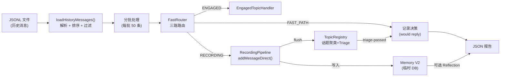
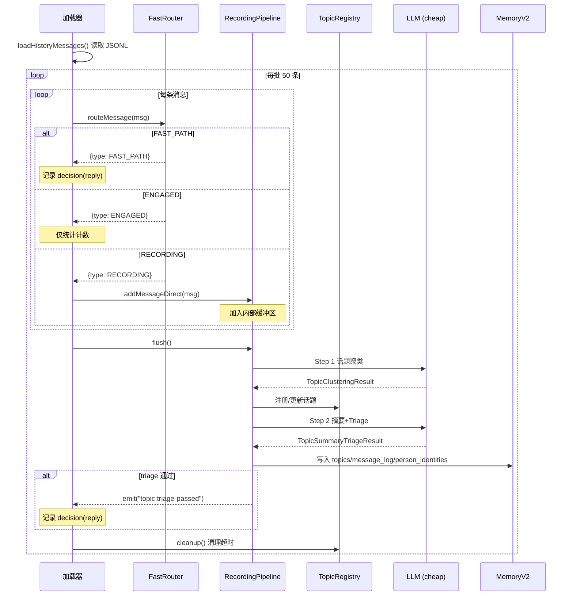
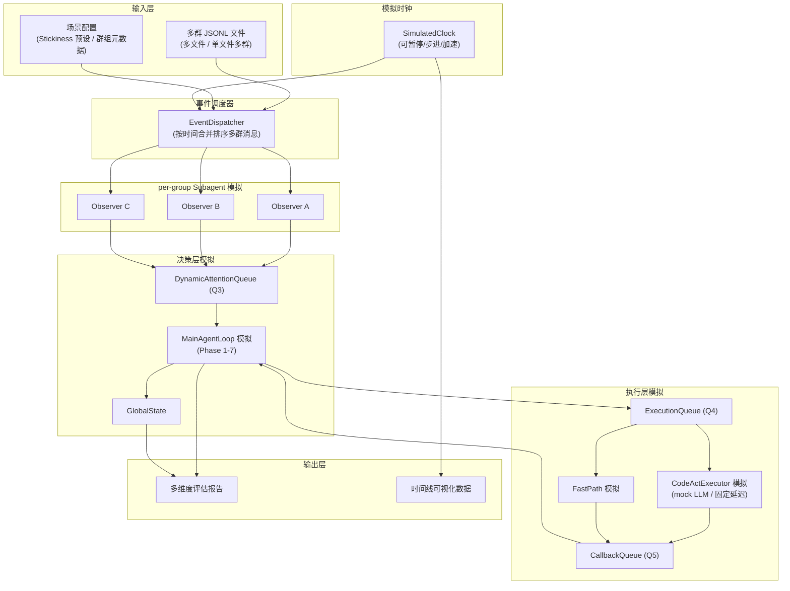
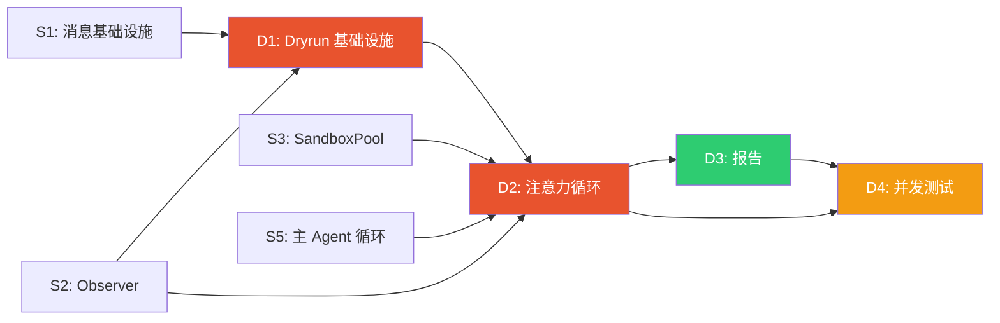

# Dryrun 系统分析与多群聊测试设计

> **文档版本**: 0.1.0  
> **创建时间**: 2026-03-13  
> **状态**: 设计分析稿  
> **关联文档**: `Implementation_Plan.md` Phase 6.7, `subagent.md` v0.5.0, `subtask.md`

---

## 目录

1. [当前 Dryrun 系统分析](#1-当前-dryrun-系统分析)
   - [1.1 架构概览](#11-架构概览)
   - [1.2 数据流详解](#12-数据流详解)
   - [1.3 组件初始化](#13-组件初始化)
   - [1.4 消息处理流程](#14-消息处理流程)
   - [1.5 输出与报告](#15-输出与报告)
   - [1.6 CLI 集成](#16-cli-集成)
   - [1.7 当前设计的局限性](#17-当前设计的局限性)
2. [Subagent 架构对 Dryrun 的影响](#2-subagent-架构对-dryrun-的影响)
   - [2.1 架构差异对比](#21-架构差异对比)
   - [2.2 新增需要测试的组件](#22-新增需要测试的组件)
3. [多群聊 Dryrun 设计方案](#3-多群聊-dryrun-设计方案)
   - [3.1 设计目标](#31-设计目标)
   - [3.2 多群聊 Dryrun 架构](#32-多群聊-dryrun-架构)
   - [3.3 数据输入格式](#33-数据输入格式)
   - [3.4 模拟时钟与事件调度](#34-模拟时钟与事件调度)
   - [3.5 Observer 模拟](#35-observer-模拟)
   - [3.6 主 Agent 注意力循环模拟](#36-主-agent-注意力循环模拟)
   - [3.7 CodeActExecutor / FastPath 模拟](#37-codeactexecutor--fastpath-模拟)
   - [3.8 报告扩展](#38-报告扩展)
4. [分布式系统中的锁问题分析](#4-分布式系统中的锁问题分析)
   - [4.1 关键共享资源与竞争点](#41-关键共享资源与竞争点)
   - [4.2 锁问题分类与分析](#42-锁问题分类与分析)
   - [4.3 Dryrun 中如何测试锁问题](#43-dryrun-中如何测试锁问题)
5. [实施建议](#5-实施建议)

---

## 1. 当前 Dryrun 系统分析

### 1.1 架构概览

当前 dryrun 系统实现位于 [`dry-run.ts`](file:///Users/arc/Documents/github/arc/CyberGroupmate/src/pipeline/dry-run.ts)，是 Phase 6.7 的交付物。其核心思路是：**离线重放历史 JSONL 消息文件，模拟 FastRouter + RecordingPipeline 的处理流程，评估 agent 在哪些消息上"会回复"，产出 JSON 评估报告**。



**核心特征**：
- **单群处理模型**：虽然可以处理所有群组消息（不传 `--chat-id`），但所有组件（TopicRegistry、RecordingPipeline、EngagedTopicHandler、FastRouter）都是**全局单例**，不区分群组
- **无时间模拟**：消息按时间排序后直接批量处理，不模拟"消息到达的时间间隔"
- **不模拟 Agent 决策**：只走到"是否回复"的判断，不运行 LLM 生成实际回复内容
- **不模拟消息发送**：`send: false` 始终为假

### 1.2 数据流详解

#### 输入

JSONL 文件每行一个 JSON 对象：

```json
{"id": "12345", "chat_id": "1001234567", "user_id": "67890", "user_name": "alice", "text": "今天吃什么", "date": "2026-03-01T12:00:00Z", "reply_to": "12340"}
```

`loadHistoryMessages()` 将其标准化为内部 `Message` 类型：
1. 解析每行 JSON
2. `normalizeChatId()` — 正数超级群 ID 自动取反（兼容 Telegram Desktop 导出格式）
3. `--chat-id` 过滤（可选）
4. 按 `timestamp` 升序排序
5. `--days` 过滤最近 N 天

#### 处理

消息按 50 条一批处理：

```
for 每批 50 条:
  for 批内每条消息:
    route = fastRouter.routeMessage(msg)
    switch route.type:
      FAST_PATH → 记录 decision (reply, 原因: direct_mention/reply_to_agent/private_chat)
      ENGAGED   → routeStats.engaged++ (不直接记录 decision)
      RECORDING → recordingPipeline.addMessageDirect(msg)
  
  await recordingPipeline.flush()    // 调 LLM 做话题聚类 + Triage
  registry.cleanup()                 // 清理超时话题
```

关键事件监听：
- `recordingPipeline.on("topic:triage-passed")` — 话题通过 Triage 时记录 decision
- `registry.on("topic:archived")` — 话题归档时调 `memory.finalizeTopic()`

#### 输出

`DryRunResult` 包含：
| 字段 | 说明 |
|------|------|
| `totalMessages` | 总消息数 |
| `wouldReply` / `wouldIgnore` | 回复/沉默计数 |
| `decisions[]` | 每条回复决策的详情（触发消息、原因、pipeline trace） |
| `totalTokens` | LLM token 消耗 |
| `totalTimeMs` | 总耗时 |
| `memoryStats` | Memory V2 表统计（topics/facts/messages/persons/profiles） |
| `reflectionResults` | Reflection 结果（可选） |

### 1.3 组件初始化

```typescript
// 模型配置（三层）
cheapConfig  = resolveTierProfile("cheap", appConfig)
midConfig    = resolveTierProfile("mid", appConfig)
sotaConfig   = resolveTierProfile("sota", appConfig)

// 核心组件（全部全局单例）
memory            = new MemoryStoreV2(dbPath)           // 临时 DB，每次运行前删除重建
registry          = new TopicRegistry()                  // 全局单例
recordingPipeline = new RecordingPipeline(registry, ...)  // 全局单例
engagedHandler    = new EngagedTopicHandler(registry, ...) // 全局单例
fastRouter        = new FastRouter(registry, engagedHandler, recordingPipeline, agentUserId)
modelRouter       = new ModelRouter(midConfig, ...)
```

### 1.4 消息处理流程



### 1.5 输出与报告

`saveDryRunReport()` 将结果写入 JSON 文件（`<input>.dry-run-report.json`）：

```json
{
  "totalMessages": 500,
  "wouldReply": 23,
  "wouldIgnore": 477,
  "decisions": [...],
  "summary": {
    "replyRate": "4.6%",
    "totalTimeMs": 45000
  },
  "memoryStats": {
    "topics": 15,
    "facts": 0,
    "messages": 500,
    "persons": 12
  }
}
```

### 1.6 CLI 集成

```bash
# 基本用法
npx tsx src/cli.ts dry-run workspace/dryrun/chat1_test.jsonl

# 带选项
npx tsx src/cli.ts dry-run chat.jsonl --chat-id -100123456 --days 7 --reflect

# 自定义 memory DB 路径
npx tsx src/cli.ts dry-run chat.jsonl --memory-db /tmp/test.db
```

辅助工具：
- `tests/scripts/bootstrap-dryrun-db.ts` — 创建预填充种子数据的 Memory V2 数据库，用于验证 recall/browse 功能
- `src/tools/tg-to-jsonl.ts` — Telegram JSON 导出 → JSONL 转换

### 1.7 当前设计的局限性

| # | 局限 | 影响 |
|---|------|------|
| 1 | **全局单例组件**：TopicRegistry / RecordingPipeline / FastRouter 不按群组隔离 | 多群消息混合在同一个注册表中，话题可能跨群误聚类 |
| 2 | **无时间模拟**：消息直接按序处理，不模拟到达间隔 | 无法测试 engagement 评分的时间衰减、flush 时机、超时清理等时间敏感逻辑 |
| 3 | **无注意力循环**：不模拟主 Agent 的优先级排序和串行处理 | 无法评估多群竞争时的注意力分配合理性 |
| 4 | **不模拟并发**：单线程顺序执行 | 无法发现 Q3/Q4/Q5 队列的竞态条件 |
| 5 | **单维度评估**：只有"reply/ignore"二元决策 | 无法评估回复质量、时机、模式选择等多维度指标 |
| 6 | **无 Subagent 组件**：不包含 Observer、CodeActExecutor、FastPath | Subagent 架构的核心路径完全未覆盖 |
| 7 | **单 chatId 过滤**：`--chat-id` 只能选一个群 | 无法测试多群同时活跃的并发场景 |

---

## 2. Subagent 架构对 Dryrun 的影响

### 2.1 架构差异对比

| 维度 | 现有 Dryrun (Phase 6) | Subagent 架构 (Phase 7+) |
|------|----------------------|--------------------------|
| **消息路由** | FastRouter 全局单例，三路分发 | NC → GroupDispatcher → per-group Observer (Q1→Q2) |
| **话题管理** | TopicRegistry 全局单例 | per-group TopicRegistry (Observer 持有) |
| **消息处理** | RecordingPipeline 全局单例批量 flush | per-group RecordingPipeline + Observer 的 Q2 buffer |
| **决策层** | 无（只到 Triage 判断） | 主 Agent 注意力循环 Phase 1-7 |
| **执行层** | 无 | CodeActExecutor (Q4) + FastPath |
| **回调处理** | 无 | Q5 Callback → Main Agent Phase 1 |
| **优先级** | 无 | DynamicAttentionQueue (Q3) + Cosine Decay |
| **并发模型** | 单线程顺序 | Observer 并行 + Main Agent 串行出队 + CodeAct 后台执行 |
| **群组间交互** | 无 | GlobalState + pendingFollowups 跨群追踪 |

### 2.2 新增需要测试的组件

```
                新架构需覆盖的测试面
                ═══════════════════

感知层 (per-group)
├── Observer.onMessage()          消息消费 + Q2 buffer
├── Observer.flushBuffer()        话题聚类 + Triage
├── Observer.getEngagementScore() 纯算法 engagement 计算
├── Observer.checkAlert()         engagement 阈值告警
├── Observer.checkFastPathRequest() 高 engagement + FP 过期检测
└── per-group TopicRegistry/RecordingPipeline 隔离性

决策层 (全局)
├── DynamicAttentionQueue.evaluate()   动态队列评估
├── DynamicAttentionQueue.dequeue()    优先级排序
├── getContextDepth() (Cosine Decay)   上下文深度计算
├── estimateReplyCount()               单/批量回复模式判断
├── buildContextPackage()              L0-L3 分级上下文构建
└── makeDecisions()                    LLM 决策输出解析

执行层 (per-group)
├── CodeActExecutor.execute()          independentSession + Sandbox
├── FastPath.execute()                 预授权范围内 mid-tier LLM 快速回复
├── SandboxPool                        多 Sandbox 并行管理
├── ExecutionQueue (Q4)                串行任务执行
└── CallbackQueue (Q5)                 回调收集 + drain

全局协调
├── SubagentManager                    生命周期管理
├── GlobalState + TaskList             跨群任务追踪
├── GroupStickiness                    群组自适应
├── block/unblock 机制                 CodeAct 执行期间群组隔离
└── 跨群传话 (pendingFollowups)         多群联动
```

---

## 3. 多群聊 Dryrun 设计方案

### 3.1 设计目标

1. **多群同时活跃**：同时模拟 2-10 个群组的消息流，测试注意力分配
2. **时间模拟**：模拟真实的消息到达时间间隔，触发时间相关的逻辑
3. **全链路覆盖**：消息进入 → Observer 感知 → Q3 排序 → 主 Agent 决策 → Q4 分派 → Q5 回调 → 全局状态更新
4. **并发场景模拟**：模拟多群同时高活跃、多个 CodeAct 并行执行等场景
5. **可重现性**：相同输入始终产出相同结果（确定性调度）
6. **分布式锁问题检测**：在 Dryrun 中暴露竞态条件和死锁风险

### 3.2 多群聊 Dryrun 架构



### 3.3 数据输入格式

#### 方案 A：多文件输入

```bash
npx tsx src/cli.ts dry-run \
  --group workspace/dryrun/group_a.jsonl \
  --group workspace/dryrun/group_b.jsonl \
  --group workspace/dryrun/group_c.jsonl \
  --scenario workspace/dryrun/scenario.yaml
```

#### 方案 B：单文件多群（现有格式兼容）

现有 JSONL 已包含 `chat_id` 字段。多群消息可以在同一个文件中混合，自动按 `chat_id` 分组。

#### 场景配置文件

```yaml
# scenario.yaml
groups:
  "-100001":
    title: "旅行交流群"
    stickiness: CORE
  "-100002":
    title: "技术讨论"
    stickiness: FAMILIAR
  "-100003":
    title: "大学同学群"
    stickiness: CORE
  "-100004":
    title: "行业交流"
    stickiness: ACQUAINTANCE

simulation:
  timeScale: 1.0          # 1.0 = 实时，0 = 尽快处理
  pollIntervalMs: 5000     # 主 Agent 轮询间隔
  maxRounds: 100           # 最大模拟轮次
  mockCodeActDelayMs: 5000 # CodeAct 模拟延迟
  mockFastPathDelayMs: 1000 # FastPath 模拟延迟

evaluation:
  enableTimeline: true     # 输出时间线数据
  compareWithBaseline: null # 对比基线报告路径
```

### 3.4 模拟时钟与事件调度

#### SimulatedClock

一个可控的虚拟时钟，替代 `Date.now()`，使所有时间相关逻辑可被确定性控制：

```typescript
interface SimulatedClock {
  now(): number;                 // 当前模拟时间
  advance(ms: number): void;    // 推进时间
  advanceTo(timestamp: number): void; // 推进到指定时间
  setSpeed(multiplier: number): void; // 0=步进, 1=实时, 10=快进
}
```

**注意力循环中所有 `Date.now()` 引用必须替换为 `clock.now()`**——这是使 Dryrun 具有确定性和可重现性的关键。

#### EventDispatcher

将多群消息按全局时间线合并排序，然后驱动模拟时钟逐步推进：

```typescript
class EventDispatcher {
  // 加载所有群的消息，按全局 timestamp 排序
  loadMessages(files: Map<string, string>): void;
  
  // 返回下一批应该到达的事件（时间窗口内的所有消息）
  nextBatch(windowMs: number): Message[];
  
  // 是否还有未分发的事件
  hasMore(): boolean;
}
```

**关键设计**：EventDispatcher 按照模拟时钟推进，每次推进一个时间窗口（如 5 秒），取出该窗口内所有群的消息，分发到对应群的 Observer。这样可以自然模拟"群 A 和群 B 同时有消息到达"的场景。

### 3.5 Observer 模拟

每个群组拥有独立的 Observer 实例，持有独立的 TopicRegistry 和 RecordingPipeline：

```typescript
class DryRunObserver {
  chatId: string;
  topicRegistry: TopicRegistry;      // per-group 实例
  recordingPipeline: RecordingPipeline; // per-group 实例
  
  // 消费消息（Q2 buffer）
  onMessage(msg: Message): void;
  
  // flush 并生成 TopicDigest → Q3
  async flush(): Promise<AttentionQueueEntry>;
  
  // engagement 评分
  getEngagementScore(): number;
  
  // 告警检测
  checkAlert(): ObserverAlert | null;
}
```

**与现有 Dryrun 的差异**：现有 Dryrun 的 `addMessageDirect()` + 全局 `flush()` 替换为 per-group Observer 的独立 `onMessage()` + per-group `flush()`。

### 3.6 主 Agent 注意力循环模拟

模拟 `subagent.md` §4.5 中的 Phase 1-7：

```typescript
async function simulatedMainAgentLoop(
  clock: SimulatedClock,
  queue: DynamicAttentionQueue,
  callbackQueue: CallbackQueue,
  observers: Map<string, DryRunObserver>,
  globalState: MainAgentGlobalState,
  config: SimulationConfig,
): Promise<SimulationTrace> {
  
  const trace: SimulationTrace = { rounds: [] };
  
  for (let round = 0; round < config.maxRounds; round++) {
    const roundTrace: RoundTrace = { timestamp: clock.now(), phase: {} };
    
    // Phase 1: Drain Callbacks (Q5)
    const callbacks = callbackQueue.drain();
    for (const cb of callbacks) {
      queue.unblock(cb.chatId);
      roundTrace.phase.drainedCallbacks = callbacks.length;
    }
    
    // Phase 2: 动态队列评估 (Q3)
    for (const [chatId, obs] of observers) {
      queue.enqueueOrUpdate(obs.buildQueueEntry());
    }
    queue.evaluate();
    
    // Phase 3: Dequeue 最高优先级群组
    const next = queue.dequeue();
    if (!next) {
      clock.advance(config.pollIntervalMs);
      continue;
    }
    
    // Phase 4: 构建时间一致上下文（Cosine Decay）
    const depth = getContextDepth(next);
    next.attendCycle++;
    roundTrace.phase.attendedGroup = next.chatId;
    roundTrace.phase.contextDepth = depth;
    
    // Phase 5: 决策（mock LLM / 基于规则的决策器）
    const replyMode = estimateReplyCount({...});
    const decisions = await mockDecisionMaker(next, depth, replyMode);
    roundTrace.phase.decisions = decisions;
    
    // Phase 6: 分派
    for (const d of decisions) {
      if (d.type === 'CODEACT_REPLY') {
        // mock CodeAct — 固定延迟后产出 callback
        scheduleCallback(clock, callbackQueue, d, config.mockCodeActDelayMs);
        queue.block(next.chatId);
      } else if (d.type === 'FAST_PATH_AUTH') {
        // mock FastPath 授权
      }
    }
    
    // Phase 7: 更新全局状态
    next.lastAttendedAt = clock.now();
    
    trace.rounds.push(roundTrace);
    clock.advance(config.pollIntervalMs);
  }
  
  return trace;
}
```

**Mock 决策器选项**：

| 模式 | LLM 调用 | 适用场景 |
|------|---------|---------|
| **Rule-based** | 无 | 快速验证队列调度、优先级排序、block/unblock 机制 |
| **Mock LLM** | Mock 固定 JSON 输出 | 验证 JSON 解析、决策分派逻辑 |
| **Real LLM** | 实际调用 cheap/mid model | 端到端评估决策质量（慢且费 token） |

### 3.7 CodeActExecutor / FastPath 模拟

在 Dryrun 中不需要真实执行 CodeAct 代码。模拟方式：

```typescript
function scheduleCallback(
  clock: SimulatedClock,
  callbackQueue: CallbackQueue,
  task: CodeActReplyTask,
  delayMs: number,
): void {
  // 在模拟时钟推进到 delayMs 后，自动向 Q5 推入 callback
  clock.onAdvancePast(clock.now() + delayMs, () => {
    callbackQueue.enqueue({
      chatId: task.chatId,
      taskId: task.taskId,
      source: 'CODE_ACT',
      type: 'COMPLETED',
      result: {
        sentMessageIds: [`sim_msg_${task.taskId}`],
        replyContent: `[模拟回复] ${task.contextSnapshot.contentDirection}`,
        sessionSummary: 'dryrun simulation',
        tokensUsed: 0,
        duration: delayMs,
      },
    });
  });
}
```

**FastPath 模拟**：授权后按 `mockFastPathDelayMs` 延迟产出 callback，模拟 `maxRepliesBeforeReauth` 计数。

### 3.8 报告扩展

```typescript
interface MultiGroupDryRunResult extends DryRunResult {
  // === 现有指标 ===
  totalMessages: number;
  wouldReply: number;
  wouldIgnore: number;
  decisions: DryRunDecision[];
  
  // === 新增：per-group 维度 ===
  perGroupStats: Map<string, {
    chatId: string;
    chatTitle: string;
    stickiness: string;
    totalMessages: number;
    wouldReply: number;
    avgEngagement: number;
    maxEngagement: number;
    alertCount: number;
    fastPathAuthCount: number;
    codeActTaskCount: number;
    avgContextDepth: number;
    attendCount: number;
    avgAttendInterval: number;   // 平均被关注间隔(ms)
  }>;
  
  // === 新增：注意力分配维度 ===
  attentionDistribution: {
    totalRounds: number;
    emptyRounds: number;         // 队列空的轮次
    roundsPerGroup: Map<string, number>;
    avgQueueLength: number;
    maxQueueLength: number;
    blockEvents: Array<{ chatId: string; start: number; end: number; duration: number }>;
  };
  
  // === 新增：时间线 ===
  timeline: Array<{
    timestamp: number;
    event: 'MESSAGE' | 'ALERT' | 'ATTEND' | 'DECISION' | 'CALLBACK' | 'BLOCK' | 'UNBLOCK';
    chatId: string;
    details: Record<string, unknown>;
  }>;
  
  // === 新增：锁与竞争检测 ===
  concurrencyReport: {
    maxConcurrentCodeActs: number;
    deadlockRisks: string[];     // 检测到的潜在死锁模式
    resourceContention: Array<{
      resource: string;
      contenders: string[];
      timestamp: number;
    }>;
  };
}
```

---

## 4. 分布式系统中的锁问题分析

### 4.1 关键共享资源与竞争点

虽然 CyberGroupmate 是单进程 Node.js 应用（非真正分布式），但其异步并发架构引入了类似分布式系统中的竞争问题。以下是关键共享资源：

```
         共享资源与访问者矩阵
         ═══════════════════

共享资源                    写入者                     读取者
────────────────────────── ─────────────── ───────────────
Q3 (AttentionQueue)        Observer (多个)            Main Agent (1 个)
                           Main Agent (adjust/block)

Q5 (CallbackQueue)         CodeActExecutor (多个)     Main Agent (1 个 drain)
                           FastPath (多个)

GlobalState                Main Agent (Phase 7)       Main Agent (Phase 5 读取)
                                                      CodeActExecutor (host_call)

TopicRegistry (per-group)  Observer (onMessage)       Observer (getDigest)
                           RecordingPipeline (flush)  Main Agent (context build)

Memory V2 (SQLite)         RecordingPipeline (flush)  CodeActExecutor (recall)
                           Reflection                 Main Agent (context build)
                           CodeActExecutor (update)

SandboxPool                CodeActExecutor (acquire)  CodeActExecutor (execute)
                           SandboxPool (release/gc)
```

### 4.2 锁问题分类与分析

#### 4.2.1 Q3 写入竞争：Observer 并行上报 vs Main Agent 读取

**问题描述**：多个 Observer 可能同时调用 `queue.enqueueOrUpdate()`，而 Main Agent 正在 `evaluate()` + `dequeue()`。

**风险评级**：🟡 中等

**分析**：

在 Node.js 的单线程事件循环中，同步操作天然是原子的。但如果 `evaluate()` 中包含异步操作（如 LLM 调用），则存在以下时序问题：

```
时间线:
  t=0    Main Agent 开始 evaluate() (读 Q3 快照)
  t=1    Observer A 推入新 entry (Q3 变更)
  t=2    Main Agent 基于旧快照的 dequeue() (可能错过 A 的更新)
  t=3    Main Agent 完成 dequeue → 处理一个优先级较低的群
```

**缓解方案**：
- `evaluate()` 应当是同步的（纯计算，无 I/O）
- 在 `dequeue()` 之前重新检查 Q3 是否有新更新
- Dryrun 中可以通过记录"evaluate 时 Q3 的大小 vs dequeue 时 Q3 的大小"来检测此问题

**Dryrun 测试方法**：插入一个 `delayedObserverUpdate` 事件，在 `evaluate()` 和 `dequeue()` 之间触发 Observer 上报，验证系统是否正确处理了该更新。

#### 4.2.2 Q5 Callback 竞争：多 CodeAct 并行 → drain 时序

**问题描述**：多个 CodeActExecutor 可能异步并行执行（不同群组），它们的 callback 到达 Q5 的时序不确定。Main Agent 的 Phase 1 `drain()` 可能在部分 callback 到达前执行。

**风险评级**：🟢 低（设计上已处理——未到达的 callback 下一轮再 drain）

**分析**：

```
时间线:
  t=0    Phase 6: 分派 群A Task1, 群B Task2
  t=5    群B Task2 完成 → callback → Q5
  t=6    Main Agent Phase 1: drain Q5 → 只拿到 群B callback → unblock(B)
         群A 仍然 blocked
  t=10   群A Task1 完成 → callback → Q5
  t=11   Main Agent Phase 1: drain Q5 → 拿到群A callback → unblock(A)
```

**这是正确行为**，但需要测试确保：
1. 群 A 在 blocked 期间不被 dequeue
2. 群 A 的 Observer 在 blocked 期间仍然可以接收消息（设计中明确指出）
3. 群 A unblock 后，累积的 Observer alert 正确生效

**Dryrun 测试方法**：构造场景——两个群同时被分派 CodeAct 任务，群 B 先完成，验证群 B 被 unblock 而群 A 仍 blocked。

#### 4.2.3 SandboxPool 资源耗尽

**问题描述**：当并发 CodeActExecutor 数量超过 `maxInstances` 时，SandboxPool 需要等待释放或淘汰 LRU 实例。

**风险评级**：🟡 中等

**分析**：

```
SandboxPool maxInstances = 5

场景：6 个群同时被分派 CODEACT_REPLY
  群 A-E → SandboxPool.acquire() → 各获得一个 sandbox（使用 5 个）
  群 F → SandboxPool.acquire() → ??? 

选项 1: 等待（阻塞）— 可能导致主循环卡住
选项 2: 淘汰 LRU — 可能 kill 正在执行的 sandbox
选项 3: 拒绝 — 返回错误，task 失败
```

**潜在死锁**：如果 `acquire()` 是阻塞等待，且等待写在 Main Agent 的 Phase 6 分派路径中，会阻塞整个主循环。但 CodeActExecutor 的执行应该是异步的（不阻塞主循环），所以只要分派本身不等待 sandbox，就不会死锁。

**Dryrun 测试方法**：设置 `maxSandboxInstances=2`，同时分派 3 个 CodeAct 任务，验证：
1. 前 2 个正常执行
2. 第 3 个的处理策略（排队/拒绝/等待）
3. 主循环不被阻塞

#### 4.2.4 Memory V2 (SQLite) 并发读写

**问题描述**：SQLite 使用 WAL 模式允许并发读，但写入仍然是串行的。多个组件同时写入可能导致 `SQLITE_BUSY`。

**风险评级**：🟡 中等

**分析**：

潜在的写入冲突：
1. **RecordingPipeline flush** (per-group, 各自写入 topics/message_log)  
   与  
2. **CodeActExecutor** (host_call memory.update, 写入 core_facts/person_profiles)  
   与  
3. **Reflection** (写入 topics/core_facts/person_group_profiles, 批量 merge)

如果两个群的 RecordingPipeline 同时 flush，WAL 模式下一般不会报错，但 `finalizeTopic()` 的 `UPDATE` 和 Reflection 的批量 `INSERT` 可能争抢。

**Dryrun 测试方法**：

```typescript
// 模拟并发写入场景
test("Memory V2 并发写入不丢数据", async () => {
  const memory = new MemoryStoreV2(":memory:");
  
  // 模拟 3 个群同时 flush 写入
  await Promise.all([
    flushGroup(memory, "group_a", 50),  // 写入 50 条 message_log
    flushGroup(memory, "group_b", 50),
    flushGroup(memory, "group_c", 50),
  ]);
  
  // 验证：150 条全部写入，无丢失
  const count = memory.db.prepare("SELECT COUNT(*) as cnt FROM message_log").get();
  assert.strictEqual(count.cnt, 150);
});
```

#### 4.2.5 FastPath 重入：Observer 触发 vs FastPath 执行

**问题描述**：FastPath 被授权后，Observer 检测到触发消息并调用 `onTriggerMessage()`。如果两条消息快速到达，可能同时触发两次 `execute()`。

**风险评级**：🟡 中等

**设计中已考虑**：`subtask.md` S4 测试用例 #10 明确要求"并发消息不重复触发"。

**Dryrun 测试方法**：构造场景——FastPath 授权后，在 1ms 内快速投递 2 条 @agent 消息，验证只触发 1 次 execute。

#### 4.2.6 GlobalState 读写一致性

**问题描述**：Main Agent Phase 5（决策）读取 GlobalState，Phase 7（更新）写入 GlobalState。如果 CodeActExecutor 通过 host_call 的 `skills.taskList.add()` 也在修改 GlobalState（如场景 5 跨群传话），可能导致丢失更新。

**风险评级**：🔴 高

**分析**：

```
时间线:
  t=0    Phase 5: 读取 GlobalState (snapshot)
  t=1    CodeActExecutor 通过 host_call: skills.taskList.add("传话任务")
         → GlobalState 被修改
  t=2    Phase 7: 覆盖写入 GlobalState (基于 t=0 的 snapshot)
         → t=1 的 taskList.add 被覆盖丢失!
```

**缓解方案**：
- GlobalState 的修改应通过原子操作（CAS 或 merge-update），不是整体覆盖
- 或：CodeActExecutor 的 host_call 修改不直接写 GlobalState，而是产出到 callback 中，由 Main Agent Phase 1 合并
- Dryrun 中需要检测"GlobalState 在 Phase 5 读取后到 Phase 7 写入前是否被其他组件修改"

**Dryrun 测试方法**：

```typescript
test("GlobalState 不丢失并发写入", async () => {
  // Phase 5 读取 GlobalState (taskList 为空)
  // 分派 CodeAct 到群 E
  // CodeAct 执行期间通过 host_call 写入 taskList
  // Phase 7 更新 GlobalState
  // 验证：taskList 中包含 CodeAct 写入的条目
});
```

#### 4.2.7 block/unblock 时序与 Observer 累积

**问题描述**：群组被 block 后，Observer 仍然运行并累积消息和告警。当 unblock 时，累积的告警需要正确反映到 Q3 中。

**风险评级**：🟢 低（但易被忽略）

**Dryrun 测试方法**：

```
1. 群 A 被 block (CodeAct 执行中)
2. 群 A 收到 5 条新消息 (Observer 继续运行)
3. 群 A Observer 产出 ALERT (engagement > 阈值)
4. CodeAct 完成 → callback → unblock(A)
5. 验证：Q3 中群 A 的 priority 正确反映了累积的消息和 alert
```

### 4.3 Dryrun 中如何测试锁问题

#### 4.3.1 Dryrun 专用并发模拟模式

由于 Dryrun 在单线程中运行（无真正并发），需要通过 **事件交错注入** 来模拟并发：

```typescript
interface ConcurrencyTestHook {
  // 在指定的两个操作之间注入事件
  injectBetween(
    before: 'evaluate' | 'dequeue' | 'phase5_read' | 'phase7_write',
    after:  'evaluate' | 'dequeue' | 'phase5_read' | 'phase7_write',
    event: () => void,
  ): void;
}
```

用法示例：
```typescript
hooks.injectBetween('phase5_read', 'phase7_write', () => {
  // 模拟 CodeAct host_call 修改 GlobalState
  globalState.taskList.push(newTask);
});
```

#### 4.3.2 竞争条件检测器

在 Dryrun 模式下，为关键共享资源添加访问日志：

```typescript
class ResourceAccessTracker {
  private accessLog: Array<{
    resource: string;     // 资源名
    operation: 'read' | 'write';
    accessor: string;     // 组件名
    timestamp: number;
    stackTrace?: string;
  }> = [];
  
  // 分析 accessLog 检测问题模式
  analyze(): ConcurrencyReport {
    return {
      // ① 写后读未感知：写入后另一组件读到旧值
      staleReads: this.findStaleReads(),
      // ② 并发写入：两个写入没有互斥
      concurrentWrites: this.findConcurrentWrites(),
      // ③ 读-修改-写竞争：读和写之间有其他写入
      lostUpdates: this.findLostUpdates(),
    };
  }
}
```

#### 4.3.3 确定性重放与变异测试

基于确定性的 SimulatedClock，Dryrun 可以做变异测试：

```
原始时间线:     msg1(t=0) → msg2(t=100) → msg3(t=200)
变异 1（压缩）: msg1(t=0) → msg2(t=1)   → msg3(t=2)    // 极端并发
变异 2（交错）: msg2(t=0) → msg1(t=100) → msg3(t=200)   // 乱序到达
变异 3（丢失）: msg1(t=0) → msg3(t=200)                  // 消息丢失
```

对于每种变异，验证系统最终状态的一致性：
- 所有已写入 Memory 的消息不丢失
- Q3 最终没有永久 blocked 的群组
- GlobalState 的 taskList 无遗漏任务

#### 4.3.4 场景化锁测试矩阵

| # | 场景 | 测试的锁问题 | 验证点 |
|---|------|-------------|--------|
| L1 | 3 个 Observer 同时上报 Q3 | Q3 写入竞争 | 3 个 entry 都存在于 Q3 |
| L2 | evaluate() 中间有新上报 | Q3 读写交错 | 新上报不丢失 |
| L3 | 2 个群同时 block, callback 交错到达 | block/unblock 时序 | 双方最终都 unblock |
| L4 | SandboxPool 达上限 | 资源耗尽 | 无死锁，任务最终完成或明确失败 |
| L5 | RecordingPipeline 并发 flush 写 SQLite | Memory 写入竞争 | 无数据丢失 |
| L6 | CodeAct host_call 写 GlobalState vs Phase 7 | GlobalState 丢失更新 | taskList 无遗漏 |
| L7 | FastPath 2 条消息快速重入 | FastPath 重入 | 只执行 1 次 |
| L8 | blocked 群 Observer 累积 alert → unblock | 累积状态释放 | unblock 后 Q3 优先级正确 |
| L9 | Reflection 写入 vs RecordingPipeline 写入 | SQLite WAL 并发 | 两者数据均完整 |
| L10 | 100 群 Observer 同时上报 | Q3 性能/竞争 | evaluate 完成时间 < 100ms |

---

## 5. 实施建议

### 5.1 分阶段实施路径

```
Phase D1: 基础设施（~2 天）
  ├── SimulatedClock 实现
  ├── EventDispatcher 实现
  ├── per-group Observer 适配（复用 S2 实现）
  └── 多群 JSONL 加载

Phase D2: 注意力循环模拟（~3 天）
  ├── DynamicAttentionQueue 接入
  ├── simulatedMainAgentLoop
  ├── Mock 决策器（rule-based + mock LLM）
  └── block/unblock + callback 闭环

Phase D3: 报告与分析（~2 天）
  ├── MultiGroupDryRunResult 输出
  ├── per-group 统计
  ├── 时间线数据
  └── CLI 扩展

Phase D4: 锁与并发测试（~2 天）
  ├── ResourceAccessTracker
  ├── ConcurrencyTestHook
  ├── 场景化锁测试矩阵 L1-L10
  └── 变异测试框架
```

### 5.2 与 S1-S8 子任务的依赖关系



> [!IMPORTANT]
> D1-D4 的实施应在 S2 + S5 完成后进行。可以与 S6-S8 并行。

### 5.3 向后兼容

新的 Dryrun 系统应向后兼容现有用法：

```bash
# 现有用法仍然工作（单群 / 全部群）
npx tsx src/cli.ts dry-run chat.jsonl

# 新增多群模式
npx tsx src/cli.ts dry-run chat.jsonl --multi-group --scenario config.yaml

# 新增锁测试模式
npx tsx src/cli.ts dry-run chat.jsonl --concurrency-test
```

当不传 `--multi-group` 时，fallback 到现有的全局单例模式；传了 `--multi-group` 时，使用新的 per-group Observer + 注意力循环模拟。
